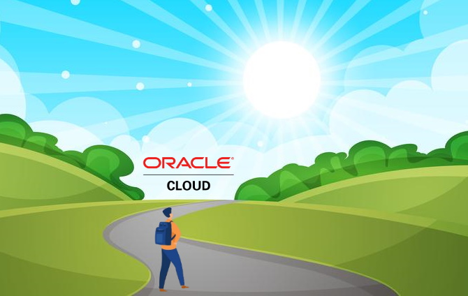

# Conhecendo o OCI (Oracle Cloud Infraestructure)

Esse livro apresenta o **OCI (Oracle Cloud Infraestructure)** e por quê você deve considerá-lo como mais uma opção de nuvem disponível.

> Autor: **[Daniel Armbrust](https://github.com/daniel-armbrust)**  
> _ainda escrevendo ..._

## Sumário

- [Capítulo 1: Conceitos e introdução a Computação em Nuvem no OCI](https://github.com/daniel-armbrust/oci-book/blob/main/chapter-1/README.md)  
    [1.1 - Introdução a Computação em Nuvem](https://github.com/daniel-armbrust/oci-book/blob/main/chapter-1/1-1_intro-cloud-computing.md) 
    [1.2 - Modelos de deployment (IaaS, PaaS, SaaS, FaaS, etc)](https://github.com/daniel-armbrust/oci-book/blob/main/chapter-1/1-2_iaas-paas-saas.md)  
    [1.3 - Criando sua conta no OCI](https://github.com/daniel-armbrust/oci-book/blob/main/chapter-1/1-3_criando-sua-conta.md)  
    [1.4 - Conceitos básicos sobre o OCI](https://github.com/daniel-armbrust/oci-book/blob/main/chapter-1/1-4_conceitos-basicos.md)  
    [1.5 - OCI CLI e Cloud Shell](https://github.com/daniel-armbrust/oci-book/blob/main/chapter-1/1-5_ocicli-cloudshell.md)  
    [1.6 - Introdução aos principais serviços do OCI](https://github.com/daniel-armbrust/oci-book/blob/main/chapter-1/1-6_intro-principais-servicos.md)   
    1.7 - Aspectos básicos do Lift-and-Shift e Modelos de Cobrança  
    1.8 - Entendendo o Service Limits (Limites de Serviços)  

- [Capítulo 2: Automação, Arquitetura e DevOps](https://github.com/daniel-armbrust/oci-book/blob/main/chapter-2/README.md)  
    2.1 - O surgimento do DevOps  
    2.2 - APIs no mundo Cloud  
    2.3 - SDK  
    2.4 - CLI  
    [2.5 - Introdução ao Terraform](https://github.com/daniel-armbrust/oci-book/blob/main/chapter-2/2-5_introducao-terraform.md)  
    [2.6 - Docker HOWTO](https://github.com/daniel-armbrust/oci-book/blob/main/chapter-2/2-6_docker-howto.md)  
    [2.7 - Git é o seu amigo](https://github.com/daniel-armbrust/oci-book/blob/main/chapter-2/2-7_git-amigo.md)  
    2.8 - Modelos de arquitetura (3 camadas, Microsserviços, Cloud Native)  

- [Capítulo 3: Primeira aplicação no OCI](https://github.com/daniel-armbrust/oci-book/blob/main/chapter-3/README.md)  
    [3.1 - Fundamentos do Serviço de Redes](https://github.com/daniel-armbrust/oci-book/blob/main/chapter-3/3-1_fundamentos-redes.md)  
    [3.2 - Fundamentos do Serviço de Computação](https://github.com/daniel-armbrust/oci-book/blob/main/chapter-3/3-2_fundamentos-computacao.md)  
    [3.3 - Apresentando o Serviço Bastion](https://github.com/daniel-armbrust/oci-book/blob/main/chapter-3/3-3_servico-bastion.md)  
    [3.4 - Oracle Linux com WordPress na nuvem](https://github.com/daniel-armbrust/oci-book/blob/main/chapter-3/3-4_oracle-linux-wordpress.md)  
    [3.5 - Fundamentos do Serviço de Load Balancing](https://github.com/daniel-armbrust/oci-book/blob/main/chapter-3/3-5_fundamentos-load-balancing.md)  
    [3.6 - MySQL: Banco de Dados do Wordpress](https://github.com/daniel-armbrust/oci-book/blob/main/chapter-3/3-6_wordpress-mysql-database.md)  
    [3.7 - Concluindo a instalação do Wordpress](https://github.com/daniel-armbrust/oci-book/blob/main/chapter-3/3-7_concluindo-wordpress.md)  
    [3.8 - Quanto custa tudo isto?](https://github.com/daniel-armbrust/oci-book/blob/main/chapter-3/3-8_quanto-custa-wordpress.md)  

- [Capítulo 4: Melhorias na aplicação Wordpress](https://github.com/daniel-armbrust/oci-book/blob/main/chapter-4/README.md)  
    [4.1 - Utilizando o Serviço de DNS](https://github.com/daniel-armbrust/oci-book/blob/main/chapter-4/4-1_servico-dns.md)  
    [4.2 - HTTPS via Let’s Encrypt](https://github.com/daniel-armbrust/oci-book/blob/main/chapter-4/4-2_https-lets-encrypt.md)  
    [4.3 - Adicionando segurança extra. Seja bem-vindo WAF!](https://github.com/daniel-armbrust/oci-book/blob/main/chapter-4/4-3_seguranca-waf.md)  
    [4.4 - Armazenamento compartilhado através do Serviço File Storage](https://github.com/daniel-armbrust/oci-book/blob/main/chapter-4/4-4_armcomp-servico-fstorage.md)  

- [Capítulo 5: Mais sobre Redes no OCI](https://github.com/daniel-armbrust/oci-book/blob/main/chapter-5/README.md)  
    [5.1 - Conectando múltiplas VCNs na mesma região](https://github.com/daniel-armbrust/oci-book/blob/main/chapter-5/5-1_mais-sobre-redes-multiplas-vcn-lpg-drg.md)  
    [5.2 - Conexão ao OCI através de VPN](https://github.com/daniel-armbrust/oci-book/blob/main/chapter-5/5-2_mais-sobre-redes-vpn.md)  
    [5.3 - Roteamento de Trânsito](https://github.com/daniel-armbrust/oci-book/blob/main/chapter-5/5-3_mais-sobre-redes-roteamento-transito.md)  
    [5.4 - FastConnect](https://github.com/daniel-armbrust/oci-book/blob/main/chapter-5/5-4_mais-sobre-redes-fastconnect.md)  
    [5.5 - Linkando o OCI ao Microsoft Azure](https://github.com/daniel-armbrust/oci-book/blob/main/chapter-5/5-5_mais-sobre-redes-msazure.md)  
    [5.6 - Ambiente DR (Disaster Recovery)](https://github.com/daniel-armbrust/oci-book/blob/main/chapter-5/5-6_mais-sobre-redes-ambiente-dr.md)  
    [5.7 - Múltiplos DRGs e múltiplas VCNs](https://github.com/daniel-armbrust/oci-book/blob/main/chapter-5/5-7_mais-sobre-redes-multiplos-drgs-multiplos-vcns.md)  
    [5.8 - Visualização através do Network Visualizer](https://github.com/daniel-armbrust/oci-book/blob/main/chapter-5/5-8_mais-sobre-redes-net-visualizer.md)  

- [Capítulo 6: Storage no OCI](https://github.com/daniel-armbrust/oci-book/blob/main/chapter-6/README.md)  
    [6.1 - Object Storage]()  
    [6.2 - Criando um site sem servidor]()  

- [Capítulo 7: Banco de Dados](https://github.com/daniel-armbrust/oci-book/blob/main/chapter-7/README.md)  
    [7.1 - MySQL](https://github.com/daniel-armbrust/oci-book/blob/main/chapter-7/7-1_mysql.md)  
    7.2 - Banco de Dados Oracle  
    7.3 - Exadata  
    7.4 - Autonomous DB  
    [7.5 - Oracle NoSQL](https://github.com/daniel-armbrust/oci-book/blob/main/chapter-7/7-5_nosql.md)  

- [Capítulo 8: A aplicação FotoGal](https://github.com/daniel-armbrust/oci-book/blob/main/chapter-8/README.md)  

- [Capítulo 9: Segurança no OCI](https://github.com/daniel-armbrust/oci-book/blob/main/chapter-9/README.md)  
    9.1 - Zonas de Segurança  
    9.2 - Security Advisor  
    9.3 - Serviço Vault  
    9.4 - Verificação de Vulnerabilidades  
    9.5 - Detecção de Anomalia  
    9.6 - Oracle Cloud Advisor  
    9.7 - Cloud Guard  
    9.8 - Oracle Ksplice   
    9.9 - OS Management  
