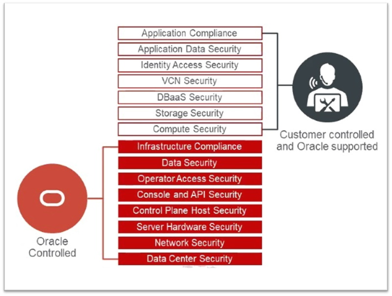

# Capítulo 1: Conceitos e introdução a Computação em Nuvem no OCI

_O ser humano não vive sem água, o conhecimento precisa da Internet, e hoje não há negócios sem a Computação em Nuvem._

## 1.1 - Introdução a Computação em Nuvem

### __Introdução__

Antigamente, implantávamos sistemas (deploy) ou em máquinas pequenas, ou em máquinas onde abrigavam vários diferentes sites. Esta única máquina é o gargalo (problema). Você nunca sabe se esta máquina aguenta uma carga maior de acessos. E caso ela de fato não aguente, você não tem para onde ir.

A partir deste tipo de problema, surgiram algumas soluções dentro de um mundo que conhecemos hoje como **"Cloud Computing" (Computação em Nuvem ou computação nas nuvens)**. Neste mundo, eu não estou restrito a uma única máquina. Minha aplicação está dentro de uma "máquina virtual", que está dentro de uma "infraestrutura virtual", na qual eu consigo replicar quantas máquinas eu quiser (clones), na demanda que eu necessitar (em tempo real pelo acesso crescente). Dentro desse modelo, eu não preciso ligar para um time de suporte, para solicitar uma nova máquina, e esta estar disponível somente 48 horas depois.

No mundo cloud, há flexibilidade. Basicamente, eu posso desenvolver o meu software, esperando ou não, uma demanda crescente de acessos. Eu tenho a minha disposição, uma infraestrutura elástica. Com isto, eu posso evoluir e não ficar "preso" em uma única máquina. Quando você tem um produto web, no qual você espera um volume de acessos incertos (no mundo Internet isto é incontrolável), o mundo cloud surge como solução.

- Concluíndo: _"O mundo cloud foi feito para um momento de demanda imprevísivel."_

Algumas das muitas definições existentes para o termo **Computação em Nuvem**:

- Computação em Nuvem é um modelo computacional no qual é possível provisionar recursos de TI sob demanda, de acordo com o seu negócio e pagar somente pelo uso que se faz. Em sua essência, é uma nova forma de se provisionar recursos e serviços de TI.
- É uma forma de entrega/aluguel de recursos computacionais (servidores, storage, banco de dados, rede, software, etc), através da Internet.
- É uma nova arquitetura  no qual muda-se para uma nova forma de se adquirir TI. Agora paga-se pelo uso dos recursos em um modelo que se adequa a demanda, o que se convencionou a chamar de _"elasticidade"_. Esta nova forma de aquisição de serviços de infraestrutura de TI reduz custo e aumenta a produtividade.
- Cloud Computing é um termo genérico usado para descrever a transformação disruptiva da TI em uma economia baseada em serviços, impulsionada por um conjunto de condições econômicas, culturais e tecnológicas.

Uma empresa que adota práticas de computação em nuvem aumenta sua agilidade, promovem mudanças mais ambiciosas além de agregar mais valor aos negócios. A computação em nuvem possibilitou desenvolver novos produtos, que consequentemente deu espaço as chamadas Startups. 

Diferente do mundo coorporativo, onde há o desenvolvimento de sistemas internos ou aqueles que ninguém vê, startups tem exigências para a web que incluem escalabilidade, usabilidade, desenvolvimento ágil, ferramental adequado e desempenho para criar bons produtos e atrair mais pessoas.

#### Definições do NIST

De acordo com o _[NIST (National Institure of Standards and Technology)](https://nvlpubs.nist.gov/nistpubs/Legacy/SP/nistspecialpublication800-145.pdf)_, Computação em Nuvem é um modelo que permite acesso através da Internet a um conjunto de recursos computacionais (rede, armazenamento, servidores, serviços, etc) nos quais podem ser rapidamente criados e apagados, de forma fácil, sem a necessidade de qualquer intervenção humana (ex: ligar para um Helpdesk para solicitar a criação de um servidor).

Um provedor de Computação em Nuvem, deve possuir algumas características que são essenciais. Além disso, um usuário deve ser capaz de implementar sua aplicação (deploy) ou provisionar sua infraestrutura, sobre um dos três modelos de serviços existentes, em um dos modelos de serviços oferecidos pelo provedor. Vamos destrinchar ...

- Autoatendimento sob demanda (On-demand self-service)
    - Um consumidor pode criar servidores, redes, banco de dados, etc, conforme sua demanda, sem necessitar de qualquer intervenção humana.

- Amplo acesso à rede (Broad network access)
    - Os recursos computacionais estão disponíveis através da rede (Internet) e são acessados via mecanismos padronizados, e que podem ser utilizados por celulares, tablets, laptops ou estações de trabalho.

- Conjunto de recursos (Resource pooling) / Multitenancy
    - Os recursos computacionais de um provedor são agrupados para servir múltiplos clientes, isolados uns dos outros, através de um modelo conhecido como multi-tenant (multilocatário). Os diferentes recursos físicos e virtuais, são dinamicamente atribuídos e reatribuídos, de acordo com a necessidade do cliente. O cliente geralmente não tem controle ou conhecimento sobre a localização exata dos recursos fornecidos pelo provedor de cloud. Porém, o provedor normalmente especifica a localização em nível de país, estado ou datacenter.

- Rápida elasticidade (Rapid elasticity)
    - Os recursos computacionais podem ser criados e apagados a qualquer momento. Os clientes devem ter a impressão de que os recursos são ilimitados (podem ser adquiridos em qualquer quantidade e a qualquer momento).
    - A elasticidade é uma propriedade fundamental. É ela quem dá o “poder” para se dimensionar recursos computacionais, diminuindo ou expandindo-os facilmente, com o mínimo de atrito. Além de maximizar a utilização dos recursos (utilizar somente o necessário e escalar somente quando necessário), possibilita redução de custo trazendo benefícios ao negócio.
    - Elasticidade é uma das “fortes considerações” que os consumidores levam em conta quando planejam a adoção da Computação em Nuvem.

- Serviço medido (Measured service)
    - É a habilidade que um provedor de serviços cloud tem em relação ao acompanhamento da utilização dos recursos de TI pelos seus consumidores.
    - O provedor de serviços em cloud automaticamente controla, monitora e otimiza o uso dos recursos pelos clientes. Isto também é reportado, provendo transparência tanto para o provedor de serviços quanto para os clientes que utilizam os serviços.

### Modelo de responsabilidade compartilhada

Ao utilizar a Computação em Nuvem para hospedar os seus recursos, existe um limite de atuação entre o fornecedor de cloud e você cliente (suas obrigações). Isto independe de qualquer provedor de nuvem. Todo fornecedor impõe limites como este. Contratar qualquer serviço na cloud não significa dispor de backup e proteção de dados "inclusos" no pacote. O cliente deve fazer a sua parte pela proteção e disponibilidade da sua solução tecnológica.

A Oracle possui responsabilidades que vão até o hardware físico, a virtualização, cabeamento, energia elétrica, até a segurança física das instalações em que o serviço opera. O limite do cliente começa a partir do momendo em que ele provisiona um sistema operacional, por exemplo. Quero dizer que é de responsabilidade do cliente a gestão do sistema operacional, atualizações, patches de segurança, firewall e as cópias de segurança (backups) dos dados. O OCI fornece todo um conjunto de ferramentas que auxilia a reduzir tais encargos operacionais, APIs e aplicativos para facilitar as tarefas do cliente. 

Os clientes devem examinar cuidadosamente os serviços que escolhem, pois suas respectivas responsabilidades variam dependendo se o serviço está hospedado em modelo SaaS (software como serviço), PaaS (plataforma como serviço), IaaS (infraestrutura como serviço) ou em um datacenter local.

Independentemente, algumas responsabilidades sempre são retidas por você:

- Seus dados.
- Pontos de extremidade que fazem acesso ao OCI.
- Segurança da sua conta.
- Gerenciamento de acesso.

De nada adianta, termos backup gerenciado, serviços que ajudam a rastrear vulnerabilidades, se você permite tráfego irrestrito e de qualquer lugar, as suas instâncias de computação, e ainda por cima, disponibiliza por engano a chave SSH em um repositório público no GitHub.  

Vou expor as melhores práticas aqui. Porém, segui-las e manter-se atualizado, é de sua responsabilidade.

### __Lift-and-Shift__

Lift-and-Shift é o termo que representa a migração de um aplicativo(s) do seu ambiente existente (on-premises) para um novo ambiente baseado em nuvem, sem alterar a lógica ou o modo como o aplicativo funciona. A maioria dos sistemas tem algumas dependências com outros sistemas internos ou externos, e qualquer mudança, sem mencionar mudança em código-fonte, requer mais testes, o que pode levar tempo e recursos humanos. O maior obstáculo que você irá enfrentar é a relutância das pessoas diante das mudanças.

Ao migrar para a nuvem você economiza tempo e capital para investir em testar novas tecnologias.

### __O surgimento do DevOps__

Trabalhar com Computação em Nuvem exige "uma pegada" meio dev e meio infra. É por conta disto que os profissionais de antigamente, que trabalhavam somente com infraestrutura, adicionaram práticas de desenvolvimento ao seu arsenal de conhecimento. Essa união de conhecimento _Dev + Infra_ deu origem ao termo **DevOps (Desenvolvimento e Operações)**.

A transição de um ciclo de vida tradicional de desenvolvimento de software para DevOps exige tempo e prática, tanto das pessoas que trabalham com TI quanto das pessoas que atuam nos negócios.