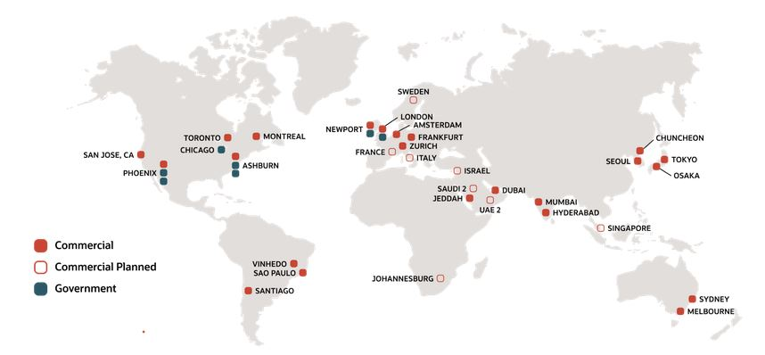
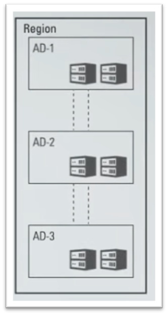
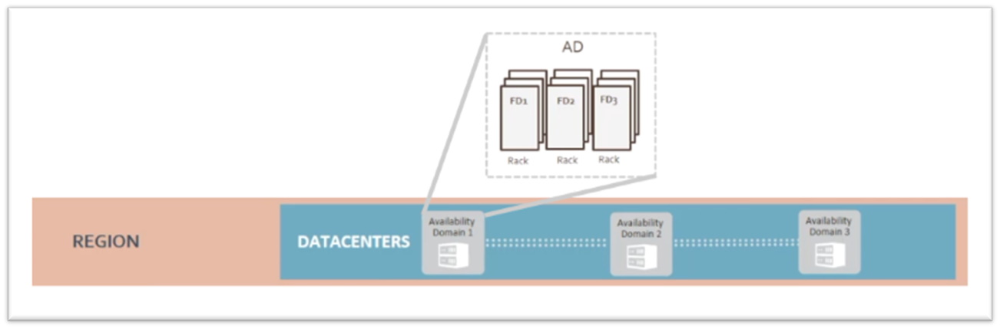
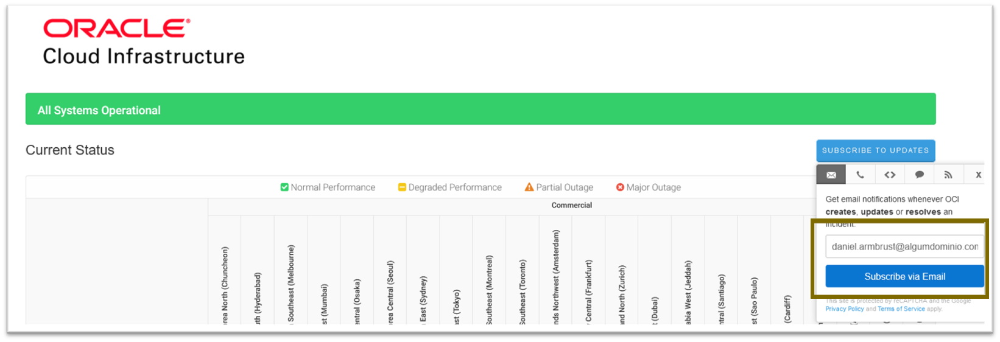

# Capítulo 1: Conceitos e introdução a Computação em Nuvem no OCI

## 1.4 - Conceitos básicos sobre o OCI

### __Regiões, Domínios de Disponibilidade (AD) e Domínios de Falha (FD)__

A infraestrutura do OCI está presente em diversas regiões do globo. Um dos critérios utilizados para a escolha de uma região, está na proximidade do data center aos seus clientes. Quanto menor essa distância, menor a latência e melhor a experiência na utilização dos serviços. De tempos em tempos, a Oracle cria e expande suas regiões pelo mundo. 

Esta diversidade geográfica pode ser vista na figura abaixo:



>_**__NOTA:__** Consulte este [link](https://www.oracle.com/cloud/architecture-and-regions/) para uma visão atualizada sobre o mapa de regiões._

Uma região é composta de múltiplos data centes isolados chamados de _"[Dominios de Disponibilidade (Availability Domains ou AD)](https://docs.oracle.com/pt-br/iaas/Content/General/Concepts/regions.htm#top)"_. Normalmente por região, existem até três _"[Dominios de Disponibilidades](https://docs.oracle.com/pt-br/iaas/Content/General/Concepts/regions.htm#top)"_. Estes não compartilham infraestrutura (energia, refrigeração, rede, etc), são isolados entre si, tolerantes a falhas e dificilmente falham ao mesmo tempo. Caso um _"[dominio de disponibilidade](https://docs.oracle.com/pt-br/iaas/Content/General/Concepts/regions.htm#top)"_ dentro de uma região falhe, ele não afeta a disponibilidade dos outros _"[dominios de disponibilidade](https://docs.oracle.com/pt-br/iaas/Content/General/Concepts/regions.htm#top)"_ existentes na região. Para qualquer região, com apenas um _"[dominio de disponibilidade](https://docs.oracle.com/pt-br/iaas/Content/General/Concepts/regions.htm#top)"_, um segundo _"[dominio de disponibilidade](https://docs.oracle.com/pt-br/iaas/Content/General/Concepts/regions.htm#top)"_ ou região no mesmo país ou área geopolítica será disponibilizada dentro de um ano. A ideia é disponibilizar mais opções de _[recuperação de desastres](https://pt.wikipedia.org/wiki/Recupera%C3%A7%C3%A3o_de_desastres)_ que atendam aos requisitos dos clientes.

Os _"[dominios de disponibilidade](https://docs.oracle.com/pt-br/iaas/Content/General/Concepts/regions.htm#top)_" da mesma região são conectados entre si por uma rede de baixa latência e alta largura de banda. Isto permite que você distribua suas aplicações em data centers diferentes na mesma região, e se comunicando como se estivessem em uma rede local.



Dentro de um "_[dominio de disponibilidade](https://docs.oracle.com/pt-br/iaas/Content/General/Concepts/regions.htm#top)_", há grupos distintos de hardware que são chamados de _"[Domínios de Falha (Fault Domains ou FD)](https://docs.oracle.com/pt-br/iaas/Content/General/Concepts/regions.htm#fault)_". Eles permitem distribuir suas instâncias para que elas não fiquem no mesmo hardware físico dentro do mesmo data center. Há pelo menos três diferentes _"[domínios de falha (FD)](https://docs.oracle.com/pt-br/iaas/Content/General/Concepts/regions.htm#fault)"_ dentro de cada _"[dominio de disponibilidade](https://docs.oracle.com/pt-br/iaas/Content/General/Concepts/regions.htm#top)"_. 

>_**__NOTA:__** O tráfego entre os domínios de disponibilidade e entre as regiões é criptografado._

A ideia geral é poder distribuir suas soluções tecnológicas em diferentes regiões pelo globo, permitindo um melhor acesso e melhor experiência dos seus usuários. Além disto, distribuir suas aplicações em diferentes _"[dominios de disponibilidade](https://docs.oracle.com/pt-br/iaas/Content/General/Concepts/regions.htm#top)"_ e "_[domínios de falha](https://docs.oracle.com/pt-br/iaas/Content/General/Concepts/regions.htm#fault)_", remove o chamado _"[ponto único de falha](https://pt.wikipedia.org/wiki/Ponto_%C3%BAnico_de_falha)"_, que garante maior disponibilidade em caso de falha.



<br>

>_**__LEMBRE-SE:__** Data centers, domínios de disponibilidade, domínios de falha, qualquer hardware, pode falhar! Ter sua aplicação em cloud não a torna infalível. É sua responsabilidade evitar o "[ponto único de falha](https://pt.wikipedia.org/wiki/Ponto_%C3%BAnico_de_falha)"_.

Resumindo:

- Uma região contém um ou mais data centers chamados de _"[Dominios de Disponibilidade (Availability Domains ou AD)](https://docs.oracle.com/pt-br/iaas/Content/General/Concepts/regions.htm#top)"_.
- Um "_[Dominio de Disponibilidade](https://docs.oracle.com/pt-br/iaas/Content/General/Concepts/regions.htm#top)_" contém três "_[Domínios de Falha](https://docs.oracle.com/pt-br/iaas/Content/General/Concepts/regions.htm#fault)_".

Quando criamos ou utilizamos um recurso cloud, é importante sabermos o seu "escopo". Alguns recursos do OCI são específicos da região, como uma rede virtual na nuvem, ou específicos de um _"[dominio de disponibilidade](https://docs.oracle.com/pt-br/iaas/Content/General/Concepts/regions.htm#top)"_, como uma instância de computação. O "escopo" de um recurso pode ser caracterizado como:

- Global
    - Por exemplo um usuário criado no seviço global _[IAM](https://docs.oracle.com/pt-br/iaas/Content/Identity/Concepts/overview.htm)_, pode se autenticar em qualquer região disponível.
        
- Regional 
    - Existente dentro de uma região e pode ser acessado por todos os _"[Dominios de Disponibilidade (Availability Domains ou AD)](https://docs.oracle.com/pt-br/iaas/Content/General/Concepts/regions.htm#top)"_ da região.

- Por "_[dominios de disponibilidade](https://docs.oracle.com/pt-br/iaas/Content/General/Concepts/regions.htm#top)_":
    - Por exemplo um bloco de disco. Este que é criado dentro de um _"[dominios de disponibilidade](https://docs.oracle.com/pt-br/iaas/Content/General/Concepts/regions.htm#top)"_ só existe aqui. 


Para os exemplos demonstrados no decorrer do livro, utilizaremos as regiões abaixo:

| Nome da Região | Identificador da Região | Local da Região | Chave da Região | Domínios de Disponibilidade | 
| -------------- | ----------------------- | --------------- | --------------- | --------------------------- |
| Brazil East (Sao Paulo) | sa-saopaulo-1  | Sao Paulo, Brazil | GRU | 1
| Sudeste do Brasil (Vinhedo) | sa-vinhedo-1  | Vinhedo, Brasil | VCP | 1
| US East (Ashburn) | us-ashburn-1 | Ashburn, VA | IAD | 3
| Japan East (Tokyo) | ap-tokyo-1 | Tokyo, Japan | NRT | 1

A a lista oficial de todas as regiões disponíveis pode ser visualizada _[neste link](https://docs.oracle.com/pt-br/iaas/Content/General/Concepts/regions.htm#top)_.

### __Tenancy e Compartimentos__

Quando você cria uma conta no OCI, é atribuído a você um "espaço", seguro, isolado e criptografado dentro da infraestrutura de nuvem da Oracle. Chamamos este "seu espaço" de _[Tenancy](https://docs.oracle.com/pt-br/iaas/Content/Identity/Tasks/managingtenancy.htm)_.

_[Tenancy](https://docs.oracle.com/pt-br/iaas/Content/Identity/Tasks/managingtenancy.htm)_ é um conceito lógico. Um dos significados da palavra _[Tenancy](https://docs.oracle.com/pt-br/iaas/Content/Identity/Tasks/managingtenancy.htm)_ é "locatário" ou "propriedade arrendada". Isto quer dizer que ao criar sua conta, é como se você estivesse "alugando" uma porção da infraestrutura do OCI para o seu próprio uso. Lembrando que _cloud computing_, por definição é _[Multitenancy](https://en.wikipedia.org/wiki/Multitenancy)_. Isto significa que há diferentes usuários (cloud account) que "alugam" porções da infraestrutura do OCI para uso próprio. Estas são isoladas uma das outras.

>_**__NOTA:__** É possível mudar o nome do seu [Tenancy](https://docs.oracle.com/pt-br/iaas/Content/Identity/Tasks/managingtenancy.htm) após a criação da conta. 
Consulte este [link](https://docs.oracle.com/pt-br/iaas/Content/General/Concepts/renamecloudaccount.htm) para saber como fazer._

Normalmente, uma empresa possui uma única conta cloud para criar e hospedar todos os seus recursos, sejam eles recursos de desenvolvimentos, homologação ou produção. É prudente e seguro, que o time que está desenvolvendo uma aplicação por exemplo, usando os recursos de desenvolvimento, não interfira nos recursos de produção. Ou mesmo que o grupo de pessoas que desenvolve o PROJETO-A, não tenha acesso ao PROJETO-B. 

Para realizar este tipo de separação dentro da sua conta, o OCI disponibiliza os chamados _"[compartimentos](https://docs.oracle.com/pt-br/iaas/Content/Identity/Tasks/managingcompartments.htm)"_.

Um _[compartimento](https://docs.oracle.com/pt-br/iaas/Content/Identity/Tasks/managingcompartments.htm)_ pode ser usado para isolar, organizar e controlar o acesso  os recursos dentro do mesmo _[tenancy](https://docs.oracle.com/pt-br/iaas/Content/Identity/Tasks/managingtenancy.htm)_. Ele não interfere no funcionamento ou na comunicação entre recursos. Isto significa que uma máquina virtual criada no COMPARTIMENTO-A, não é impedida de "falar" com outra máquina virtual existente no COMPARTIMENTO-B.

_[Compartimentos](https://docs.oracle.com/pt-br/iaas/Content/Identity/Tasks/managingcompartments.htm)_ são recursos globais. Quando criado, ele se torna presente em todas as regiões no qual seu _[tenancy](https://docs.oracle.com/pt-br/iaas/Content/Identity/Tasks/managingtenancy.htm)_ foi inscrito.

Seu _[tenancy](https://docs.oracle.com/pt-br/iaas/Content/Identity/Tasks/managingtenancy.htm)_ quando criado, já vem equipado por padrão com o chamado **_"root compartment"_**. Este é usado por padrão quando você criar um recurso sem especificar qual seu _[compartimento](https://docs.oracle.com/pt-br/iaas/Content/Identity/Tasks/managingcompartments.htm)_. Lembrando que todo recurso criado no OCI, deve obrigatóriamente pertencer a um _[compartimento](https://docs.oracle.com/pt-br/iaas/Content/Identity/Tasks/managingcompartments.htm)_.

>_**__NOTA:__** Tecnicamente falando, o **"root compartment"** representa seu [tenancy](https://docs.oracle.com/pt-br/iaas/Content/Identity/Tasks/managingtenancy.htm)._

Ao começar a trabalhar com o OCI, é importante pensar cuidadosamente sobre a organização dos seus _[compartimentos](https://docs.oracle.com/pt-br/iaas/Content/Identity/Tasks/managingcompartments.htm)_. É possível criar tudo embaixo do "_root compartment_", porém esta não é uma boa prática.

Abaixo apresento um simples exemplo de uma possível divisão dos compartimentos:

```
suaEmpresa (root)
   ├── ProjetoABC                   
   │     ├── Prod
   │     ├── Hml
   │     └── Dev
   │
   ├── ProjetoXYZ
   │     ├── Prod
   │     ├── Hml
   │     └── Dev
   │
   └── Network
```

Algumas informações úteis sobre _[compartimentos](https://docs.oracle.com/pt-br/iaas/Content/Identity/Tasks/managingcompartments.htm)_:
- Ao nomear um compartimento, é permitido no máximo 100 caracteres incluindo letras, números, pontos, hifens e sublinhados.
- Para colocar um novo recurso em um compartimento, você simplesmente especifica esse compartimento ao criar o recurso.
- A maioria dos recursos pode ser movida entre compartimentos diferentes.
- Só é possível excluir um compartimento caso ele esteja vazio (sem nenhum recurso criado).
- Você pode criar subcompartimentos em compartimentos existes para criar hierarquias com até seis níveis de profundidade.
- Quando você trabalha na Web Console, você deve escolher em qual compartimento deseja trabalhar.
- O OCI também atribuirá ao compartimento um ID exclusivo chamado Oracle Cloud ID (OCID).
- Depois de criar um novo compartimento, você precisa gravar pelo menos uma política de acesso para ele. Caso contrário, ninguém poderá acessá-lo (exceto administradores ou usuários com permissões definidas no nível do tenancy).


### __Oracle Cloud ID (OCID)__

A maioria dos recursos criados no OCI possui um ID exclusivo atribuído pela Oracle chamado _"[OCID (Oracle Cloud Identifier)](https://docs.oracle.com/pt-br/iaas/Content/General/Concepts/identifiers.htm#Resource_Identifiers)"_.

_[OCID](https://docs.oracle.com/pt-br/iaas/Content/General/Concepts/identifiers.htm#Resource_Identifiers)_ é uma string alfanumérica única por recurso. Esta é usada quando é preciso fazer referência de forma exclusiva a um recurso que foi criado.

 Os [OCIDs](https://docs.oracle.com/pt-br/iaas/Content/General/Concepts/identifiers.htm#Resource_Identifiers) usam esta sintaxe: 

```
ocid1.<RESOURCE TYPE>.<REALM>.[REGION][.FUTURE USE].<UNIQUE ID>
```

Por exemplo:

```
ocid1.instance.oc1.sa-saopaulo-1.antxeljr6noke4qc6gXnyfvzfj43135yh2hpvu5li6n5GF5jgslnldoa
```

>_**__NOTA:__** Quando abrir um ticket no suporte, você sempre terá que informar o OCID do seu tenant e recurso(s) que apresentam problema(s)._


### __OCI Status__

_[OCI Status](https://ocistatus.oraclecloud.com)_ ou _[OCI Service Health Dashboard](https://ocistatus.oraclecloud.com)_, é um painel de acesso público que disponibiliza o _"status atual"_ de todos os serviços do OCI por região. Além desta monitoração em tempo real, é possível ver o _[histórico de incidentes](https://ocistatus.oraclecloud.com/history)_ que já ocorreram na infraestrutura do OCI.

Acesse o _[OCI Status](https://ocistatus.oraclecloud.com)_ através deste _[link aqui](https://ocistatus.oraclecloud.com)_.

No canto superior direito do _[OCI Status](https://ocistatus.oraclecloud.com)_, existe um botão _"Subscribe to updates"_. Este possibilita você a receber notificações por e-mail sempre que a infraestrutura do OCI apresentar um problema, atualização de um problema, ou quando o mesmo for resolvido.

É recomendado fazer sua subscrição.

