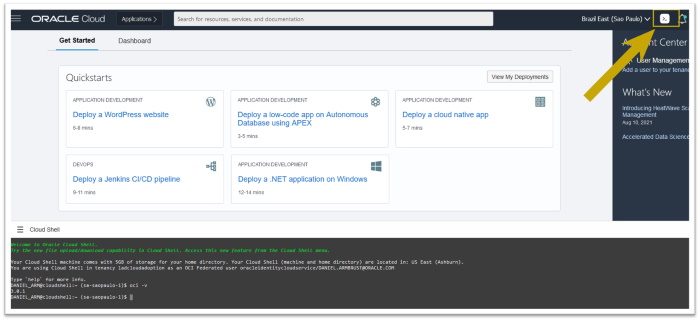

# Capítulo 1: Conceitos e introdução a Computação em Nuvem no OCI

## 1.5 - OCI CLI e Cloud Shell

### __OCI CLI__

A Computação em Nuvem não existe sem automação! Por conta disto, a Oracle disponibiliza algumas ferramentas que facilitam a interação com as APIs do OCI. Lidar diretamente com as APIs exige detalhes e é trabalhoso. 

Este é um livro _"Orientado a Código"_. Poucas vezes iremos utilizar a _[Web Console](https://docs.oracle.com/pt-br/iaas/Content/GSG/Tasks/signingin.htm#Signing_In_to_the_Console)_ para exibir ou concluir uma ação. A _[Web Console](https://docs.oracle.com/pt-br/iaas/Content/GSG/Tasks/signingin.htm#Signing_In_to_the_Console)_ está sujeita a sofrer mudanças com maior frequência, sendo que isto poderia invalidar nossos exemplos aqui. 

O _[OCI CLI](https://docs.oracle.com/pt-br/iaas/Content/API/Concepts/cliconcepts.htm)_ é uma ferramenta de linha de comando que permite você interagir, de um modo mais fácil, com as APIs do OCI. O _[OCI CLI](https://docs.oracle.com/pt-br/iaas/Content/API/Concepts/cliconcepts.htm)_ fornece mais funcionalidades que a _[Web Console](https://docs.oracle.com/pt-br/iaas/Content/GSG/Tasks/signingin.htm)_.

A referência completa de todos os comandos do OCI CLI pode ser vista _[aqui](https://docs.oracle.com/en-us/iaas/tools/oci-cli/latest/oci_cli_docs/)_.

#### __Instalação do OCI CLI__

A instalação do OCI CLI é muito simples. Irei apresentar os comandos usados para instalação em um sistema operacional Linux. Para saber sobre outros sistemas operacionais suportados, consulte a documentação oficial _[aqui](https://docs.oracle.com/pt-br/iaas/Content/API/SDKDocs/cliinstall.htm)_.

```
root@hoodwink:~# bash -c "$(curl -L https://raw.githubusercontent.com/oracle/oci-cli/master/scripts/install/install.sh)"
  % Total    % Received % Xferd  Average Speed   Time    Time     Time  Current
                                 Dload  Upload   Total   Spent    Left  Speed
100 17280  100 17280    0     0  36150      0 --:--:-- --:--:-- --:--:-- 36150
...
```

O comando acima tenta resolver sozinho diversas dependências para concluir a instalação, caso seja necessário.

#### __Atualizando o OCI CLI__

É sempre bom verificarmos se realmente estamos utilizando a última versão disponível do _[OCI CLI](https://docs.oracle.com/pt-br/iaas/Content/API/Concepts/cliconcepts.htm)_.

```
root@hoodwink:~# oci --latest-version
3.0.2
You are using OCI CLI version 2.26.2, however version 3.0.2 is available. 
You should consider upgrading using https://docs.cloud.oracle.com/en-us/iaas/Content/API/SDKDocs/cliupgrading.htm
```

Neste caso, o comando nos avisou que há a necessidade de atualização. Para atualizar, executamos o comando abaixo:

```
root@hoodwink:~# pip install oci-cli --upgrade
```

Feito! Podemos verificar que a ferramenta foi atualizada pois agora não há nenhum aviso:

```
root@hoodwink:~# oci --latest-version
3.0.2
```

Mantenha-se sempre atualizado! Além de corrigir bugs e acrescentar melhorias, atualizar o _[OCI CLI](https://docs.oracle.com/pt-br/iaas/Content/API/Concepts/cliconcepts.htm)_ possibilita interação com novos serviços.

#### __Trabalhando com o OCI CLI__

Ao começar a trabalhar com o _[OCI CLI](https://docs.oracle.com/pt-br/iaas/Content/API/Concepts/cliconcepts.htm)_ você irá se deparar com parâmetros que exigem valores _"complexos no formato [JSON](https://pt.wikipedia.org/wiki/JSON)"_. Estes podem ser vetores e objetos que exigem mais de um valor e devem ser especificados no formato _[JSON](https://pt.wikipedia.org/wiki/JSON)_, através de uma string na linha de comando, ou utilizando um arquivo.

Uma das formas para consultar os valores necessários para se criar um recurso, é através da documentação das APIs do OCI neste link _[aqui](https://docs.oracle.com/en-us/iaas/api/)_.

Uma outra forma é através do parâmetro _"--generate-param-json-input"_ do _[OCI CLI](https://docs.oracle.com/pt-br/iaas/Content/API/Concepts/cliconcepts.htm)_. Este exibe qual é o documento _[JSON](https://pt.wikipedia.org/wiki/JSON)_ esperado de um determinado parâmetro. Veja o exemplo abaixo, onde necessito saber qual é o _[JSON](https://pt.wikipedia.org/wiki/JSON)_ para criação de um _[Service Gateway](https://docs.oracle.com/pt-br/iaas/Content/Network/Tasks/servicegateway.htm)_:

```
darmbrust@hoodwink:~$ oci network service-gateway create --generate-param-json-input services
[
  {
    "serviceId": "string"
  },
  {
    "serviceId": "string"
  }
]
```

Neste caso, sabemos que o parâmetro _"--services"_ para a criação do _[Service Gateway](https://docs.oracle.com/pt-br/iaas/Content/Network/Tasks/servicegateway.htm)_, pode ser especificado da seguinte forma:

```
darmbrust@hoodwink:~$ oci network service-gateway create \
> --compartment-id "ocid1.compartment.oc1..aaaaaaaauvqvbbx3oridcm5d2ztxkftwr362u2vl5zdsayzbehzwbjs56soq" \
> --services '[{"serviceId": "ocid1.service.oc1.sa-saopaulo-1.aaaaaaaalrthnhiysrsux6lnhougwb2wvq37bd2tpf2au4ieahtg57zw7ura"}]' \
> --vcn-id "ocid1.vcn.oc1.sa-saopaulo-1.amaaaaaahcglxkaabicl4jiikcavz2h2nvazibxp4rdiwziqsce4h5wksz2a" \
> --display-name "srgw_vcn-prd"
```

Um outro parâmetro que você verá por aqui é _"--wait-for-state"_. Alguns recursos possuem um _"ciclo de vida"_. Isto quer dizer que quando solicitamos sua criação, por exemplo, o mesmo não será criado imediatamente. O OCI recebe a instrução de criação, esta instrução vai para um fila que será processada e se tudo der certo, o recurso será criado. Isto não necessáriamente se aplica somente a ação de _"criar"_. Ações de _"exclusão"_ ou _"atualização"_, também caem em uma fila para ser processada no futuro. 

Dizemos então, que este tipo de operação, é uma operação _**assíncrona**_. Operações assíncronas estão presentes neste _"mundo de APIs"_. O que a ferramenta _[OCI CLI](https://docs.oracle.com/pt-br/iaas/Content/API/Concepts/cliconcepts.htm)_ faz, é lidar de uma forma fácil, com as _[APIs do OCI](https://docs.oracle.com/en-us/iaas/api/)_.

O parâmetro _"--wait-for-state"_, é uma forma de "travar/bloquear a execução" do _[OCI CLI](https://docs.oracle.com/pt-br/iaas/Content/API/Concepts/cliconcepts.htm)_, e só me devolver devolta o shell, quando o recurso atingir determinado _"estado"_. 

Por exemplo, ao criarmos uma _[VCN](https://docs.oracle.com/pt-br/iaas/Content/Network/Tasks/managingVCNs_topic-Overview_of_VCNs_and_Subnets.htm)_, podemos bloquear a execução do _[OCI CLI](https://docs.oracle.com/pt-br/iaas/Content/API/Concepts/cliconcepts.htm)_ até que o recurso se torne disponível:

```
darmbrust@hoodwink:~$ oci network vcn create \
> --compartment-id "ocid1.compartment.oc1..aaaaaaaauvqvbbx3oridcm5d2ztxkftwr362u2vl5zdsayzbehzwbjs56soq" \
> --cidr-blocks '["10.0.0.0/16"]' \
> --display-name "vcn-prd" \
> --is-ipv6-enabled false \
> --wait-for-state AVAILABLE
```

Usar o parâmetro _"--wait-for-state"_, pode ser útil quando você for programar a criação dos seus recursos no OCI. 

### __Cloud Shell__

O _[Cloud Shell](https://docs.oracle.com/pt-br/iaas/Content/API/Concepts/devcloudshellintro.htm)_ é um terminal (shell Linux) acessível através da _[Web Console](https://docs.oracle.com/pt-br/iaas/Content/GSG/Tasks/signingin.htm#Signing_In_to_the_Console)_, gratuito e já com o _[OCI CLI](https://docs.oracle.com/pt-br/iaas/Content/API/Concepts/cliconcepts.htm)_ configurado e pronto pra uso. Há também outras ferramentas que já vem instaladas como o _[Ansible](https://docs.oracle.com/pt-br/iaas/Content/API/SDKDocs/ansible.htm)_.

>_**__NOTA:__** A lista das ferramentas disponíveis no [Cloud Shell](https://docs.oracle.com/pt-br/iaas/Content/API/Concepts/devcloudshellintro.htm) pode ser consultada na documentação oficial [aqui](https://docs.oracle.com/pt-br/iaas/Content/API/Concepts/devcloudshellintro.htm#Whats_Included_With_Cloud_Shell)._

O _[Cloud Shell](https://docs.oracle.com/pt-br/iaas/Content/API/Concepts/devcloudshellintro.htm)_ pode ser uma maneira rápida e prática para utilização do _[OCI CLI](https://docs.oracle.com/pt-br/iaas/Content/API/Concepts/cliconcepts.htm)_, sem a necessidade de seguir o processo de instalação. Para iniciar o uso, basta clicar no botão localizado no topo da console:



