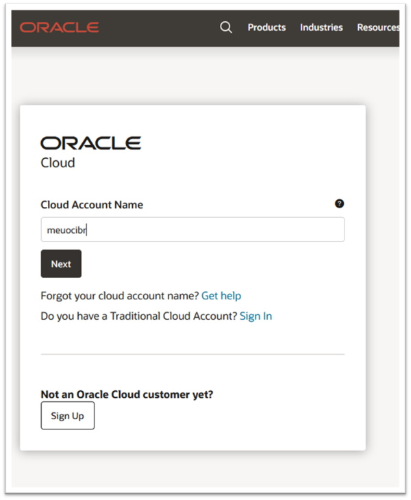
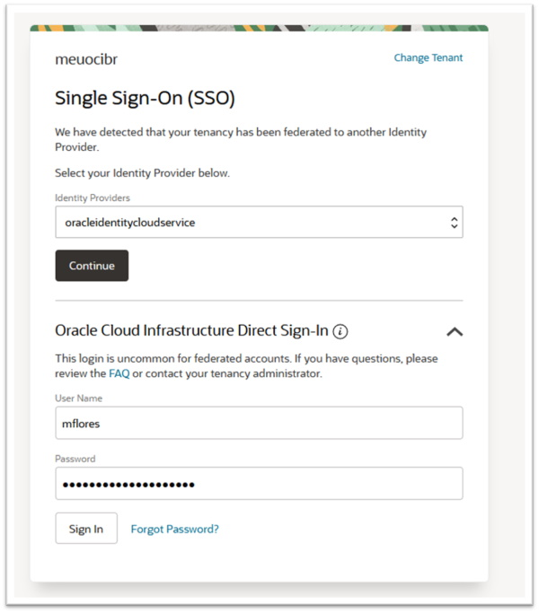

# Capítulo 1: Conceitos e introdução a Computação em Nuvem no OCI

## 1.6 - Introdução aos principais serviços do OCI

### __Principais Serviços__

https://www.oracle.com/cloud/data-regions/

### __Serviço IAM (Identity and Access Management)__

A principal função do serviço _[IAM](https://docs.oracle.com/pt-br/iaas/Content/Identity/Concepts/overview.htm)_ é a _Gestão de Identidades e Acessos_. 

Através dele é possivel especificar qual o **_tipo de acesso_** que um **_grupo de usuários_** possui, sobre determinados **_recursos_**. É aqui que você identifica, autentica e controla o acesso (autorização) de indivíduos ou aplicações, que utilizam os recursos do OCI (no seu tenant pra ser mais exato).

>_**__NOTA:__** Um **recurso** é um "objeto de nuvem" que você cria no OCI. Por exemplo: instâncias de computação, volumes de armazenamento em blocos, redes virtuais, etc._

Ao criar sua conta da conta no OCI, você começa com uma única identidade de login que tem acesso total a todos os recursos e serviços do seu _[tenancy](https://docs.oracle.com/pt-br/iaas/Content/Identity/Tasks/managingtenancy.htm)_. Este primeiro usuário criado recebe o título de _"Administrador do Tenant"_ ou _"Administrador Padrão"_. 

O privilégio de _"acesso total"_, é concedido através de uma _política de segurança (policy)_ que dá ao grupo **Administrators**, acesso a todas as operações das APIs do OCI e a todos os recursos do seu _[tenancy](https://docs.oracle.com/pt-br/iaas/Content/Identity/Tasks/managingtenancy.htm)_. Para se ter o privilégio de _"acesso total"_, basta o usuário ser membro do grupo **Administrators**. 

>_**__NOTA:__** Não é possível excluir o grupo **Administrators** e sempre deve haver pelo menos um usuário membro. Também não é possível alterar nem excluir esta política, que concede os direitos de administrador._

#### __Usuários e Grupos__

Um novo _[Tenant](https://docs.oracle.com/pt-br/iaas/Content/Identity/Tasks/managingtenancy.htm)_ criado nasce "fechado". É função do _Administrador_ criar e disponibilizar acesso a novos usuários.

Um **usuário** é um indivíduo da sua organização que precisa gerenciar ou usar os recursos do seu _[Tenant](https://docs.oracle.com/pt-br/iaas/Content/Identity/Tasks/managingtenancy.htm)_. Um usuário não precisa ser uma pessoa. Ele também pode representar uma aplicação.

O serviço _[IAM](https://docs.oracle.com/pt-br/iaas/Content/Identity/Concepts/overview.htm)_ utiliza a combinação _"nome do usuário" (username)_ e _"senha"_ para autenticação. Uma _"senha"_ pode ser uma combinação de caracteres alfanuméricos ou ser representado através de uma _"[chave de acesso](https://docs.oracle.com/pt-br/iaas/Content/Identity/Concepts/usercredentials.htm)"_ (método normalmente usado por aplicações).

>_**__NOTA:__** Recomendamos que você não use as credenciais do usuário administrador para acesso diário. Recomendamos também que você não compartilhe suas credenciais do usuário administrador com outras pessoas, pois isso oferece a eles acesso irrestrito ao seu [tenancy](https://docs.oracle.com/pt-br/iaas/Content/Identity/Tasks/managingtenancy.htm)._

Utilize o comando abaixo para se criar um novo usuário:

```
darmbrust@hoodwink:~$ oci iam user create --name "mflores" --email "maria@algumdominio.com.br" --description "Maria das Flores"    
{
  "data": {
    "capabilities": {
      "can-use-api-keys": true,
      "can-use-auth-tokens": true,
      "can-use-console-password": true,
      "can-use-customer-secret-keys": true,
      "can-use-o-auth2-client-credentials": true,
      "can-use-smtp-credentials": true
    },
    "compartment-id": "ocid1.tenancy.oc1..aaaaaaaavv2qh5asjdcoufmb6fzpnrfqgjxxdzlvjrgkrkytnyyz6zgvjnua",
    "defined-tags": {
      "Oracle-Tags": {
        "CreatedBy": "oracleidentitycloudservice/daniel.armbrust@algumdominio.com",
        "CreatedOn": "2021-08-23T18:29:11.203Z"
      }
    },
    "description": "Maria das Flores",
    "email": "maria@algumdominio.com.br",
    "email-verified": false,
    "external-identifier": null,
    "freeform-tags": {},
    "id": "ocid1.user.oc1..aaaaaaaagpov2dclzaxb4hoyapkwnwsdcymlvsl3fgrjuhdzka34kd4fmxbq",
    "identity-provider-id": null,
    "inactive-status": null,
    "is-mfa-activated": false,
    "last-successful-login-time": null,
    "lifecycle-state": "ACTIVE",
    "name": "mflores",
    "previous-successful-login-time": null,
    "time-created": "2021-08-23T18:29:11.340000+00:00"
  },
  "etag": "b2efa082d75f6a8be5b445f96259f1c3638688ba"
}
```

Agora, é preciso definir uma senha de acesso. Primeiramente, iremos obter o OCID no qual representa o usuário "mflores" para então definir a nova senha:

```
darmbrust@hoodwink:~$ oci iam user list --query "data[?name=='mflores'].id"
[
  "ocid1.user.oc1..aaaaaaaagpov2dclzaxb4hoyapkwnwsdcymlvsl3fgrjuhdzka34kd4fmxbq"
]
```

```
darmbrust@hoodwink:~$ oci iam user ui-password create-or-reset --user-id ocid1.user.oc1..aaaaaaaagpov2dclzaxb4hoyapkwnwsdcymlvsl3fgrjuhdzka34kd4fmxbq
{
  "data": {
    "inactive-status": null,
    "lifecycle-state": "ACTIVE",
    "password": "MxmB5<EAkFKCiy9k[9zA",
    "time-created": "2021-08-24T10:40:49.628000+00:00",
    "user-id": "ocid1.user.oc1..aaaaaaaagpov2dclzaxb4hoyapkwnwsdcymlvsl3fgrjuhdzka34kd4fmxbq"
  },
  "etag": "05bd43fc36fae50a0f32d808854efe53c5103b78"
}
```

>_**__NOTA:__** Para saber mais detalhes sobre os filtros em documentos JSON, consulte este link [aqui](https://jmespath.org/)_. 

Um **grupo** é um meio de se organizar usuários que terão permissões em comum. Quando se cria um novo grupo, você deve fornecer um nome exclusivo e inalterável. Este nasce sem nenhuma permissão até que você defina uma política (policy), que dá determinado acesso aos usuários membros do grupo. Lembrando que um usuário pode ser membro de diferentes grupos.

Para se criar um grupo, usamos o comando abaixo:

```
darmbrust@hoodwink:~$ oci iam group create --name "grp-netadm" --description "Usuários administradores dos recursos de rede."
{
  "data": {
    "compartment-id": "ocid1.tenancy.oc1..aaaaaaaavv2qh5asjdcoufmb6fzpnrfqgjxxdzlvjrgkrkytnyyz6zgvjnua",
    "defined-tags": {
      "Oracle-Tags": {
        "CreatedBy": "oracleidentitycloudservice/daniel.armbrust@algumdominio.com",
        "CreatedOn": "2021-08-23T16:07:49.894Z"
      }
    },
    "description": "Usu\u00e1rios administradores dos recursos de rede.",
    "freeform-tags": {},
    "id": "ocid1.group.oc1..aaaaaaaatafagegoyy56srtflrknuxzmzmhfgzfyclrbh7ozderdo4z52gda",
    "inactive-status": null,
    "lifecycle-state": "ACTIVE",
    "name": "grp-netadm",
    "time-created": "2021-08-23T16:07:49.909000+00:00"
  },
  "etag": "4918daacc579081cbec733d939a831da9f1adfa5"
}
```

Igual a todos os outros recursos, um grupo também possui um OCID exclusivo:

```
darmbrust@hoodwink:~$ oci iam group list --query 'data[].[name, id]'
[
  [
    "Administrators",
    "ocid1.group.oc1..aaaaaaaazhxisz5ho2c3scyxnn4ezvs3gmowq7uuxqekpd65lwpykywzwm4q"
  ],
  [
    "grp-netadm",
    "ocid1.group.oc1..aaaaaaaatafagegoyy56srtflrknuxzmzmhfgzfyclrbh7ozderdo4z52gda"
  ]
]
```

Adicionamos um usuário em um grupo, através dos respectivos OCID:

```
darmbrust@hoodwink:~$ oci iam group add-user \
> --user-id "ocid1.user.oc1..aaaaaaaagpov2dclzaxb4hoyapkwnwsdcymlvsl3fgrjuhdzka34kd4fmxbq" \
> --group-id "ocid1.group.oc1..aaaaaaaatafagegoyy56srtflrknuxzmzmhfgzfyclrbh7ozderdo4z52gda"
{
  "data": {
    "compartment-id": "ocid1.tenancy.oc1..aaaaaaaavv2qh5asjdcoufmb6fzpnrfqgjxxdzlvjrgkrkytnyyz6zgvjnua",
    "group-id": "ocid1.group.oc1..aaaaaaaatafagegoyy56srtflrknuxzmzmhfgzfyclrbh7ozderdo4z52gda",
    "id": "ocid1.groupmembership.oc1..aaaaaaaamdmqcstqymhuqgc54n2gbjkeq5mj27c3ipagcujmi3jlcyr7znoa",
    "inactive-status": null,
    "lifecycle-state": "ACTIVE",
    "time-created": "2021-08-24T11:22:52.617000+00:00",
    "user-id": "ocid1.user.oc1..aaaaaaaagpov2dclzaxb4hoyapkwnwsdcymlvsl3fgrjuhdzka34kd4fmxbq"
  },
  "etag": "8ca8b8d7addd78c6fbcfc8c647d61680dde14138"
}
```

#### __OCI Web Console__

Uma das maneiras mais simples de lidar com os recursos do OCI é através da _[Web Console](https://docs.oracle.com/pt-br/iaas/Content/GSG/Tasks/signingin.htm#Signing_In_to_the_Console)_.

Acesse a _Web Console_ através da url _[https://cloud.oracle.com](https://cloud.oracle.com,)_ e insira as credências conforme o exemplo abaixo:

<br>



<br>



<br>

A _Web Console_, como dito, é a maneira mais simples e rápida de lidar com seus recursos cloud. Porém, nem sempre é a mais eficiente. Você verá que quanto mais recursos existir, mais difícil fica, lidar com a administração direta deles somente pela _Web Console_.

#### __Políticas de Autorização (Policy)__

Já sabemos que não é uma boa prática, por exemplo, ter vários usuários membros do grupo **_Administrators_**, ou criar recursos diretamente no **_root compartment_**. A boa prática, é ter um pequeno número de usuários administradores (o recomendado é que só exista um), e que esses administradores concedam o mínimo de acesso necessário, para os demais usuários do seu _[tenancy](https://docs.oracle.com/pt-br/iaas/Content/Identity/Tasks/managingtenancy.htm)_.

As **_Políticas de Autorização_**, ou simplesmente **_Policy (política)_**, é um documento que especifica quem e de que forma, o indivíduo ou aplicação, podem acessar os recursos do seu _[tenancy](https://docs.oracle.com/pt-br/iaas/Content/Identity/Tasks/managingtenancy.htm)_. Uma **_política_** simplesmente permite que um **_grupo de usuários_**, tenham acesso a determinados recursos, em um compartimento específico.

Um usuário administrador ou administrador do Serviço IAM, desempenha as seguintes atividades:
1. Definir novos usuários e grupos.
2. Criar compartimentos específicos para armazenar os recursos.
3. Escrever as políticas de autorização que permitam os usuários ou grupos, gerenciar os recursos em compartimentos específicos. 
 
Uma política possui a seguinte sintaxe:

```
Allow <subject> to <verb> <resource-type> in <location> where <conditions>
```

- **subject**
    - Pode ser um ou mais grupos, ou o valor **any-user** que corresponde todos os usuários do seu  _[tenancy](https://docs.oracle.com/pt-br/iaas/Content/Identity/Tasks/managingtenancy.htm)_.
    - Um grupo pode ser especificado através do seu nome ou OCID.

- **verb**    
    - Verbos dizem respeito as ações (operações em APIs) sobre um recurso. Um verbo especifica um determinado tipo de acesso.
    - Do menor privilégio ao maior, os verbos podem ser: **inspect**, **read**, **use** e **manage**.
    - 

>_**__NOTA:__** Para maiores detalhes sobre a sintaxe das políticas, consulte a documentação oficial **[aqui](https://docs.oracle.com/pt-br/iaas/Content/Identity/Concepts/policysyntax.htm)**._
    