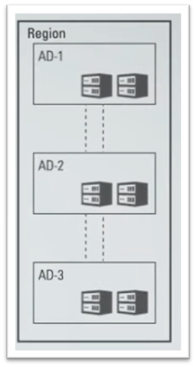

# Capítulo 1: Conceitos e introdução a Computação em Nuvem no OCI

## 1.2 - Conceitos básicos sobre o OCI

### __Regiões, Domínios de Disponibilidade (AD) e Domínios de Falha (FD)__

A infraestrutura do OCI está presente em diversas regiões do globo. Um dos critérios utilizados para a escolha de uma região, está na proximidade do data center aos seus clientes. Quanto menor essa distância, menor a latência e melhor a experiência na utilização dos serviços. De tempos em tempos, a Oracle cria e expande suas regiões pelo mundo.

>_**__NOTA:__** Consulte este [link](https://www.oracle.com/cloud/architecture-and-regions/) para uma visão atualizada sobre o mapa de regiões._

Uma região é composta de múltiplos data centes isolados chamados de _"[Dominios de Disponibilidade (Availability Domains ou AD)](https://docs.oracle.com/pt-br/iaas/Content/General/Concepts/regions.htm#top)"_. Normalmente por região, existem até três _"[Dominios de Disponibilidades](https://docs.oracle.com/pt-br/iaas/Content/General/Concepts/regions.htm#top)"_. Estes não compartilham infraestrutura (energia, refrigeração, rede, etc), são isolados entre si, tolerantes a falhas e dificilmente falham ao mesmo tempo. Caso um _"[dominio de disponibilidade](https://docs.oracle.com/pt-br/iaas/Content/General/Concepts/regions.htm#top)"_ dentro de uma região falhe, ele não afeta a disponibilidade dos outros _"[dominios de disponibilidade](https://docs.oracle.com/pt-br/iaas/Content/General/Concepts/regions.htm#top)"_ existentes na região. Para qualquer região, com apenas um _"[dominio de disponibilidade](https://docs.oracle.com/pt-br/iaas/Content/General/Concepts/regions.htm#top)"_, um segundo _"[dominio de disponibilidade](https://docs.oracle.com/pt-br/iaas/Content/General/Concepts/regions.htm#top)"_ ou região no mesmo país ou área geopolítica será disponibilizada dentro de um ano. A ideia é disponibilizar mais opções de _[recuperação de desastres](https://pt.wikipedia.org/wiki/Recupera%C3%A7%C3%A3o_de_desastres)_ que atendam aos requisitos dos clientes.

Os _"[dominios de disponibilidade](https://docs.oracle.com/pt-br/iaas/Content/General/Concepts/regions.htm#top)_" da mesma região são conectados entre si por uma rede de baixa latência e alta largura de banda. Isto permite que você distribua suas aplicações em data centers diferentes na mesma região, e se comunicando como se estivessem em uma rede local.

Dentro de um _[Dominio de Disponibilidade](https://docs.oracle.com/pt-br/iaas/Content/General/Concepts/regions.htm#top)_, há grupos distintos de hardware que são chamados de _"[Domínios de Falha (Fault Domains ou FD)](https://docs.oracle.com/pt-br/iaas/Content/General/Concepts/regions.htm#fault)_". Eles permitem distribuir suas instâncias para que elas não fiquem no mesmo hardware físico dentro do mesmo data center. Há pelo menos três diferentes _"[domínios de falha (FD)](https://docs.oracle.com/pt-br/iaas/Content/General/Concepts/regions.htm#fault)"_ dentro de cada _"[dominio de disponibilidade](https://docs.oracle.com/pt-br/iaas/Content/General/Concepts/regions.htm#top)"_. 

>_**__NOTA:__** O tráfego entre os domínios de disponibilidade e entre as regiões é criptografado._

A ideia geral é poder distribuir suas soluções tecnológicas em diferentes regiões pelo globo, permitindo um melhor acesso e melhor experiência dos seus usuários. Além disto, distribuir suas aplicações em diferentes _"[dominios de disponibilidade](https://docs.oracle.com/pt-br/iaas/Content/General/Concepts/regions.htm#top)"_ e "_[domínios de falha](https://docs.oracle.com/pt-br/iaas/Content/General/Concepts/regions.htm#fault)_", remove o chamado _"[ponto único de falha](https://pt.wikipedia.org/wiki/Ponto_%C3%BAnico_de_falha)"_, que garante maior disponibilidade em caso de falha.

 

>_**__LEMBRE-SE:__** Data centers, domínios de disponibilidade, domínios de falha, qualquer hardware, pode falhar! Ter sua aplicação em cloud não a torna infalível. É sua responsabilidade evitar o "[ponto único de falha](https://pt.wikipedia.org/wiki/Ponto_%C3%BAnico_de_falha)"_.

Resumindo:

- Uma região contém um ou mais data centers chamados de _"[Dominios de Disponibilidade (Availability Domains ou AD)](https://docs.oracle.com/pt-br/iaas/Content/General/Concepts/regions.htm#top)"_.
- Um _[Dominio de Disponibilidade](https://docs.oracle.com/pt-br/iaas/Content/General/Concepts/regions.htm#top)_ contém três "_[Domínios de Falha](https://docs.oracle.com/pt-br/iaas/Content/General/Concepts/regions.htm#fault)_

Quando criamos ou utilizamos um recurso cloud, é importante sabermos o seu "escopo". Alguns recursos do OCI são específicos da região, como uma rede virtual na nuvem, ou específicos de um domínio de disponibilidade, como uma instância de computação. O "escopo" de um recurso pode ser caracterizado como:

- Global
    - Por exemplo um usuário criado no seviço global _[IAM](https://docs.oracle.com/pt-br/iaas/Content/Identity/Concepts/overview.htm)_, pode se autenticar em qualquer região disponível.
        
- Regional 
    - Existente dentro de uma região e pode ser acessado por todos os _"[Dominios de Disponibilidade (Availability Domains ou AD)](https://docs.oracle.com/pt-br/iaas/Content/General/Concepts/regions.htm#top)"_ da região.

- Por _[dominios de disponibilidade](https://docs.oracle.com/pt-br/iaas/Content/General/Concepts/regions.htm#top)_:
    - Por exemplo um bloco de disco. Este que é criado dentro de um _"[dominios de disponibilidade](https://docs.oracle.com/pt-br/iaas/Content/General/Concepts/regions.htm#top)"_ só existe aqui. 

Para os exemplos demonstrados no decorrer do livro, utilizaremos as regiões abaixo:

| Nome da Região | Identificador da Região | Local da Região | Chave da Região | Domínios de Disponibilidade | 
| -------------- | ----------------------- | --------------- | --------------- | --------------------------- |
| Brazil East (Sao Paulo) | sa-saopaulo-1  | Sao Paulo, Brazil | GRU | 1
| Sudeste do Brasil (Vinhedo) | sa-vinhedo-1  | Vinhedo, Brasil | VCP | 1
| US East (Ashburn) | us-ashburn-1 | Ashburn, VA | IAD | 3
| Japan East (Tokyo) | ap-tokyo-1 | Tokyo, Japan | NRT | 1

A a lista oficial de todas as regiões disponíveis pode ser visualizada _[neste link](https://docs.oracle.com/pt-br/iaas/Content/General/Concepts/regions.htm#top)_.