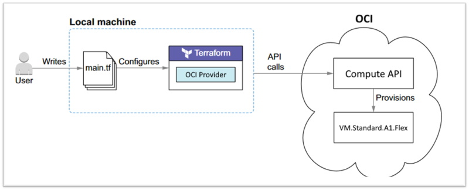
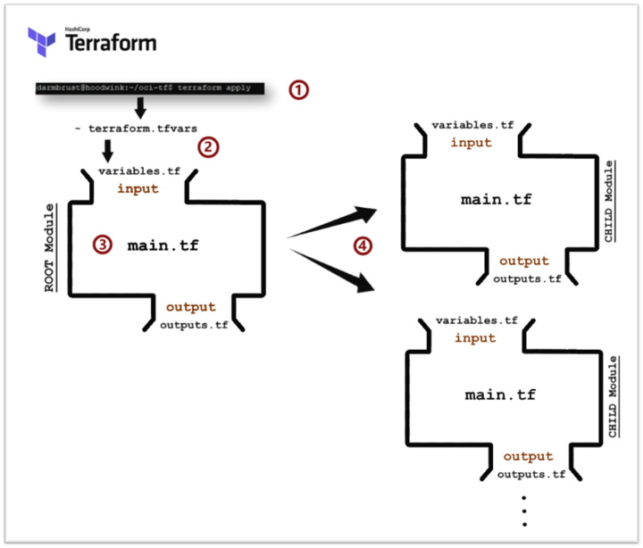
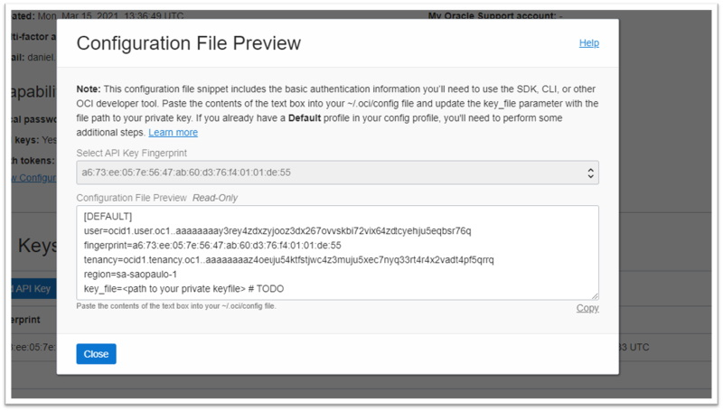

# Capítulo 2: Automação, Arquitetura e DevOps

## 2.5 - Usando o Terraform para criar sua Infraestrutura no OCI

### __Visão Geral__
_[Terraform](https://www.terraform.io/)_ é uma ferramenta que permite definir, provisionar e gerenciar sua infraestrutura através de código (criar, atualizar e destruir). O conceito por trás do termo _"[infraestrutura como código](https://pt.wikipedia.org/wiki/Infraestrutura_como_C%C3%B3digo)"_ é simples: você define recursos cloud (vm, banco de dados, redes, etc) em um ou mais arquivos de configuração (infraestrutura em código). O código utiliza uma _"abordagem declarativa"_. Isto significa que é possível definir qual é o _“estado esperado”_ da sua infraestrutura através de instruções simples e diretas.

Codificar em _[Terraform](https://www.terraform.io/)_, significa codificar em uma linguagem especifica chamada _HashiCorp Configuration Language (HCL)_. Esta foi criada pela _HashiCorp_ com o intuito de substituir configurações antes escritas em formato _[JSON](https://pt.wikipedia.org/wiki/JSON)_ ou _[XML](https://pt.wikipedia.org/wiki/XML)_. Seu principal propósito é declarar _[recursos](https://www.terraform.io/docs/language/resources/index.html)_ que representam objetos de infraestrutura.

Quando falamos sobre a ação de _"provisionar infraestrutura"_, estamos nos referindo à criação ou implantação (deploy) dos componentes que formam uma infraestrutura. Isto é diferente do _“gerenciamento de configuração”_, feito por ferramentas como _[Ansible](https://docs.ansible.com/ansible/latest/index.html)_, por exemplo.

Ferramentas que atuam no _“gerenciamento de configuração”_ manuseiam software dentro de servidores já existentes. Essas ferramentas são a favor do chamado _"infraestrutura mutável"_. Já ferramentas como o  _[Terraform](https://www.terraform.io/)_, são a favor da _"infraestrutura imutável"_.

>_**__NOTA:__** Tecnicamente tudo que pode ser controlado por uma API pode ser controlado e gerenciado pelo Terraform a partir de plugins específicos. A ferramenta não está limitada somente a operar em cloud computing._

Depois que você conhecer o _[Terraform](https://www.terraform.io/)_, nunca mais vai querer dar _cliques_ na _[Web Console](https://docs.oracle.com/pt-br/iaas/Content/GSG/Concepts/console.htm)_ para criar seus recursos. O _[Terraform](https://www.terraform.io/)_ facilita e agiliza todo o _"lifecyle"_ da sua infraestrutura. Além disto, o código que provisiona sempre está atualizado, diferente da velha documentação, que sempre está desatualizada.

A ferramenta _[Terraform](https://www.terraform.io/)_ é independente de qualquer sistema remoto. Ela se integra as APIs de um provedor em especifico através dos chamados _[providers](https://www.terraform.io/docs/language/providers/index.html)_. Estes nada mais são do que _plugins_ que capacitam o _[Terraform](https://www.terraform.io/)_ na comunicação com um sistema remoto em particular. A entidade dona do _[provider](https://www.terraform.io/docs/language/providers/index.html)_, é responsável por manter o código do _plugin_ atualizado no _[Terraform Registry](https://registry.terraform.io/)_.

>_**__NOTA:__** A integração da ferramenta em um provedor depende da existência/escrita de um pluging provider. Atualmente, todos os grandes provedores de cloud pública já possuem plugins prontos para uso. Estes podem ser verificados [aqui](https://registry.terraform.io/browse/providers)._

<br>



### __Instalação do Terraform__

Escrito na linguagem de programação _[Go](https://pt.wikipedia.org/wiki/Go_(linguagem_de_programa%C3%A7%C3%A3o))_, o _[Terraform](https://www.terraform.io/)_ é composto de apenas um binário executável. Ou seja, sua instalação é muito simples:

1. Baixe neste _[site](https://www.terraform.io/downloads.html)_ o binário do _[Terraform](https://www.terraform.io/)_ de acordo com o seu sistema operacional e arquitetura do seu processador.
2. Descompacte e mova o binário para algum lugar em que sua variável de ambiente _[PATH](https://en.wikipedia.org/wiki/PATH_(variable))_ faça referência.
3. Pronto!

No meu caso, estou usando um sistema operacional _[Linux](https://pt.wikipedia.org/wiki/Linux)_ em processador _[ARM 32-bits](https://pt.wikipedia.org/wiki/Arquitetura_ARM)_.

```linux
darmbrust@hoodwink:~/oci-tf$ sudo su -
[sudo] password for darmbrust:

root@hoodwink:~# cd /usr/src

root@hoodwink:/usr/src# wget https://releases.hashicorp.com/terraform/1.0.4/terraform_1.0.4_linux_arm.zip

root@hoodwink:/usr/src# unzip terraform_1.0.4_linux_arm.zip
Archive:  terraform_1.0.4_linux_arm.zip
  inflating: terraform

root@hoodwink:/usr/src# chown root:root terraform
root@hoodwink:/usr/src# chmod 0555 terraform

root@hoodwink:/usr/src# mv terraform /usr/local/bin/

root@hoodwink:/usr/src# terraform -v
Terraform v1.0.4
on linux_arm
```

### __Utilização básica do Terraform__

O _[Terraform](https://www.terraform.io/)_ lê todos os arquivos com a extensão __.tf__ do diretório corrente _(root module)_ e os concatena. Os nomes dos arquivos não importam. Você é livre para definir qualquer nome de arquivo que quiser. A ferramenta não obedece nenhuma lógica quando for ler arquivos com a extensão __.tf__. 

Toda definição da sua _"[infraestrutura como código](https://pt.wikipedia.org/wiki/Infraestrutura_como_C%C3%B3digo)"_ começa pela declaração do _[provider](https://www.terraform.io/docs/language/providers/index.html)_. Cada _[provider](https://www.terraform.io/docs/language/providers/index.html)_ disponibiliza diferentes _[recursos](https://www.terraform.io/docs/language/resources/index.html)_ que podem ser usados para a construção da sua infraestrutura. Para os exemplos demonstrados aqui, estamos utilizando o _[OCI Provider](https://registry.terraform.io/providers/hashicorp/oci/latest/docs)_. 

>_**__NOTA:__** Consulte a página oficial do [OCI Provider](https://registry.terraform.io/providers/hashicorp/oci/latest/docs) para saber detalhes de como usar cada [recurso](https://www.terraform.io/docs/language/resources/index.html) que ele disponibiliza._

Vamos utilizar o exemplo abaixo para criar uma _[VCN](https://docs.oracle.com/pt-br/iaas/Content/Network/Tasks/managingVCNs_topic-Overview_of_VCNs_and_Subnets.htm)_ no _[OCI](https://www.oracle.com/cloud/)_ e demonstrar o básico:

```terraform
darmbrust@hoodwink:~/oci-tf$ cat vcn.tf

provider "oci" {
  region = "sa-saopaulo-1"
  fingerprint = "a6:73:ee:05:7e:56:47:ab:60:d3:76:f4:01:01:de:55"
  private_key_path = "./keys/oci.key"
  tenancy_ocid = "ocid1.tenancy.oc1..aaaaaaaaz4oeus54ktfstpwc4z3muju5xec7nppp33rt4r4x2v1xydt4pf5qrrq"
  user_ocid = "ocid1.user.oc1..aaaaaaaay3rey4zdxzyj1oz3rey267ovskbi72vix3reytptcyehqmqbsr76q"
}

resource "oci_core_vcn" "vcn" {
   compartment_id = "ocid1.compartment.oc1..aaaaaaaaro7baesc4z3untyqxajzotsthm4baa6bwumacmb1xydw6gvb2mq"
   display_name = "vcn_saopaulo"
   cidr_blocks = ["10.0.0.0/16"]
}

resource "oci_core_subnet" "subnet" {
    cidr_block = "10.10.0.0/24"
    compartment_id = "ocid1.compartment.oc1..aaaaaaaaro7baesc4z3untyqxajzotsthm4baa6bwumacmb1xydw6gvb2mq"
    vcn_id = oci_core_vcn.vcn.id
}

```

O binário executável do _[Terraform](https://www.terraform.io/)_ aceita vários subcomandos (ou argumentos), sendo os principais: _"init"_, _"validate"_, _"plan"_, _"apply"_ e _"destroy"_. Começaremos pelo _"init"_ que lê o bloco _"provider { ... }"_ e faz download do _pluging_ que foi especificado:

```terraform
darmbrust@hoodwink:~/oci-tf$ terraform init

Initializing the backend...

Initializing provider plugins...
- Finding latest version of hashicorp/oci...
- Installing hashicorp/oci v4.39.0...
- Installed hashicorp/oci v4.39.0 (signed by HashiCorp)

Terraform has created a lock file .terraform.lock.hcl to record the provider
selections it made above. Include this file in your version control repository
so that Terraform can guarantee to make the same selections by default when
you run "terraform init" in the future.

Terraform has been successfully initialized!

You may now begin working with Terraform. Try running "terraform plan" to see
any changes that are required for your infrastructure. All Terraform commands
should now work.

If you ever set or change modules or backend configuration for Terraform,
rerun this command to reinitialize your working directory. If you forget, other
commands will detect it and remind you to do so if necessary.
```

Podemos verificar no diretório corrente, que o subcomando _"init"_ baixou o _plugin_ especificado para uso:

```
darmbrust@hoodwink:~/oci-tf$ ls -hl .terraform/providers/registry.terraform.io/hashicorp/oci/4.39.0/linux_arm/
total 66M
-rwxr-xr-x 1 darmbrust darmbrust 66M Aug 13 17:08 terraform-provider-oci_v4.39.0_x4
```

Após instalação do _pluging_, podemos verificar o _"plano de execução"_ através do subcomando _"plan"_. Esta ação verifica quais _[recursos](https://www.terraform.io/docs/language/resources/index.html)_ serão criados, removidos ou alterados:

```terraform
darmbrust@hoodwink:~/oci-tf$ terraform plan

Terraform used the selected providers to generate the following execution plan. Resource actions are indicated with the following symbols:
  + create

Terraform will perform the following actions:

  # oci_core_subnet.subnet will be created
  + resource "oci_core_subnet" "subnet" {
      + availability_domain        = (known after apply)
      + cidr_block                 = "10.0.10.0/24"
      + compartment_id             = "ocid1.compartment.oc1..aaaaaaaaro7baesc4z3untyqxajzotsthm4baa6bwumacmb1xydw6gvb2mq"
      + defined_tags               = (known after apply)
      + dhcp_options_id            = (known after apply)
      + display_name               = (known after apply)
      + dns_label                  = (known after apply)
      + freeform_tags              = (known after apply)
      + id                         = (known after apply)
      + ipv6cidr_block             = (known after apply)
      + ipv6virtual_router_ip      = (known after apply)
      + prohibit_internet_ingress  = (known after apply)
      + prohibit_public_ip_on_vnic = (known after apply)
      + route_table_id             = (known after apply)
      + security_list_ids          = (known after apply)
      + state                      = (known after apply)
      + subnet_domain_name         = (known after apply)
      + time_created               = (known after apply)
      + vcn_id                     = (known after apply)
      + virtual_router_ip          = (known after apply)
      + virtual_router_mac         = (known after apply)
    }

  # oci_core_vcn.vcn will be created
  + resource "oci_core_vcn" "vcn" {
      + cidr_block               = (known after apply)
      + cidr_blocks              = [
          + "10.0.0.0/16",
        ]
      + compartment_id           = "ocid1.compartment.oc1..aaaaaaaaro7baesc4z3untyqxajzotsthm4baa6bwumacmb1xydw6gvb2mq"
      + default_dhcp_options_id  = (known after apply)
      + default_route_table_id   = (known after apply)
      + default_security_list_id = (known after apply)
      + defined_tags             = (known after apply)
      + display_name             = "vcn_saopaulo"
      + dns_label                = (known after apply)
      + freeform_tags            = (known after apply)
      + id                       = (known after apply)
      + ipv6cidr_blocks          = (known after apply)
      + is_ipv6enabled           = (known after apply)
      + state                    = (known after apply)
      + time_created             = (known after apply)
      + vcn_domain_name          = (known after apply)
    }

Plan: 2 to add, 0 to change, 0 to destroy.
```

A criação é feita com o subcomando _"apply"_, após sua confirmação:

```terraform
darmbrust@hoodwink:~/oci-tf-simple$ terraform apply

Terraform used the selected providers to generate the following execution plan. Resource actions are indicated with the following symbols:
  + create

Terraform will perform the following actions:

  # oci_core_subnet.subnet will be created
  + resource "oci_core_subnet" "subnet" {
      + availability_domain        = (known after apply)
      + cidr_block                 = "10.0.10.0/24"
      + compartment_id             = "ocid1.compartment.oc1..aaaaaaaaro7baesc4z3untyqxajzotsthm4baa6bwumacmb1xydw6gvb2mq"
      + defined_tags               = (known after apply)
      + dhcp_options_id            = (known after apply)
      + display_name               = (known after apply)
      + dns_label                  = (known after apply)
      + freeform_tags              = (known after apply)
      + id                         = (known after apply)
      + ipv6cidr_block             = (known after apply)
      + ipv6virtual_router_ip      = (known after apply)
      + prohibit_internet_ingress  = (known after apply)
      + prohibit_public_ip_on_vnic = (known after apply)
      + route_table_id             = (known after apply)
      + security_list_ids          = (known after apply)
      + state                      = (known after apply)
      + subnet_domain_name         = (known after apply)
      + time_created               = (known after apply)
      + vcn_id                     = (known after apply)
      + virtual_router_ip          = (known after apply)
      + virtual_router_mac         = (known after apply)
    }

  # oci_core_vcn.vcn will be created
  + resource "oci_core_vcn" "vcn" {
      + cidr_block               = (known after apply)
      + cidr_blocks              = [
          + "10.0.0.0/16",
        ]
      + compartment_id           = "ocid1.compartment.oc1..aaaaaaaaro7baesc4z3untyqxajzotsthm4baa6bwumacmb1xydw6gvb2mq"
      + default_dhcp_options_id  = (known after apply)
      + default_route_table_id   = (known after apply)
      + default_security_list_id = (known after apply)
      + defined_tags             = (known after apply)
      + display_name             = "vcn_saopaulo"
      + dns_label                = (known after apply)
      + freeform_tags            = (known after apply)
      + id                       = (known after apply)
      + ipv6cidr_blocks          = (known after apply)
      + is_ipv6enabled           = (known after apply)
      + state                    = (known after apply)
      + time_created             = (known after apply)
      + vcn_domain_name          = (known after apply)
    }

Plan: 2 to add, 0 to change, 0 to destroy.

Do you want to perform these actions?
  Terraform will perform the actions described above.
  Only 'yes' will be accepted to approve.

  Enter a value: yes

oci_core_vcn.vcn: Creating...
oci_core_vcn.vcn: Creation complete after 1s [id=ocid1.vcn.oc1.sa-saopaulo-1.amaaaaaa6noke4qalk4skgcfco3w7kvfnhsld6oykaxp5tarzojdo66qcqoq]
oci_core_subnet.subnet: Creating...
oci_core_subnet.subnet: Creation complete after 9s [id=ocid1.subnet.oc1.sa-saopaulo-1.aaaaaaaag3xjulaxu7xgjdtmwgc5jjgelsfibr4gawb7c72gfsq32dvjnxla]

Apply complete! Resources: 2 added, 0 changed, 0 destroyed.
```

Por fim, para a remoção utilizamos o subcomando _"destroy"_:

```terraform
darmbrust@hoodwink:~/oci-tf-simple$ terraform destroy
oci_core_vcn.vcn: Refreshing state... [id=ocid1.vcn.oc1.sa-saopaulo-1.amaaaaaa6noke4qalk4skgcfco3w7kvfnhsld6oykaxp5tarzojdo66qcqoq]
oci_core_subnet.subnet: Refreshing state... [id=ocid1.subnet.oc1.sa-saopaulo-1.aaaaaaaag3xjulaxu7xgjdtmwgc5jjgelsfibr4gawb7c72gfsq32dvjnxla]

Terraform used the selected providers to generate the following execution plan. Resource actions are indicated with the following symbols:
  - destroy

Terraform will perform the following actions:

  # oci_core_subnet.subnet will be destroyed
  - resource "oci_core_subnet" "subnet" {
      - cidr_block                 = "10.0.10.0/24" -> null
      - compartment_id             = "ocid1.compartment.oc1..aaaaaaaaro7baesc4z3untyqxajzotsthm4baa6bwumacmb1xydw6gvb2mq" -> null     
      - dhcp_options_id            = "ocid1.dhcpoptions.oc1.sa-saopaulo-1.aaaaaaaaakt34mjxbhjugnzusdjntjokr2omzf6um66tjkb4rrboukrvtm5a" -> null
      - display_name               = "subnet20210814112842" -> null
      - freeform_tags              = {} -> null
      - id                         = "ocid1.subnet.oc1.sa-saopaulo-1.aaaaaaaag3xjulaxu7xgjdtmwgc5jjgelsfibr4gawb7c72gfsq32dvjnxla" -> null
      - prohibit_internet_ingress  = false -> null
      - prohibit_public_ip_on_vnic = false -> null
      - route_table_id             = "ocid1.routetable.oc1.sa-saopaulo-1.aaaaaaaawqmkrljrusfs3zuoxrljjw56epjljluodukod7srtxqsrmncglgq" -> null
      - security_list_ids          = [
          - "ocid1.securitylist.oc1.sa-saopaulo-1.aaaaaaaanrsrjkdkytchlaqbs5tomn6dsxeyh6hbet6eh5u3kx5rqbgwg2vq",
        ] -> null
      - state                      = "AVAILABLE" -> null
      - time_created               = "2021-08-14 11:28:42.637 +0000 UTC" -> null
      - vcn_id                     = "ocid1.vcn.oc1.sa-saopaulo-1.amaaaaaa6noke4qalk4skgcfco3w7kvfnhsld6oykaxp5tarzojdo66qcqoq" -> null
      - virtual_router_ip          = "10.0.10.1" -> null
      - virtual_router_mac         = "00:00:17:0C:57:CD" -> null
    }

  # oci_core_vcn.vcn will be destroyed
  - resource "oci_core_vcn" "vcn" {
      - cidr_block               = "10.0.0.0/16" -> null
      - cidr_blocks              = [
          - "10.0.0.0/16",
        ] -> null
      - compartment_id           = "ocid1.compartment.oc1..aaaaaaaaro7baesc4z3untyqxajzotsthm4baa6bwumacmb1xydw6gvb2mq" -> null
      - default_dhcp_options_id  = "ocid1.dhcpoptions.oc1.sa-saopaulo-1.aaaaaaaaakt34mjxbhjugnzusdjntjokr2omzf6um66tjkb4rrboukrvtm5a" -> null
      - default_route_table_id   = "ocid1.routetable.oc1.sa-saopaulo-1.aaaaaaaawqmkrljrusfs3zuoxrljjw56epjljluodukod7srtxqsrmncglgq" -> null
      - default_security_list_id = "ocid1.securitylist.oc1.sa-saopaulo-1.aaaaaaaanrsrjkdkytchlaqbs5tomn6dsxeyh6hbet6eh5u3kx5rqbgwg2vq" -> null     
      - display_name             = "vcn_saopaulo" -> null
      - freeform_tags            = {} -> null
      - id                       = "ocid1.vcn.oc1.sa-saopaulo-1.amaaaaaa6noke4qalk4skgcfco3w7kvfnhsld6oykaxp5tarzojdo66qcqoq" -> null
      - ipv6cidr_blocks          = [] -> null
      - is_ipv6enabled           = false -> null
      - state                    = "AVAILABLE" -> null
      - time_created             = "2021-08-14 11:28:41.889 +0000 UTC" -> null
    }

Plan: 0 to add, 0 to change, 2 to destroy.

Do you really want to destroy all resources?
  Terraform will destroy all your managed infrastructure, as shown above.
  There is no undo. Only 'yes' will be accepted to confirm.

  Enter a value: yes

oci_core_subnet.subnet: Destroying... [id=ocid1.subnet.oc1.sa-saopaulo-1.aaaaaaaag3xjulaxu7xgjdtmwgc5jjgelsfibr4gawb7c72gfsq32dvjnxla]
oci_core_subnet.subnet: Destruction complete after 2s
oci_core_vcn.vcn: Destroying... [id=ocid1.vcn.oc1.sa-saopaulo-1.amaaaaaa6noke4qalk4skgcfco3w7kvfnhsld6oykaxp5tarzojdo66qcqoq]
oci_core_vcn.vcn: Destruction complete after 1s

Destroy complete! Resources: 2 destroyed.
```

### __Apresentando um exemplo maior__

A partir do básico apresentado, iremos partir para um novo exemplo com um pouco mais de detalhes e algumas boas práticas para lidar com vários _[recursos](https://www.terraform.io/docs/language/resources/index.html)_.

```
darmbrust@hoodwink:~$ git clone https://github.com/daniel-armbrust/oci-terraform-multiregion.git
Cloning into 'oci-terraform-multiregion'...

darmbrust@hoodwink:~$ ls -1F oci-terraform-multiregion/
datasources.tf
drg.tf
gru_compute.tf
gru_vcn-dev.tf
gru_vcn-hml.tf
gru_vcn-prd.tf
gru_vcn-shared.tf
LICENSE
locals.tf
modules/
providers.tf
README.md
terraform.tfvars.example
variables.tf
vcp_compute.tf
vcp_vcn-dr.tf
```

>_**__NOTA:__** Acesse o repositório que contém os códigos neste [link aqui](https://github.com/daniel-armbrust/oci-terraform-multiregion)_.

### __Módulo principal (root module)__

Similar a uma _função_ em linguagem de programação tradicional, um _[módulo](https://www.terraform.io/docs/language/modules/index.html)_ é uma maneira de agrupar código relacionado. É usado como um container para múltiplos _[recursos](https://www.terraform.io/docs/language/resources/index.html)_.

O módulo principal ou _root module_ é o ponto de partida. É o diretório de trabalho, onde se executa os comandos _"terraform plan"_ ou _"terraform apply"_. Encare como se fosse a função _"main()"_ de um programa escrito em _[linguagem C](https://pt.wikipedia.org/wiki/C_(linguagem_de_programa%C3%A7%C3%A3o))_ (onde a execução do programa começa). A partir do _root module_ é que chamamos outros módulos _(child modules)_.

Todo módulo, seja o _root module_ ou seus _child modules_, podem receber valores através de _[variáveis](https://www.terraform.io/docs/language/values/variables.html)_. Estas funcionam como _[argumentos do módulo](https://www.terraform.io/docs/language/modules/develop/index.html)_. Podemos informar (parametrizar) valores ao _root module_ através:

1. Pelo uso do argumento de linha de comando __*-var*__, no qual é possível especificar variável e valor (ex: _-var="display_name=vcn"_).
2. Através do arquivo de definições de variáveis __*\*.tfvars*__.
3. Através de variáveis de ambientes que contenham o prefixo __*TF\_VAR\_\<nome\>\=\<valor\>*__ (ex: _TF_VAR_display_name="vcn"_).

<br>



>_**__NOTA:__** Por questões de boas práticas, a HashiCorp recomenda que existam no mínimo os arquivos main.tf, variables.tf e outputs.tf por diretório de módulo, independente de possuirem conteúdo ou não._

Eu particularmente gosto de declarar os blocos _"resource"_ dentro de um _child module_. Com isto, o meu _"root module"_, faz "chamadas" ao _child modules_ informando os parâmetros necessários para a construção de determinado recurso.

### __Terraform e OCI__

Toda comunicação com o _[OCI](https://www.oracle.com/cloud/)_ necessita de um _[usuário](https://docs.oracle.com/pt-br/iaas/Content/GSG/Tasks/addingusers.htm)_, _[credenciais](https://docs.oracle.com/pt-br/iaas/Content/Identity/Concepts/usercredentials.htm)_ válidas para _autenticação_ e _[políticas](https://docs.oracle.com/pt-br/iaas/Content/Identity/Concepts/policies.htm)_ que _autorizem_ a criação dos recursos em uma _[região](https://docs.oracle.com/pt-br/iaas/Content/General/Concepts/regions.htm)_ e _[tenancy](https://docs.oracle.com/pt-br/iaas/Content/GSG/Concepts/settinguptenancy.htm)_ específicos.

Apresentei os conceitos básicos sobre módulos para que possamos informar alguns valores exigidos pelo _[OCI Provider](https://registry.terraform.io/providers/hashicorp/oci/latest/docs)_ ao _[Terraform](https://www.terraform.io/)_. Criaremos o arquivo _"terraform.tfvars"_ com as informações.

<br>



Transportando os valores para o arquivo, nós temos:

```terraform
darmbrust@hoodwink:~/oci-terraform-multiregion$ cat terraform.tfvars
#
# terraform.tfvars
#

api_private_key_path = "./keys/oci.key"
api_fingerprint = "a6:73:ee:05:7e:56:47:ab:60:d3:76:f4:01:01:de:55"
user_id = "ocid1.user.oc1..aaaaaaaay3rey4zdxzyj1oz3rey267ovskbi72vix3reytptcyehqmqbsr76q"
tenancy_id = "ocid1.tenancy.oc1..aaaaaaaaz4oeus54ktfstpwc4z3muju5xec7nppp33rt4r4x2v1xydt4pf5qrrq"
compartment_id = "ocid1.compartment.oc1..aaaaaaaaro7baesc4z3untyqxajzotsthm4baa6bwumacmb1xydw6gvb2mq"
```

>_**__NOTA:__** Não versione o arquivo _"terraform.tfvars"_ nem o diretório _"keys/"_. Eles contém informações confidenciais de acesso._

### __Variáveis de Input__

_[Variáveis de Input](https://www.terraform.io/docs/language/values/variables.html)_ ou para entrada de dados, é o meio pelo qual parametrizamos ou informamos a um módulo sobre determinado valor. Toda declaração de variável possui a seguinte estrutura:

```terraform
variable "<NOME>" {
    description = "<DESCRIÇÃO>"
    type = <TIPO DE DADOS>
    default = <VALOR PADRÃO A SER USADO NA AUSÊNCIA DE UM VALOR>
}
```

Por exemplo:

```terraform
variable "vcn_display_name" {
    description = "A user-friendly name for OCI VCN."
    type = string
    default = "vcn"
}
```

No _[Terraform](https://www.terraform.io/)_, dentro de um mesmo módulo, nomes de variáveis devem ser únicos. Caso contrário, teremos um erro:

```
darmbrust@hoodwink:~/oci-tf$ terraform validate
╷
│ Error: Duplicate variable declaration
│
│   on variables.tf line 25:
│   25: variable "user_id" {
│
│ A variable named "user_id" was already declared at variables.tf:20,1-19. Variable names must be unique within a module.
╵
```

Os argumentos _"description"_, _"type"_ e _"default"_, são opcionais. O argumento _"description"_ é uma maneira de você documentar qual o propósito da variável (boa prática). Já o argumento "_type_", permite que você restrinja qual é o tipo de valor aceito pela variável. Se você não especificar um tipo, o tipo "_any_" (qualquer tipo) será usado. Por último, o argumento "_default_" torna a variável opcional. Caso a variável não receba um valor, o valor contido em "_default_" será usado.

Para maiores detalhes sobre o uso de variáveis e quais os tipos de dados suportados, consulte a _[documentação oficial](https://www.terraform.io/docs/language/values/variables.html)_.

### __Valores de Output__

_[Valores de Output](https://www.terraform.io/docs/language/values/outputs.html)_ são valores que um módulo retorna. A ideia é similar ao valor de retorno de uma _função_. _[Valores de Output](https://www.terraform.io/docs/language/values/outputs.html)_ possuem alguns casos de uso, que são:

1. Módulos filhos _(child modules)_ podem especificar o que retornar/expor ao módulo pai _(root module)_, através da instrução _"output { ... }"_.
2. O módulo pai _(root module)_, pode utilizar instruções _"output { ... }"_, para imprimir valores na linha de comando após execução do comando _"terraform apply"_.

Cada _[valor de output](https://www.terraform.io/docs/language/values/outputs.html)_ exportado por um módulo, deve ser devidamente declarado através da instrução _"output { ... }"_. Por exemplo:

```terraform
output "<IDENTIFICADOR>" {
   description = "<DESCRIÇÃO>"
   value = "<EXPRESSÃO>"
}
```

Para que o entendimento fique mais claro, vou exibir os arquivos usados no módulo que cria uma _[VCN](https://docs.oracle.com/pt-br/iaas/Content/Network/Tasks/managingVCNs_topic-Overview_of_VCNs_and_Subnets.htm)_: 

```terraform

darmbrust@hoodwink:~/oci-terraform-multiregion$ cat modules/networking/vcn/main.tf
#
# modules/networking/vcn/main.tf
# https://registry.terraform.io/providers/hashicorp/oci/latest/docs/resources/core_vcn
#

resource "oci_core_vcn" "vcn" {
    compartment_id = var.compartment_id
    cidr_blocks = var.cidr_blocks
    display_name = var.display_name
    dns_label = var.dns_label
    is_ipv6enabled = var.is_ipv6enabled
}

darmbrust@hoodwink:~/oci-terraform-multiregion$ cat modules/networking/vcn/outputs.tf
#
# modules/networking/vcn/outputs.tf
# https://registry.terraform.io/providers/hashicorp/oci/latest/docs/resources/core_vcn
#

output "id" {
    value = oci_core_vcn.vcn.id
}
```

Aqui usamos o bloco _"output"_ para retornar o valor do atributo _"id"_ do recurso _"[oci_core_vcn](https://registry.terraform.io/providers/hashicorp/oci/latest/docs/resources/core_vcn)"_. Perceba que o nome do recurso _"vcn"_ é usado na expressão _"value"_ do bloco "_output_".

```terraform
output "id" {
    value = <RECURSO>.<IDENTIFICADOR>.<ATRIBUTO EXPORTADO>
}
```

>_**__NOTA:__** Lembre-se sempre de consultar a documentação referente ao recurso no qual deseja retornar valores. A documentação dos recursos disponíveis pelo [OCI Provider](https://registry.terraform.io/providers/hashicorp/oci/latest/docs) podem ser consultados [aqui](https://registry.terraform.io/providers/hashicorp/oci/latest/docs)._

### __Detalhes do nosso exemplo__

Aqui, quero apresentar mais detalhes do _fluxo lógico_ usado pelo _[Terraform](https://www.terraform.io/)_ quando disparamos a ação _"apply"_ para a criação dos _[recursos](https://www.terraform.io/docs/language/resources/index.html)_ no _[OCI](https://en.wikipedia.org/wiki/Oracle_Cloud#Infrastructure_as_a_Service_(IaaS))_.

A partir dos arquivos de exemplo:

```
darmbrust@hoodwink:~/oci-terraform-multiregion$ ls -1F
datasources.tf
drg.tf
gru_compute.tf
gru_vcn-dev.tf
gru_vcn-hml.tf
gru_vcn-prd.tf
gru_vcn-shared.tf
LICENSE
locals.tf
modules/
providers.tf
README.md
terraform.tfvars.example
variables.tf
vcp_compute.tf
vcp_vcn-dr.tf
```

