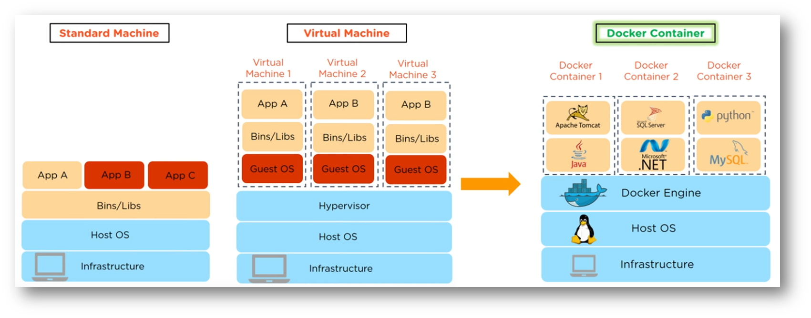
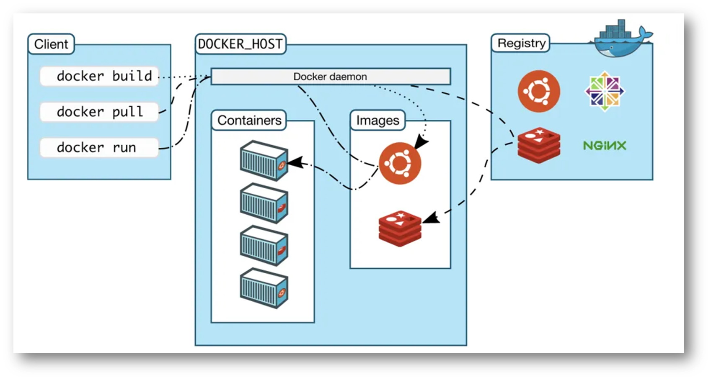
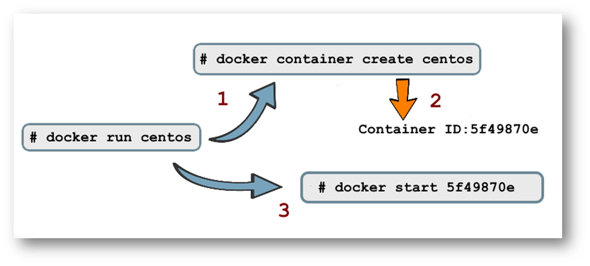

# Capítulo 2: Automação, Arquitetura e DevOps

## 2.6 - Docker HOWTO

### O que é um Contêiner?

Um contêiner é um ambiente de execução completo e isolado (runs in isolation) no qual compartilha o mesmo Kernel do sistema operacional host. Se assemelha a uma máquina virtual por possuir seus próprios processos, serviços, interface de rede, ponto de montagem, etc.  

Executar uma aplicação de forma isolada, dentro de uma mesma máquina, não é algo novo. No _[Linux](https://pt.wikipedia.org/wiki/Linux)_ temos o _[chroot](https://pt.wikipedia.org/wiki/Chroot)_ que restringe o acesso de um processo a uma determinada porção do sistema de arquivos. Vale destacar outras tecnologias existentes a algum tempo como o _[jails](https://pt.wikipedia.org/wiki/FreeBSD_jail)_ do _[FreeBSD](https://pt.wikipedia.org/wiki/FreeBSD)_, e _[Solaris Zones](https://en.wikipedia.org/wiki/Solaris_Containers)_ criado pela _[Sun Microsystems](https://pt.wikipedia.org/wiki/Sun_Microsystems)_. Apesar dessas implementações serem diferentes, elas possuem um objetivo em comum: _"Isolar processos dentro de um mesmo sistema operacional"_

A virtualização no qual conhecemos, no seu sentido mais simples, seria ter sobre um único hardware (host) vários sistemas operacionais (guest), podendo ser de diferentes fabricantes e executados de forma simultânea. Um servidor virtual é criado a partir de um hardware que foi virtualizado ou emulado. 

O conceito de contêineres é similar às máquinas virtuais. A diferença é que as máquinas virtuais _"virtualizam"_ em nível de hardware (diferentes kernel em execução sobre o mesmo hardware). Já os contêineres, possuem virtualização em nível de sistema operacional (um único kernel que executa diferentes aplicações). Normalmente um contêiner executa um único processo dentro dele. E cada contêiner, não sabe da existência um do outro. Contêineres não contém a instalação completa de um Sistema Operacional (apenas alguns binários).

Na imagem abaixo podemos observar melhor essa diferença entre uma máquina tradicional, máquina virtual e contêineres:



Pense em um contêiner como sendo uma _"caixa isolada"_ no qual você executa sua aplicação com suas respectivas dependências. É um novo meio para se executar, empacotar e distribuir/transportar suas aplicações.

_"Múltiplas aplicações executadas em um único host, de forma isolada e gerenciadas por um único Kernel."_

### Quais suas vantagens?

Sistemas operacionais completos são difíceis e custosos para uma organização administrar. Imagine vários deles. Mesmo na nuvem ou virtualizados, temos que nos preocupar com segurança, políticas de acesso, usuários, atualizações periódicas, drivers de dispositivos, etc. Além de que, um sistema operacional instalado pode consumir mais de 1 GByte de armazenamento. Sua aplicação completa, não deve passar dos 200 MBytes, na maioria dos casos.

Pelo fato dos contêineres serem ambientes isolados e portáveis, isto ajuda no desenvolvimento de aplicações, pois é possível empacotar uma aplicação com todas suas dependências, formando uma imagem que pode ser transportada para outro servidor, para um desktop ou para a nuvem.

Utilizar contêineres facilita o deploy e execução de aplicações distribuídas. Ao invés de termos um sistema operacional completo para executar uma aplicação, temos um único sistema operacional, um único Kernel, capaz de gerenciar múltiplos contêineres. É a solução que as empresas e desenvolvedores buscam hoje em dia.

_"Menos trabalho e incômodo ao provisionar ambientes de execução (runtime). Ter o mínimo e o essencial para executar uma aplicação."_

Das suas diversas vantagens, podemos destacar:
- Contêineres provêm ambientes isolados (Loose coupling - baixo acoplamento). Mantêm programas e suas dependências isoladas uns dos outros.
- São provisionados, desprovisionados e inicializados muito mais rápidos do que máquinas virtuais.
- Consome menos recursos em termos de hardware, comparados com máquinas virtuais. São mais _"leves"_ e ocupam menos espaço. Permite que as organizações otimizem a utilização de seus recursos de infraestrutura, economizando também custos operacionais.
- Maior eficiência em termos de escalabilidade e desempenho.
- Na maioria dos casos, uma aplicação que _"roda"_ em um contêiner é bastante _"enxuta"_, havendo somente o necessário para o seu funcionamento.
- Facilita o desenvolvimento de Microserviços.
- Aplicações conteinerizadas são portáveis. Tudo que é necessário para _"rodar"_ já está dentro do contêiner e não há dependência externa. Através do conceito de imagens, é possível fazer o deploy em diferentes provedores de Nuvem ou mesmo em ambientes on-premises.
- Possibilita que as aplicações sejam construídas sob o modelo Cloud Native.
- Permite a padronização dos ambientes de desenvolvimento.

### O surgimento do Docker

De acordo com a _[documentação oficial do Docker](https://docs.docker.com/get-started/)_, containers não é uma tecnologia nova. Porém, usar contêineres para o deploy de aplicações é algo novo. 

Criado em Março de 2013, o Docker é um conjunto de ferramentas (ferramental) que facilita a criação e administração de contêineres. Ele não é uma tecnologia de virtualização. Ele ajuda a resolver os problemas mais comuns referente a instalação, remoção, atualização e execução de softwares em contêineres. Resolve conflitos relacionados a ambientes de desenvolvimento, eliminando frases do tipo: _"Isto funciona na minha máquina"_.

Podemos dizer que o Docker é um novo formato para _"empacotar"_ aplicações (através de imagens Docker). Qualquer aplicação que _"roda"_ em um terminal Linux, _"roda"_ em Docker.

_"O Docker permite empacotar uma aplicação com todas as suas dependências em uma unidade padronizada, chamado de Imagem Docker."_

_"Docker - Construir, Transportar e Rodar em qualquer lugar."_

### Arquitetura

O Docker usa uma _[arquitetura cliente-servidor](https://pt.wikipedia.org/wiki/Modelo_cliente%E2%80%93servidor)_ e faz uso das tecnologias Linux Namespace e cgroups para prover um _"espaço de trabalho"_ isolado, no qual é chamado de contêiner. Todo o ferramental que o Docker disponibiliza permite a construção e implantação de imagens local ou remotamente.

Alguns dos componentes descritos aqui são:

- **Docker Client (docker)**
    - Programa de linha de comando no qual usa REST API para se comunicar com o Docker Daemon.
    - Ferramenta principal usada pela maioria das pessoas.

- **Docker Daemon (dockerd)**
    - Processo que permanece em execução o tempo todo. Verifica as requisições vindas do cliente para gerenciar os objetos Docker (imagens, contêineres, redes e volumes). Todo o trabalho _"pesado"_ referente a criação, execução e distribuição dos contêineres é feito feito pelo Docker Daemon.
    - Transforma o Linux em um servidor Docker que pode receber ações de um cliente remoto.

- **Docker Image**
    - É uma espécie de template no qual contém instruções para a criação de contêineres.
    - Imagens são usadas para armazenar e transportar aplicações. É uma coleção de arquivos (bibliotecas, executáveis, arquivos de configuração, etc).
    - Você pode criar suas próprias imagens ou baixar imagens criadas por outras pessoas, publicadas em um _[registry](https://en.wikipedia.org/wiki/Docker_(software))_.
    - Uma mesma imagem pode ser copiada para inúmeros hosts.

- **Docker Registry**
    - É um serviço que hospeda repositório(s) de imagen(s), permitindo que tais imagens sejam baixadas pelo comando _"docker pull"_.  
    - Pode ser privado ou público como o Docker Hub.

- **Docker Hub (_[https://hub.docker.com/](https://hub.docker.com/)_)**
    - Repositório oficial de imagens Docker. Nele é possível armazenar suas imagens e torná-las públicas ou privadas.
    - É um serviço acessado através da Internet, que permite você procurar, baixar e compartilhar imagens Docker.

- **Docker Contêiner**
    - É a instância de uma imagem (Docker Image) em execução.
    - É possível criar uma infinidade de contêineres a partir de uma imagem.
    - Você só pode executar processos conteinerizados compatíveis com o Kernel do sistema operacional host. Aplicações Windows não podem ser executadas em contêiner Linux.

- **Dockerfile**
    - É um arquivo texto no qual contém a lista de comandos em forma declarativa (receita) usados para construir uma imagem Docker.
    - Após este arquivo de instruções ser criado, usamos o comando docker build no qual irá de fato criar uma imagem.
  


### Instalação

A instalação do Docker é bem simples e difere um pouco, dependendo da distribuição Linux usada. Aqui irei descrever o passo-a-passo utilizando um _[Oracle Linux versão 7.9](https://docs.oracle.com/en/operating-systems/oracle-linux/7/relnotes7.9/index.html)_. Consulte a página oficial do Docker _[aqui](https://docs.docker.com/get-docker/)_ para detalhes de outras distribuições Linux.

```
[opc@docker-lab ~]$ cat /etc/oracle-release
Oracle Linux Server release 7.9

[opc@docker-lab ~]$ uname -a
Linux docker-lab 5.4.17-2102.205.7.3.el7uek.x86_64 #2 SMP Fri Sep 17 16:52:13 PDT 2021 x86_64 x86_64 x86_64 GNU/Linux
```

```
[opc@docker-lab ~]$ sudo yum -y install docker-engine
```

```
[opc@docker-lab ~]$ sudo systemctl enable docker
[opc@docker-lab ~]$ sudo systemctl start docker
```

```
[opc@docker-lab ~]$ docker -v
Docker version 19.03.11-ol, build 9bb540d
```

### Administrando contêineres

Aqui descrevo de forma resumida os comandos básicos no qual eu uso no dia-a-dia para manuseio dos contêineres Docker. A documentação oficial, bem mais detalhada, pode ser encontrada _[aqui](https://docs.docker.com/engine/reference/commandline/container/)_.

Somente lembrando que é uma boa prática executar um único processo dentro de um contêiner. Um contêiner deve ser uma _"peça imutável"_. Isto significa que um contêiner não pode executar nada internamente que o modifique. Um contêiner deve conter somente o necessário para prover sua funcionalidade, pois isto facilita a ação de escalar horizontalmente os componentes que formam sua aplicação.

#### Criando, executando e removendo

- Cria um contêiner usando uma imagem do _[Oracle Linux](https://docs.oracle.com/en/operating-systems/oracle-linux/7/relnotes7.9/index.html)_:

```
[opc@docker-lab ~]$ sudo docker container create oraclelinux:6.9
Unable to find image 'oraclelinux:6.9' locally
Trying to pull repository docker.io/library/oraclelinux ...
6.9: Pulling from docker.io/library/oraclelinux
a3b2bc283bf3: Pull complete
Digest: sha256:9152d3d98e35e36109e7e7585e0fa547d5cd8e6f58c0e622c7a7f5c6452fc396
Status: Downloaded newer image for oraclelinux:6.9
0198fc9b7e3f80a4ce82c65c2cbd6d37621ab733e854ec98a6e8feba282ccd6a
``` 

- Após isto, executa o utilitário _[ping](https://pt.wikipedia.org/wiki/Ping)_ dentro dele:

```
[opc@docker-lab ~]$ sudo docker run -i oraclelinux:6.9 ping -c 2 cloud.oracle.com
PING e130756.dscx.akamaiedge.net (23.54.22.232) 56(84) bytes of data.
64 bytes from a23-54-22-232.deploy.static.akamaitechnologies.com (23.54.22.232): icmp_seq=1 ttl=59 time=0.868 ms
64 bytes from a23-54-22-232.deploy.static.akamaitechnologies.com (23.54.22.232): icmp_seq=2 ttl=59 time=0.942 ms

--- e130756.dscx.akamaiedge.net ping statistics ---
2 packets transmitted, 2 received, 0% packet loss, time 1001ms
rtt min/avg/max/mdev = 0.868/0.905/0.942/0.037 ms
```

- Cria um contêiner com o nome _"meu-linux"_ usando uma imagem do _[CentOS](https://pt.wikipedia.org/wiki/CentOS)_. Após criado, será executado o binário _/bin/bash_ dentro dele, e o mesmo será colocado em _"background"_.

```
[opc@docker-lab ~]$ sudo docker run -tdi --name "meu-linux" centos:latest /bin/bash
Unable to find image 'centos:latest' locally
Trying to pull repository docker.io/library/centos ...
latest: Pulling from docker.io/library/centos
a1d0c7532777: Pull complete
Digest: sha256:a27fd8080b517143cbbbab9dfb7c8571c40d67d534bbdee55bd6c473f432b177
Status: Downloaded newer image for centos:latest
fcdfecbc8f7ed4b6d38efd6ea80a6e5add4f37b1ed8666a7659ceb38917fb46b
```

Nota para outras opções:
- **-t** : Aloca um pseudo-TTY (terminal). Necessário para a execução de um shell.
- **-d** : Executa o contêiner em background (detach) e exibe o container ID.
- **-i** : Executa o contêiner de modo interativo (abre o STDIN do processo). Necessário para a execução de um shell.

- Cria e executa um contêiner usando uma imagem do _[Debian](https://pt.wikipedia.org/wiki/Debian)_. Após criado, será executado de forma interativa, o binário _/bin/bash_ dentro dele. Note que o comando abaixo irá te _"jogar"_ pra dentro do contêiner que acaba de ser criado:

```
[opc@docker-lab ~]$ sudo docker run -ti debian /bin/bash
Unable to find image 'debian:latest' locally
Trying to pull repository docker.io/library/debian ...
latest: Pulling from docker.io/library/debian
bb7d5a84853b: Pull complete
Digest: sha256:4d6ab716de467aad58e91b1b720f0badd7478847ec7a18f66027d0f8a329a43c
Status: Downloaded newer image for debian:latest

root@03b683604b20:/# cat /etc/debian_version
11.1
root@03b683604b20:/# exit
exit
```

- Exibe os contêineres em execução:

```
[opc@docker-lab ~]$ sudo docker ps
CONTAINER ID        IMAGE               COMMAND             CREATED             STATUS              PORTS               NAMES
fcdfecbc8f7e        centos:latest       "/bin/bash"         4 minutes ago       Up 4 minutes                            meu-linux
```

- Exibe os contêineres em execução e também os que já foram encerrados:

```
[opc@docker-lab ~]$ sudo docker ps -a
CONTAINER ID        IMAGE               COMMAND                  CREATED             STATUS                      PORTS               NAMES
03b683604b20        debian              "/bin/bash"              7 minutes ago       Exited (0) 6 minutes ago                        jovial_proskuriakova
fcdfecbc8f7e        centos:latest       "/bin/bash"              10 minutes ago      Up 9 minutes                                    meu-linux
8289f2054c2f        oraclelinux:6.9     "ping -c 2 cloud.ora…"   13 minutes ago      Exited (0) 13 minutes ago                       eager_galileo
```

- Acessa o processo em execução _"dentro"_ do container (pode ser através do CONTAINER ID ou do seu nome):

```
[opc@docker-lab ~]$ sudo docker attach meu-linux
[root@fcdfecbc8f7e /]# cat /etc/redhat-release
CentOS Linux release 8.4.2105

[opc@docker-lab ~]$ sudo docker attach fcdfecbc8f7e
[root@fcdfecbc8f7e /]# cat /etc/redhat-release
CentOS Linux release 8.4.2105
```

>_**__NOTA:__**  Esta ação de "atachar" (attach) basicamente sobrescreve o seu terminal (docker host) com o terminal do contêiner. Lembra da opção -t quando criamos o contêiner? Além disso, é possível referenciar o contêiner em execução pelo seu ID ou nome._

>_**__NOTA:__** Para retornar ao shell do Docker Host, execute o conjunto de teclas: CTRL+p+q_

- Executa um comando dentro de um contêiner que esteja em execução:

```
[opc@docker-lab ~]$ sudo docker exec meu-linux whoami
root
``` 

- Remove automaticamente um contêiner após completar sua execução:

```
[opc@docker-lab ~]$ sudo docker run --rm hello-world
Unable to find image 'hello-world:latest' locally
Trying to pull repository docker.io/library/hello-world ...
latest: Pulling from docker.io/library/hello-world
2db29710123e: Pull complete
Digest: sha256:37a0b92b08d4919615c3ee023f7ddb068d12b8387475d64c622ac30f45c29c51
Status: Downloaded newer image for hello-world:latest

Hello from Docker!
This message shows that your installation appears to be working correctly.

To generate this message, Docker took the following steps:
 1. The Docker client contacted the Docker daemon.
 2. The Docker daemon pulled the "hello-world" image from the Docker Hub.
    (amd64)
 3. The Docker daemon created a new container from that image which runs the
    executable that produces the output you are currently reading.
 4. The Docker daemon streamed that output to the Docker client, which sent it
    to your terminal.

To try something more ambitious, you can run an Ubuntu container with:
 $ docker run -it ubuntu bash

Share images, automate workflows, and more with a free Docker ID:
 https://hub.docker.com/

For more examples and ideas, visit:
 https://docs.docker.com/get-started/

```

- Remove _"forçadamente"_ um contêiner em execução:

```
[opc@docker-lab ~]$ sudo docker rm -f meu-linux
meu-linux
```

- Remove _"forçadamente"_ **TODOS** os contêineres que não estão em execução (stopped):

```
[opc@docker-lab ~]$ sudo docker container prune -f
Deleted Containers:
4c1ac6150ee903cacaa30ffe363414db256c95f9e5f932060110f276ceb8f7a7
03b683604b201e3ceb04eec46eaecbeb02afc9c25aae30421070ca1a2e08e666
fcdfecbc8f7ed4b6d38efd6ea80a6e5add4f37b1ed8666a7659ceb38917fb46b
dde36922c450ac5c2794c6215a8fb9f2708313617689a7610c82a8c66caad61d
8289f2054c2fb5a402048f1632faacec44441da2dfc43d8d8462bc8103a79efe
0198fc9b7e3f80a4ce82c65c2cbd6d37621ab733e854ec98a6e8feba282ccd6a

Total reclaimed space: 82B
```

- Remove _"forçadamente"_ **TODOS** os contêineres em execução ou não:

```
[opc@docker-lab ~]$ sudo docker rm -f $(sudo docker ps -aq)
```

>_**__NOTA:__** Use com cuidado!_

#### Anatomia do comando: "docker run"

A execução do comando _"docker run"_ é dividida em dois comandos separados:



1. Primeiramente é verificado se a imagem (centos) existe localmente. Caso contrário, ela será baixada de um registry. No nosso caso é o _[Docker Hub](https://hub.docker.com/)_. Em seguida, o contêiner será criado através do comando: _"docker container create \<IMAGEM\>"_.

2. Como resultado da criação do contêiner bem sucedida, é retornado um ID.

3. A partir desse ID, o contêiner será iniciado através do comando: _"docker start \<CONTAINER ID\>"_

#### Iniciando, reiniciando, parando, pausando e sinais

Para os comandos abaixo, é possível especificar o _CONTAINER ID_ ou o nome que foi especificado pelo parâmetro _"--name"_, no momento da sua criação.

- Parar a execução de um contêiner (envia um sinal SIGTERM):

```
[opc@docker-lab ~]$ sudo docker stop meu-linux
meu-linux
```

- Parar _"forçadamente"_ a execução de um contêiner (envia um sinal SIGKILL):

```
[opc@docker-lab ~]$ sudo docker kill meu-linux
meu-linux
```

- Tenta parar a execução do contêiner (SIGTERM). Depois de 15 segundos, para _"forçadamente"_ (SIGKILL):

```
[opc@docker-lab ~]$ sudo docker stop -t 15 meu-linux
meu-linux
```

- Parar todos os contêineres em execução:

```
[opc@docker-lab ~]$ sudo docker stop $(sudo docker ps -q)
f74ffc8b124a
```

- Envia um sinal do tipo SIGHUP para o contêiner:

```
[opc@docker-lab ~]$ sudo docker kill --signal=HUP meu-linux
meu-linux
``` 

- Inicia um contêiner:

```
[opc@docker-lab ~]$ sudo docker start meu-linux
meu-linux
```

- Pausa a execução de um contêiner (congela os processos em execução): 

```
[opc@docker-lab ~]$ sudo docker pause meu-linux
meu-linux
```

- Despausa a execução de um contêiner:

```
[opc@docker-lab ~]$ sudo docker unpause meu-linux
meu-linux
```

- Reinicia a execução de um contêiner:

```
[opc@docker-lab ~]$ sudo docker restart meu-linux
meu-linux
```

#### Reiniciando em caso de problemas