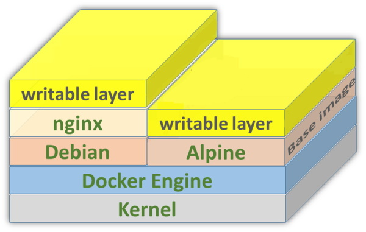
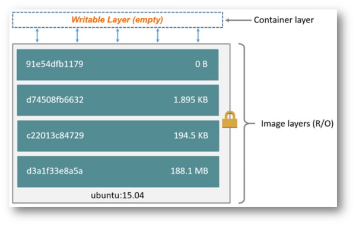

# Capítulo 2: Automação, Arquitetura e DevOps

## 2.6 - Docker HOWTO

### O que é um Contêiner?

Um contêiner é um ambiente de execução completo e isolado (runs in isolation) no qual compartilha o mesmo Kernel do sistema operacional host. Se assemelha a uma máquina virtual por possuir seus próprios processos, serviços, interface de rede, ponto de montagem, etc.  

Executar uma aplicação de forma isolada, dentro de uma mesma máquina, não é algo novo. No _[Linux](https://pt.wikipedia.org/wiki/Linux)_ temos o _[chroot](https://pt.wikipedia.org/wiki/Chroot)_ que restringe o acesso de um processo a uma determinada porção do sistema de arquivos. Vale destacar outras tecnologias existentes a algum tempo como o _[jails](https://pt.wikipedia.org/wiki/FreeBSD_jail)_ do _[FreeBSD](https://pt.wikipedia.org/wiki/FreeBSD)_, e _[Solaris Zones](https://en.wikipedia.org/wiki/Solaris_Containers)_ criado pela _[Sun Microsystems](https://pt.wikipedia.org/wiki/Sun_Microsystems)_. Apesar dessas implementações serem diferentes, elas possuem um objetivo em comum: _"Isolar processos dentro de um mesmo sistema operacional"_

A virtualização no qual conhecemos, no seu sentido mais simples, seria ter sobre um único hardware (host) vários sistemas operacionais (guest), podendo ser de diferentes fabricantes e executados de forma simultânea. Um servidor virtual é criado a partir de um hardware que foi virtualizado ou emulado. 

O conceito de contêineres é similar às máquinas virtuais. A diferença é que as máquinas virtuais _"virtualizam"_ em nível de hardware (diferentes kernel em execução sobre o mesmo hardware). Já os contêineres, possuem virtualização em nível de sistema operacional (um único kernel que executa diferentes aplicações). Normalmente um contêiner executa um único processo dentro dele. E cada contêiner, não sabe da existência um do outro. Contêineres não contém a instalação completa de um Sistema Operacional (apenas alguns binários).

Na imagem abaixo podemos observar melhor essa diferença entre uma máquina tradicional, máquina virtual e contêineres:


Pense em um contêiner como sendo uma _"caixa isolada"_ no qual você executa sua aplicação com suas respectivas dependências. É um novo meio para se executar, empacotar e distribuir/transportar suas aplicações.

_"Múltiplas aplicações executadas em um único host, de forma isolada e gerenciadas por um único Kernel."_

### Quais suas vantagens?

Sistemas operacionais completos são difíceis e custosos para uma organização administrar. Imagine vários deles. Mesmo na nuvem ou virtualizados, temos que nos preocupar com segurança, políticas de acesso, usuários, atualizações periódicas, drivers de dispositivos, etc. Além de que, um sistema operacional instalado pode consumir mais de 1 GByte de armazenamento. Sua aplicação completa, não deve passar dos 200 MBytes, na maioria dos casos.

Pelo fato dos contêineres serem ambientes isolados e portáveis, isto ajuda no desenvolvimento de aplicações, pois é possível empacotar uma aplicação com todas suas dependências, formando uma imagem que pode ser transportada para outro servidor, para um desktop ou para a nuvem.

Utilizar contêineres facilita o deploy e execução de aplicações distribuídas. Ao invés de termos um sistema operacional completo para executar uma aplicação, temos um único sistema operacional, um único Kernel, capaz de gerenciar múltiplos contêineres. É a solução que as empresas e desenvolvedores buscam hoje em dia.

_"Menos trabalho e incômodo ao provisionar ambientes de execução (runtime). Ter o mínimo e o essencial para executar uma aplicação."_

Das suas diversas vantagens, podemos destacar:
- Contêineres provêm ambientes isolados (Loose coupling - baixo acoplamento). Mantêm programas e suas dependências isoladas uns dos outros.
- São provisionados, desprovisionados e inicializados muito mais rápidos do que máquinas virtuais.
- Consome menos recursos em termos de hardware, comparados com máquinas virtuais. São mais _"leves"_ e ocupam menos espaço. Permite que as organizações otimizem a utilização de seus recursos de infraestrutura, economizando também custos operacionais.
- Maior eficiência em termos de escalabilidade e desempenho.
- Na maioria dos casos, uma aplicação que _"roda"_ em um contêiner é bastante _"enxuta"_, havendo somente o necessário para o seu funcionamento.
- Facilita o desenvolvimento de Microserviços.
- Aplicações conteinerizadas são portáveis. Tudo que é necessário para _"rodar"_ já está dentro do contêiner e não há dependência externa. Através do conceito de imagens, é possível fazer o deploy em diferentes provedores de Nuvem ou mesmo em ambientes on-premises.
- Possibilita que as aplicações sejam construídas sob o modelo Cloud Native.
- Permite a padronização dos ambientes de desenvolvimento.

### O surgimento do Docker

De acordo com a _[documentação oficial do Docker](https://docs.docker.com/get-started/)_, containers não é uma tecnologia nova. Porém, usar contêineres para o deploy de aplicações é algo novo. 

Criado em Março de 2013, o Docker é um conjunto de ferramentas (ferramental) que facilita a criação e administração de contêineres. Ele não é uma tecnologia de virtualização. Ele ajuda a resolver os problemas mais comuns referente a instalação, remoção, atualização e execução de softwares em contêineres. Resolve conflitos relacionados a ambientes de desenvolvimento, eliminando frases do tipo: _"Isto funciona na minha máquina"_.

Podemos dizer que o Docker é um novo formato para _"empacotar"_ aplicações (através de imagens Docker). Qualquer aplicação que _"roda"_ em um terminal Linux, _"roda"_ em Docker.

_"O Docker permite empacotar uma aplicação com todas as suas dependências em uma unidade padronizada, chamado de Imagem Docker."_

_"Docker - Construir, Transportar e Rodar em qualquer lugar."_

### Arquitetura

O Docker usa uma _[arquitetura cliente-servidor](https://pt.wikipedia.org/wiki/Modelo_cliente%E2%80%93servidor)_ e faz uso das tecnologias Linux Namespace e cgroups para prover um _"espaço de trabalho"_ isolado, no qual é chamado de contêiner. Todo o ferramental que o Docker disponibiliza permite a construção e implantação de imagens local ou remotamente.

Alguns dos componentes descritos aqui são:

- **Docker Client (docker)**
    - Programa de linha de comando no qual usa REST API para se comunicar com o Docker Daemon.
    - Ferramenta principal usada pela maioria das pessoas.

- **Docker Daemon (dockerd)**
    - Processo que permanece em execução o tempo todo. Verifica as requisições vindas do cliente para gerenciar os objetos Docker (imagens, contêineres, redes e volumes). Todo o trabalho _"pesado"_ referente a criação, execução e distribuição dos contêineres é feito feito pelo Docker Daemon.
    - Transforma o Linux em um servidor Docker que pode receber ações de um cliente remoto.

- **Docker Image**
    - É uma espécie de template no qual contém instruções para a criação de contêineres.
    - Imagens são usadas para armazenar e transportar aplicações. É uma coleção de arquivos (bibliotecas, executáveis, arquivos de configuração, etc).
    - Você pode criar suas próprias imagens ou baixar imagens criadas por outras pessoas, publicadas em um _[registry](https://en.wikipedia.org/wiki/Docker_(software))_.
    - Uma mesma imagem pode ser copiada para inúmeros hosts.

- **Docker Registry**
    - É um serviço que hospeda repositório(s) de imagen(s), permitindo que tais imagens sejam baixadas pelo comando _"docker pull"_.  
    - Pode ser privado ou público como o Docker Hub.

- **Docker Hub (_[https://hub.docker.com/](https://hub.docker.com/)_)**
    - Repositório oficial de imagens Docker. Nele é possível armazenar suas imagens e torná-las públicas ou privadas.
    - É um serviço acessado através da Internet, que permite você procurar, baixar e compartilhar imagens Docker.

- **Docker Contêiner**
    - É a instância de uma imagem (Docker Image) em execução.
    - É possível criar uma infinidade de contêineres a partir de uma imagem.
    - Você só pode executar processos conteinerizados compatíveis com o Kernel do sistema operacional host. Aplicações Windows não podem ser executadas em contêiner Linux.

- **Dockerfile**
    - É um arquivo texto no qual contém a lista de comandos em forma declarativa (receita) usados para construir uma imagem Docker.
    - Após este arquivo de instruções ser criado, usamos o comando docker build no qual irá de fato criar uma imagem.
  


### Instalação

A instalação do Docker é bem simples e difere um pouco, dependendo da distribuição Linux usada. Aqui irei descrever o passo-a-passo utilizando um _[Oracle Linux versão 7.9](https://docs.oracle.com/en/operating-systems/oracle-linux/7/relnotes7.9/index.html)_. Consulte a página oficial do Docker _[aqui](https://docs.docker.com/get-docker/)_ para detalhes de outras distribuições Linux.

```
[opc@docker-lab ~]$ cat /etc/oracle-release
Oracle Linux Server release 7.9

[opc@docker-lab ~]$ uname -a
Linux docker-lab 5.4.17-2102.205.7.3.el7uek.x86_64 #2 SMP Fri Sep 17 16:52:13 PDT 2021 x86_64 x86_64 x86_64 GNU/Linux
```

```
[opc@docker-lab ~]$ sudo yum -y install docker-engine
```

```
[opc@docker-lab ~]$ sudo systemctl enable docker
[opc@docker-lab ~]$ sudo systemctl start docker
```

```
[opc@docker-lab ~]$ docker -v
Docker version 19.03.11-ol, build 9bb540d
```

### Administrando contêineres

Aqui descrevo de forma resumida os comandos básicos no qual eu uso no dia-a-dia para manuseio dos contêineres Docker. A documentação oficial, bem mais detalhada, pode ser encontrada _[aqui](https://docs.docker.com/engine/reference/commandline/container/)_.

Somente lembrando que é uma boa prática executar um único processo dentro de um contêiner. Um contêiner deve ser uma _"peça imutável"_. Isto significa que um contêiner não pode executar nada internamente que o modifique. Um contêiner deve conter somente o necessário para prover sua funcionalidade, pois isto facilita a ação de escalar horizontalmente os componentes que formam sua aplicação.

#### Criando, executando e removendo

- Cria um contêiner usando uma imagem do _[Oracle Linux](https://docs.oracle.com/en/operating-systems/oracle-linux/7/relnotes7.9/index.html)_:

```
[opc@docker-lab ~]$ sudo docker container create oraclelinux:6.9
Unable to find image 'oraclelinux:6.9' locally
Trying to pull repository docker.io/library/oraclelinux ...
6.9: Pulling from docker.io/library/oraclelinux
a3b2bc283bf3: Pull complete
Digest: sha256:9152d3d98e35e36109e7e7585e0fa547d5cd8e6f58c0e622c7a7f5c6452fc396
Status: Downloaded newer image for oraclelinux:6.9
0198fc9b7e3f80a4ce82c65c2cbd6d37621ab733e854ec98a6e8feba282ccd6a
``` 

- Após isto, executa o utilitário _[ping](https://pt.wikipedia.org/wiki/Ping)_ dentro dele:

```
[opc@docker-lab ~]$ sudo docker run -i oraclelinux:6.9 ping -c 2 cloud.oracle.com
PING e130756.dscx.akamaiedge.net (23.54.22.232) 56(84) bytes of data.
64 bytes from a23-54-22-232.deploy.static.akamaitechnologies.com (23.54.22.232): icmp_seq=1 ttl=59 time=0.868 ms
64 bytes from a23-54-22-232.deploy.static.akamaitechnologies.com (23.54.22.232): icmp_seq=2 ttl=59 time=0.942 ms

--- e130756.dscx.akamaiedge.net ping statistics ---
2 packets transmitted, 2 received, 0% packet loss, time 1001ms
rtt min/avg/max/mdev = 0.868/0.905/0.942/0.037 ms
```

- Cria um contêiner com o nome _"meu-linux"_ usando uma imagem do _[CentOS](https://pt.wikipedia.org/wiki/CentOS)_. Após criado, será executado o binário _/bin/bash_ dentro dele, e o mesmo será colocado em _"background"_.

```
[opc@docker-lab ~]$ sudo docker run -tdi --name "meu-linux" centos:latest /bin/bash
Unable to find image 'centos:latest' locally
Trying to pull repository docker.io/library/centos ...
latest: Pulling from docker.io/library/centos
a1d0c7532777: Pull complete
Digest: sha256:a27fd8080b517143cbbbab9dfb7c8571c40d67d534bbdee55bd6c473f432b177
Status: Downloaded newer image for centos:latest
fcdfecbc8f7ed4b6d38efd6ea80a6e5add4f37b1ed8666a7659ceb38917fb46b
```

Nota para outras opções:
- **-t** : Aloca um pseudo-TTY (terminal). Necessário para a execução de um shell.
- **-d** : Executa o contêiner em background (detach) e exibe o container ID.
- **-i** : Executa o contêiner de modo interativo (abre o STDIN do processo). Necessário para a execução de um shell.

- Cria e executa um contêiner usando uma imagem do _[Debian](https://pt.wikipedia.org/wiki/Debian)_. Após criado, será executado de forma interativa, o binário _/bin/bash_ dentro dele. Note que o comando abaixo irá te _"jogar"_ pra dentro do contêiner que acaba de ser criado:

```
[opc@docker-lab ~]$ sudo docker run -ti debian /bin/bash
Unable to find image 'debian:latest' locally
Trying to pull repository docker.io/library/debian ...
latest: Pulling from docker.io/library/debian
bb7d5a84853b: Pull complete
Digest: sha256:4d6ab716de467aad58e91b1b720f0badd7478847ec7a18f66027d0f8a329a43c
Status: Downloaded newer image for debian:latest

root@03b683604b20:/# cat /etc/debian_version
11.1
root@03b683604b20:/# exit
exit
```

- Exibe os contêineres em execução:

```
[opc@docker-lab ~]$ sudo docker ps
CONTAINER ID        IMAGE               COMMAND             CREATED             STATUS              PORTS               NAMES
fcdfecbc8f7e        centos:latest       "/bin/bash"         4 minutes ago       Up 4 minutes                            meu-linux
```

- Exibe os contêineres em execução e também os que já foram encerrados:

```
[opc@docker-lab ~]$ sudo docker ps -a
CONTAINER ID        IMAGE               COMMAND                  CREATED             STATUS                      PORTS               NAMES
03b683604b20        debian              "/bin/bash"              7 minutes ago       Exited (0) 6 minutes ago                        jovial_proskuriakova
fcdfecbc8f7e        centos:latest       "/bin/bash"              10 minutes ago      Up 9 minutes                                    meu-linux
8289f2054c2f        oraclelinux:6.9     "ping -c 2 cloud.ora…"   13 minutes ago      Exited (0) 13 minutes ago                       eager_galileo
```

- Acessa o processo em execução _"dentro"_ do container (pode ser através do CONTAINER ID ou do seu nome):

```
[opc@docker-lab ~]$ sudo docker attach meu-linux
[root@fcdfecbc8f7e /]# cat /etc/redhat-release
CentOS Linux release 8.4.2105

[opc@docker-lab ~]$ sudo docker attach fcdfecbc8f7e
[root@fcdfecbc8f7e /]# cat /etc/redhat-release
CentOS Linux release 8.4.2105
```

>_**__NOTA:__**  Esta ação de "atachar" (attach) basicamente sobrescreve o seu terminal (docker host) com o terminal do contêiner. Lembra da opção -t quando criamos o contêiner? Além disso, é possível referenciar o contêiner em execução pelo seu ID ou nome._

>_**__NOTA:__** Para retornar ao shell do Docker Host, execute o conjunto de teclas: CTRL+p+q_

- Executa um comando dentro de um contêiner que esteja em execução:

```
[opc@docker-lab ~]$ sudo docker exec meu-linux whoami
root
``` 

- Remove automaticamente um contêiner após completar sua execução:

```
[opc@docker-lab ~]$ sudo docker run --rm hello-world
Unable to find image 'hello-world:latest' locally
Trying to pull repository docker.io/library/hello-world ...
latest: Pulling from docker.io/library/hello-world
2db29710123e: Pull complete
Digest: sha256:37a0b92b08d4919615c3ee023f7ddb068d12b8387475d64c622ac30f45c29c51
Status: Downloaded newer image for hello-world:latest

Hello from Docker!
This message shows that your installation appears to be working correctly.

To generate this message, Docker took the following steps:
 1. The Docker client contacted the Docker daemon.
 2. The Docker daemon pulled the "hello-world" image from the Docker Hub.
    (amd64)
 3. The Docker daemon created a new container from that image which runs the
    executable that produces the output you are currently reading.
 4. The Docker daemon streamed that output to the Docker client, which sent it
    to your terminal.

To try something more ambitious, you can run an Ubuntu container with:
 $ docker run -it ubuntu bash

Share images, automate workflows, and more with a free Docker ID:
 https://hub.docker.com/

For more examples and ideas, visit:
 https://docs.docker.com/get-started/

```

- Remove _"forçadamente"_ um contêiner em execução:

```
[opc@docker-lab ~]$ sudo docker rm -f meu-linux
meu-linux
```

- Remove _"forçadamente"_ **TODOS** os contêineres que não estão em execução (stopped):

```
[opc@docker-lab ~]$ sudo docker container prune -f
Deleted Containers:
4c1ac6150ee903cacaa30ffe363414db256c95f9e5f932060110f276ceb8f7a7
03b683604b201e3ceb04eec46eaecbeb02afc9c25aae30421070ca1a2e08e666
fcdfecbc8f7ed4b6d38efd6ea80a6e5add4f37b1ed8666a7659ceb38917fb46b
dde36922c450ac5c2794c6215a8fb9f2708313617689a7610c82a8c66caad61d
8289f2054c2fb5a402048f1632faacec44441da2dfc43d8d8462bc8103a79efe
0198fc9b7e3f80a4ce82c65c2cbd6d37621ab733e854ec98a6e8feba282ccd6a

Total reclaimed space: 82B
```

- Remove _"forçadamente"_ **TODOS** os contêineres em execução ou não:

```
[opc@docker-lab ~]$ sudo docker rm -f $(sudo docker ps -aq)
```

>_**__NOTA:__** Use com cuidado!_

#### Anatomia do comando: "docker run"

A execução do comando _"docker run"_ é dividida em dois comandos separados:


1. Primeiramente é verificado se a imagem (centos) existe localmente. Caso contrário, ela será baixada de um registry. No nosso caso é o _[Docker Hub](https://hub.docker.com/)_. Em seguida, o contêiner será criado através do comando: _"docker container create \<IMAGEM\>"_.

2. Como resultado da criação do contêiner bem sucedida, é retornado um ID.

3. A partir desse ID, o contêiner será iniciado através do comando: _"docker start \<CONTAINER ID\>"_

#### Iniciando, reiniciando, parando, pausando e sinais

Para os comandos abaixo, é possível especificar o _CONTAINER ID_ ou o nome que foi especificado pelo parâmetro _"--name"_, no momento da sua criação.

- Parar a execução de um contêiner (envia um sinal SIGTERM):

```
[opc@docker-lab ~]$ sudo docker stop meu-linux
meu-linux
```

- Parar _"forçadamente"_ a execução de um contêiner (envia um sinal SIGKILL):

```
[opc@docker-lab ~]$ sudo docker kill meu-linux
meu-linux
```

- Tenta parar a execução do contêiner (SIGTERM). Depois de 15 segundos, para _"forçadamente"_ (SIGKILL):

```
[opc@docker-lab ~]$ sudo docker stop -t 15 meu-linux
meu-linux
```

- Parar todos os contêineres em execução:

```
[opc@docker-lab ~]$ sudo docker stop $(sudo docker ps -q)
f74ffc8b124a
```

- Envia um sinal do tipo SIGHUP para o contêiner:

```
[opc@docker-lab ~]$ sudo docker kill --signal=HUP meu-linux
meu-linux
``` 

- Inicia um contêiner:

```
[opc@docker-lab ~]$ sudo docker start meu-linux
meu-linux
```

- Pausa a execução de um contêiner (congela os processos em execução): 

```
[opc@docker-lab ~]$ sudo docker pause meu-linux
meu-linux
```

- Despausa a execução de um contêiner:

```
[opc@docker-lab ~]$ sudo docker unpause meu-linux
meu-linux
```

- Reinicia a execução de um contêiner:

```
[opc@docker-lab ~]$ sudo docker restart meu-linux
meu-linux
```

#### Reiniciando em caso de problemas

- Cria e inicia um contêiner com uma política de restart. Caso o processo que _"roda"_ dentro do contêiner falhe por algum motivo, ele será reiniciado com um limite máximo de três restarts.

```
[opc@docker-lab ~]$ sudo docker run -d --restart=on-failure:3 nginx
Unable to find image 'nginx:latest' locally
Trying to pull repository docker.io/library/nginx ...
latest: Pulling from docker.io/library/nginx
b380bbd43752: Pull complete
fca7e12d1754: Pull complete
745ab57616cb: Pull complete
a4723e260b6f: Pull complete
1c84ebdff681: Pull complete
858292fd2e56: Pull complete
Digest: sha256:644a70516a26004c97d0d85c7fe1d0c3a67ea8ab7ddf4aff193d9f301670cf36
Status: Downloaded newer image for nginx:latest
f101e8b70c0adba24a3bd848311785ce53b728bb9d062963ad1ff851eb134feb
```

- Cria e inicia um contêiner com uma política de restart. Caso o processo que _"roda"_ dentro do contêiner falhe por algum motivo, ele será reiniciado infinitamente.

```
[opc@docker-lab ~]$ sudo docker run -d --restart=always nginx
23e15a1615afc65a150ec2a048a578b432f51193484523f9981e21fef3513413
```

#### Limitando a utilização de recursos 

- Exibe a quantidade de CPUs e memória disponíveis no Docker Host:

```
[opc@docker-lab ~]$ sudo docker info | egrep "(CPU|Memory)"
 CPUs: 2
 Total Memory: 7.488GiB
```

- Limita a utilização do contêiner para uma CPU e 128 megabytes de memória:

```
[opc@docker-lab ~]$ sudo docker run -d --cpus 1 -m 128m --name "web-server" nginx
d8b109577b24c4dce89cb7ebf18799ee62963ef9e4acc668eb9cf25a49a980dd
```

- Atualiza a quantidade de memória e CPU disponível para um contêiner em execução:

```
[opc@docker-lab ~]$ sudo docker update --memory 1024m --memory-swap 1024m --cpus 2 web-server
web-server
```

#### Monitorando e verificando suas propriedades

- Exibe a versão de todos os componentes do Docker:

```
[opc@docker-lab ~]$ sudo docker version
Client: Docker Engine - Community
 Version:           19.03.11-ol
 API version:       1.40
 Go version:        go1.16.2
 Git commit:        9bb540d
 Built:             Fri Jul 23 01:33:55 2021
 OS/Arch:           linux/amd64
 Experimental:      false

Server: Docker Engine - Community
 Engine:
  Version:          19.03.11-ol
  API version:      1.40 (minimum version 1.12)
  Go version:       go1.16.2
  Git commit:       9bb540d
  Built:            Fri Jul 23 01:32:08 2021
  OS/Arch:          linux/amd64
  Experimental:     false
  Default Registry: docker.io
 containerd:
  Version:          v1.4.8
  GitCommit:        7eba5930496d9bbe375fdf71603e610ad737d2b2
 runc:
  Version:          1.0.0-rc95
  GitCommit:        2856f01
 docker-init:
  Version:          0.18.0
  GitCommit:        fec3683
```

- Exibe diversas informações referente a instalação e execução do Docker:

```
[opc@docker-lab ~]$ sudo docker version
```

- Exibe o diretório raiz onde são armazenados imagens e contêineres:

```
[opc@docker-lab ~]$ sudo docker info | grep "Root Dir"
 Docker Root Dir: /var/lib/docker
```

- Exibe os logs de um contêiner. Tudo que for enviado para STDOUT e STDERR, dos processos em execução de dentro do contêiner, será exibido com o comando abaixo:

```
[opc@docker-lab ~]$ sudo docker logs web-server
/docker-entrypoint.sh: /docker-entrypoint.d/ is not empty, will attempt to perform configuration
/docker-entrypoint.sh: Looking for shell scripts in /docker-entrypoint.d/
/docker-entrypoint.sh: Launching /docker-entrypoint.d/10-listen-on-ipv6-by-default.sh
10-listen-on-ipv6-by-default.sh: info: Getting the checksum of /etc/nginx/conf.d/default.conf
10-listen-on-ipv6-by-default.sh: info: Enabled listen on IPv6 in /etc/nginx/conf.d/default.conf
/docker-entrypoint.sh: Launching /docker-entrypoint.d/20-envsubst-on-templates.sh
/docker-entrypoint.sh: Launching /docker-entrypoint.d/30-tune-worker-processes.sh
/docker-entrypoint.sh: Configuration complete; ready for start up
2021/10/14 20:06:38 [notice] 1#1: using the "epoll" event method
2021/10/14 20:06:38 [notice] 1#1: nginx/1.21.3
2021/10/14 20:06:38 [notice] 1#1: built by gcc 8.3.0 (Debian 8.3.0-6)
2021/10/14 20:06:38 [notice] 1#1: OS: Linux 5.4.17-2102.205.7.3.el7uek.x86_64
2021/10/14 20:06:38 [notice] 1#1: getrlimit(RLIMIT_NOFILE): 1048576:1048576
2021/10/14 20:06:38 [notice] 1#1: start worker processes
2021/10/14 20:06:38 [notice] 1#1: start worker process 32
2021/10/14 20:06:38 [notice] 1#1: start worker process 33
```

- Exibe os logs de um contêiner de forma contínua:

```
[opc@docker-lab ~]$ sudo docker logs -f web-server
```

- Exibe de forma contínua algumas estatísticas (CPU, memória, I/O e o número de processos ou threads)  de todos os contêiner em execução:

```
[opc@docker-lab ~]$ sudo docker stats
```

- Exibe de forma contínua todos os eventos do Docker Host:

```
[opc@docker-lab ~]$ sudo docker events
```

- Exibe quais os processos que estão em execução em um contêiner:

```
[opc@docker-lab ~]$ sudo docker top web-server
UID                 PID                 PPID                C                   STIME               TTY                 TIME                CMD
root                30061               30043               0                   20:06               ?                   00:00:00            nginx: master process nginx -g daemon off;
101                 30121               30061               0                   20:06               ?                   00:00:00            nginx: worker process
101                 30122               30061               0                   20:06               ?                   00:00:00            nginx: worker process
```

>_**__NOTA:__** Executar o comando "ps" diretamente no Docker Host, exibe todos os processos, de todos os contêineres em execução neste host._

>_**__NOTA:__** É possível utilizar o comando "ps axlfww" diretamente no Docker Host para facilitar a visualização dos processos._

### Administrando volumes

Volumes são diretórios externos e existentes no Docker Host no qual é possível _"montar"_ dentro de um contêiner. Todo contêiner possui seu próprio _[MNT Namespace](https://en.wikipedia.org/wiki/Linux_namespaces)_ e seu próprio sistema de arquivos. Lembrando que todo sistema de arquivos de um contêiner é apagado quando o mesmo encerra sua execução.

Através do uso de volumes, um contêiner pode persistir dados. Isto significa que caso um contêiner esteja usando um volume, que foi montado ou anexado nele, e o mesmo seja excluído, os dados deste volume não serão perdidos. Além disso, volumes também podem ser reutilizados ou compartilhados entre contêineres.

Existem três diferentes tipos de armazenamento mais comumente utilizados:

- BIND Mounts
- Armazenamento In-Memory
- Volumes Dockers

#### BIND Mounts

Podemos dizer que neste modo de montagem é realizado um link ou uma _"ligação direta"_, de um arquivo ou diretório a partir do Docker Host, para dentro do contêiner especificado.  Este modo é útil quando o Docker Host disponibiliza um arquivo ou diretório que é necessário para um programa em execução dentro de um contêiner. Ou mesmo quando o contêiner disponibiliza conteúdo para ser processado pelo Docker Host, por exemplo. 

- Monta um diretório através do modo BIND (link ou _"ligação direta"_) para dentro de um contêiner:

```
[opc@docker-lab ~]$ sudo docker run -tdi --mount type=bind,src=/tmp,dst=/tmp debian /bin/bash
319a33221c5406a18d45e82c8453219a96c42a38f65771d64535aca3da3f9f13
```

- Monta um arquivo somente-leitura, através do modo BIND (link ou _"ligação direta"_) para dentro de um contêiner:

```
[opc@docker-lab ~]$ sudo docker run -tdi --mount type=bind,src=/etc/passwd,dst=/etc/passwd,readonly=true centos /bin/bash
2dff183ee05b752b6c221ea8ecdf55ab308f9380a2a0768db2406bf41ffdba52
```

>_**__NOTA:__** Lembrando que a operação BIND pode ser feita tanto em arquivo quanto em diretório._

#### Armazenamento In-Memory

```
[opc@docker-lab ~]$ sudo docker run --mount type=tmpfs,dst=/tmp,tmpfs-size=16k,tmpfs-mode=1777 centos
```

#### Volumes Docker

Volumes são blocos de armazenamento, nomeados e gerenciados pelo Docker. Estes podem ser disponibilizados através do disco do Docker Host ou via algum tipo de _"cloud storage"_ mais exótico.

- Cria um novo volume:

```
[opc@docker-lab ~]$ sudo docker volume create meu-volume-1
meu-volume-1
```

- Lista os volumes criados:

```
[opc@docker-lab ~]$ sudo docker volume ls
DRIVER              VOLUME NAME
local               meu-volume-1
```

- Exibindo a localização real dos volumes no Docker Host: 

```
[opc@docker-lab ~]$ sudo ls -ltr /var/lib/docker/volumes/
total 24
drwxr-xr-x. 3 root root    19 Oct 14 22:59 meu-volume-1
-rw-------. 1 root root 32768 Oct 14 22:59 metadata.db
```

>_**__NOTA:__** Todos os volumes são criados abaixo do diretório: "/var/lib/docker/volumes"_

- Monta um volume em um contêiner:

```
[opc@docker-lab ~]$ sudo docker run -tdi --mount type=volume,src=meu-volume-1,dst=/mnt/vol1 centos
60d6d57452ef1d928a30199f3b914de77f3da20039b1835cd4316ac223c7d4d6
``` 

- Utiliza volumes de outro contêiner (copia as definições de montagem de outro contêiner):

```
[opc@docker-lab ~]$ sudo docker run -d --name meu-linux-1 ubuntu
ddcae0ab7a494556036113929af73cc934fa47722f71cdbf6a1b3644aa6a67c8

[opc@docker-lab ~]$ sudo docker run -d --name outro-linux --volumes-from meu-linux-1 ubuntu
40a30c0c753c1a63aefbe9db8bc2903f766d884d0bb56d6a79a95d6b6c547265
```

- Exibe a criação de um arquivo dentro de um volume:

```
[opc@docker-lab ~]$ sudo docker exec linux /bin/bash -c "touch /mnt/vol1/meu-arquivo.txt"


[opc@docker-lab ~]$ sudo ls -lt /var/lib/docker/volumes/meu-volume-1/_data/
total 0
-rw-r--r--. 1 root root 0 Aug 19 10:29 meu-arquivo.txt
```

- Exibe detalhes de um volume:

```
[opc@docker-lab ~]$ sudo docker volume inspect meu-volume-1
[
    {
        "CreatedAt": "2021-10-14T22:59:06Z",
        "Driver": "local",
        "Labels": {},
        "Mountpoint": "/var/lib/docker/volumes/meu-volume-1/_data",
        "Name": "meu-volume-1",
        "Options": {},
        "Scope": "local"
    }
]
```

- Cria um contêiner com um volume anônimo:

```
[opc@docker-lab ~]$ sudo docker run -tdi --mount type=volume,dst=/dados debian:latest /bin/bash
1623346daa7f0a7729531b474f09791832de97f853867706c7914d121cdf3a29

[opc@docker-lab ~]$ sudo docker volume ls
DRIVER              VOLUME NAME
local               929bcbf90964ef693e06de7130bbbfeff6b0906d4553275269beef0482b74993
local               meu-volume-1
```

- Remove um volume que não está em uso:

```
[opc@docker-lab ~]$ sudo docker volume rm meu-volume-1
meu-volume-1
```

- Remove TODOS os volumes que não estão em uso:

```
[opc@docker-lab ~]$ sudo docker volume prune
WARNING! This will remove all local volumes not used by at least one container.
Are you sure you want to continue? [y/N] n
Total reclaimed space: 0B
```

- Remove sem solicitar confirmação, TODOS os volumes que não estão em uso:

```
[opc@docker-lab ~]$ sudo docker volume prune -f
Total reclaimed space: 0B
``` 

### Administrando contêineres

Uma imagem é basicamente um arquivo _".tar.gz"_ que armazena um sistema de arquivos em camadas. Podemos dizer também, que uma imagem docker é um pacote executável, um template no qual é possível criar contêineres. Em uma imagem, temos tudo o que é necessário para executar sua aplicação (runtime, binários, bibliotecas, variáveis de ambiente, arquivos de configuração, etc).

Quando dizemos _"sistema de arquivos em camadas"_, estamos nos referindo a uma pilha de camadas imutáveis (somente leitura e que não podem ser modificadas), permitindo escrita somente pela camada mais alta (writable layer). A camada mais alta, é o nosso contêiner em execução. Além disso, a imutabilidade facilita o compartilhamento das imagens Docker ao invés de ter que criar cópias independentes de cada contêiner. Camadas individuais são reutilizáveis.

_"Uma pilha de camadas somente-leitura (ro) e uma no topo leitura-escrita (rw), que é o nosso container em execução."_



>_**__NOTA:__** As camadas abaixo da "writable layer" são imutáveis e não podem ser modificadas._

De um modo mais direto, quando um contêiner inicia, o Docker aloca uma camada writable vazia (empty) no topo das outras camadas existentes, onde é possível termos escrita.



Essa camada writable é efêmera e só existe enquanto o contêiner estiver em execução. Ao eliminar o contêiner, essa camada writable morre junto com seus dados. Exceto quando usamos volumes externos.

O que for gravado nestes volumes externos, não será perdido com o término do contêiner.Como você lerá, uma outra forma de persistir os dados da camada writable, é através do comando _"docker commit"_, que transforma todas as camadas, incluindo o conteúdo da camada writable, em uma imagem.

Tecnicamente falando, as camadas são montadas pelo Docker sobre um _[Union FileSystem (UnionFS)](https://pt.wikipedia.org/wiki/UnionFS)_ que utiliza uma técnica chamada _[Copy-On-Write (CoW)](https://pt.wikipedia.org/wiki/C%C3%B3pia_em_grava%C3%A7%C3%A3o)_. Basicamente, esta técnica permite que se altere uma cópia e preserve o original. A cada alteração, uma cópia antes é feita, por isto o nome  _[Copy-On-Write (CoW)](https://pt.wikipedia.org/wiki/C%C3%B3pia_em_grava%C3%A7%C3%A3o)_ ou _"cópia sobre escrita"_. A implementação do _[UnionFS](https://pt.wikipedia.org/wiki/UnionFS)_ usada atualmente pelo Docker é o _[OverlayFS2](https://docs.docker.com/storage/storagedriver/overlayfs-driver/)_. 

>_**__NOTA:__** Contêineres são efêmeros. Toda alteração realizada em seu sistema de arquivos é perdida quando a execução do contêiner termina. A imutabilidade é uma característica de uma boa engenharia de software._

>_**__NOTA:__** As imagens Docker que utilizam OverlayFS2 são armazenadas neste diretório: /var/lib/docker/overlay2_

Uma imagem Docker pode ser criada de três diferentes maneiras:

1. Executar um contêiner de forma interativa, realizar suas mudanças e alterações, e por último executar um commit, que terá como resultado uma nova imagem.

**docker container run … → * mudanças * → docker container commit … → \*\* nova imagem \*\***

2. Através de um _[Dockerfile](https://docs.docker.com/engine/reference/builder/)_, que nada mais é do que um arquivo texto que contém instruções para se criar imagens.

3. Importar uma imagem compactada no formato _".tar"_

#### Criando uma Imagem interativamente

Toda imagem que você cria começa a partir de uma Imagem Base. Algumas dessas como _[Alpine](https://hub.docker.com/_/alpine)_, _[BusyBox](https://hub.docker.com/_/busybox)_ ou _[Cirros](https://hub.docker.com/_/cirros)_, são mais apropriadas para se criar aplicações em contêineres por conta do seu tamanho total ser menor. Nada impede você de usar imagens CentOS ou Ubuntu como imagem base. Porém, quanto menor for seu contêiner, melhor. Além disso, é uma boa prática seu contêiner possuir somente o necessário para desempenhar sua função. 

1. Primeiramente vamos fazer o download de uma imagem base:

```
[opc@docker-lab ~]$ sudo docker pull centos
Using default tag: latest
Trying to pull repository docker.io/library/centos ...
latest: Pulling from docker.io/library/centos
Digest: sha256:a27fd8080b517143cbbbab9dfb7c8571c40d67d534bbdee55bd6c473f432b177
Status: Image is up to date for centos:latest
centos:latest
```

2. Criar um novo contêiner a partir da imagem base que foi baixada:

```
[opc@docker-lab ~]$ sudo docker container run --name meu-container -ti centos:latest /bin/bash
[root@00d212550284 /]# cat /etc/centos-release
CentOS Linux release 8.4.2105
```

3. A partir do shell iniciado dentro do contêiner, iremos executar os seguintes comandos:

```
[root@17c2843e88ba /]# yum -y update
[root@17c2843e88ba /]# yum install -y python38-devel.x86_64
[root@17c2843e88ba /]# yum clean all -y
```

```
[root@17c2843e88ba /]# ln -sf /bin/python3.8 /bin/python
[root@17c2843e88ba /]# ln -sf /bin/pip3.8 /bin/pip
```

```
[root@17c2843e88ba /]# pip install --no-cache-dir "django==3.*"
[root@17c2843e88ba /]# mkdir -p /srv/www-motando-com-br/
[root@17c2843e88ba /]# /usr/local/bin/django-admin.py startproject motando /srv/www-motando-com-br/
```

4. Pronto! Temos nossa imagem base já customizada. Agora, vamos sair do contêiner para seguirmos com as demais atividades:

```
[root@17c2843e88ba /]# exit
exit
[opc@docker-lab ~]$
``` 

>_**__NOTA:__** Ao executar o comando exit, voltamos ao shell do Docker Host além do contêiner em si ser encerrado. Isto porque o único processo que estava em execução dentro deste contêiner era o /bin/bash. Dizemos então que este contêiner passou do estado "running" para "stopped"._

5. Com o comando abaixo, verificamos que o contêiner que foi criado e modificado está parado: 

```
[opc@docker-lab ~]$ sudo docker ps -a
CONTAINER ID        IMAGE               COMMAND                CREATED             STATUS                      PORTS               NAMES
17c2843e88ba        centos:latest       "/bin/bash"            13 minutes ago      Exited (0) 2 minutes ago                        meu-container
```

6. Para visualizar todas as mudanças que foram feitas no sistema de arquivos, você pode usar o comando abaixo:

```
[opc@docker-lab ~]$ sudo docker diff meu-container
```

A saída do comando _"docker diff"_ apresenta as seguintes letras iniciais na frente de arquivos ou diretórios:

- A → informa quais arquivos ou diretórios que foram adicionados (added).
- C → informa quais arquivos ou diretórios que foram alterados (changed).
- D → informa quais arquivos ou diretórios que foram excluídos (deleted).

7. Para se criar uma imagem a partir do contêiner modificado _"meu-container"_, usamos o comando  _"docker commit"_. Ele irá persistir as modificações feitas criando uma nova imagem.

```
[opc@docker-lab ~]$ sudo docker container commit -a "Daniel Armbrust <daniel.armbrust@algumdominio.com>" -m "Django Container" meu-container minha-imagem
sha256:eecaeff07508932d2edea39be730b92f98d74bdc9dcb771570afa3f560932017
```

>_**__NOTA:__** É uma boa prática assinar a imagem com os dados do autor (-a) além de uma mensagem que identifique e descreva este commit (-m)._

8. A partir de agora já é possível ver a imagem _"minha-imagem"_ que acaba de ser criada:

```
[opc@docker-lab ~]$ sudo docker images
REPOSITORY          TAG                 IMAGE ID            CREATED             SIZE
minha-imagem        latest              eecaeff07508        7 minutes ago       433MB
nginx               latest              87a94228f133        2 days ago          133MB
debian              latest              f776cfb21b5e        3 days ago          124MB
ubuntu              latest              597ce1600cf4        13 days ago         72.8MB
hello-world         latest              feb5d9fea6a5        3 weeks ago         13.3kB
centos              latest              5d0da3dc9764        4 weeks ago         231MB
oraclelinux         6.9                 8deb00ba1b3a        3 years ago         171MB
```

9. Além de ser uma outra boa prática, é recomendado versionar suas imagens através de TAGS:

```
[opc@docker-lab ~]$ sudo docker tag minha-imagem armbrust/django:1.0
```

10. Por fim, para criar um novo contêiner a partir da imagem que criamos: 

```
[opc@docker-lab ~]$ sudo docker container run --name meu-django armbrust/django:1.0
```

>_**__NOTA:__** Como não definimos um processo persistente para ser executado dentro do contêiner, este será criado e em seguida encerrado._

11. Caso deseje verificar como a imagem foi construída, use o comando docker image history conforme abaixo:

```
[opc@docker-lab ~]$ sudo docker image history minha-imagem
IMAGE               CREATED             CREATED BY                                      SIZE                COMMENT
eecaeff07508        9 minutes ago       /bin/bash                                       202MB               Django Container
5d0da3dc9764        4 weeks ago         /bin/sh -c #(nop)  CMD ["/bin/bash"]            0B
<missing>           4 weeks ago         /bin/sh -c #(nop)  LABEL org.label-schema.sc…   0B
<missing>           4 weeks ago         /bin/sh -c #(nop) ADD file:805cb5e15fb6e0bb0…   231MB
```

#### Salvar, Exportar e Importar

É possível salvar, exportar e importar o sistema de arquivos de uma imagem ou contêiner para fora dos domínios do Docker. Em alguns momentos pode ser útil quando se deseja trabalhar sem o sistema de camadas. Obviamente quando se faz isto, você perde todo o histórico de mudanças oferecido pelas camadas do sistema de arquivos.

- Salva uma imagem em um arquivo _.tar_:

```
[opc@docker-lab ~]$ sudo docker image save armbrust/django:1.0 -o armbrust-django.tar

[opc@docker-lab ~]$ ls -ld armbrust-django.tar
-rw-------. 1 root root 455150080 Oct 15 04:38 armbrust-django.tar
```

- Carrega uma imagem a partir de um arquivo _.tar_:

```
[opc@docker-lab ~]$ sudo docker image load -i armbrust-django.tar
Loaded image: armbrust/django:1.0
```

- Exporta um contêiner em um arquivo _.tar_:

```
[opc@docker-lab ~]$ sudo docker export meu-container -o meu-container.tar

[opc@docker-lab ~]$ ls -ld meu-container.tar
-rw-------. 1 root root 369082880 Oct 15 04:40 meu-container.tar
```

- Importa o conteúdo de um arquivo _.tar_ para criar uma imagem:

```
[opc@docker-lab ~]$ sudo chown opc: meu-container.tar

[opc@docker-lab ~]$ sudo docker import - armbrust/django-importado:2.0 < meu-container.tar
sha256:2e95023191608a373e331007eea62251205c36327aa325ec833581feea5eb1d1
```

>_**__NOTA:__** Você pode usar também, a URL de um arquivo para realizar uma importação._

#### Entrypoint

O Entrypoint é o programa que será executado quando o contêiner iniciar.

Para demonstrar sua funcionalidade, vamos criar uma nova imagem e evitar _"chamar o shell"_ toda vez que criarmos nosso container CentOS.

1. Cria-se um novo contêiner em background, usando a imagem do CentOS, de nome _"meu-container-shell"_, informando que o comando _/bin/bash_ deve ser executado assim que o contêiner iniciar:

```
[opc@docker-lab ~]$ sudo docker run --rm --name meu-container-shell -di --entrypoint /bin/bash centos:latest
0bf3b1c034c8f6523ab339ba3053842dbfaf7a1e6846d09b27c831b741d00abf
```

2. Logo após, criamos uma nova imagem de nome _"centos-shell"_ a partir do contêiner _"meu-container-shell"_ que está em execução:

```
[opc@docker-lab ~]$ sudo docker commit meu-container-shell centos-shell
sha256:caf4de58d1121f264e3e3c98065ec9e8dcd3c3a77d1c835b03655975889239a2
```

3. Podemos verificar a imagem que acabamos de criar com o comando abaixo:

```
[opc@docker-lab ~]$ sudo docker images
REPOSITORY                  TAG                 IMAGE ID            CREATED             SIZE
centos-shell                latest              caf4de58d112        28 seconds ago      231MB
```

4. Com a imagem criada, podemos parar o contêiner _"meu-container-shell"_:

```
[opc@docker-lab ~]$ sudo docker stop meu-container-shell
meu-container-shell
```

>_**__NOTA:__** Ao parar a execução do contêiner "meu-container-shell", ele automaticamente será removido, pois foi criado com a opção --rm._

5. Como temos o entrypoint definido para _/bin/bash_ nesta imagem que acabamos de criar, basta iniciar um novo contêiner a partir dela que já será disponibilizado um shell interativo:

```
[opc@docker-lab ~]$ sudo docker run -ti centos-shell
[root@682cc15fe01a /]# cat /etc/centos-release
CentOS Linux release 8.4.2105
```

#### Criando uma Imagem a partir de um Dockerfile

Dockerfile é um arquivo texto no qual especifica, comando por comando (passo-a-passo), como uma imagem Docker deve ser criada. De forma resumida: 

_"É um arquivo de receita, passado como parâmetro para o comando **docker build**, e usado para gerar imagens."_

Ou seja, dentro de um Dockerfile, você irá encontrar comandos para construção da imagem em si e execução do processo _"conteinerizado"_.

1. Primeiramente devemos criar um diretório de trabalho. É neste diretório que iremos criar nosso Dockerfile. Lembrando que aqui você pode ter qualquer outro arquivo ou diretório, no qual deseja que faça parte de sua imagem.

```
[opc@docker-lab ~]$ cd armbrust-django/

[opc@docker-lab ~]$ ls -la armbrust-django/
total 4
drwxrwxr-x. 2 opc opc   45 Oct 15 11:10 .
drwx------. 6 opc opc 4096 Oct 15 11:09 ..
-rw-rw-r--. 1 opc opc    0 Oct 15 11:10 Dockerfile
-rw-rw-r--. 1 opc opc    0 Oct 15 11:10 .dockerignore
```

>_**__NOTA:__** É uma boa prática criar sempre um diretório de trabalho exclusivo para construir suas imagens, pois o processo que faz a construção da imagem transfere todo o conteúdo deste para o Docker daemon, de forma recursiva. Quanto menor, melhor._

2. Nosso Dockerfile possui o seguinte conteúdo:

```
[opc@docker-lab ~]$ cat armbrust-django/Dockerfile
FROM centos:latest

LABEL maintainer="daniel.armbrust@algumdominio.com"
LABEL description="Django App in Docker"

# Variaveis de ambiente do container
ENV PATH="$PATH:/usr/local/bin:/usr/local/sbin"
WORKDIR /srv/www-motando-com-br

# Atualizacao do s.o.
RUN yum -y update

# Instalacao do Python e ajustes de links simbolicos
RUN yum -y install python38-devel.x86_64 && yum -y clean all
RUN ln -sf /bin/python3.8 /bin/python && ln -sf /bin/pip3.8 /bin/pip

# Instalacao do DJANGO Framework
RUN pip install --no-cache-dir "django==3.*"

# Criacao da estrutura inicial da aplicacao DJANGO
RUN django-admin.py startproject motando /srv/www-motando-com-br/
RUN /srv/www-motando-com-br/manage.py makemigrations
RUN /srv/www-motando-com-br/manage.py migrate

# Criacao da estrutura/usuario para a aplicacao
RUN groupadd -g 5580 django && useradd -u 5580 -g django -m django
RUN chown -R django:django /srv/www-motando-com-br/motando/

USER django:django

EXPOSE 80:8000

# Execucao do processo persistente do container
ENTRYPOINT ["/srv/www-motando-com-br/manage.py"]
CMD ["runserver", "0.0.0.0:8000"]
```

Alguns detalhes referente ao Dockerfile merecem destaque:

- Todo Dockerfile deve iniciar com a instrução FROM, que especifica a imagem base.
- Toda linha que inicia com o carácter #, é tratada como um comentário.
- Um arquivo _.dockerignore_ pode ser criado dentro do diretório de trabalho. Este possui a função de excluir arquivos ou diretórios do processo de construção da imagem.
- Sempre que possível devemos utilizar “execuções inline” para reduzir o número de camadas que serão criadas:
    - Ex: _yum -y update && yum -y clean all_