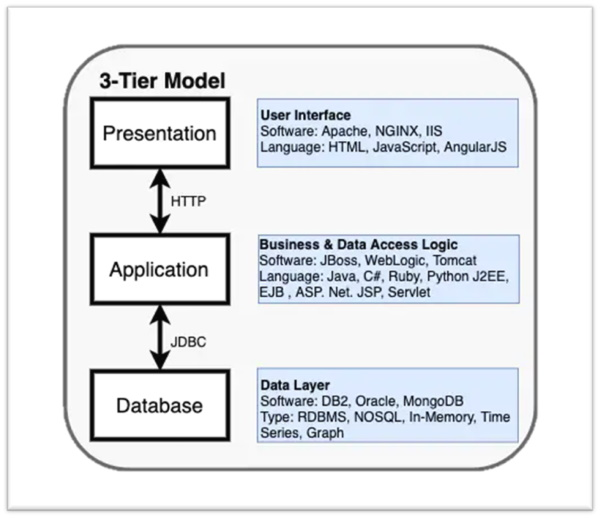

# Capítulo 2: Automação, Arquitetura e DevOps

## 2.8 - Modelos de Arquitetura

### Modelo de 3 Camadas

É o modelo mais conhecido onde consiste em uma _Camada de Apresentação (interface com o usuário)_, _Camada de Aplicação (regras de negócio)_ e _Camada de Banco de Dados_.

