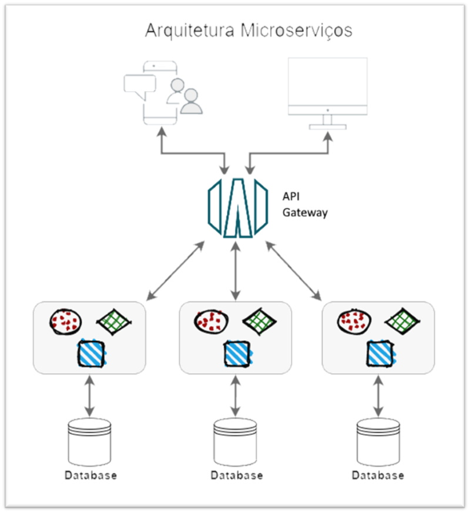

# Capítulo 2: Automação, Arquitetura e DevOps

## 2.8 - Uma breve apresentação sobre Modelos de Arquitetura

### Modelo de 3 Camadas

É o modelo mais conhecido onde consiste em uma _Camada de Apresentação (interface com o usuário)_, _Camada de Aplicação (regras de negócio)_ e _Camada de Banco de Dados_.

Muitas aplicações do _[mundo corporativo (enterprise)](https://en.wikipedia.org/wiki/Enterprise_software)_ foram criadas sobre este modelo onde tínhamos, um _[Apache](https://pt.wikipedia.org/wiki/Servidor_Apache) ou [Nginx](https://pt.wikipedia.org/wiki/Nginx)_ fazendo papel de _[proxy reverso](https://pt.wikipedia.org/wiki/Proxy_reverso)_ e ficando a frente de um _[servidor de aplicação (middleware)](https://pt.wikipedia.org/wiki/Servidor_de_aplica%C3%A7%C3%A3o)_ _[Jboss](https://en.wikipedia.org/wiki/JBoss_Enterprise_Application_Platform)_ ou _[Tomcat](https://pt.wikipedia.org/wiki/Apache_Tomcat)_, que era o local onde a aplicação era executada e _implantada (deploy)_. Este _[servidor de aplicação](https://pt.wikipedia.org/wiki/Servidor_de_aplica%C3%A7%C3%A3o)_ também tinha acesso a um Banco de Dados para recuperar e persistir as informações, que era normalmente um _[Banco de Dados Oracle](https://pt.wikipedia.org/wiki/Oracle_(banco_de_dados))_ ou _[MySQL](https://pt.wikipedia.org/wiki/MySQL)_.

Apesar de ainda ser um modelo ainda em uso, pode-se dizer que este é um modelo desatualizado neste _"tempo de cloud"_ em que vivemos. Crescer uma aplicação dentro deste modelo ou escalar verticalmente, torna-se difícil e complexo. 

Aplicações executadas sobre este modelo também são chamadas de _[aplicações monolíticas](https://pt.wikipedia.org/wiki/Aplica%C3%A7%C3%A3o_monol%C3%ADtica)_.

Com a chegada e maior utilização da _[Computação em Nuvem](https://pt.wikipedia.org/wiki/Computa%C3%A7%C3%A3o_em_nuvem)_, outros modelos de arquiteturas surgiram e passaram a ser utilizados.

### Arquitetura em Microsserviços 

Atualmente o tema de maior destaque, quando falamos ou pensamos no desenvolvimento de software moderno, são os _microsserviços_. Seu conceito é bem simples: _"divida seu aplicativo em partes menores, cada uma desempenhando uma única função e podendo ser desenvolvido e implantado de forma independente."_

Toda parte que foi _"quebrada"_ ou dividia em uma parte menor, recebe o nome de _serviço_. Sendo um _serviço menor_, _auto-contido_ e independente, este passa a ser chamado de _microsserviço_. Pode-se dizer também, que _microsserviços_ é um estilo arquitetural que estrutura uma aplicação em uma _"coleção de serviços"_. Cada diferente serviço é independente de linguagem de programação. Você pode ter serviços escritos em _[Python](https://pt.wikipedia.org/wiki/Python)_, _[Go](https://pt.wikipedia.org/wiki/Go_(linguagem_de_programa%C3%A7%C3%A3o))_ ou _[Java](https://pt.wikipedia.org/wiki/Java_(linguagem_de_programa%C3%A7%C3%A3o))_, coexistindo juntos.

Utilizar este estilo de arquitetura não resolve todos os problemas (não é uma _"bala de prata"_). Seu uso somente é recomendando quando começam haver problemas de escalabilidade, tanto no código, pessoas e infraestrutura. 

Podemos destacar algumas vantagens e desvantagens:

- **Vantagens**
    - Aumento da resiliência ou Falhas Isoladas
        - A aplicação é descentralizada e desacoplada em serviços que atuam como entidades separadas.
        - Impacto mínimo. Se um serviço _"cai"_ somente este serviço em particular para de funcionar, não afetando o resto da aplicação.
    
    - Escalabilidade e melhor utilização dos recursos
        - Como cada serviço é um componente separado, você pode expandir uma única função ou serviço sem ter que dimensionar todo o aplicativo.
        
    - Deploy parcial.
        - Ao desenvolver aplicativos em incrementos menores, que são independentemente testáveis e implantáveis, você pode disponibilizar sua aplicação e serviços mais rapidamente.
        - _Deploys_ são únicos e independentes.
        
    - Código desenvolvido e mantido por diferentes times.
        - Os _microsserviços_ fazem uso _equipes multifuncionais_ para lidar com todo o ciclo de vida de uma aplicação em um modelo de entrega contínua. 
        - Existem equipes distintas focadas no desenvolvimento, melhorias e sustentação de cada serviço em separado.    
        
    - Agnóstico de tecnologia 
        - Você pode ter _microsserviços_ escritos em _[Python](https://pt.wikipedia.org/wiki/Python)_, _[Go](https://pt.wikipedia.org/wiki/Go_(linguagem_de_programa%C3%A7%C3%A3o))_, _[Java](https://pt.wikipedia.org/wiki/Java_(linguagem_de_programa%C3%A7%C3%A3o))_ ou qualquer outra linguagem que quiser.

- **Desvantagens**        
    - A complexidade operacional de manter tudo funcionando é maior.
        - Um sistema formado por partes autônomas e especializadas, forma um todo bem complexo e distribuído.
        - Testar, monitorar, depurar, implantar _(deploy)_ é mais trabalhoso e requer coordenação.
    
    - Chamadas remotas podem ser lentas, pois há uma maior dependência da rede e comunicação entre as máquinas.
    
    - Service Discovery 
        - Cada _microsserviço_ deve ter meios de _"descobrir"_ outros _microsserviços_.
    
    - Código repetitivo
        - Normalmente uma regra de negócio se _"espalha"_ por mais de um serviço.

Segundo _[Martin Fowler](https://pt.wikipedia.org/wiki/Martin_Fowler)_, ele afirma que: _"não considere migrar para microsserviços a menos que você já tenha um sistema que seja muito complexo para gerenciar como um monolito."_

### Arquitetura Cloud Native

É uma arquitetura projetada especificamente para aplicações construída sobre o modelo computacional da nuvem _[(Computação em Nuvem)](https://pt.wikipedia.org/wiki/Computa%C3%A7%C3%A3o_em_nuvem)_. Aplicações construídas sobre este tipo de arquitetura são conhecidas como _"cloud-centric applications (nascido na nuvem)"_, pois também fazem uso de muitos dos serviços que um provedor de nuvem disponibiliza.

Na nuvem, os aplicativos devem ser capazes de executar simultaneamente em vários _nós_ através de contêineres e _[Kubernetes](https://pt.wikipedia.org/wiki/Kubernetes)_, utilizar mecanismos para registro em log centralizado, usam processos _[CI/CD](https://pt.wikipedia.org/wiki/CI/CD)_ além de estarem estritamente _"ligados"_ a uma cultura _[DevOps](https://pt.wikipedia.org/wiki/DevOps)_.

