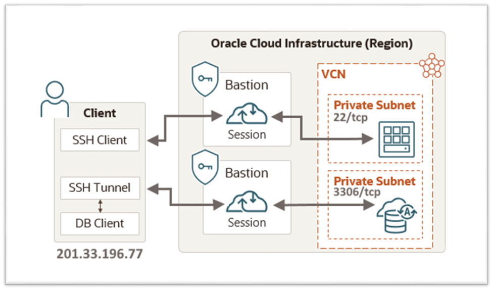

# Capítulo 3: Primeira aplicação no OCI

## 3.3 - Apresentando o Serviço Bastion

### __Introdução__

O _[Serviço Bastion](https://docs.oracle.com/pt-br/iaas/Content/Bastion/Concepts/bastionoverview.htm)_ do OCI permite você acessar de forma segura, através de sessões _[SSH](https://pt.wikipedia.org/wiki/Secure_Shell)_ e por tempo limitado, os recursos da sua infraestrutura que não possuem endereço IP público. Ele é um meio rápido e simples de implementar um acesso seguro, gerencial, até seus recursos privados. Um Bastion é uma entidade lógica, gerenciada pela Oracle que ao ser provisionado, ele cria a infraestrutura de rede necessária para se conectar aos recursos existentes em uma subrede.

Através do _[Bastion](https://docs.oracle.com/pt-br/iaas/Content/Bastion/Concepts/bastionoverview.htm)_ você pode acessar seus recursos sem a necessidade de ter um _["jump server"](https://pt.wikipedia.org/wiki/Jump_server)_ na rede. Este pode ser usado a vontade, de acordo com os _[limites](https://docs.oracle.com/pt-br/iaas/Content/General/Concepts/servicelimits.htm)_ disponíveis no seu _[tenancy](https://docs.oracle.com/pt-br/iaas/Content/Identity/Tasks/managingtenancy.htm)_, além de não gerar custos extras. É um serviço gratuito.

_[OCI Bastion](https://docs.oracle.com/pt-br/iaas/Content/Bastion/Concepts/bastionoverview.htm)_ se integra ao _[IAM (Identity and Access Management)](https://docs.oracle.com/pt-br/iaas/Content/Identity/Concepts/overview.htm)_ e permite que você controle quem pode acessar o serviço ou uma sessão, e o que pode ser feito com esses recursos. 

Por hora, iremos utilizar o _[Serviço Bastion](https://docs.oracle.com/pt-br/iaas/Content/Bastion/Concepts/bastionoverview.htm)_, para concluír algumas tarefas necessárias diretamente no servidor que irá hospedar a aplicação _[Wordpress](https://pt.wikipedia.org/wiki/WordPress)_.



>_**__NOTA:__** Como você verá, um Bastion deve ser criado e "atrelado" a uma única subrede. A partir disto, ele só consegue prover acesso aos recursos desta subrede em específico. Para acesso através de um Bastion ao MySQL do desenho acima, um segundo Bastion foi criado e atrelado a sua subrede._

Para termos êxito no acesso a instância privada da aplicação _[Wordpress](https://pt.wikipedia.org/wiki/WordPress)_, iremos seguir o "passo a passo" abaixo:

- Habilitar o _[plugin Bastion](https://docs.oracle.com/pt-br/iaas/Content/Compute/Tasks/manage-plugins.htm)_ através do _[Oracle Cloud Agent (OCA)](https://docs.oracle.com/pt-br/iaas/Content/Compute/Tasks/manage-plugins.htm)_ em execução na instância _[Wordpress](https://pt.wikipedia.org/wiki/WordPress)_.
- Criar um _[Bastion](https://docs.oracle.com/pt-br/iaas/Content/Bastion/Concepts/bastionoverview.htm)_ em nosso _[tenancy](https://docs.oracle.com/pt-br/iaas/Content/Identity/Tasks/managingtenancy.htm)_ que será usado exclusivamente pela subrede privada que hospeda a instância do _[Wordpress](https://pt.wikipedia.org/wiki/WordPress)_.
- Criar uma _[Sessão SSH](https://docs.oracle.com/pt-br/iaas/Content/Bastion/Concepts/bastionoverview.htm#session_types)_ que possibilita conectividade _[SSH](https://pt.wikipedia.org/wiki/Secure_Shell)_ a partir da _máquina cliente (201.33.196.77)_ a instância do _[Wordpress](https://pt.wikipedia.org/wiki/WordPress)_.
- Estabelecer uma _conexão SSH_ a partir do _host cliente_, usando o _[Bastion](https://docs.oracle.com/pt-br/iaas/Content/Bastion/Concepts/bastionoverview.htm)_ criado até  a instância de destino da aplicação _[Wordpress](https://pt.wikipedia.org/wiki/WordPress)_.

### __Plugin Bastion do Oracle Cloud Agent (OCA)__

O _[Oracle Cloud Agent (OCA)](https://docs.oracle.com/pt-br/iaas/Content/Compute/Tasks/manage-plugins.htm)_ é um processo que vem instalado nas _[imagens de plataforma](https://docs.oracle.com/pt-br/iaas/Content/Compute/References/images.htm#OracleProvided_Images)_ e sua principal função está no gerenciamento de diversos _[plugins](https://docs.oracle.com/pt-br/iaas/Content/Compute/Tasks/manage-plugins.htm#available-plugins)_. Estes coletam métricas de desempenho, instalam atualizações do sistema operacional, verificam vulnerabilidades de segurança, entre outras tarefas na instância de computação.

Um dos _[plugins](https://docs.oracle.com/pt-br/iaas/Content/Compute/Tasks/manage-plugins.htm#available-plugins)_ disponíveis no _[Oracle Cloud Agent (OCA)](https://docs.oracle.com/pt-br/iaas/Content/Compute/Tasks/manage-plugins.htm)_ é o _[plugin](https://docs.oracle.com/pt-br/iaas/Content/Compute/Tasks/manage-plugins.htm#available-plugins)_ _**Bastion**_ que irá permitir conexões _[SSH (Secure Shell)](https://pt.wikipedia.org/wiki/Secure_Shell)_ a partir do _[Serviço Bastion](https://docs.oracle.com/pt-br/iaas/Content/Bastion/Concepts/bastionoverview.htm)_. Este vem desabilitado por padrão e precisa ser ativado antes de criarmos a sessão _[SSH](https://pt.wikipedia.org/wiki/Secure_Shell)_ até a instância.

>_**__NOTA:__** Os [plugins](https://docs.oracle.com/pt-br/iaas/Content/Compute/Tasks/manage-plugins.htm#available-plugins) do [OCA](https://docs.oracle.com/pt-br/iaas/Content/Compute/Tasks/manage-plugins.htm) disponíveis hoje podem ser consultados neste [link aqui](https://docs.oracle.com/pt-br/iaas/Content/Compute/Tasks/manage-plugins.htm#available-plugins)._

Para listarmos todos os _[plugins](https://docs.oracle.com/pt-br/iaas/Content/Compute/Tasks/manage-plugins.htm#available-plugins)_ em execução na instância, usamos o comando abaixo:

```
darmbrust@hoodwink:~$ oci instance-agent plugin list \
> --compartment-id "ocid1.compartment.oc1..aaaaaaaamcff6exkhvp4aq3ubxib2wf74v7cx22b3yj56jnfkazoissdzefq" \
> --instanceagent-id "ocid1.instance.oc1.sa-saopaulo-1.antxeljr6noke4qcric5qfuocpbpeuuydcbqdquokl6erikoxitmzsckmnra" \
> --output table
+------------------------------+---------+----------------------------------+
| name                         | status  | time-last-updated-utc            |
+------------------------------+---------+----------------------------------+
| Custom Logs Monitoring       | RUNNING | 2021-09-09T18:17:11.772000+00:00 |
| Compute Instance Run Command | RUNNING | 2021-09-09T18:17:11.771000+00:00 |
| OS Management Service Agent  | RUNNING | 2021-09-09T18:17:11.770000+00:00 |
| Vulnerability Scanning       | STOPPED | 2021-09-09T18:17:11.769000+00:00 |
| Management Agent             | STOPPED | 2021-09-09T18:17:11.768000+00:00 |
| Block Volume Management      | STOPPED | 2021-09-09T18:17:11.768000+00:00 |
| Compute Instance Monitoring  | RUNNING | 2021-09-09T18:17:11.766000+00:00 |
| Bastion                      | STOPPED | 2021-09-09T18:17:11.762000+00:00 |
+------------------------------+---------+----------------------------------+
```

Perceba que o _[plugin](https://docs.oracle.com/pt-br/iaas/Content/Compute/Tasks/manage-plugins.htm#available-plugins)_ _**Bastion**_ não está em execução. Iremos ativá-lo com o comando abaixo:

```
darmbrust@hoodwink:~$ oci compute instance update \
> --instance-id "ocid1.instance.oc1.sa-saopaulo-1.antxeljr6noke4qcric5qfuocpbpeuuydcbqdquokl6erikoxitmzsckmnra" \
> --agent-config '{"pluginsConfig": [{"name": "Bastion", "desiredState": "ENABLED"}]}'
WARNING: Updates to defined-tags and freeform-tags and agent-config and metadata and extended-metadata and shape-config and instance-options and launch-options and availability-config will replace any existing values. Are you sure you want to continue? [y/N]: y
```

Lembrando que a subrede onde reside a instância, deve possuir uma _"rota de saída"_ para a internet ou, se a ideia é ter um ambiente com maior controle, basta configurar uma _"rota de saída"_ para um _[Service Gateway](https://docs.oracle.com/pt-br/iaas/Content/Network/Tasks/servicegateway.htm)_. Sem isto o _[plugin](https://docs.oracle.com/pt-br/iaas/Content/Compute/Tasks/manage-plugins.htm#available-plugins)_ não ativa.

Depois de alguns minutos e após confirmarmos as alteração no _[OCA](https://docs.oracle.com/pt-br/iaas/Content/Compute/Tasks/manage-plugins.htm)_ da instância, podemos ver que o _[plugin](https://docs.oracle.com/pt-br/iaas/Content/Compute/Tasks/manage-plugins.htm#available-plugins)_ _**Bastion**_ está ativo e em execução:

```
darmbrust@hoodwink:~$ oci instance-agent plugin list \
> --compartment-id "ocid1.compartment.oc1..aaaaaaaamcff6exkhvp4aq3ubxib2wf74v7cx22b3yj56jnfkazoissdzefq" \
> --instanceagent-id "ocid1.instance.oc1.sa-saopaulo-1.antxeljr6noke4qcric5qfuocpbpeuuydcbqdquokl6erikoxitmzsckmnra" \
> --name "Bastion"
{
  "data": [
    {
      "name": "Bastion",
      "status": "RUNNING",
      "time-last-updated-utc": "2021-09-09T18:26:14.737000+00:00"
    }
  ]
}
```

>_**__NOTA:__** O _[Oracle Cloud Agent (OCA)](https://docs.oracle.com/pt-br/iaas/Content/Compute/Tasks/manage-plugins.htm)_ é um processo "auto gerênciável". Você informa um "estado desejado para o plugin" e ele se encarrega de ativá-lo. Esta ação pode demorar um pouco para concluír. Além disto, se sua instância puder acessar a internet, o [OCA](https://docs.oracle.com/pt-br/iaas/Content/Compute/Tasks/manage-plugins.htm) verifica periodicamente se há versões mais recentes e o atualiza_. 


### __Criando um Bastion__

Antes de criarmos nosso _[Bastion](https://docs.oracle.com/pt-br/iaas/Content/Bastion/Concepts/bastionoverview.htm)_ precisamos de algumas informações. A primeira delas é o endereço IP público da máquina onde estou. Existem inumeras maneiras de se obter esta informação. Porém, como tudo aqui é via linha de comando, estou usando um site externo cuja finalidade é retornar qual é o meu endereço IP público.

Basta eu enviar um _[GET](https://pt.wikipedia.org/wiki/Hypertext_Transfer_Protocol#GET)_ através do comando _[curl](https://pt.wikipedia.org/wiki/CURL)_, que eu consigo saber meu endereço IP público:

```
darmbrust@hoodwink:~$ curl icanhazip.com
201.33.196.77
```

>_**__NOTA:__** Existem outros sites no qual você pode usar como o [ifconfig.me](https://ifconfig.me/), [api.ipify.org](https://api.ipify.org/) ou [ipinfo.io/ip](https://ipinfo.io/ip) que exibem qual é o seu endereço IP público. Consulte este [link](https://linuxconfig.org/how-to-use-curl-to-get-public-ip-address) para mais detalhes._

A próxima informação é saber qual é o OCID da subrede que o _[Serviço Bastion](https://docs.oracle.com/pt-br/iaas/Content/Bastion/Concepts/bastionoverview.htm)_ permitirá _[sessões SSH](https://docs.oracle.com/pt-br/iaas/Content/Bastion/Tasks/managingsessions.htm)_ através dele. Em nosso caso, iremos "anexar" o _[Bastion](https://docs.oracle.com/pt-br/iaas/Content/Bastion/Concepts/bastionoverview.htm)_ na subrede privada que hospeda a instância da aplicação _[Wordpress](https://pt.wikipedia.org/wiki/WordPress)_.

Vamos obter o OCID da subrede com o comando abaixo:

```
darmbrust@hoodwink:~$ oci network subnet list \
> --compartment-id "ocid1.compartment.oc1..aaaaaaaauvqvbbx3oridcm5d2ztxkftwr362u2vl5zdsayzbehzwbjs56soq" \
> --query "data[?\"display-name\"=='subnprv-app_vcn-prd'].id"
[
  "ocid1.subnet.oc1.sa-saopaulo-1.aaaaaaaajb4wma763mz6uowun3pfeltobe4fmiegdeyma5ehvnf3kzy3jvxa"
]
```

Juntando as informações, criaremos nosso _[Bastion](https://docs.oracle.com/pt-br/iaas/Content/Bastion/Concepts/bastionoverview.htm)_ com o comando abaixo:

```
darmbrust@hoodwink:~$ oci bastion bastion create \
> --compartment-id "ocid1.compartment.oc1..aaaaaaaauvqvbbx3oridcm5d2ztxkftwr362u2vl5zdsayzbehzwbjs56soq" \
> --bastion-type "standard" \
> --target-subnet-id "ocid1.subnet.oc1.sa-saopaulo-1.aaaaaaaajb4wma763mz6uowun3pfeltobe4fmiegdeyma5ehvnf3kzy3jvxa" \
> --client-cidr-list '["201.33.196.77/32"]' \
> --name "BastionSubnprvAppVcnPrd" \
> --wait-for-state "SUCCEEDED"
Action completed. Waiting until the work request has entered state: ('SUCCEEDED',)
{
  "data": {
    "compartment-id": "ocid1.compartment.oc1..aaaaaaaauvqvbbx3oridcm5d2ztxkftwr362u2vl5zdsayzbehzwbjs56soq",
    "id": "ocid1.bastionworkrequest.oc1.sa-saopaulo-1.amaaaaaa6noke4qavrtnbcuoycdjrmpm2su4j6zqoapftx6ikuvhhdxxdzua",
    "operation-type": "CREATE_BASTION",
    "percent-complete": 100.0,
    "resources": [
      {
        "action-type": "CREATED",
        "entity-type": "BastionsResource",
        "entity-uri": "/bastions/ocid1.bastion.oc1.sa-saopaulo-1.amaaaaaa6noke4qavfjoxi4kunt3sdo7ps46lbkfq3loxgqqomhmizoxhf4q",
        "identifier": "ocid1.bastion.oc1.sa-saopaulo-1.amaaaaaa6noke4qavfjoxi4kunt3sdo7ps46lbkfq3loxgqqomhmizoxhf4q"
      }
    ],
    "status": "SUCCEEDED",
    "time-accepted": "2021-09-09T23:43:33.234000+00:00",
    "time-finished": "2021-09-09T23:44:16.380000+00:00",
    "time-started": "2021-09-09T23:43:42.172000+00:00"
  }
}
```

Destaco alguns parâmetros importantes usados na criação do serviço. 

Começamos pelo parâmetro obrigatório _"--bastion-type"_ que deve possuir o valor _"standard"_. O próximo é o parâmetro _"--target-subnet-id"_ que necessita do valor OCID da subrede no qual permite _[sessões SSH](https://docs.oracle.com/pt-br/iaas/Content/Bastion/Concepts/bastionoverview.htm#session_types)_ vindas do _[Bastion](https://docs.oracle.com/pt-br/iaas/Content/Bastion/Concepts/bastionoverview.htm)_.

Por último, o parâmetro _"--client-cidr-list"_ no qual se especifica em notação _[CIDR](https://pt.wikipedia.org/wiki/Roteamento_entre_dom%C3%ADnios_sem_classes)_, quais redes IP podem utilizar o serviço _[Bastion](https://docs.oracle.com/pt-br/iaas/Content/Bastion/Concepts/bastionoverview.htm)_. É um tipo de firewall. Em nosso caso, estamos especificando somente conexões vinda do endereço IP **201.33.196.77/32**, que é o meu host na internet.

>_**__NOTA:__** O parâmetro "--client-cidr-list" aceita como valor um vetor. Ou seja, é possível informar uma lista de redes IPs dentro dos colchetes desta forma: '["192.168.1.0/24", "172.16.100.57/32"]'_

_[Bastion](https://docs.oracle.com/pt-br/iaas/Content/Bastion/Concepts/bastionoverview.htm)_ criado, vamos consultar algumas informações começando por seu OCID: 

```
darmbrust@hoodwink:~$ oci bastion bastion list \
> --compartment-id "ocid1.compartment.oc1..aaaaaaaauvqvbbx3oridcm5d2ztxkftwr362u2vl5zdsayzbehzwbjs56soq" \
> --query "data[?name=='BastionSubnprvAppVcnPrd'].id" \
> --all
[
  "ocid1.bastion.oc1.sa-saopaulo-1.amaaaaaa6noke4qavfjoxi4kunt3sdo7ps46lbkfq3loxgqqomhmizoxhf4q"  
]
```

A partir do OCID, iremos consultar todas as suas propriedades com o comando abaixo:

```
darmbrust@hoodwink:~$ oci bastion bastion get \
> --bastion-id "ocid1.bastion.oc1.sa-saopaulo-1.amaaaaaa6noke4qavfjoxi4kunt3sdo7ps46lbkfq3loxgqqomhmizoxhf4q"
{
  "data": {
    "bastion-type": "STANDARD",
    "client-cidr-block-allow-list": [
      "201.33.196.77/32"
    ],
    "compartment-id": "ocid1.compartment.oc1..aaaaaaaauvqvbbx3oridcm5d2ztxkftwr362u2vl5zdsayzbehzwbjs56soq",
    "defined-tags": {
      "Oracle-Tags": {
        "CreatedBy": "oracleidentitycloudservice/daniel.armbrust@algumdominio.com",
        "CreatedOn": "2021-09-09T23:43:29.409Z"
      }
    },
    "freeform-tags": {},
    "id": "ocid1.bastion.oc1.sa-saopaulo-1.amaaaaaa6noke4qavfjoxi4kunt3sdo7ps46lbkfq3loxgqqomhmizoxhf4q",
    "lifecycle-details": null,
    "lifecycle-state": "ACTIVE",
    "max-session-ttl-in-seconds": 10800,
    "max-sessions-allowed": 20,
    "name": "BastionSubnprvAppVcnPrd",
    "phone-book-entry": null,
    "private-endpoint-ip-address": "10.0.10.112",
    "static-jump-host-ip-addresses": null,
    "system-tags": {},
    "target-subnet-id": "ocid1.subnet.oc1.sa-saopaulo-1.aaaaaaaajb4wma763mz6uowun3pfeltobe4fmiegdeyma5ehvnf3kzy3jvxa",
    "target-vcn-id": "ocid1.vcn.oc1.sa-saopaulo-1.amaaaaaahcglxkaabicl4jiikcavz2h2nvazibxp4rdiwziqsce4h5wksz2a",
    "time-created": "2021-09-09T23:43:33.233000+00:00",
    "time-updated": "2021-09-09T23:44:16.380000+00:00"
  },
  "etag": "355e77dbd3bd9cb4429edc0658df5cf652990242874c1d4ba985bc4d7c7c4dae--gzip"
}
```

Perceba que o serviço após criado, consumiu um endereço IP da subrede. Este pode ser visto pela propriedade _"private-endpoint-ip-address"_ que possui o valor _"10.0.10.112"_.

Por fim, a propriedade _"max-session-ttl-in-seconds"_ especifica um tempo limite máximo que uma _[sessões SSH](https://docs.oracle.com/pt-br/iaas/Content/Bastion/Concepts/bastionoverview.htm#session_types)_ pode ter. Neste caso, não alteramos o valor padrão que é 10800 segundos ou 3 horas. Você pode especificar um valor menor, mas não maior que 3 horas, através do parâmetro _"--max-session-ttl"_. Este valor fará mais sentido quando criarmos as sessões.

### __Gerenciando Sessões__

Uma _Sessão_ ou _"Sessão pelo Bastion"_, é o meio pelo qual se possibilita a conectividade, a partir de uma origem (ex: host na internet), até um recurso de destino localizado no OCI que não recebe conexão direta vinda da internet. Este recurso de destino pode ser uma instância, um serviço gerenciado pelo OCI (PaaS) ou até mesmo uma porta TCP qualquer. A criação de uma sessão no _[serviço bastion](https://docs.oracle.com/pt-br/iaas/Content/Bastion/Concepts/bastionoverview.htm)_ é o que possibilita "ponte" entre o mundo externo e o interno.

Existem dois tipos de sessões que podem ser criadas:

- **Sessão SSH gerenciada**
    - Requer a execução do _[OpenSSH](https://en.wikipedia.org/wiki/OpenSSH)_ no recurso de destino, e também do plugin _Bastion_ habilitado e em execução no _[Oracle Cloud Agent (OCA)](https://docs.oracle.com/pt-br/iaas/Content/Compute/Tasks/manage-plugins.htm)_.
    - Este tipo de sessão possibilita abertura de shell interativo via SSH.
    - Necessário um nome de usuário (login) válido no sistema operacional.
    
- **Sessão de encaminhamento de porta SSH**
    - Esta sessão cria um _[túnel SSH](https://en.wikipedia.org/wiki/Tunneling_protocol#Secure_Shell_tunneling)_ para uma porta de rede específica no recurso de destino.
    - O único pré-requisito aqui, é ter a porta "aberta" no recurso de destino.
    - Normalmente, usamos este tipo de sessão, para conectividade direta e segura com outros protocolos, como o _[RDP](https://en.wikipedia.org/wiki/Remote_Desktop_Protocol)_ do Windows (porta 3389/TCP) ou shell MySQL (porta 3306/TCP).

Toda sessão, independente do seu tipo, deve ter um tempo limite configurado no qual controla sua existência. Se este tempo não for informado, o tempo limite máximo que foi especificado na criação do serviço, será usado. Ao expirar este tempo, a sessão é automaticamente removida. Lembrando que o propósito de acesso através do _[Bastion](https://docs.oracle.com/pt-br/iaas/Content/Bastion/Concepts/bastionoverview.htm)_, é para execução de tarefas gerenciais e que não exigem conexões persistentes de longa duração.

>_**__NOTA:__** É possível ter até 20 sessões ativas por [Bastion](https://docs.oracle.com/pt-br/iaas/Content/Bastion/Concepts/bastionoverview.htm)_.

#### Criando uma Sessão SSH gerenciada

A partir do _[Serviço Bastion](https://docs.oracle.com/pt-br/iaas/Content/Bastion/Concepts/bastionoverview.htm)_ criado, vamos agora criar uma _[sessão SSH](https://docs.oracle.com/pt-br/iaas/Content/Bastion/Concepts/bastionoverview.htm#session_types)_ que irá permitir acesso a instância da aplicação _[Wordpress](https://pt.wikipedia.org/wiki/WordPress)_.

Antes de criarmos a sessão, é necessário criarmos uma _[chave SSH](https://docs.oracle.com/pt-br/iaas/Content/Compute/Tasks/managingkeypairs.htm)_ para autenticação. É recomendado criar uma chave diferente para este acesso gerencial e pontual. Assim que a _[sessão SSH](https://docs.oracle.com/pt-br/iaas/Content/Bastion/Concepts/bastionoverview.htm#session_types)_ expirar, esta chave será removida.

```
darmbrust@hoodwink:~$ ssh-keygen -t rsa -N "" -b 2048 -f sessao-temp
Generating public/private rsa key pair.
Your identification has been saved in sessao-temp
Your public key has been saved in sessao-temp.pub
The key fingerprint is:
SHA256:dJ8XAfgQKRObPfH5hHPxNp429USkkkn09MR3D2pxuLI darmbrust@hoodwink
The key's randomart image is:
+---[RSA 2048]----+
|        ..o=+o+o+|
|        o+++oBoO+|
|        +o+oO=*oX|
|       . ..o=B.+*|
|        S  +o o=.|
|          E  .. .|
|                 |
|                 |
|                 |
+----[SHA256]-----+

darmbrust@hoodwink:~$ chmod 0400 ./sessao-temp
```

Agora, vou obter o endereço IP privado que a instância _[Wordpress](https://pt.wikipedia.org/wiki/WordPress)_ consumiu. Para isto, primeiramente tenho que obter a lista de _[VNICs](https://docs.oracle.com/pt-br/iaas/Content/Network/Tasks/managingVNICs.htm)_ desta instância:

```
darmbrust@hoodwink:~$ oci compute vnic-attachment list \
> --compartment-id "ocid1.compartment.oc1..aaaaaaaamcff6exkhvp4aq3ubxib2wf74v7cx22b3yj56jnfkazoissdzefq" \
> --instance-id "ocid1.instance.oc1.sa-saopaulo-1.antxeljr6noke4qcric5qfuocpbpeuuydcbqdquokl6erikoxitmzsckmnra" \
> --query "data[].\"vnic-id\""
[
  "ocid1.vnic.oc1.sa-saopaulo-1.abtxeljrxckhpgqp27r55nl4nbhd3ruawu33zenc2mwhavi3h2rqtzvg2ica"
]
```

Neste caso, a instância da aplicação _[Wordpress](https://pt.wikipedia.org/wiki/WordPress)_ possui somente uma _[VNIC](https://docs.oracle.com/pt-br/iaas/Content/Network/Tasks/managingVNICs.htm)_. Com o comando abaixo, irei exibir os detalhes desta _[VNIC](https://docs.oracle.com/pt-br/iaas/Content/Network/Tasks/managingVNICs.htm)_, que incluem o endereço IP privado atribuído a ela:

```
darmbrust@hoodwink:~$ oci network vnic get \
> --vnic-id "ocid1.vnic.oc1.sa-saopaulo-1.abtxeljrxckhpgqp27r55nl4nbhd3ruawu33zenc2mwhavi3h2rqtzvg2ica"
{
  "data": {
    "availability-domain": "ynrK:SA-SAOPAULO-1-AD-1",
    "compartment-id": "ocid1.compartment.oc1..aaaaaaaamcff6exkhvp4aq3ubxib2wf74v7cx22b3yj56jnfkazoissdzefq",
    "defined-tags": {
      "Oracle-Tags": {
        "CreatedBy": "oracleidentitycloudservice/daniel.armbrust@algumdominio.com",
        "CreatedOn": "2021-09-09T18:14:58.697Z"
      }
    },
    "display-name": "vm-wordpress-tmp",
    "freeform-tags": {},
    "hostname-label": "wordpress",
    "id": "ocid1.vnic.oc1.sa-saopaulo-1.abtxeljrxckhpgqp27r55nl4nbhd3ruawu33zenc2mwhavi3h2rqtzvg2ica",
    "is-primary": true,
    "lifecycle-state": "AVAILABLE",
    "mac-address": "02:00:17:02:F4:E7",
    "nsg-ids": [],
    "private-ip": "10.0.10.154",
    "public-ip": null,
    "skip-source-dest-check": false,
    "subnet-id": "ocid1.subnet.oc1.sa-saopaulo-1.aaaaaaaajb4wma763mz6uowun3pfeltobe4fmiegdeyma5ehvnf3kzy3jvxa",
    "time-created": "2021-09-09T18:15:04.023000+00:00",
    "vlan-id": null
  },
  "etag": "c6159ff4"
}
```

Pronto! Como pode ver, o endereço IP _"10.0.10.154"_ é exibido pela propriedade _"private-ip"_ da _[VNIC](https://docs.oracle.com/pt-br/iaas/Content/Network/Tasks/managingVNICs.htm)_.

Juntando as informações, iremos criar a sessão pelo _[Bastion](https://docs.oracle.com/pt-br/iaas/Content/Bastion/Concepts/bastionoverview.htm)_ através do comando abaixo:

```
darmbrust@hoodwink:~$ oci bastion session create-managed-ssh \
> --bastion-id "ocid1.bastion.oc1.sa-saopaulo-1.amaaaaaa6noke4qavfjoxi4kunt3sdo7ps46lbkfq3loxgqqomhmizoxhf4q" \
> --display-name "wordpress_session" \
> --session-ttl "7200" \
> --ssh-public-key-file "./sessao-temp.pub" \
> --target-resource-id "ocid1.instance.oc1.sa-saopaulo-1.antxeljr6noke4qcric5qfuocpbpeuuydcbqdquokl6erikoxitmzsckmnra" \
> --target-os-username "opc" \ 
> --target-private-ip "10.0.10.154" \
> --target-port "22" \
> --wait-for-state "SUCCEEDED"
Action completed. Waiting until the work request has entered state: ('SUCCEEDED',)
{
  "data": {
    "compartment-id": "ocid1.compartment.oc1..aaaaaaaamcff6exkhvp4aq3ubxib2wf74v7cx22b3yj56jnfkazoissdzefq",
    "id": "ocid1.bastionworkrequest.oc1.sa-saopaulo-1.amaaaaaa6noke4qaumcgkdkhzfpoftxu47fiyiyztlssrihccbags57oekha",
    "operation-type": "CREATE_SESSION",
    "percent-complete": 100.0,
    "resources": [
      {
        "action-type": "CREATED",
        "entity-type": "SessionResource",
        "entity-uri": "/sessions/ocid1.bastionsession.oc1.sa-saopaulo-1.amaaaaaa6noke4qar76rq6xg4llxhfssk2zfqmb6f6l4nr6l2uwrqpwb6e6a",
        "identifier": "ocid1.bastionsession.oc1.sa-saopaulo-1.amaaaaaa6noke4qar76rq6xg4llxhfssk2zfqmb6f6l4nr6l2uwrqpwb6e6a"
      }
    ],
    "status": "SUCCEEDED",
    "time-accepted": "2021-09-10T19:32:33.978000+00:00",
    "time-finished": "2021-09-10T19:33:24.991000+00:00",
    "time-started": "2021-09-10T19:32:44.285000+00:00"
  }
}
```

Na verdade, especificar uma sessão SSH através do Bastion usando um endereço IP privado como destino _(--target-private-ip)_, não é algo obrigatório. Você pode criar uma sessão SSH que aponta somente para o OCID da instância _(--target-resource-id)_ que tudo irá funcionar. Porém, eu entrei neste detalhe, pois você pode enfrentar situações no qual uma instância pode ter mais de uma _[VNIC](https://docs.oracle.com/pt-br/iaas/Content/Network/Tasks/managingVNICs.htm)_, e você precisa de acesso somente em um dos seus endereços IP. 

Alguns parâmetros que destaco na criação da sessão. Começando pelo parâmetro _"-target-os-username"_ que deve especificar um usuário existente no sistema operacional de destino. Se este não existir, a sessão não será criada. Sabemos que as _[imagens de plataforma](https://docs.oracle.com/pt-br/iaas/Content/Compute/References/images.htm#OracleProvided_Images)_ possuem o usuário **_opc_** criado por padrão.

O parâmetro _"--ssh-public-key-file"_ especifica o caminho da chave pública que criamos. Esta chave será "injetada" nesta sessão para autenticação.

A duração da sessão é especificada pelo parâmetro _"--session-ttl"_. Neste caso, estamos criado uma sessão de duração máxima de 2 horas (7200 segundos). Após este tempo, a sessão será automaticamente excluída. Este parâmetro não é obrigatório. Caso ele não seja informado, o tempo limite máximo da sessão vem do parâmetro _"max-session-ttl-in-seconds"_ especificado na criação do _[Bastion](https://docs.oracle.com/pt-br/iaas/Content/Bastion/Concepts/bastionoverview.htm)_.

Sessão criada, vamos obter o comando SSH que irá possibilitar nossa conectividade com a instância.

```
darmbrust@hoodwink:~$ oci bastion session get \
> --session-id "ocid1.bastionsession.oc1.sa-saopaulo-1.amaaaaaa6noke4qar76rq6xg4llxhfssk2zfqmb6f6l4nr6l2uwrqpwb6e6a" \
> --query "data.\"ssh-metadata\".command" \
> --raw-output
ssh -i <privateKey> -o ProxyCommand="ssh -i <privateKey> -W %h:%p -p 22 ocid1.bastionsession.oc1.sa-saopaulo-1.amaaaaaa6noke4qar76rq6xg4llxhfssk2zfqmb6f6l4nr6l2uwrqpwb6e6a@host.bastion.sa-saopaulo-1.oci.oraclecloud.com" -p 22 opc@10.0.10.154
```

Perceba que o comando SSH possui _duas posições_ nomeadas como _**\<privateKey\>**_ que devemos preencher com o caminho da nossa chave privada, criada anteriormente. Ao ajustarmos isto, é possível realizar a conexão:

```
darmbrust@hoodwink:~$ ssh -i ./sessao-temp -o \
> ProxyCommand="ssh -i ./sessao-temp -W %h:%p -p 22 ocid1.bastionsession.oc1.sa-saopaulo-1.amaaaaaa6noke4qar76rq6xg4llxhfssk2zfqmb6f6l4nr6l2uwrqpwb6e6a@host.bastion.sa-saopaulo-1.oci.oraclecloud.com" \
> -p 22 opc@10.0.10.240
The authenticity of host '10.0.10.240 (<no hostip for proxy command>)' can't be established.
ECDSA key fingerprint is SHA256:uPLOqOTGKYusbMpBQdPvO9oNRIJnHWsYq8RjPxhWDSg.
Are you sure you want to continue connecting (yes/no/[fingerprint])? yes
Warning: Permanently added '10.0.10.240' (ECDSA) to the list of known hosts.
[opc@wordpress ~]$ hostname
wordpress
```

Depois da confirmação pelo prompt do SSH, estamos dentro!

>_**__NOTA:__** São dois lugares que devemos informar a chave privada através da opção -i do comando ssh. Perceba que a segunda opção, está dentro da variável ProxyCommand. Caso a chave não seja especificada nos dois lugares, a conexão com a instância não irá funcionar._ 

#### Excluíndo uma Sessão ativa

Você pode a qualquer momento, excluír uma sessão ativa _(ACTIVE)_ ou que esteja em criação _(CREATING)_ do seu _[Bastion](https://docs.oracle.com/pt-br/iaas/Content/Bastion/Concepts/bastionoverview.htm)_. Isto pode ser útil, para interromper um acesso qualquer que não seja mais necessário.

Vamos listar as sessões ativas _(ACTIVE)_ e demonstrar uma exclusão na prática:

```
darmbrust@hoodwink:~$ oci bastion session list \
> --bastion-id  "ocid1.bastion.oc1.sa-saopaulo-1.amaaaaaa6noke4qavfjoxi4kunt3sdo7ps46lbkfq3loxgqqomhmizoxhf4q" \
> --all \
> --session-lifecycle-state "ACTIVE"
{
  "data": [
    {
      "bastion-id": "ocid1.bastion.oc1.sa-saopaulo-1.amaaaaaa6noke4qavfjoxi4kunt3sdo7ps46lbkfq3loxgqqomhmizoxhf4q",
      "bastion-name": "BastionSubnprvAppVcnPrd",
      "display-name": "wordpress_session",
      "id": "ocid1.bastionsession.oc1.sa-saopaulo-1.amaaaaaa6noke4qar76rq6xg4llxhfssk2zfqmb6f6l4nr6l2uwrqpwb6e6a",
      "lifecycle-details": null,
      "lifecycle-state": "ACTIVE",
      "session-ttl-in-seconds": 7200,
      "target-resource-details": {
        "session-type": "MANAGED_SSH",
        "target-resource-display-name": "vm-wordpress_subnprv-app_vcn-prd",
        "target-resource-id": "ocid1.instance.oc1.sa-saopaulo-1.antxeljr6noke4qcric5qfuocpbpeuuydcbqdquokl6erikoxitmzsckmnra",
        "target-resource-operating-system-user-name": "opc",
        "target-resource-port": 22,
        "target-resource-private-ip-address": "10.0.10.154"
      },
      "time-created": "2021-09-11T13:30:52.875000+00:00",
      "time-updated": "2021-09-11T13:31:08.301000+00:00"
    }
  ]
}
```

Para excluírmos esta sessão, usamos o comando abaixo:

``` 
darmbrust@hoodwink:~$ oci bastion session delete \
> --session-id "ocid1.bastionsession.oc1.sa-saopaulo-1.amaaaaaa6noke4qar76rq6xg4llxhfssk2zfqmb6f6l4nr6l2uwrqpwb6e6a" \
> --wait-for-state "SUCCEEDED"
Are you sure you want to delete this resource? [y/N]: y
Action completed. Waiting until the work request has entered state: ('SUCCEEDED',)
{
  "data": {
    "compartment-id": "ocid1.compartment.oc1..aaaaaaaamcff6exkhvp4aq3ubxib2wf74v7cx22b3yj56jnfkazoissdzefq",
    "id": "ocid1.bastionworkrequest.oc1.sa-saopaulo-1.amaaaaaa6noke4qamhaia6wkzobjik5sjnzobb5g3e4obxovujah7vbzptsq",
    "operation-type": "DELETE_SESSION",
    "percent-complete": 100.0,
    "resources": [
      {
        "action-type": "DELETED",
        "entity-type": "SessionResource",
        "entity-uri": "/sessions/ocid1.bastionsession.oc1.sa-saopaulo-1.amaaaaaa6noke4qar76rq6xg4llxhfssk2zfqmb6f6l4nr6l2uwrqpwb6e6a",
        "identifier": "ocid1.bastionsession.oc1.sa-saopaulo-1.amaaaaaa6noke4qar76rq6xg4llxhfssk2zfqmb6f6l4nr6l2uwrqpwb6e6a"
      }
    ],
    "status": "SUCCEEDED",
    "time-accepted": "2021-09-11T13:23:21.513000+00:00",
    "time-finished": "2021-09-11T13:24:06.576000+00:00",
    "time-started": "2021-09-11T13:23:29.128000+00:00"
  }
}
```

Após a confirmação da exclusão, se houver alguma conexão SSH presente na instância, a mesma será desconectada:

```
Last login: Sat Sep 11 12:06:17 2021 from 10.0.10.112
[opc@wordpress ~]$ Connection to host.bastion.sa-saopaulo-1.oci.oraclecloud.com closed by remote host.
Connection to 10.0.10.154 closed by remote host.
Connection to 10.0.10.154 closed.
```

### __Conclusão__

Aqui concluímos este capítulo que apresenta o serviço _[Bastion](https://docs.oracle.com/pt-br/iaas/Content/Bastion/Concepts/bastionoverview.htm)_. Por hora, não entraremos nos detalhes para criar uma sessão de encaminhamento de porta. Deixaremos isto para um momento mais oportuno.

Deixo aqui também o link do _[FAQ](https://www.oracle.com/security/cloud-security/bastion/faq/)_ do serviço que pode ajudar em outras informações, caso precise.