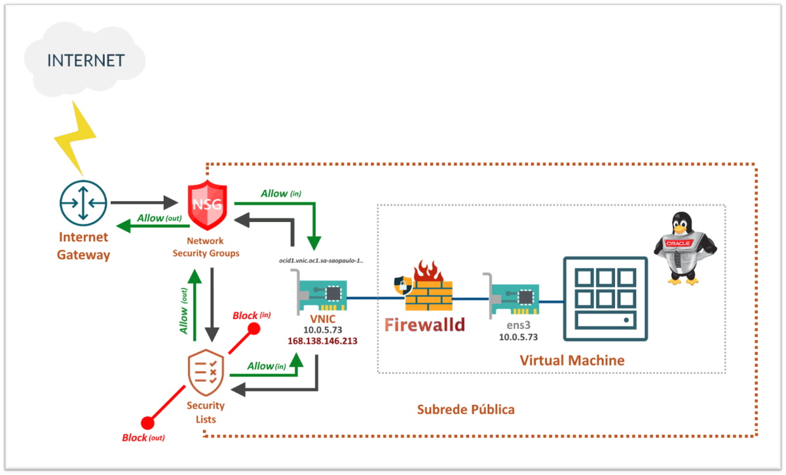

# Capítulo 3: Primeira aplicação no OCI

## 3.4 - Oracle Linux com WordPress na nuvem

### __Introdução__

Neste capítulo quero descrever um pouco mais sobre o _[serviço de computação](https://github.com/daniel-armbrust/oci-book/blob/main/chapter-4/4-2_fundamentos-computacao.md)_, instâncias de computação com _[Oracle Linux](https://www.oracle.com/linux/)_, e suas boas práticas no _[OCI](https://www.oracle.com/cloud/)_. Por fim, faremos a instalação da aplicação _[Wordpress](https://pt.wikipedia.org/wiki/WordPress)_ em nossa instância.

Embora você tenha _"controle total"_ da sua instância, recomendamos uma variedade de boas práticas para garantir a disponibilidade e máximo desempenho.

>_**__NOTA:__** "Controle total" em cloud significa "Responsabilidade Compartilhada". Consulte sobre ["Modelo de responsabilidade compartilhada"](https://github.com/daniel-armbrust/oci-book/blob/main/chapter-1/1-1_intro-cloud-computing.md) para saber mais._


### __Oracle Linux__

Este não é um capítulo que documenta o _[Oracle Linux](https://www.oracle.com/linux/)_. Até por que, existem diversos livros sobre o tema e uma extensa documentação disponível na internet pela própria Oracle. Vou deixar o link de cada versão mais usada hoje em dia. Consulte quando precisar saber de detalhes mais específicos sobre a versão do sistema operacional que está usando.

- [Oracle Linux 8](https://docs.oracle.com/en/operating-systems/oracle-linux/8/)
- [Oracle Linux 7](https://docs.oracle.com/en/operating-systems/oracle-linux/7/)
- [Oracle Linux 6](https://docs.oracle.com/en/operating-systems/oracle-linux/6/)

Porém, vou destacar pontos importantes. Começando por suas vantagens de utilização no _[OCI](https://www.oracle.com/cloud/)_:

- Contas criadas no _[OCI](https://www.oracle.com/cloud/)_ já incluem o _[Oracle Linux Premier Support](https://www.oracle.com/linux/support.html)_ sem custo adicional.
- Gerenciamento de pacotes e patches automatizados através do _[Serviço OS Management](https://docs.oracle.com/pt-br/iaas/os-management/osms/index.htm)_, que mantêm seus sistemas seguros e confiáveis. 
- Acesso a atualizações, últimas correções de bugs, erratas de segurança, etc.
- Ferramenta _[Ksplice](https://docs.oracle.com/pt-br/iaas/Content/Compute/Tasks/installingconfiguringksplice.htm)_ pré-instalada em imagens do _[OCI](https://www.oracle.com/cloud/)_, no qual possibilita aplicar atualizações de segurança importantes e críticas do kernel sem a necessidade de reboot (zero-downtime).
- 100% binário compatível com Red Hat Enterprise Linux.

>_**__NOTA:__** O documento que descreve todas essas vantagens e outras em mais detalhes, pode ser consultado neste [link aqui](https://www.oracle.com/a/ocom/docs/linux-for-cloud-infrastructure-4024517.pdf)._

Vamos seguir agora para o entendimento sobre os **firewalls** que temos até que o tráfego chegue em uma instância de computação. Por um momento, vamos tomar outro exemplo.

Imagine que criamos uma nova instância temporária em nossa subrede pública (10.0.5.0/24), também com _[Oracle Linux](https://www.oracle.com/linux/)_. Esta instância, além do seu endereço IP privado 10.0.5.73, foi atribuído um IP público 168.138.146.213.

Veja abaixo a representação desta instância:



Sabemos que toda instância possui uma ou mais _[VNICs](https://docs.oracle.com/pt-br/iaas/Content/Network/Tasks/managingVNICs.htm)_. Cada _[VNIC](https://docs.oracle.com/pt-br/iaas/Content/Network/Tasks/managingVNICs.htm)_ reside em uma subrede e é ela quem possibilita a instância se comunicar com os recursos de toda _[VCN](https://docs.oracle.com/pt-br/iaas/Content/Network/Tasks/managingVCNs_topic-Overview_of_VCNs_and_Subnets.htm)_. Sabemos também que toda _[VNIC](https://docs.oracle.com/pt-br/iaas/Content/Network/Tasks/managingVNICs.htm)_ possui um endereço IPv4 privado principal e um endereço IPv4 público opcional para cada IP privado.

O primeiro detalhe importante aqui a se notar, é que o tráfego da rede é verificado por dois _[firewalls virtuais](https://en.wikipedia.org/wiki/Virtual_firewall)_ antes de se atingir a _[VNIC](https://docs.oracle.com/pt-br/iaas/Content/Network/Tasks/managingVNICs.htm)_. São eles: _[Network Security Groups (NSG)](https://docs.oracle.com/pt-br/iaas/Content/Network/Concepts/networksecuritygroups.htm)_ e as _[Security Lists](https://docs.oracle.com/pt-br/iaas/Content/Network/Concepts/securitylists.htm#Security_Lists)_, que já conhecemos. O _[NSG](https://docs.oracle.com/pt-br/iaas/Content/Network/Concepts/networksecuritygroups.htm)_ só será avaliado, se criado e aplicado a uma _[VNIC](https://docs.oracle.com/pt-br/iaas/Content/Network/Tasks/managingVNICs.htm)_ em particular. 

>_**__NOTA:__** Lembre-se que ao criar uma [Security List](https://docs.oracle.com/pt-br/iaas/Content/Network/Concepts/securitylists.htm#Security_Lists), tudo vem "bloqueado por padrão". Você deve criar explicitamente regras que permitam (allow) tráfego da rede._

Sobre o endereço IP privado que você vê nas propriedades da _[VNIC](https://docs.oracle.com/pt-br/iaas/Content/Network/Tasks/managingVNICs.htm)_, você vê também na interface de rede da instância (ens3):

```
[opc@instance-20210912-1218 ~]$ ip addr sh ens3
2: ens3: <BROADCAST,MULTICAST,UP,LOWER_UP> mtu 9000 qdisc pfifo_fast state UP group default qlen 1000
    link/ether 02:00:17:01:e0:b1 brd ff:ff:ff:ff:ff:ff
    inet 10.0.5.73/24 brd 10.0.5.255 scope global dynamic ens3
       valid_lft 86179sec preferred_lft 86179sec
    inet6 fe80::17ff:fe01:e0b1/64 scope link
       valid_lft forever preferred_lft forever
```

Porém, o IP público só pode ser visualizado pelas propriedades da _[VNIC](https://docs.oracle.com/pt-br/iaas/Content/Network/Tasks/managingVNICs.htm)_. Ele está na _[VNIC](https://docs.oracle.com/pt-br/iaas/Content/Network/Tasks/managingVNICs.htm)_ e não na instância. Observe _"private-ip"_, _"public-ip"_ e seus respectivos valores com o comando abaixo:

```
darmbrust@hoodwink:~$ oci network vnic get \
> --vnic-id "ocid1.vnic.oc1.sa-saopaulo-1.abtxeljrdbajg6ruoyrmbp53uxf26z3sp32655fj6tmu3snn5gqufybartwa"
{
  "data": {
    "availability-domain": "ynrK:SA-SAOPAULO-1-AD-1",
    "compartment-id": "ocid1.compartment.oc1..aaaaaaaauvqvbbx3oridcm5d2ztxkftwr362u2vl5zdsayzbehzwbjs56soq",
    "defined-tags": {
      "Oracle-Tags": {
        "CreatedBy": "oracleidentitycloudservice/daniel.armbrust@algumdominio.com",
        "CreatedOn": "2021-09-12T15:19:48.000Z"
      }
    },
    "display-name": "instance-20210912-1218",
    "freeform-tags": {},
    "hostname-label": "instance-20210912-1218",
    "id": "ocid1.vnic.oc1.sa-saopaulo-1.abtxeljrdbajg6ruoyrmbp53uxf26z3sp32655fj6tmu3snn5gqufybartwa",
    "is-primary": true,
    "lifecycle-state": "AVAILABLE",
    "mac-address": "02:00:17:01:E0:B1",
    "nsg-ids": [],
    "private-ip": "10.0.5.73",
    "public-ip": "168.138.146.213",
    "skip-source-dest-check": false,
    "subnet-id": "ocid1.subnet.oc1.sa-saopaulo-1.aaaaaaaax6arj6ccrzlm7fxb4pl4ggrsgig4bwnbvtqaayosdulsyoaliuka",
    "time-created": "2021-09-12T15:19:55.109000+00:00",
    "vlan-id": null
  },
  "etag": "7a55f0e0"
}
```

Isto quer dizer que o _[OCI](https://www.oracle.com/cloud/)_ sempre faz um _[NAT 1:1](https://en.wikipedia.org/wiki/Network_address_translation)_ do IP público da _[VNIC](https://docs.oracle.com/pt-br/iaas/Content/Network/Tasks/managingVNICs.htm)_ para o IP privado. O contrário (saída do tráfego de rede) segue o mesmo processo.

No meio do caminho, entre _[VNIC](https://docs.oracle.com/pt-br/iaas/Content/Network/Tasks/managingVNICs.htm)_ e a interface de rede do _[Oracle Linux](https://www.oracle.com/linux/)_, há outro _[firewall virtual](https://en.wikipedia.org/wiki/Virtual_firewall)_. O _[firewalld](https://firewalld.org/)_. 

Este vem habilitado por padrão nas _[imagens de plataforma](https://docs.oracle.com/pt-br/iaas/Content/Compute/References/images.htm#OracleProvided_Images)_ equipadas com _[Oracle Linux](https://www.oracle.com/linux/)_.

Somente as portas para os serviços SSH e cliente DHCP vem _"abertas"_:

```
[opc@instance-20210912-1218 ~]$ sudo firewall-cmd --list-services
dhcpv6-client ssh
```

Por exemplo, para _"abrirmos"_ as portas HTTP (80/TCP) e HTTPS (443/TCP) de forma permanente, executamos os comandos abaixo:

```
[opc@instance-20210912-1218 ~]$ sudo firewall-cmd --add-service=http --permanent
success
[opc@instance-20210912-1218 ~]$ sudo firewall-cmd --add-service=https --permanent
success
[opc@instance-20210912-1218 ~]$ sudo firewall-cmd --reload
success
[opc@wordpress ~]$ sudo firewall-cmd --runtime-to-permanent
success
```

Esta ação pode ser confirmada com o comando abaixo:

```
[opc@instance-20210912-1218 ~]$ sudo firewall-cmd --list-services
dhcpv6-client http https ssh
```

#### __Regras Essenciais de Firewall__

Todas as _[imagens de plataforma](https://docs.oracle.com/pt-br/iaas/Content/Compute/References/images.htm#OracleProvided_Images)_ incluem regras de firewall que só permitem o usuário _"root"_ ou _"Administrators"_ em instâncias Windows, a estabelecer conexões com a rede _[iSCSI](https://pt.wikipedia.org/wiki/ISCSI)_ (169.254.0.2:3260, 169.254.2.0/24:3260) que se conecta ao serviço de storage do OCI.

>_**__NOTA:__** Maiores detalhes sobre volumes de disco, conexões _[iSCSI](https://pt.wikipedia.org/wiki/ISCSI)_, você encontra mais adiante. Por hora, siga a recomendação exposta aqui._

É importante _**NÃO REMOVER**_ essas regras através do _[firewalld](https://firewalld.org/)_ ou diretamente pelo _[iptables](https://pt.wikipedia.org/wiki/Iptables)_. A remoção dessas regras irá permitir que usuários não administradores, acessem o volumes de disco de boot da instância. É recomendado também, que não se crie imagens personalizadas sem essas regras de firewall.

>_**__NOTA:__** A excessão é por conta de imagens [Ubuntu](https://pt.wikipedia.org/wiki/Ubuntu), que ao habilitar o [UFW (Uncomplicated Firewall)](https://help.ubuntu.com/community/UFW) pode causar problemas com essas regras. Recomendamos que você não ative o [UFW](https://help.ubuntu.com/community/UFW) em suas instâncias._

#### __A rede reservada 169.254.0.0/16__

Esta é uma rede especial e reservada para conexões _[iSCSI](https://pt.wikipedia.org/wiki/ISCSI)_ utilizados por _[volumes de inicialização](https://docs.oracle.com/pt-br/iaas/Content/Block/Concepts/bootvolumes.htm)_ e _[volumes em blocos](https://docs.oracle.com/pt-br/iaas/Content/Block/Concepts/overview.htm)_ da instância. 

Um outro serviço presente nesta rede é _[serviço de metadados da instância (IMDS)](https://docs.oracle.com/pt-br/iaas/Content/Compute/Tasks/gettingmetadata.htm)_. Este está em execução através de um endpoint HTTP no endereço _169.254.169.254_ e fornece diversas informações sobre a instância em execução.

Veja abaixo a consulta dos metadados da instância:

```
[opc@instance-20210912-1218 ~]$ curl -H "Authorization: Bearer Oracle" -L http://169.254.169.254/opc/v2/instance/
{
  "availabilityDomain" : "ynrK:SA-SAOPAULO-1-AD-1",
  "faultDomain" : "FAULT-DOMAIN-2",
  "compartmentId" : "ocid1.compartment.oc1..aaaaaaaauvqvbbx3oridcm5d2ztxkftwr362u2vl5zdsayzbehzwbjs56soq",
  "displayName" : "instance-20210912-1218",
  "hostname" : "instance-20210912-1218",
  "id" : "ocid1.instance.oc1.sa-saopaulo-1.antxeljr6noke4qctlg477aoiweyytsovsxxvhraujot27wsin5axqiqfwqq",
  "image" : "ocid1.image.oc1.sa-saopaulo-1.aaaaaaaasahnls6nmev22raz7ecw6i64d65fu27pmqjn4pgz7zue56ojj7qq",
  "metadata" : {
    "ssh_authorized_keys" : "ssh-rsa AAAAB3NzaC1yc2EAAAADAQABAAABAQCVW1S8GjxpV37PCd+2HK4/nEhgwjn5S2flcV8E+y05dvS2YyMHPIsJr9BylgVtYMH7Coe1Q/tAW2Oo7TewUE4c/Y8GssTPJR0r15R/ccsMmY/04Tg2V9S8eBN2MemqDbJL4Vm5GMCIG8JZ7miaRzCpvXDAWPf+OJ/gn3VQHPygNiZp2E6HHmmBiL3JMKQz/43Lj65tDPpI0NZtCtJShV/1bS2houwaU2cG2MedacdjqvF/IPk9CSouxTFJ1BYb9t3czBULq7Hl79iqXAW2dfPl17dckKzfwQDHbBbYXgOdV4Ap3nK6VU70j6kHzdbt2uxUq3IgtMlOyTGyKsJyIzwR darmbrust@hoodwink"
  },
  "region" : "sa-saopaulo-1",
  "canonicalRegionName" : "sa-saopaulo-1",
  "ociAdName" : "sa-saopaulo-1-ad-1",
  "regionInfo" : {
    "realmKey" : "oc1",
    "realmDomainComponent" : "oraclecloud.com",
    "regionKey" : "GRU",
    "regionIdentifier" : "sa-saopaulo-1"
  },
  "shape" : "VM.Standard.E2.1",
  "shapeConfig" : {
    "ocpus" : 1.0,
    "memoryInGBs" : 8.0,
    "networkingBandwidthInGbps" : 0.7,
    "maxVnicAttachments" : 2
  },
  "state" : "Running",
  "timeCreated" : 1631459988266,
  "agentConfig" : {
    "monitoringDisabled" : false,
    "managementDisabled" : false,
    "allPluginsDisabled" : false,
    "pluginsConfig" : [ {
      "name" : "Vulnerability Scanning",
      "desiredState" : "DISABLED"
    }, {
      "name" : "OS Management Service Agent",
      "desiredState" : "ENABLED"
    }, {
      "name" : "Management Agent",
      "desiredState" : "DISABLED"
    }, {
      "name" : "Custom Logs Monitoring",
      "desiredState" : "ENABLED"
    }, {
      "name" : "Compute Instance Run Command",
      "desiredState" : "ENABLED"
    }, {
      "name" : "Compute Instance Monitoring",
      "desiredState" : "ENABLED"
    }, {
      "name" : "Block Volume Management",
      "desiredState" : "DISABLED"
    }, {
      "name" : "Bastion",
      "desiredState" : "DISABLED"
    } ]
  },
  "definedTags" : {
    "Oracle-Tags" : {
      "CreatedBy": "oracleidentitycloudservice/daniel.armbrust@algumdominio.com",
      "CreatedOn" : "2021-09-12T15:19:47.830Z"
    }
  }
}
```

### __Iniciando o processo de instalação do Wordpress__

 _[Wordpress](https://pt.wikipedia.org/wiki/WordPress)_ é um dos sistemas de _[gerenciamento de conteúdo (CMS)](https://pt.wikipedia.org/wiki/Sistema_de_gerenciamento_de_conte%C3%BAdo)_ mais populares. Este _[CMS](https://pt.wikipedia.org/wiki/Sistema_de_gerenciamento_de_conte%C3%BAdo)_ é comumente usado no gerenciamento de blogs, mas há muitos complementos e módulos para expandir seus recursos. 

Como já criamos parte da infraestrutura no _[OCI](https://www.oracle.com/cloud/)_, aqui iremos atuar diretamente no shell da instância.

>_**__NOTA:__** A Oracle disponibiliza todo o passo a passo desta instalação neste [link aqui](https://docs.oracle.com/en/learn/wrdprs_mysqldbs_wrkshp/index.html)._ 

#### __Ajuste do Fuso horário__

Pelo fato do _[OCI](https://www.oracle.com/cloud/)_ dispor de uma infraestrutura global, ele deve utilizar um _[fuso horário](https://pt.wikipedia.org/wiki/Fuso_hor%C3%A1rio)_ consistente em todas as suas regiões do globo. Por conta disto, por padrão, o _[fuso horário](https://pt.wikipedia.org/wiki/Fuso_hor%C3%A1rio)_ de uso por todos os recursos é o _[UTC (Coordinated Universal Time) ou Tempo Universal Coordenado](https://pt.wikipedia.org/wiki/Tempo_Universal_Coordenado)_. Ele é a referência a partir do qual se calculam todas as outras zonas horárias do mundo, além de não estar sujeito ao _[horário de verão](https://pt.wikipedia.org/wiki/Hor%C3%A1rio_de_ver%C3%A3o)_ (e ao risco associado de bugs). 

Podemos ver pelo comando abaixo que a instância que criamos está com seu  _[fuso horário](https://pt.wikipedia.org/wiki/Fuso_hor%C3%A1rio)_ definido em _[UTC+0](https://pt.wikipedia.org/wiki/UTC%2B0)_:

```
[opc@wordpress ~]$ timedatectl
      Local time: Thu 2021-09-16 18:17:12 GMT
  Universal time: Thu 2021-09-16 18:17:12 UTC
        RTC time: Thu 2021-09-16 18:17:13
       Time zone: GMT (GMT, +0000)
     NTP enabled: yes
NTP synchronized: yes
 RTC in local TZ: no
      DST active: n/a
```

Como critério de demonstração, para alterarmos o _[fuso horário](https://pt.wikipedia.org/wiki/Fuso_hor%C3%A1rio)_ da instância para o _[fuso horário](https://pt.wikipedia.org/wiki/Fuso_hor%C3%A1rio)_ de _[São Paulo (UTC-3)](https://pt.wikipedia.org/wiki/UTC%E2%88%923)_, utilizamos o comando abaixo:

```
[opc@wordpress ~]$ sudo timedatectl set-timezone America/Sao_Paulo
``` 

>_**__NOTA:__** Ajustar o [fuso horário](https://pt.wikipedia.org/wiki/Fuso_hor%C3%A1rio) pode ser algo complicado. Como já foi dito, tudo no [OCI](https://www.oracle.com/cloud/) utiliza [UTC+0](https://pt.wikipedia.org/wiki/UTC%2B0). Fique atento quando for correlacionar tempo sobre qualquer evento, agora gerado em [UTC-3](https://pt.wikipedia.org/wiki/UTC%E2%88%923) a partir desta instância, com outro evento do [OCI](https://www.oracle.com/cloud/), por exemplo._


#### __Instalação e configuração do Apache HTTP e PHP__

A partir de uma sessão do _[Bastion](https://docs.oracle.com/pt-br/iaas/Content/Bastion/Concepts/bastionoverview.htm)_, vamos acessar a instância do _[Wordpress](https://pt.wikipedia.org/wiki/WordPress)_ e seguir com o passo a passo de sua instalação.

1. Primeira atividade será desabilitar o _[SELinux](https://pt.wikipedia.org/wiki/SELinux)_ da instância:

```
[opc@wordpress ~]$ sudo setenforce permissive
[opc@wordpress ~]$ sudo sed -i 's/SELINUX=enforcing/SELINUX=permissive/' /etc/selinux/config
```

>_**__NOTA:__** [SELinux](https://pt.wikipedia.org/wiki/SELinux) é um componente de segurança muito importante do sistema operacional e já vem habilitado por padrão. Porém, sua configuração e troubleshoot pode ser um pouco mais complexo. Meu intuíto aqui é demonstrar uma instalação básica do [Wordpress](https://pt.wikipedia.org/wiki/WordPress) no [OCI](https://www.oracle.com/cloud/). Se a sua necessidade é ter um [Wordpress](https://pt.wikipedia.org/wiki/WordPress) produtivo, recomendo não desativar o [SELinux](https://pt.wikipedia.org/wiki/SELinux)._

2. É necessário instalar o último pacote _oracle-php-release-el7_ que irá permitir a instalação do _[PHP](https://pt.wikipedia.org/wiki/PHP)_ versão _7.4_:

```
[opc@wordpress ~]$ sudo yum -y install oracle-php-release-el7
```

3. Agora, iremos instalar o servidor _[HTTP Apache](https://pt.wikipedia.org/wiki/Servidor_Apache)_ e o _[PHP](https://pt.wikipedia.org/wiki/PHP)_:

```
[opc@wordpress ~]$ sudo yum install -y httpd php
```

4. Instalação das extensões do _[PHP](https://pt.wikipedia.org/wiki/PHP)_ necessárias para o funcionamento do _[Wordpress](https://pt.wikipedia.org/wiki/WordPress)_:

```
[opc@wordpress ~]$ sudo yum install -y php-mysqlnd php-zip php-gd php-mcrypt php-mbstring php-xml php-json
```

5. Irei permitir tráfego na porta 80/TCP da instância através do _[firewalld](https://firewalld.org/)_:

```
[opc@wordpress ~]$ sudo firewall-cmd --permanent --add-port=80/tcp
success
[opc@wordpress ~]$ sudo firewall-cmd --reload
success
[opc@wordpress ~]$ sudo firewall-cmd --runtime-to-permanent
success
```

6. Habilitar e iniciar o servidor _[HTTP Apache](https://pt.wikipedia.org/wiki/Servidor_Apache)_:

```
[opc@wordpress ~]$ sudo systemctl enable httpd --now
[opc@wordpress ~]$ sudo systemctl start httpd --now
```

7. Download da última versão do _[Wordpress](https://pt.wikipedia.org/wiki/WordPress)_:

```
[opc@wordpress ~]$ curl -O https://wordpress.org/latest.tar.gz
```

8. Instalação e ajustes finais:

```
[opc@wordpress ~]$ sudo tar zxf latest.tar.gz -C /var/www/html/ --strip 1
[opc@wordpress ~]$ sudo chown apache. -R /var/www/html/
[opc@wordpress ~]$ sudo mkdir /var/www/html/wp-content/uploads
[opc@wordpress ~]$ sudo chown apache:apache /var/www/html/wp-content/uploads
```

9. Pronto! _[Wordpress](https://pt.wikipedia.org/wiki/WordPress)_ parcialmente instalado.

### __Conclusão__

Neste capítulo foi demonstrado a instalação do _[Wordpress](https://pt.wikipedia.org/wiki/WordPress)_ em uma instância _[Oracle Linux](https://www.oracle.com/linux/)_ no _[OCI](https://www.oracle.com/cloud/)_.