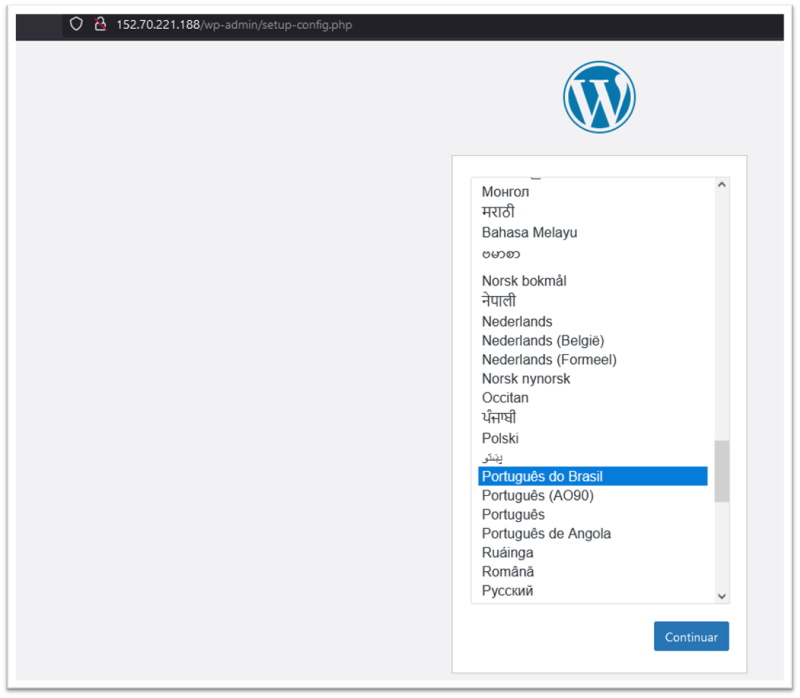
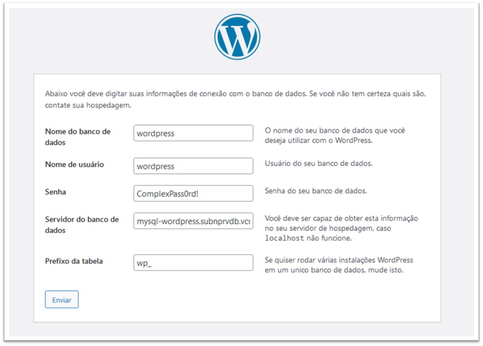

# Capítulo 3: Primeira aplicação no OCI

## 3.7 - Concluindo a instalação do Wordpress

### __Visão Geral__

Aqui iremos concluir a instalação do _[Wordpress](https://pt.wikipedia.org/wiki/WordPress)_. Se você seguiu todos os outros capítulos, chegamos aqui com toda a infraestrutura construída e pronta para finalizarmos a instalação da aplicação.

Vamos aos detalhes finais.

### __Detalhes finais__

A partir de uma sessão do _[Bastion](https://docs.oracle.com/pt-br/iaas/Content/Bastion/Concepts/bastionoverview.htm)_ vamos se conectar na instância principal do _[Wordpress](https://pt.wikipedia.org/wiki/WordPress)_.

Após conexão, iremos instalar o _MySQL Shell_ com o comando abaixo:

```
[opc@wordpress ~]$ sudo yum -y install mysql-shell
```

A instalação do _MySQL Shell_ é necessária para que possamos criar o banco de dados do _[Wordpress](https://pt.wikipedia.org/wiki/WordPress)_, seu usuário e senha.

Antes de realizarmos a conexão com o serviço, precisamos das informações referente ao _endpoint_ _(hostname e porta)_:

```
darmbrust@hoodwink:~$ oci mysql db-system list \
> --compartment-id "ocid1.compartment.oc1..aaaaaaaa6d2s5sgmxmyxu2vca3pn46y56xisijjyhdjwgqg3f6goh3obj4qq" \
> --display-name "mysql_subnprv-db_vcn-prd" \
> --query "data[].\"endpoints\""
[
  [
    {
      "hostname": "mysql-wordpress.subnprvdb.vcnprd.oraclevcn.com",
      "ip-address": "10.0.20.185",
      "modes": [
        "READ",
        "WRITE"
      ],
      "port": 3306,
      "port-x": 33060,
      "status": "ACTIVE",
      "status-details": null
    }
  ]
]
```

Irei realizar a conexão pelo hostname _mysql-wordpress.subnprvdb.vcnprd.oraclevcn.com_ usando o nome do _usuário administrador_ e _senha_, que criados no capítulo passado:

```
[opc@wordpress ~]$ mysqlsh --sql -u admin -h mysql-wordpress.subnprvdb.vcnprd.oraclevcn.com
Please provide the password for 'admin@mysql-wordpress.subnprvdb.vcnprd.oraclevcn.com': *************

MySQL Shell 8.0.26

Copyright (c) 2016, 2021, Oracle and/or its affiliates.
Oracle is a registered trademark of Oracle Corporation and/or its affiliates.
Other names may be trademarks of their respective owners.

Type '\help' or '\?' for help; '\quit' to exit.
Creating a session to 'admin@mysql-wordpress.subnprvdb.vcnprd.oraclevcn.com'
Fetching schema names for autocompletion... Press ^C to stop.
Your MySQL connection id is 24
Server version: 8.0.26-u2-cloud MySQL Enterprise - Cloud
No default schema selected; type \use <schema> to set one.
 MySQL mysql-wordpress.subnprvdb.vcnprd.oraclevcn.com:3306 ssl  SQL >
```

Conectado, vamos criar o banco de dados do _[Wordpress](https://pt.wikipedia.org/wiki/WordPress)_, usuário e senha:

```
 MySQL  mysql-wordpress.subnprvdb.vcnprd.oraclevcn.com:3306 ssl  SQL > create database wordpress;
Query OK, 1 row affected (0.0038 sec)
 MySQL  mysql-wordpress.subnprvdb.vcnprd.oraclevcn.com:3306 ssl  SQL > create user wordpress IDENTIFIED BY 'ComplexPass0rd!';
Query OK, 0 rows affected (0.0057 sec)
 MySQL  mysql-wordpress.subnprvdb.vcnprd.oraclevcn.com:3306 ssl  SQL > GRANT ALL ON `wordpress`.* TO wordpress;
Query OK, 0 rows affected (0.0047 sec)
```

Podemos agora sair do _modo texto_ e abrir o navegador na URL: _http://152.70.221.188/wp-admin/setup-config.php_



Após escolha do idioma de instalação, inserimos os parâmetros de conexão ao _[MySQL](https://docs.oracle.com/pt-br/iaas/mysql-database/index.html)_ na aplicação:



Basta clicar no botão _"Instalar"_ para concluir a instalação:


Instalação concluída!

Podemos conferir as tabelas criadas no _[MySQL](https://docs.oracle.com/pt-br/iaas/mysql-database/index.html)_ pelo comando abaixo:

```
 MySQL  mysql-wordpress.subnprvdb.vcnprd.oraclevcn.com:3306 ssl  SQL > use wordpress
Default schema set to `wordpress`.
Fetching table and column names from `wordpress` for auto-completion... Press ^C to stop.
 MySQL  mysql-wordpress.subnprvdb.vcnprd.oraclevcn.com:3306 ssl  wordpress  SQL > show tables;                                                                               
+-----------------------+
| Tables_in_wordpress   |
+-----------------------+
| wp_commentmeta        |
| wp_comments           |
| wp_links              |
| wp_options            |
| wp_postmeta           |
| wp_posts              |
| wp_term_relationships |
| wp_term_taxonomy      |
| wp_termmeta           |
| wp_terms              |
| wp_usermeta           |
| wp_users              |
+-----------------------+
12 rows in set (0.0016 sec)
```

### __Atualizando a Custom Image do Wordpress__

Como houveram alterações na instância principal do _[Wordpress](https://pt.wikipedia.org/wiki/WordPress)_, é prudente criarmos uma nova _[custom image](https://docs.oracle.com/pt-br/iaas/Content/Compute/Tasks/managingcustomimages.htm)_:

```
darmbrust@hoodwink:~$ oci compute image create \
> --compartment-id "ocid1.compartment.oc1..aaaaaaaamcff6exkhvp4aq3ubxib2wf74v7cx22b3yj56jnfkazoissdzefq" \
> --instance-id "ocid1.instance.oc1.sa-saopaulo-1.antxeljr6noke4qcf4yilvaofwpt5aiavnsx7cfev3fhp2bpc3xfcxo5k6zq" \
> --display-name "ol7-wordpress-v2_img" \
> --wait-for-state "AVAILABLE"
Action completed. Waiting until the resource has entered state: ('AVAILABLE',)
{
  "data": {
    "agent-features": null,
    "base-image-id": "ocid1.image.oc1.sa-saopaulo-1.aaaaaaaasahnls6nmev22raz7ecw6i64d65fu27pmqjn4pgz7zue56ojj7qq",
    "billable-size-in-gbs": 5,
    "compartment-id": "ocid1.compartment.oc1..aaaaaaaamcff6exkhvp4aq3ubxib2wf74v7cx22b3yj56jnfkazoissdzefq",
    "create-image-allowed": true,
    "defined-tags": {
      "Oracle-Tags": {
        "CreatedBy": "oracleidentitycloudservice/daniel.armbrust@algumdominio.com",
        "CreatedOn": "2021-09-23T13:56:05.745Z"
      }
    },
    "display-name": "ol7-wordpress-v2_img",
    "freeform-tags": {},
    "id": "ocid1.image.oc1.sa-saopaulo-1.aaaaaaaahao4ljsu2eynh2b233peu3un2xrz23pltqkwh5emmznimwhmfzza",
    "launch-mode": "PARAVIRTUALIZED",
    "launch-options": {
      "boot-volume-type": "PARAVIRTUALIZED",
      "firmware": "UEFI_64",
      "is-consistent-volume-naming-enabled": true,
      "is-pv-encryption-in-transit-enabled": false,
      "network-type": "PARAVIRTUALIZED",
      "remote-data-volume-type": "PARAVIRTUALIZED"
    },
    "lifecycle-state": "AVAILABLE",
    "listing-type": null,
    "operating-system": "Oracle Linux",
    "operating-system-version": "7.9",
    "size-in-mbs": 102400,
    "time-created": "2021-09-23T13:56:06.464000+00:00"
  },
  "etag": "ce0a2251c26cf854f8d58b272c27815340fb4f51c6f0eac980675791b93c43ef"
}
```

Após criarmos a nova _[custom image](https://docs.oracle.com/pt-br/iaas/Content/Compute/Tasks/managingcustomimages.htm)_ podemos excluír a antiga:

```
darmbrust@hoodwink:~$ oci compute image delete \
> --image-id "ocid1.image.oc1.sa-saopaulo-1.aaaaaaaamfroj67f7odaqosqnyid3ic3eh5lbovdm6ko5xkdqsexlpyatlda"
Are you sure you want to delete this resource? [y/N]: y
```