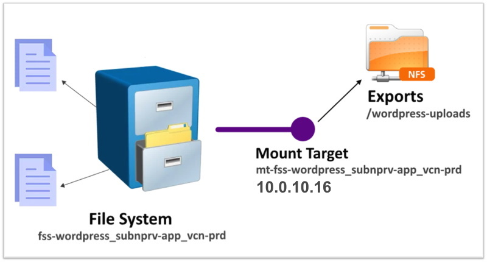
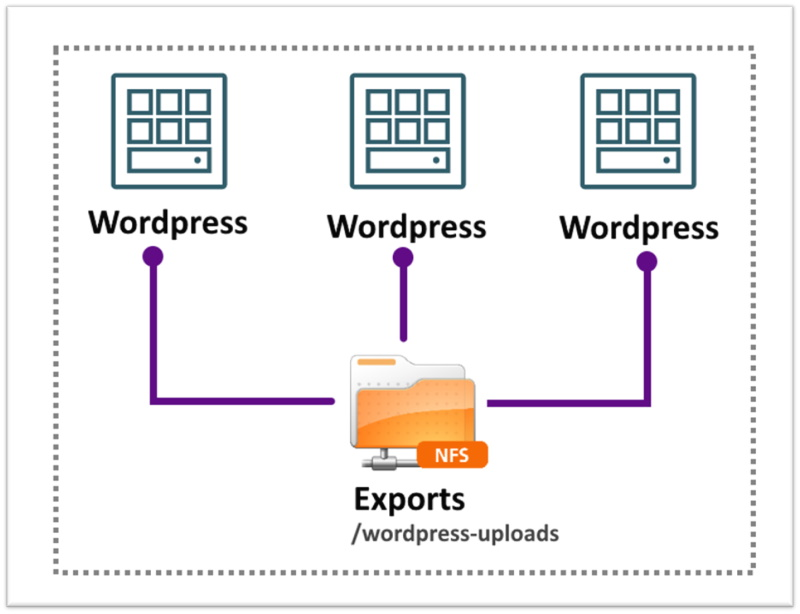
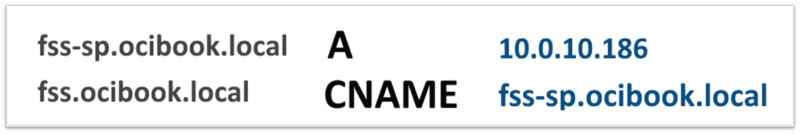

# Capítulo 3: Primeira aplicação no OCI

## 3.7 - File Storage, DNS Privado e Custom Image

### __Visão Geral__

Como sabemos, o _[OCI](https://www.oracle.com/cloud/)_ disponibiliza uma série de recursos que nos possibilita construir aplicações _[tolerantes à falhas](https://pt.wikipedia.org/wiki/Toler%C3%A2ncia_%C3%A0_falha)_. Neste capítulo, irei apresentar alguns serviços úteis que serão utilizados pela aplicação _[Wordpress](https://pt.wikipedia.org/wiki/WordPress)_, com o intuíto de evitar o chamado _"[ponto único de falha](https://pt.wikipedia.org/wiki/Ponto_%C3%BAnico_de_falha)"_.

Evitar o _"[ponto único de falha](https://pt.wikipedia.org/wiki/Ponto_%C3%BAnico_de_falha)"_, reduz o _tempo de indisponibilidade_, seja ele planejado ou não. Lembrando que uma _indisponibilidade_ pode vir de uma _manutenção programada_, exigida para manter a aplicação operando _(patches, novo deploy, fix de segurança, etc)_, ou de uma _falha de hardware_, _software_, ou mesmo um _"erro humano"_.

Contornamos essas _indisponibilidades_, através dos serviços que o _[OCI](https://www.oracle.com/cloud/)_ disponibiliza. 

Vamos começar...

### __O Serviço File Storage__

O _[Serviço File Storage](https://docs.oracle.com/pt-br/iaas/Content/File/Concepts/filestorageoverview.htm)_ fornece um _[sistema de arquivos](https://pt.wikipedia.org/wiki/Sistema_de_ficheiros)_ de rede, compatível com o protocolo _[NFS](https://pt.wikipedia.org/wiki/Network_File_System)_ e gerenciado pelo _[OCI](https://www.oracle.com/cloud/)_. Por ser um _[sistema de arquivos](https://pt.wikipedia.org/wiki/Sistema_de_ficheiros)_ gerenciado, seus ajustes de capacidade, atualizações e proteções contra falhas, são feitos de forma automática. 

Você pode se conectar a um _[sistema de arquivos](https://pt.wikipedia.org/wiki/Sistema_de_ficheiros)_ criado pelo _[Serviço File Storage](https://docs.oracle.com/pt-br/iaas/Content/File/Concepts/filestorageoverview.htm)_ a partir de qualquer instância computacional em sua _[VCN](https://docs.oracle.com/pt-br/iaas/Content/Network/Tasks/managingVCNs_topic-Overview_of_VCNs_and_Subnets.htm)_, ou a partir do seu data center local _(on-premises)_ via _[FastConnect](https://docs.oracle.com/pt-br/iaas/Content/Network/Concepts/fastconnectoverview.htm#FastConnect_Overview)_ ou _[VPN](https://pt.wikipedia.org/wiki/Rede_privada_virtual)_.

Para criarmos o _[File Storage](https://docs.oracle.com/pt-br/iaas/Content/File/Concepts/filestorageoverview.htm)_, serão necessários criar três recursos diferentes. Esses recursos são:

- **File System**
    - Este é apenas o _[sistema de arquivos](https://pt.wikipedia.org/wiki/Sistema_de_ficheiros)_ que será compartilhado. É o ponto inicial para criarmos os demais recursos. 
    - É necessário especificar em qual _[Availability Domain (AD)](https://docs.oracle.com/pt-br/iaas/Content/General/Concepts/regions.htm#top)_ o _[sistema de arquivos](https://pt.wikipedia.org/wiki/Sistema_de_ficheiros)_ irá residir.

- **Mount Target**
    - É um _"endpoint NFS"_. Este necessáriamente deve residir em uma subrede, pois ele consome um _endereço IP_ no qual permite os clientes da rede se conectar. Você verá que é possível utilizar um _[Mount Target](https://docs.oracle.com/en-us/iaas/Content/File/Tasks/managingmounttargets.htm)_ e ter vários _[exports NFS](https://pt.wikipedia.org/wiki/Network_File_System)_ associados a ele.

- **Exports**
    - Um _export_, termo intimamente ligado ao protocolo _[NFS](https://pt.wikipedia.org/wiki/Network_File_System)_, é o meio pelo qual é disponibilizado um _[diretório](https://pt.wikipedia.org/wiki/Diret%C3%B3rio_(computa%C3%A7%C3%A3o))_ na rede. É necessário haver pelo menos um _[diretório](https://pt.wikipedia.org/wiki/Diret%C3%B3rio_(computa%C3%A7%C3%A3o))_ _"exportado"_, para que os clientes da rede possam se conectar.
    - Cada _[Mount Target](https://docs.oracle.com/en-us/iaas/Content/File/Tasks/managingmounttargets.htm)_ pode conter um ou mais _exports_, ou também chamado de _export sets_. 
    - Ao ser criado, um _export_ possui algumas opções que são um conjunto de parâmetros que especificam o nível de acesso concedido aos clientes quando se conectam. É possível limitar quais clientes se conectam através de um único _endereço IP_ ou _bloco CIDR_, especificar acesso _somente-leitura (Read Only access)_, exigir conexões somente de _portas privilegiadas (1-1023)_ e também especificar o _Squash de Identidade_ para melhorar a segurança do _[sistema de arquivos](https://pt.wikipedia.org/wiki/Sistema_de_ficheiros)_.

Veja a demonstração dos recursos do nosso exemplo na imagem abaixo:



A ideia em utilizar o _[File Storage](https://docs.oracle.com/pt-br/iaas/Content/File/Concepts/filestorageoverview.htm)_, é por conta de que o _[Wordpress](https://pt.wikipedia.org/wiki/WordPress)_ armazena as imagens que vem via _[upload](https://en.wikipedia.org/wiki/Upload)_ dos usuários em um diretório específico na instância: _/var/www/html/wp-content/uploads_

Se é possível centralizar o acesso aos _[uploads](https://en.wikipedia.org/wiki/Upload)_ em um serviço como este, é possível ter múltiplas instâncias da aplicação acessando o mesmo conteúdo, evitando assim o _"[ponto único de falha](https://pt.wikipedia.org/wiki/Ponto_%C3%BAnico_de_falha)"_ e promovendo a _[escalabilidade horizontal](https://pt.wikipedia.org/wiki/Escalabilidade)_.



Para começar, precisamos do nome do _[availability domain (AD)](https://docs.oracle.com/pt-br/iaas/Content/General/Concepts/regions.htm#top)_ dentro da _[região](https://www.oracle.com/cloud/data-regions/)_ no qual iremos criar o _[File Storage](https://docs.oracle.com/pt-br/iaas/Content/File/Concepts/filestorageoverview.htm)_:

```
darmbrust@hoodwink:~$ oci iam availability-domain list \
> --region "sa-saopaulo-1" \
> --compartment-id "ocid1.tenancy.oc1..aaaaaaaavv2qh5asjdcoufmb6fzpnrfqgjxxdzlvjrgkrkytnyyz6zgvjnua" \
> --all \
> --query "data[].name"
[
  "ynrK:SA-SAOPAULO-1-AD-1"
]
```

Tendo o _[availability domain (AD)](https://docs.oracle.com/pt-br/iaas/Content/General/Concepts/regions.htm#top)_, é possível criar o _[sistema de arquivos](https://pt.wikipedia.org/wiki/Sistema_de_ficheiros)_:

```
darmbrust@hoodwink:~$ oci fs file-system create \
> --compartment-id "ocid1.compartment.oc1..aaaaaaaauvqvbbx3oridcm5d2ztxkftwr362u2vl5zdsayzbehzwbjs56soq" \
> --region "sa-saopaulo-1" \
> --availability-domain "ynrK:SA-SAOPAULO-1-AD-1" \
> --display-name "fss-wordpress_subnprv-app_vcn-prd" \
> --wait-for-state "ACTIVE"
Action completed. Waiting until the resource has entered state: ('ACTIVE',)
{
  "data": {
    "availability-domain": "ynrK:SA-SAOPAULO-1-AD-1",
    "compartment-id": "ocid1.compartment.oc1..aaaaaaaauvqvbbx3oridcm5d2ztxkftwr362u2vl5zdsayzbehzwbjs56soq",
    "defined-tags": {
      "Oracle-Tags": {
        "CreatedBy": "oracleidentitycloudservice/daniel.armbrust@algumdominio.com",
        "CreatedOn": "2021-12-01T17:43:31.054Z"
      }
    },
    "display-name": "fss-wordpress_subnprv-app_vcn-prd",
    "freeform-tags": {},
    "id": "ocid1.filesystem.oc1.sa_saopaulo_1.aaaaaaaaaaac4dpmm5zhkllqojxwiottmewxgylpobqxk3dpfuys2ylefuyqaaaa",
    "is-clone-parent": false,
    "is-hydrated": true,
    "kms-key-id": "",
    "lifecycle-details": "",
    "lifecycle-state": "ACTIVE",
    "metered-bytes": 0,
    "source-details": {
      "parent-file-system-id": "",
      "source-snapshot-id": ""
    },
    "time-created": "2021-12-01T17:43:31.737000+00:00"
  },
  "etag": "eaa65659cb0201d8ee1f7487aa9b0ae593f349100ec6f5168b05feaf2eda33a4--gzip"
}
```

Já sabemos que um _[sistema de arquivos](https://pt.wikipedia.org/wiki/Sistema_de_ficheiros)_ criado pelo _[File Storage](https://docs.oracle.com/pt-br/iaas/Content/File/Concepts/filestorageoverview.htm)_ necessita de _[Mount Target](https://docs.oracle.com/en-us/iaas/Content/File/Tasks/managingmounttargets.htm)_, conhecido também como _"ponto-de-montagem NFS"_. 

O _[Mount Target](https://docs.oracle.com/en-us/iaas/Content/File/Tasks/managingmounttargets.htm)_ ao ser criado, recebe um _endereço IP_ e um _hostname_, para que os clientes da rede possam se conectar. Por conta disto, o _[Mount Target](https://docs.oracle.com/en-us/iaas/Content/File/Tasks/managingmounttargets.htm)_ necessita residir em uma subrede. Para o nosso caso, a subrede será a mesma das instâncias da aplicação.

```
darmbrust@hoodwink:~$ oci fs mount-target create \
> --compartment-id "ocid1.compartment.oc1..aaaaaaaauvqvbbx3oridcm5d2ztxkftwr362u2vl5zdsayzbehzwbjs56soq" \
> --availability-domain "ynrK:SA-SAOPAULO-1-AD-1" \
> --subnet-id "ocid1.subnet.oc1.sa-saopaulo-1.aaaaaaaajb4wma763mz6uowun3pfeltobe4fmiegdeyma5ehvnf3kzy3jvxa" \
> --display-name "mt-fss-wordpress_subnprv-app_vcn-prd" \
> --hostname-label "fss-sp" \
> --wait-for-state "ACTIVE"
Action completed. Waiting until the resource has entered state: ('ACTIVE',)
{
  "data": {
    "availability-domain": "ynrK:SA-SAOPAULO-1-AD-1",
    "compartment-id": "ocid1.compartment.oc1..aaaaaaaauvqvbbx3oridcm5d2ztxkftwr362u2vl5zdsayzbehzwbjs56soq",
    "defined-tags": {
      "Oracle-Tags": {
        "CreatedBy": "oracleidentitycloudservice/daniel.armbrust@algumdominio.com",
        "CreatedOn": "2021-12-06T19:15:44.060Z"
      }
    },
    "display-name": "mt-fss-wordpress_subnprv-app_vcn-prd",
    "export-set-id": "ocid1.exportset.oc1.sa_saopaulo_1.aaaaaa4np2s2ve2lm5zhkllqojxwiottmewxgylpobqxk3dpfuys2ylefuyqaaaa",
    "freeform-tags": {},
    "id": "ocid1.mounttarget.oc1.sa_saopaulo_1.aaaaaa4np2s2ve2mm5zhkllqojxwiottmewxgylpobqxk3dpfuys2ylefuyqaaaa",
    "lifecycle-details": "",
    "lifecycle-state": "ACTIVE",
    "nsg-ids": [],
    "private-ip-ids": [
      "ocid1.privateip.oc1.sa-saopaulo-1.aaaaaaaallwehmsazp4w2cs5wfd2u5abj4gvgmshcxe7zduiuvcnu7eeukra"
    ],
    "subnet-id": "ocid1.subnet.oc1.sa-saopaulo-1.aaaaaaaajb4wma763mz6uowun3pfeltobe4fmiegdeyma5ehvnf3kzy3jvxa",
    "time-created": "2021-12-06T19:15:45.628000+00:00"
  },
  "etag": "e297ea0da532ce21e11a9c4faa4f41117994d83b45dd4f8baa39f2eb5e8d551a--gzip"
}
```

Para finalizar, é necessário criar um _"[export](https://docs.oracle.com/pt-br/iaas/Content/File/Tasks/managingmounttargets.htm#Overview)"_. Sabemos também, que um _[sistema de arquivos](https://pt.wikipedia.org/wiki/Sistema_de_ficheiros)_ pode ser exportado por meio de um ou mais _"pontos de acesso NFS"_. É necessário pelo menos um _"[export](https://docs.oracle.com/pt-br/iaas/Content/File/Tasks/managingmounttargets.htm#Overview)"_ para que os clientes da rede possam _"montar"_ o _[sistema de arquivos](https://pt.wikipedia.org/wiki/Sistema_de_ficheiros)_.

Para criar o _"[export](https://docs.oracle.com/pt-br/iaas/Content/File/Tasks/managingmounttargets.htm#Overview)"_, especificamos um caminho qualquer _(--path)_ junto com os _OCIDs_ do _[sistema de arquivos](https://pt.wikipedia.org/wiki/Sistema_de_ficheiros)_ e _[Mount Target](https://docs.oracle.com/en-us/iaas/Content/File/Tasks/managingmounttargets.htm)_ que foram criados. Irei especificar também, alguns controles de segurança _(--export-options)_ que permitem o acesso somente das instâncias da subrede de aplicação _(10.0.10.0/24)_:

```
darmbrust@hoodwink:~$ oci fs export create \
> --file-system-id "ocid1.filesystem.oc1.sa_saopaulo_1.aaaaaaaaaaac4gcam5zhkllqojxwiottmewxgylpobqxk3dpfuys2ylefuyqaaaa" \
> --export-set-id "ocid1.exportset.oc1.sa_saopaulo_1.aaaaaa4np2s2ve2lm5zhkllqojxwiottmewxgylpobqxk3dpfuys2ylefuyqaaaa" \
> --path "/wordpress-uploads" \
> --export-options '[{"source": "10.0.10.0/24", "require-privileged-source-port": "true", "access": "READ_WRITE", "identitysquash": "ROOT", "anonymousuid": "65534","anonymousgid": "65534"}]' \
> --wait-for-state "ACTIVE"
Action completed. Waiting until the resource has entered state: ('ACTIVE',)
{
  "data": {
    "export-options": [
      {
        "access": "READ_WRITE",
        "anonymous-gid": 65534,
        "anonymous-uid": 65534,
        "identity-squash": "ROOT",
        "require-privileged-source-port": true,
        "source": "10.0.10.0/24"
      }
    ],
    "export-set-id": "ocid1.exportset.oc1.sa_saopaulo_1.aaaaaa4np2s2ve2lm5zhkllqojxwiottmewxgylpobqxk3dpfuys2ylefuyqaaaa",
    "file-system-id": "ocid1.filesystem.oc1.sa_saopaulo_1.aaaaaaaaaaac4gcam5zhkllqojxwiottmewxgylpobqxk3dpfuys2ylefuyqaaaa",
    "id": "ocid1.export.oc1.sa_saopaulo_1.aaaaaa4np2s2vbxsm5zhkllqojxwiottmewxgylpobqxk3dpfuys2ylefuyqaaaa",
    "lifecycle-state": "ACTIVE",
    "path": "/wordpress-uploads",
    "time-created": "2021-12-06T19:21:34+00:00"
  },
  "etag": "80c251058d0893c0da45b01797404e73eef627db3370938a01af6c40b1d46359--gzip"
}
```

Pronto! _[Serviço File Storage](https://docs.oracle.com/pt-br/iaas/Content/File/Concepts/filestorageoverview.htm)_ foi criado e encontra-se disponível para uso.

### __DNS Privado__

O _[Serviço de DNS Privado](https://docs.oracle.com/pt-br/iaas/Content/DNS/Tasks/privatedns.htm)_ é um serviço de _[DNS](https://pt.wikipedia.org/wiki/Sistema_de_Nomes_de_Dom%C3%ADnio)_ completo, no qual possibilita o gerenciamento de _[Zonas DNS](https://pt.wikipedia.org/wiki/Zona_DNS)_. Uma _[Zona DNS](https://pt.wikipedia.org/wiki/Zona_DNS)_ pode armazenar diferentes _[registros DNS](https://en.wikipedia.org/wiki/List_of_DNS_record_types)_ que fazem referência aos recursos de sua infraestrutura interna (dentro e entre _[VCNs](https://docs.oracle.com/pt-br/iaas/Content/Network/Tasks/managingVCNs_topic-Overview_of_VCNs_and_Subnets.htm)_), ou qualquer outro _endereço IP privado_ localizado no seu data center local _(on-premises)_.

>_**__NOTA:__** Neste capítulo, só mostrarei o básico sobre [DNS](https://pt.wikipedia.org/wiki/Sistema_de_Nomes_de_Dom%C3%ADnio) para completar a infraestrutura da aplicação [Wordpress](https://pt.wikipedia.org/wiki/WordPress). Para maiores detalhes sobre o protocolo, consulte o capítulo [4.1 - Utilizando o Serviço de DNS](https://github.com/daniel-armbrust/oci-book/blob/main/chapter-4/4-1_servico-dns.md)._

Lembrando que o _[Serviço de DNS Privado](https://docs.oracle.com/pt-br/iaas/Content/DNS/Tasks/privatedns.htm)_, como o próprio nome diz, cuida somente da _resolução_ de nomes _privados e/ou internos_. Para o nosso exemplo, criarei uma _[Zona DNS](https://pt.wikipedia.org/wiki/Zona_DNS)_ chamada _"ocibook.local"_. Qualquer _[registro](https://en.wikipedia.org/wiki/List_of_DNS_record_types)_ criado dentro desta _[Zona](https://pt.wikipedia.org/wiki/Zona_DNS)_, só consegue ser _"resolvido"_ dentro da própria _[VCN](https://docs.oracle.com/pt-br/iaas/Content/Network/Tasks/managingVCNs_topic-Overview_of_VCNs_and_Subnets.htm)_. Por hora isto basta, no decorrer dos capítulos seguintes iremos estender esta _resolução de nomes_ para outras _[VCNs](https://docs.oracle.com/pt-br/iaas/Content/Network/Tasks/managingVCNs_topic-Overview_of_VCNs_and_Subnets.htm)_ e também para o _on-premises (DNS Híbrido)_.

Quando uma _[VCN](https://docs.oracle.com/pt-br/iaas/Content/Network/Tasks/managingVCNs_topic-Overview_of_VCNs_and_Subnets.htm)_ é criada, é criado também um _[Private View](https://docs.oracle.com/pt-br/iaas/Content/DNS/Tasks/privatedns.htm#overview)_. Em uma _[View](https://docs.oracle.com/pt-br/iaas/Content/DNS/Tasks/privatedns.htm#overview)_, podem existir uma ou mais _[Zonas DNS](https://pt.wikipedia.org/wiki/Zona_DNS)_, e dentro de uma _[Zona](https://pt.wikipedia.org/wiki/Zona_DNS)_ podem existir um ou mais _[registros DNS](https://en.wikipedia.org/wiki/List_of_DNS_record_types)_, conforme já foi escrito.

Para que a _[Zona](https://pt.wikipedia.org/wiki/Zona_DNS)_ de nome  _"ocibook.local"_ seja criada, será preciso anexá-la com a _[Private View](https://docs.oracle.com/pt-br/iaas/Content/DNS/Tasks/privatedns.htm#overview)_ da _[VCN](https://docs.oracle.com/pt-br/iaas/Content/Network/Tasks/managingVCNs_topic-Overview_of_VCNs_and_Subnets.htm)_ na qual queremos a _"resolução"_ dos nomes. Isto possibilita que todos os recursos desta _[VCN](https://docs.oracle.com/pt-br/iaas/Content/Network/Tasks/managingVCNs_topic-Overview_of_VCNs_and_Subnets.htm)_, possam _resolver_ os _nomes DNS_ que criaremos na _[Zona](https://pt.wikipedia.org/wiki/Zona_DNS)_ _"ocibook.local"_.

Através do comando abaixo, no compartimento _"cmp-network"_, irei obter o _OCID_ da _[Private View](https://docs.oracle.com/pt-br/iaas/Content/DNS/Tasks/privatedns.htm#overview)_ da _[VCN](https://docs.oracle.com/pt-br/iaas/Content/Network/Tasks/managingVCNs_topic-Overview_of_VCNs_and_Subnets.htm)_ de produção:

```
darmbrust@hoodwink:~$ oci dns view list \
> --compartment-id "ocid1.compartment.oc1..aaaaaaaauvqvbbx3oridcm5d2ztxkftwr362u2vl5zdsayzbehzwbjs56soq" \
> --scope "PRIVATE" \
> --all
{
  "data": [
    {
      "-self": "https://dns.sa-saopaulo-1.oci.oraclecloud.com/20180115/views/ocid1.dnsview.oc1.sa-saopaulo-1.aaaaaaaa4a5vohi67qnx2jkk4bfvgy54agw24w23tdyxfohpowluupxrj4bq",
      "compartment-id": "ocid1.compartment.oc1..aaaaaaaauvqvbbx3oridcm5d2ztxkftwr362u2vl5zdsayzbehzwbjs56soq",
      "defined-tags": {
        "Oracle-Tags": {
          "CreatedBy": "oracleidentitycloudservice/daniel.armbrust@algumdominio.com",
          "CreatedOn": "2021-09-07T13:15:22.344Z"
        }
      },
      "display-name": "vcn-prd",
      "freeform-tags": {},
      "id": "ocid1.dnsview.oc1.sa-saopaulo-1.aaaaaaaa4a5vohi67qnx2jkk4bfvgy54agw24w23tdyxfohpowluupxrj4bq",
      "is-protected": true,
      "lifecycle-state": "ACTIVE",
      "time-created": "2021-09-07T13:15:26.353000+00:00",
      "time-updated": "2021-09-07T22:26:02.125000+00:00"
    }
  ]
}
```

Para criar a _[Zona](https://pt.wikipedia.org/wiki/Zona_DNS)_ interna e privada, usarei o comando abaixo:

```
darmbrust@hoodwink:~$ oci dns zone create \
> --compartment-id "ocid1.compartment.oc1..aaaaaaaauvqvbbx3oridcm5d2ztxkftwr362u2vl5zdsayzbehzwbjs56soq" \
> --name "ocibook.local" \
> --zone-type "PRIMARY" \
> --scope "PRIVATE" \
> --view-id "ocid1.dnsview.oc1.sa-saopaulo-1.aaaaaaaa4a5vohi67qnx2jkk4bfvgy54agw24w23tdyxfohpowluupxrj4bq" \
> --wait-for-state "ACTIVE" 
Action completed. Waiting until the resource has entered state: ('ACTIVE',)
{
  "data": {
    "compartment-id": "ocid1.compartment.oc1..aaaaaaaauvqvbbx3oridcm5d2ztxkftwr362u2vl5zdsayzbehzwbjs56soq",
    "defined-tags": {
      "Oracle-Tags": {
        "CreatedBy": "oracleidentitycloudservice/daniel.armbrust@algumdominio.com",
        "CreatedOn": "2021-12-03T21:17:11.494Z"
      }
    },
    "external-masters": [],
    "freeform-tags": {},
    "id": "ocid1.dns-zone.oc1.sa-saopaulo-1.aaaaaaaaacc2ofxn7xgixci6u666z4nebtduucrf5kph2ipeglkk3nvwnoea",
    "is-protected": false,
    "lifecycle-state": "ACTIVE",
    "name": "ocibook.local",
    "nameservers": [
      {
        "hostname": "vcn-dns.oraclevcn.com."
      }
    ],
    "scope": "PRIVATE",
    "self-uri": "https://dns.sa-saopaulo-1.oci.oraclecloud.com/20180115/zones/ocid1.dns-zone.oc1.sa-saopaulo-1.aaaaaaaaacc2ofxn7xgixci6u666z4nebtduucrf5kph2ipeglkk3nvwnoea",
    "serial": 1,
    "time-created": "2021-12-03T21:17:11.592000+00:00",
    "version": "1",
    "view-id": "ocid1.dnsview.oc1.sa-saopaulo-1.aaaaaaaa4a5vohi67qnx2jkk4bfvgy54agw24w23tdyxfohpowluupxrj4bq",
    "zone-transfer-servers": [],
    "zone-type": "PRIMARY"
  },
  "etag": "\"1ocid1.dns-zone.oc1.sa-saopaulo-1.aaaaaaaaacc2ofxn7xgixci6u666z4nebtduucrf5kph2ipeglkk3nvwnoea52e29219737484138d86060d72390e82#application/json--gzip\""
}
```

O _[registro DNS](https://en.wikipedia.org/wiki/List_of_DNS_record_types)_ do tipo _A_ já foi criado no momento da criação dos serviços _[File Storage](https://docs.oracle.com/pt-br/iaas/Content/File/Concepts/filestorageoverview.htm)_ e _[MySQL](https://docs.oracle.com/pt-br/iaas/mysql-database/index.html)_. Criaremos o registro do tipo _CNAME_ que _"aponta"_ para o valor de cada _[registro](https://en.wikipedia.org/wiki/List_of_DNS_record_types)_ do tipo _A_.

A figura abaixo destaca os dois _CNAMEs_ que serão criados:



Como você verá, futuramente a ideia é poder ter um _[Wordpress](https://pt.wikipedia.org/wiki/WordPress)_ distribuído entre as _[regiões](https://docs.oracle.com/pt-br/iaas/Content/General/Concepts/regions.htm#top)_ do _[OCI](https://www.oracle.com/cloud/)_. As instâncias que executam a aplicação, necessitam de um meio único e comum para acesso aos serviços de infraestrutura. Uma forma de se garantir este acesso é através do _nome DNS_ e nunca por _endereço IP_. Não se preocupe, estes conceitos ficarão mais claros no decorrer dos capítulos.

Com o comando abaixo, irei listar todas as _[Zonas](https://pt.wikipedia.org/wiki/Zona_DNS)_ existentes dentro do compartimento _"cmp-network"_:

```
darmbrust@hoodwink:~$ oci dns zone list \
> --compartment-id "ocid1.compartment.oc1..aaaaaaaauvqvbbx3oridcm5d2ztxkftwr362u2vl5zdsayzbehzwbjs56soq" \
> --scope "PRIVATE" \
> --query "data[].{name:name,\"view-id\":\"view-id\"}"
[
  {
    "name": "ocibook.local",
    "view-id": "ocid1.dnsview.oc1.sa-saopaulo-1.aaaaaaaa4a5vohi67qnx2jkk4bfvgy54agw24w23tdyxfohpowluupxrj4bq"
  },
  {
    "name": "subnpub.vcnprd.oraclevcn.com",
    "view-id": "ocid1.dnsview.oc1.sa-saopaulo-1.aaaaaaaa4a5vohi67qnx2jkk4bfvgy54agw24w23tdyxfohpowluupxrj4bq"
  },
  {
    "name": "subnprvapp.vcnprd.oraclevcn.com",
    "view-id": "ocid1.dnsview.oc1.sa-saopaulo-1.aaaaaaaa4a5vohi67qnx2jkk4bfvgy54agw24w23tdyxfohpowluupxrj4bq"
  },
  {
    "name": "subnprvdb.vcnprd.oraclevcn.com",
    "view-id": "ocid1.dnsview.oc1.sa-saopaulo-1.aaaaaaaa4a5vohi67qnx2jkk4bfvgy54agw24w23tdyxfohpowluupxrj4bq"
  },
  {
    "name": "0.10.in-addr.arpa",
    "view-id": "ocid1.dnsview.oc1.sa-saopaulo-1.aaaaaaaa4a5vohi67qnx2jkk4bfvgy54agw24w23tdyxfohpowluupxrj4bq"
  }
]
```

Sabemos que o _[File Storage](https://docs.oracle.com/pt-br/iaas/Content/File/Concepts/filestorageoverview.htm)_ criado dentro da _subrede de aplicação_, foi criado com o _hostname_ _"fss-sp"_. Acrescentando o _hostname_ ao nome da _[Zona](https://pt.wikipedia.org/wiki/Zona_DNS)_, temos o nome _"fss-sp.subnprvapp.vcnprd.oraclevcn.com"_.

Para criarmos o _[registro](https://en.wikipedia.org/wiki/List_of_DNS_record_types)_ _CNAME_ dentro da _[Zona](https://pt.wikipedia.org/wiki/Zona_DNS)_ _"ocibook.local"_, utilizamos o comando abaixo:

```
darmbrust@hoodwink:~$ oci dns record domain patch \
> --zone-name-or-id "ocibook.local" \
> --domain "fss.ocibook.local" \
> --view-id "ocid1.dnsview.oc1.sa-saopaulo-1.aaaaaaaa4a5vohi67qnx2jkk4bfvgy54agw24w23tdyxfohpowluupxrj4bq" \
> --scope "PRIVATE" \
> --items '[{"domain": "fss.ocibook.local", "rdata": "fss-sp.subnprvapp.vcnprd.oraclevcn.com", "rtype": "CNAME", "ttl": 300}]'
{
  "data": {
    "items": [
      {
        "domain": "fss.ocibook.local",
        "is-protected": false,
        "rdata": "fss-sp.subnprvapp.vcnprd.oraclevcn.com.",
        "record-hash": "f8df3de1d2261039949fe539dd3f15c0",
        "rrset-version": "5",
        "rtype": "CNAME",
        "ttl": 300
      }
    ]
  },
  "etag": "\"5ocid1.dns-zone.oc1.sa-saopaulo-1.aaaaaaaaacc2ofxn7xgixci6u666z4nebtduucrf5kph2ipeglkk3nvwnoea2bc5d520ac6fef0f2e85e012459eee6a#application/json\"",
  "opc-total-items": "1"
}
```

O mesmo será feito para o _[MySQL](https://docs.oracle.com/pt-br/iaas/mysql-database/index.html)_. Este recebeu o _hostname_ _"mysql-sp"_ no seu provisionamento, porém este foi criado na _subrede para Banco de Dados_. Seu nome completamente qualificado ficou _"mysql-sp.subnprvdb.vcnprd.oraclevcn.com"_.

Seu _[registro](https://en.wikipedia.org/wiki/List_of_DNS_record_types)_ _CNAME_ será criado com o comando abaixo:

```
darmbrust@hoodwink:~$ oci dns record domain patch \
> --zone-name-or-id "ocibook.local" \
> --domain "mysql.ocibook.local" \
> --view-id "ocid1.dnsview.oc1.sa-saopaulo-1.aaaaaaaa4a5vohi67qnx2jkk4bfvgy54agw24w23tdyxfohpowluupxrj4bq" \
> --scope "PRIVATE" \
> --items '[{"domain": "mysql.ocibook.local", "rdata": "mysql-sp.subnprvdb.vcnprd.oraclevcn.com", "rtype": "CNAME", "ttl": 300}]'
{
  "data": {
    "items": [
      {
        "domain": "mysql.ocibook.local",
        "is-protected": false,
        "rdata": "mysql-sp.subnprvdb.vcnprd.oraclevcn.com.",
        "record-hash": "71af191e0774f2336326fae8e0abe2ab",
        "rrset-version": "6",
        "rtype": "CNAME",
        "ttl": 300
      }
    ]
  },
  "etag": "\"6ocid1.dns-zone.oc1.sa-saopaulo-1.aaaaaaaaacc2ofxn7xgixci6u666z4nebtduucrf5kph2ipeglkk3nvwnoea03f18075b5ef9cc2c00eead2605bb5d1#application/json\"",
  "opc-total-items": "1"
}
```

Com isto, a básica infraestrutura de _[DNS](https://pt.wikipedia.org/wiki/Sistema_de_Nomes_de_Dom%C3%ADnio)_ para atender a aplicação _[Wordpress](https://pt.wikipedia.org/wiki/WordPress)_ está pronta!

### __Custom Image__