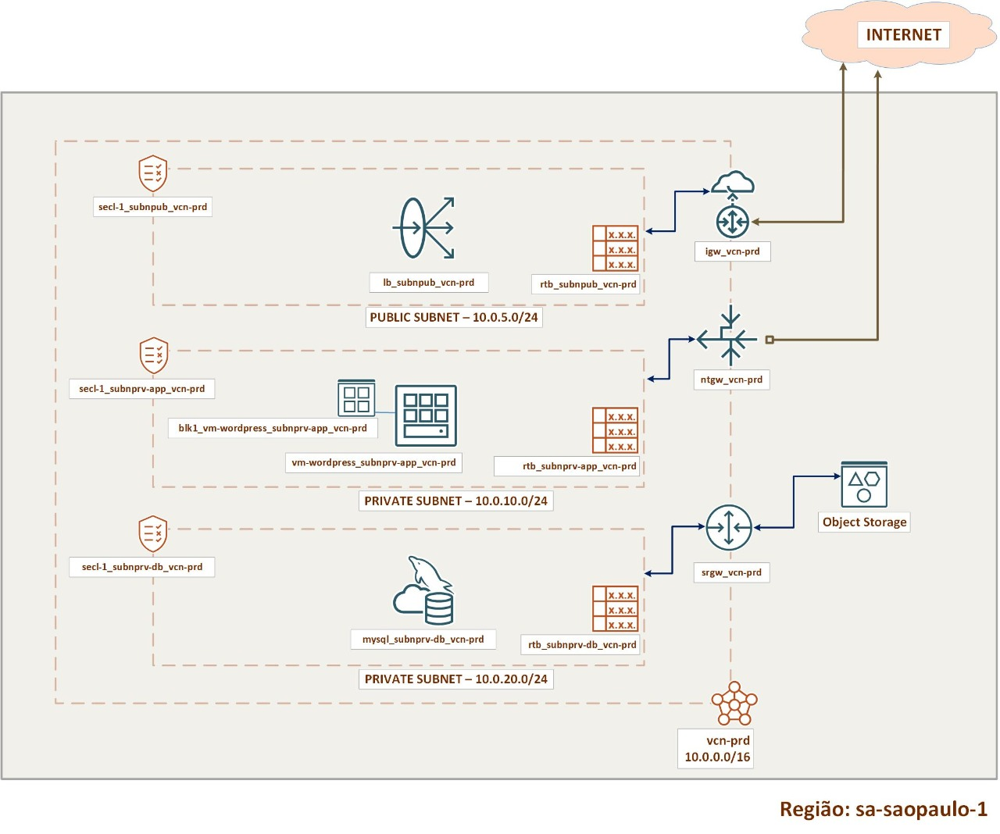

# Capítulo 4: Primeira aplicação no OCI

## 4.1 - Fundamentos de Redes no OCI

### __Visão Geral da Rede no OCI__

Uma das primeiras etapas ao começar a implementar seus recursos no OCI, é a configuração da sua rede. o serviço de _[Networking do OCI](https://docs.oracle.com/pt-br/iaas/Content/Network/Concepts/overview.htm)_ disponibiliza versões virtuais dos componentes de redes tradicionais no qual você pode usar. Configurar a rede de dados é um pré-requisito para que você possa criar seus recursos.

Aprensento abaixo, alguns dos componentes existentes do serviço de _[Networking do OCI](https://docs.oracle.com/pt-br/iaas/Content/Network/Concepts/overview.htm)_:

1. **VCN (Virtual Cloud Network)**
    - É uma rede virtual privada configurada nos data centers da Oracle e que reside em uma única região.
    - A partir de uma VCN criada e configurada, podemos criar subredes, máquinas virtuais, banco de dados, etc. É o nosso “tapete” para acomodarmos os móveis, a mesa, o sofá e a televisão.
    - Para criar uma VCN, você deve escolher um bloco de endereços IPv4 válido. A Oracle recomenda escolher um dos blocos documentados pela _[RFC1918](https://tools.ietf.org/html/rfc1918)_:
        - 10.0.0.0/8
        - 172.16.0.0/12
        - 192.168.0.0/16

2. **Subredes**
    - É a divisão de uma VCN em partes menores (subdivisões).
    - Cada subrede consiste em um intervalo contíguo de endereços IP (para IPv4 e IPv6, se ativado) que não se sobrepõem com outras subredes da VCN.    
    - Você pode criar uma subrede em um único _"domínio de disponibilidade"_ ou em uma região (subrede regional - _modo recomendado_).
    - Recursos criados dentro de uma subrede utilizam a mesma tabela de roteamento (route table), as mesmas listas de segurança (security lists), e mesmas opções de DHCP (dhcp options).
    - Você cria uma subrede como sendo pública ou privada. Uma subrede pública permite expor, através de IP público, um recurso na internet. A subrede privada, não.

3. **Tabelas de Roteamento (route table)**
    - Contém regras de roteamento que direcionam o tráfego da subrede “para fora” da VCN.
    - Subredes dentro da mesma VCN, não precisam de regras de roteamento para se comunicarem.
    
4. **Regras de Segurança (security lists)** 
    - É o firewall da subrede.
    - É possível bloquear ou liberar o tráfego de rede por protocolos e portas.

5. **Opções de DHCP (dhcp options)**
    - São configurações informadas pelo protocolo DHCP a todos os recursos criados dentro de uma subrede. 
    - É possível definir, por exemplo, quais servidores DNS serão utilizados pelos recursos da subrede.

6. **Gateways de Comunicação**
    - Existem diferentes _"gateways de comunicação"_ que podem ser usados no OCI. Segue resumo: <br>
        - **Internet Gateway**
            - Possibilita comunicação direta vinda da internet. Para isto, é necessário que o recurso tenha um IP público. <br><br>
        - **NAT Gateway**
            - Permite que recursos, sem endereço IP público, acessem a internet. Permite comunicação mas evita a exposição do recurso na internet. <br><br>
        - **Service Gateway**
            - Possibilita que recursos de uma subrede se comuniquem com os serviços do OCI diretamente, sem utilizar a internet. <br><br>
        - **Local Peering Gateway**
            - Possibilita conectividade entre VCNs da mesma região. <br><br>
        - **Dynamic Routing Gateway**
            - Possibilita conectividade das suas VCNs com seu ambiente on-premises, através de VPN ou FastConnect (link dedicado). <br><br>

Um dos trabalhos do arquiteto ou engenheiro cloud, é saber utilizar esses recursos para compor sua infraestrutura. Utilizaremos o desenho abaixo como guia do nosso primeiro deploy no OCI:

<br>



### __Decompondo o desenho em recursos Cloud__

Na cloud podemos dizer que tudo é um recurso. Um recurso possui, além de um nome, funcionalidades específicas. Para a maioria dos recursos que você cria, você tem a opção de especificar um nome para exibição. Não há regras, porém vou sugerir uma terminologia na qual eu acho útil para identificação. 

Seguindo o desenho, temos:

- **vcn-prd**: VCN de produção 10.0.0.0/16 localizada na região de São Paulo. 
<br><br>
- **subnpub_vcn-prd**: Subrede pública 10.0.5.0/24 da VCN de produção.
- **rtb_subnpub_vcn-prd**: Tabela de roteamento da subrede pública da VCN de produção.
- **secl-1_subnpub_vcn-prd**: Regras de segurança da subrede pública da VCN de produção.
- **igw_vcn-prd**: Internet Gateway da VCN de produção.
- **lb_subnpub_vcn-prd**: Load Balancer da subrede pública da VCN de produção.
<br><br>
- **subnprv-app_vcn-prd**: Subrede privada 10.0.10.0/24 para aplicação da VCN de produção.
- **rtb_subnprv-app_vcn-prd**: Tabela de roteamento da subrede privada para aplicação.
- **secl-1_subnprv-db_vcn-prd**: Regras de segurança da subrede privada para aplicação.
- **ngw_vcn-prd**: NAT Gateway da VCN de produção.
- **vm-wordpress_subnprv-app_vcn-prd**: Máquina virtual da aplicação Wordpress.
- **blk1_vm-wordpress_subnprv-app_vcn-prd**: Bloco de Disco #1 da máquina virtual da aplicação Wordpress.
<br><br> 
- **subnprv-db_vcn-prd**: Subrede privada 10.0.20.0/24 para banco de dados da VCN de produção.
- **rtb_subnprv-db_vcn-prd**: Tabela de roteamento da subrede privada para banco de dados.
- **secl-1_subnprv-db_vcn-prd**: Regras de segurança da subrede privada para banco de dados.
- **sgw_vcn-prd**: Service Gateway da VCN de produção.
- **mysql_subnprv-db_vcn-prd**: Instância MySQL da subrede privada para banco de dados.
<br><br> 
- **dhcp_vcn-prd**: DHCP Options da VCN de produção.

Antes de começarmos, vamos criar os respectivos compartimentos para abrigar os recursos que iremos criar também:

```
suaEmpresa (root)
   ├── projeto-wordpress
   │     ├── cmp-database
   │     ├── cmp-network
   │     └── cmp-app
  ...
```

A ideia é termos grupos de usuários, com políticas de autorização, por compartimento:

| Grupo      | Descrição                                    | Compartimento   |
| ---------- | -------------------------------------------- | --------------- | 
| grp-dba    | Usuários administradores dos Bancos de Dados | cmp-database    |
| grp-netadm | Usuários administradores das Redes           | cmp-network     |
| grp-appadm | Usuários administradores das aplicações      | cmp-app         |

Deixando claro que todos os três compartimentos (cmp-database, cmp-network e cmp-app), são "filhos" do compartimento pai "projeto-wordpress".

### __Compartimentos__

Primeiramente criaremos o compartimento pai "projeto-wordpress":

```
darmbrust@hoodwink:~$ oci iam compartment create --region "sa-saopaulo-1" \
> --compartment-id ocid1.tenancy.oc1..aaaaaaaavv2qh5asjdcoufmb6fzpnrfqgjxxdzlvjrgkrkytnyyz6zgvjnua \
> --name "projeto-wordpress" --description "Projeto Wordpress"
{
  "data": {
    "compartment-id": "ocid1.tenancy.oc1..aaaaaaaavv2qh5asjdcoufmb6fzpnrfqgjxxdzlvjrgkrkytnyyz6zgvjnua",
    "defined-tags": {
      "Oracle-Tags": {
        "CreatedBy": "oracleidentitycloudservice/daniel.armbrust@algumdominio.com",
        "CreatedOn": "2021-08-20T19:08:44.763Z"
      }
    },
    "description": "Projeto Wordpress",
    "freeform-tags": {},
    "id": "ocid1.compartment.oc1..aaaaaaaagnkmm5chrzmx6agponivbwohrabrzridbvxpaomwvntlq2qehk5a",
    "inactive-status": null,
    "is-accessible": true,
    "lifecycle-state": "ACTIVE",
    "name": "projeto-wordpress",
    "time-created": "2021-08-20T19:08:44.812000+00:00"
  },
  "etag": "316130173d4b2d17074a4731ee8ba79716166ecd"
}
```

Perceba que o pai do compartimento "projeto-wordpress" é o OCID que representa o nosso Tenant. Os próximos que serão criados, são compartimentos filhos do "projeto-wordpress". Para isto, iremos usar o valor contido em "id", que representa o OCID do compartimento "projeto-wordpress" que foi criado, como valor do parâmetro "--compartment-id".

```
darmbrust@hoodwink:~$ oci iam compartment create --region "sa-saopaulo-1" \
> --compartment-id "ocid1.compartment.oc1..aaaaaaaagnkmm5chrzmx6agponivbwohrabrzridbvxpaomwvntlq2qehk5a" \
> --name "cmp-database" --description "Usuários administradores dos Bancos de Dados"
{
  "data": {
    "compartment-id": "ocid1.compartment.oc1..aaaaaaaagnkmm5chrzmx6agponivbwohrabrzridbvxpaomwvntlq2qehk5a",
    "defined-tags": {
      "Oracle-Tags": {
        "CreatedBy": "oracleidentitycloudservice/daniel.armbrust@algumdominio.com",
        "CreatedOn": "2021-08-20T19:11:50.186Z"
      }
    },
    "description": "Usu\u00e1rios administradores dos Bancos de Dados",
    "freeform-tags": {},
    "id": "ocid1.compartment.oc1..aaaaaaaakehqc6cv7c5my5egzckzhhldw32preke3qzqoeloyy4i3ruiz7jq",
    "inactive-status": null,
    "is-accessible": true,
    "lifecycle-state": "ACTIVE",
    "name": "cmp-database",
    "time-created": "2021-08-20T19:11:50.303000+00:00"
  },
  "etag": "8e9ee163602cb8b98716c8df27c8a0403a30b938"
}
```

Repita o processo para os demais compartimentos que faltaram e teremos nossa estrutura de compartimentos criadas.

>_**__NOTA:__** Recursos que fazem parte do serviço IAM, são globais. Recursos globais devem ser criados na **HOME REGION**. Utilize a opção **--region** para especificar sua **HOME REGION** caso o arquivo de configuração do OCI CLI não faça referência a ela.

### __Grupo e Políticas de Autorização__

```
darmbrust@hoodwink:~$ oci iam group create --name "grp-dba" --description "Usuários administradores dos Bancos de Dados"
{
  "data": {
    "compartment-id": "ocid1.tenancy.oc1..aaaaaaaavv2qh5asjdcoufmb6fzpnrfqgjxxdzlvjrgkrkytnyyz6zgvjnua",
    "defined-tags": {
      "Oracle-Tags": {
        "CreatedBy": "oracleidentitycloudservice/daniel.armbrust@algumdominio.com",
        "CreatedOn": "2021-08-20T20:48:05.750Z"
      }
    },
    "description": "Usu\u00e1rios administradores dos Bancos de Dados",
    "freeform-tags": {},
    "id": "ocid1.group.oc1..aaaaaaaapqaq4mp2p2yaf5yqut4vcy4i5smhiz22crwim3z363ytvwexk3ta",
    "inactive-status": null,
    "lifecycle-state": "ACTIVE",
    "name": "grp-dba",
    "time-created": "2021-08-20T20:48:05.810000+00:00"
  },
  "etag": "aaa8b6ce8732856f4ca56f901187afda837aebae"
}
```