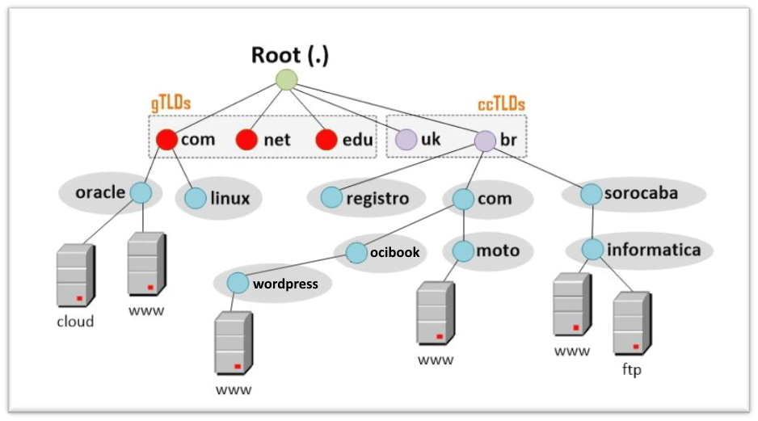
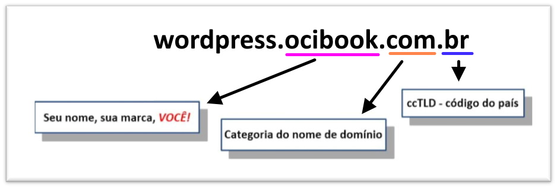
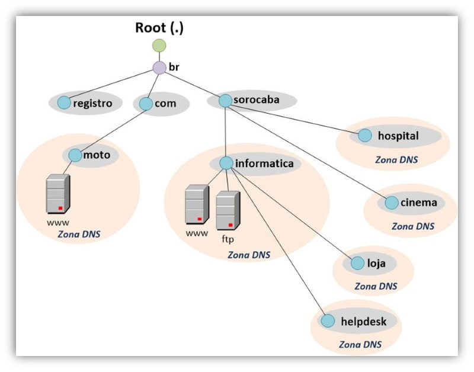

# Capítulo 4: Melhorias na aplicação Wordpress

## 4.1 - Utilizando o Serviço de DNS

### __Visão Geral__

Ao iniciarmos a migração ou hospedagem, dos nossos ativos computacionais para o _[OCI](https://www.oracle.com/cloud/)_, nos deparamos com um serviço simples porém extremamente crítico - o _[DNS](https://pt.wikipedia.org/wiki/Sistema_de_Nomes_de_Dom%C3%ADnio)_.

Neste capítulo irei explicar um pouco da teoria por trás do _[DNS (Domain Name System)](https://pt.wikipedia.org/wiki/Sistema_de_Nomes_de_Dom%C3%ADnio)_ ou _[Sistema de Nomes de Domínio](https://pt.wikipedia.org/wiki/Sistema_de_Nomes_de_Dom%C3%ADnio)_, além de demonstrar como migrar um domínio para ser gerenciado pelo _[Serviço de DNS](https://docs.oracle.com/pt-br/iaas/Content/DNS/Concepts/dnszonemanagement.htm)_ do _[OCI](https://www.oracle.com/cloud/)_.

No capítulo anterior reservamos o _[endereço IP público](https://docs.oracle.com/pt-br/iaas/Content/Network/Tasks/managingpublicIPs.htm#Public_IP_Addresses)_ _152.70.221.188_ para a aplicação _[Wordpress](https://pt.wikipedia.org/wiki/WordPress)_. Todo o acesso por enquanto está sendo feito por este IP. 

Ao final deste capítulo, a aplicação será acessada por um nome.

Vamos lá ...

### __O que é DNS?__

O _[DNS ou Domain Name System (Sistema de Nomes de Domínios)](https://pt.wikipedia.org/wiki/Sistema_de_Nomes_de_Dom%C3%ADnio)_ é um tipo de banco de dados distribuído que contém informações de _[hosts](https://pt.wikipedia.org/wiki/Host)_. Sua principal função é resolver (traduzir ou mapear) um nome de host em seu respectivo endereço IP.

Lembrando que a comunicação entre máquinas na Internet, ocorre através de _[endereços IPs](https://pt.wikipedia.org/wiki/Endere%C3%A7o_IP)_. Os nomes existem para facilitar a identificação ou acesso de uma máquina, por nós humanos.

Este banco de dados de hosts, que forma o _[serviço DNS](https://docs.oracle.com/pt-br/iaas/Content/DNS/Concepts/dnszonemanagement.htm)_, é representado por uma **_árvore invertida_** no qual possui uma única raiz (root) no topo:

No desenho acima temos os servidores DNS denominados _ROOT_ (também representados por um ponto “.”). Estes servidores sabem como direcionar uma requisição aos demais servidores _gTLDs (Generic Top Level Domains - Domínios de Primeiro Nível Genéricos)_ ou _ccTLDs (Country Code Top Level Domains - Domínios de Primeiro Nível de Código de País)_.

>_**__NOTA:__** Os ccTLDs seguiram a norma internacional ISO 3166 no qual estabelece uma abreviação de duas letras para todos os países do mundo._

Essa é a parte simples: _“Resolver um nome, por exemplo **cloud.oracle.com** em seu endereço IP **104.125.126.150**”_. Agora, imagine ficar sem este serviço. Esse é o lado crítico!
    
Por conta desta criticidade, o _[Serviço de DNS](https://docs.oracle.com/pt-br/iaas/Content/DNS/Concepts/dnszonemanagement.htm)_ do _[OCI](https://www.oracle.com/cloud/)_ é distribuído através de uma _[Rede Anycast](https://pt.wikipedia.org/wiki/Anycast)_ por todo o globo terrestre. Isto garante baixa latência ao resolver um nome pela proximidade ao usuário, alto desempenho e alta disponibilidade pela distribuição do serviço entre vários _[PoPs (Point of presence)](https://pt.wikipedia.org/wiki/Point_of_presence)_.

### __O que é um domínio?__

Podemos dizer que domínio é o seu _“espaço na internet”_. Ou seja, é um nome que serve para localizar e identificar _você_ ou _sua empresa_ na internet. É o nome do seu site, é um símbolo de identificação.

Vejamos nosso exemplo:

>_**__NOTA:__** Estamos falando de nomes que terminam em “.br”. Por tanto, para saber das categorias disponíveis no [registro.br](https://registro.br/quem-somos/) acesse este [link](https://registro.br/dominio/categorias/)._

Lembra da _árvore invertida?_ Pois bem … cada nó da árvore contém um rótulo _(ex: ocibook)_ que representa uma nova subárvore. Podemos dizer que _"ocibook"_ é um subdomínio do domínio _"com"_, e _"com"_ é um subdomínio do domínio _"br"_. No caso do nome _"wordpress"_, este representa o recurso acessível pelo IP _152.70.221.188_, que em nosso caso é o _[Load Balancer](https://docs.oracle.com/pt-br/iaas/Content/Balance/Concepts/balanceoverview.htm)_.

Aqui no Brasil, o _[registro.br](https://registro.br/quem-somos/)_ é o responsável pelas atividades de registro e manutenção dos nomes do domínio ._[br](https://pt.wikipedia.org/wiki/.br)_. Toda pessoa física ou jurídica que queira ter seu próprio nome na internet, primeiramente deve _[registrar](https://registro.br/)_ ele.

Para registrarmos um nome, como primeiro passo, é verificar sua disponibilidade através deste _[link aqui](https://registro.br/busca-dominio/)_. Basta seguir as orientações apresentadas pelo _[site](https://registro.br/quem-somos/)_ e pronto! Você agora é responsável por um domínio na internet.

### __Zona DNS e Registro de Recursos (RR)__

Uma Zona DNS nada mais é do que um conjunto de configurações que armazenam diferentes registros DNS. Esses registros são chamados de _[Registros de Recursos](https://en.wikipedia.org/wiki/List_of_DNS_record_types)_ ou _[Resource Records (RR)](https://en.wikipedia.org/wiki/List_of_DNS_record_types)_.

Lembre-se que o DNS é um tipo de banco de dados no qual contém registros e valores (chave e valor) referente aos _[host](https://pt.wikipedia.org/wiki/Host)_ da internet. Todo o conjunto registro e valor, são armazenados em uma **_Zona DNS_**.  

Cada **_Zona DNS_** é administrada de forma independente. A partir do momento que você registra um nome, você se torna responsável pela administração dele. Além dos registros que você pode inserir em sua **_Zona DNS_**, você também pode criar novos subdomínios e delegar a administração à alguém. 

Sobre os _[Registros de Recursos (RR)](https://en.wikipedia.org/wiki/List_of_DNS_record_types)_ disponíveis no _[Serviço de DNS](https://docs.oracle.com/pt-br/iaas/Content/DNS/Concepts/dnszonemanagement.htm)_ do _[OCI](https://www.oracle.com/cloud/)_, os mais utilizados são:

|Registro|Descrição                                                                                                                                              |
|:-------------|:------------------------------------------------------------------------------------------------------------------------------------------------|
| A            |  Mapeia um nome de host a um endereço IPv4.                                                                                                     |
| AAAA         |  Mapeia um nome de host a um endereço IPv6.                                                                                                     |
| CNAME        |  Canonical Name - Define um _"apelido"_ para um nome existente.                                                                                 |
| MX           |  Mail Exchanger - Define um _[host](https://pt.wikipedia.org/wiki/Host)_ que será responsável por processar mensagens de e-mail para o domínio. |

