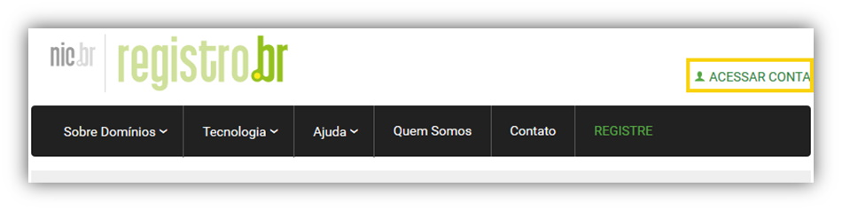
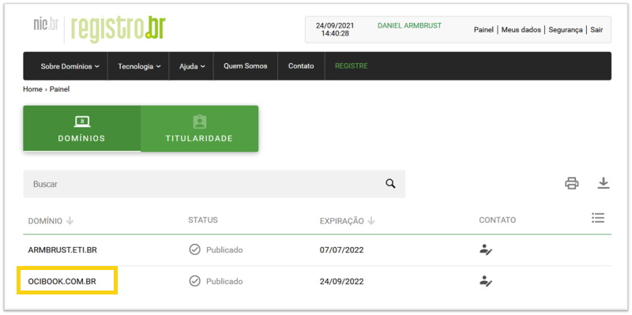
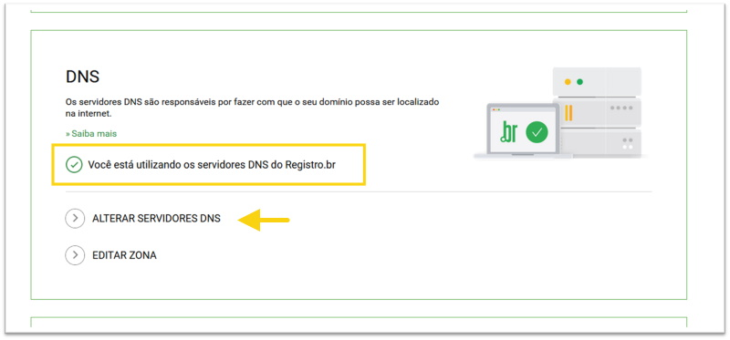
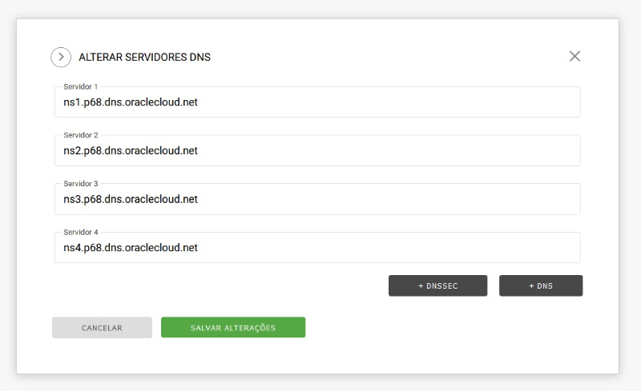
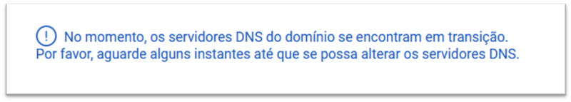
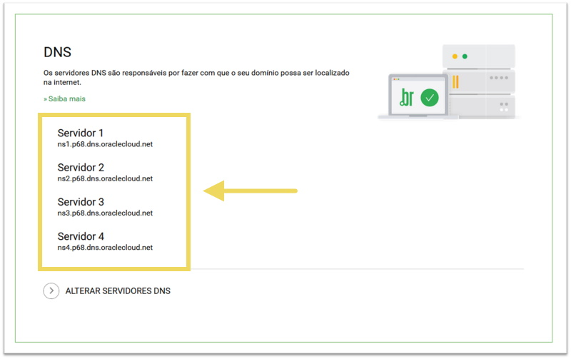

# Capítulo 4: Melhorias na aplicação Wordpress

## 4.1 - Utilizando o Serviço de DNS

### __Visão Geral__

Ao iniciarmos a migração ou hospedagem, dos nossos ativos computacionais para o _[OCI](https://www.oracle.com/cloud/)_, nos deparamos com um serviço simples porém extremamente crítico - o _[DNS](https://pt.wikipedia.org/wiki/Sistema_de_Nomes_de_Dom%C3%ADnio)_.

Neste capítulo irei explicar um pouco da teoria por trás do _[DNS (Domain Name System)](https://pt.wikipedia.org/wiki/Sistema_de_Nomes_de_Dom%C3%ADnio)_ ou _[Sistema de Nomes de Domínio](https://pt.wikipedia.org/wiki/Sistema_de_Nomes_de_Dom%C3%ADnio)_, além de demonstrar como migrar um domínio para ser gerenciado pelo _[Serviço de DNS](https://docs.oracle.com/pt-br/iaas/Content/DNS/Concepts/dnszonemanagement.htm)_ do _[OCI](https://www.oracle.com/cloud/)_.

No capítulo anterior reservamos o _[endereço IP público](https://docs.oracle.com/pt-br/iaas/Content/Network/Tasks/managingpublicIPs.htm#Public_IP_Addresses)_ _152.70.221.188_ para a aplicação _[Wordpress](https://pt.wikipedia.org/wiki/WordPress)_. Todo o acesso por enquanto está sendo feito por este IP. 

Ao final deste capítulo, a aplicação será acessada por um nome.

Vamos lá ...

### __O que é DNS?__

O _[DNS ou Domain Name System (Sistema de Nomes de Domínios)](https://pt.wikipedia.org/wiki/Sistema_de_Nomes_de_Dom%C3%ADnio)_ é um tipo de banco de dados distribuído que contém informações de _[hosts](https://pt.wikipedia.org/wiki/Host)_. Sua principal função é resolver (traduzir ou mapear) um nome de host em seu respectivo endereço IP.

Lembrando que a comunicação entre máquinas na Internet, ocorre através de _[endereços IPs](https://pt.wikipedia.org/wiki/Endere%C3%A7o_IP)_. Os nomes existem para facilitar a identificação ou acesso de uma máquina, por nós humanos.

Este banco de dados de hosts, que forma o _[serviço DNS](https://docs.oracle.com/pt-br/iaas/Content/DNS/Concepts/dnszonemanagement.htm)_, é representado por uma **_árvore invertida_** no qual possui uma única raiz (root) no topo:


No desenho acima temos os servidores DNS denominados _ROOT_ (também representados por um ponto “.”). Estes servidores sabem como direcionar uma requisição aos demais servidores _gTLDs (Generic Top Level Domains - Domínios de Primeiro Nível Genéricos)_ ou _ccTLDs (Country Code Top Level Domains - Domínios de Primeiro Nível de Código de País)_.

>_**__NOTA:__** Os ccTLDs seguiram a norma internacional ISO 3166 no qual estabelece uma abreviação de duas letras para todos os países do mundo._

Essa é a parte simples: _“Resolver um nome, por exemplo **cloud.oracle.com** em seu endereço IP **104.125.126.150**”_. Agora, imagine ficar sem este serviço. Esse é o lado crítico!
    
Por conta desta criticidade, o _[Serviço de DNS](https://docs.oracle.com/pt-br/iaas/Content/DNS/Concepts/dnszonemanagement.htm)_ do _[OCI](https://www.oracle.com/cloud/)_ é distribuído através de uma _[Rede Anycast](https://pt.wikipedia.org/wiki/Anycast)_ por todo o globo terrestre. Isto garante baixa latência ao resolver um nome pela proximidade ao usuário, alto desempenho e alta disponibilidade pela distribuição do serviço entre vários _[PoPs (Point of presence)](https://pt.wikipedia.org/wiki/Point_of_presence)_.

### __O que é um domínio?__

Podemos dizer que domínio é o seu _“espaço na internet”_. Ou seja, é um nome que serve para localizar e identificar _você_ ou _sua empresa_ na internet. É o nome do seu site, é um símbolo de identificação.

Vejamos nosso exemplo:


>_**__NOTA:__** Estamos falando de nomes que terminam em “.br”. Por tanto, para saber das categorias disponíveis no [registro.br](https://registro.br/quem-somos/) acesse este [link](https://registro.br/dominio/categorias/)._

Lembra da _árvore invertida?_ Pois bem … cada nó da árvore contém um rótulo _(ex: ocibook)_ que representa uma nova subárvore. Podemos dizer que _"ocibook"_ é um subdomínio do domínio _"com"_, e _"com"_ é um subdomínio do domínio _"br"_. No caso do nome _"wordpress"_, este representa o recurso acessível pelo IP _152.70.221.188_, que em nosso caso é o _[Load Balancer](https://docs.oracle.com/pt-br/iaas/Content/Balance/Concepts/balanceoverview.htm)_.

Aqui no Brasil, o _[registro.br](https://registro.br/quem-somos/)_ é o responsável pelas atividades de registro e manutenção dos nomes do domínio ._[br](https://pt.wikipedia.org/wiki/.br)_. Toda pessoa física ou jurídica que queira ter seu próprio nome na internet, primeiramente deve _[registrar](https://registro.br/)_ ele.

Para registrarmos um nome, como primeiro passo, é verificar sua disponibilidade através deste _[link aqui](https://registro.br/busca-dominio/)_. Basta seguir as orientações apresentadas pelo _[site](https://registro.br/quem-somos/)_ e pronto! Você agora é responsável por um domínio na internet.

### __Zona DNS e Registro de Recursos (RR)__

Uma **_Zona DNS_** nada mais é do que um conjunto de configurações que armazenam diferentes registros DNS. Esses registros são chamados de _[Registros de Recursos](https://en.wikipedia.org/wiki/List_of_DNS_record_types)_ ou _[Resource Records (RR)](https://en.wikipedia.org/wiki/List_of_DNS_record_types)_.

Lembre-se que o DNS é um tipo especial de banco de dados no qual contém _registros e valores (chave e valor)_ referente aos _[host](https://pt.wikipedia.org/wiki/Host)_ da internet. Estes _registros_ e seus _valores_, são armazenados em uma **_Zona DNS_**.  

Cada **_Zona DNS_** é administrada de forma independente. A partir do momento que você registra um nome, você se torna responsável pela administração dele. Além dos registros que você pode inserir em sua **_Zona DNS_**, você também pode criar novos subdomínios e delegar a administração à alguém. 


Sobre os _[Registros de Recursos (RR)](https://en.wikipedia.org/wiki/List_of_DNS_record_types)_ disponíveis no _[Serviço de DNS](https://docs.oracle.com/pt-br/iaas/Content/DNS/Concepts/dnszonemanagement.htm)_ do _[OCI](https://www.oracle.com/cloud/)_, os mais utilizados são:


|Registro|Descrição                                                                                                                                              |
|:-------------|:------------------------------------------------------------------------------------------------------------------------------------------------|
| A            |  Mapeia um nome de host a um endereço IPv4.                                                                                                     |
| AAAA         |  Mapeia um nome de host a um endereço IPv6.                                                                                                     |
| CNAME        |  Canonical Name - Define um _"apelido"_ para um nome existente.                                                                                 |
| MX           |  Mail Exchanger - Define um _[host](https://pt.wikipedia.org/wiki/Host)_ que será responsável por processar mensagens de e-mail para o domínio. |

>_**__NOTA:__** Para verificar a lista de [Registros de Recursos (RR)](https://docs.oracle.com/pt-br/iaas/Content/DNS/Reference/supporteddnsresource.htm) disponíveis pelo serviço, consulte este [link aqui](https://docs.oracle.com/pt-br/iaas/Content/DNS/Reference/supporteddnsresource.htm)._

### __Adicionando uma Zona DNS__

Vou demonstrar de forma prática todo o processo de _"levar"_ um domínio para o _[OCI](https://www.oracle.com/cloud/)_, com a finalidade de centralizar a administração da infraestrutura, obter proteção contra _[ataques DDoS](https://pt.wikipedia.org/wiki/Ataque_de_nega%C3%A7%C3%A3o_de_servi%C3%A7o)_ e ter _alta disponibilidade_. Todos estes recursos estão presentes no _[Serviço de DNS](https://docs.oracle.com/pt-br/iaas/Content/DNS/Concepts/dnszonemanagement.htm)_.

Criarei uma nova _Zona DNS_ de nome _"ocibook.com.br"_ que irá armazenar todos os _registros DNS_ deste livro. Como o intuíto é a administração centralizada dos _registros_ aqui no _[OCI](https://www.oracle.com/cloud/)_, esta _Zona DNS_ deve obrigatóriamente ser do tipo primária _(PRIMARY)_.

```
darmbrust@hoodwink:~$ oci dns zone create \
> --compartment-id "ocid1.compartment.oc1..aaaaaaaauvqvbbx3oridcm5d2ztxkftwr362u2vl5zdsayzbehzwbjs56soq" \
> --name "ocibook.com.br" \
> --zone-type "PRIMARY" \
> --wait-for-state "ACTIVE"
Action completed. Waiting until the resource has entered state: ('ACTIVE',)
{
  "data": {
    "compartment-id": "ocid1.compartment.oc1..aaaaaaaauvqvbbx3oridcm5d2ztxkftwr362u2vl5zdsayzbehzwbjs56soq",
    "defined-tags": {
      "Oracle-Tags": {
        "CreatedBy": "oracleidentitycloudservice/daniel.armbrust@algumdominio.com",
        "CreatedOn": "2021-09-24T22:24:03.868Z"
      }
    },
    "external-masters": [],
    "freeform-tags": null,
    "id": "ocid1.dns-zone.oc1..3b872f6da34a452ebd1c36678002acc3",
    "is-protected": false,
    "lifecycle-state": "ACTIVE",
    "name": "ocibook.com.br",
    "nameservers": [
      {
        "hostname": "ns1.p68.dns.oraclecloud.net"
      },
      {
        "hostname": "ns2.p68.dns.oraclecloud.net"
      },
      {
        "hostname": "ns3.p68.dns.oraclecloud.net"
      },
      {
        "hostname": "ns4.p68.dns.oraclecloud.net"
      }
    ],
    "scope": "GLOBAL",
    "self-uri": "https://dns.sa-saopaulo-1.oraclecloud.com/20180115/zones/ocibook.com.br",
    "serial": 1,
    "time-created": "2021-09-24T22:24:07+00:00",
    "version": "1",
    "view-id": null,
    "zone-transfer-servers": null,
    "zone-type": "PRIMARY"
  },
  "etag": "\"1ocid1.dns-zone.oc1..3b872f6da34a452ebd1c36678002acc3ocid1.compartment.oc1..aaaaaaaaie4exnvj2ktkjlliahl2bxmdnteu2xmn27oc5cy5mdcmocl4vd7q0a9dc2d7eb6346d49ffdc1dd03a3c143a2b29d10#application/json--gzip\""
}
```

### __Gerenciando registros DNS__

Após a _Zona DNS_ estar devidamente criada, irei criar dois _registros_ que serão usados pela aplicação _[Wordpress](https://pt.wikipedia.org/wiki/WordPress)_. O primeiro irá apontar o nome _"lb-1.ocibook.com.br"_ para o endereço IP _"152.70.221.188"_ do _[Load Balancer](https://docs.oracle.com/pt-br/iaas/Content/Balance/Concepts/balanceoverview.htm)_ que foi criado: 

```
darmbrust@hoodwink:~$ oci dns record domain patch \
> --zone-name-or-id "ocibook.com.br" \
> --domain "lb-1.ocibook.com.br" \
> --scope "GLOBAL" \
> --items '[{"domain": "lb-1.ocibook.com.br", "rdata": "152.70.221.188", "rtype": "A", "ttl": 3600}]'
{
  "data": {
    "items": [
      {
        "domain": "lb-1.ocibook.com.br",
        "is-protected": false,
        "rdata": "152.70.221.188",
        "record-hash": "bfc2039a0e88412c8203627f84f2ba13",
        "rrset-version": "4",
        "rtype": "A",
        "ttl": 3600
      }
    ]
  },
  "etag": "\"4ocid1.dns-zone.oc1..3b872f6da34a452ebd1c36678002acc3#application/json\"",
  "opc-total-items": "1"
}
```

Perceba que o tipo do registro definido em _"rtype"_ é do tipo _"A"_. Este tipo indica a resolução do nome _"lb-1.ocibook.com.br"_ contido em _"domain"_, para o endereço IPv4 _"152.70.221.188"_.

O valor _3600 segundos (1 hora)_ contido em _"ttl" (Time to live ou "Tempo de Vida")_, diz sobre a _duração em cache_ do registro por outros servidores ou resolvedores DNS. Ou seja, quando houver uma resolução do nome _"lb-1.ocibook.com.br"_ para o seu respectivo endereço IP, esta resposta será válida por _1 hora"_. Após este tempo, qualquer resposta contida em _cache_ sobre este nome, deve ser invalidada pelo resolvedor que a tem, obrigando uma nova consulta ao DNS do _[OCI](https://www.oracle.com/cloud/)_.

Se seus dados não mudam muito, você pode usar um valor _TTL_ de vários dias. Em nosso caso, estamos deixar um valor menor para evitar um _cache_ muito longo, pois iremos mudar esta definição em breve.

Por fim, irei adicionar um registro do tipo _CNAME_ que nada mais é do que um _apelido_ _"wordpress"_ para o nome _"lb-1.ocibook.com.br"_ que foi criado.

```
darmbrust@hoodwink:~$ oci dns record domain patch \
> --zone-name-or-id "ocibook.com.br" \
> --domain "wordpress.ocibook.com.br" \
> --scope "GLOBAL" \
> --items '[{"domain":"wordpress.ocibook.com.br", "rdata": "lb-1.ocibook.com.br", "rtype": "CNAME", "ttl": 3600}]'
{
  "data": {
    "items": [
      {
        "domain": "wordpress.ocibook.com.br",
        "is-protected": false,
        "rdata": "lb-1.ocibook.com.br.",
        "record-hash": "9f1c7a488c404ebe3f549d56c76d563f",
        "rrset-version": "5",
        "rtype": "CNAME",
        "ttl": 3600
      }
    ]
  },
  "etag": "\"5ocid1.dns-zone.oc1..3b872f6da34a452ebd1c36678002acc3#application/json\"",
  "opc-total-items": "1"
}
```

### __Configurações no Registro.BR__

Para finalizar, devemos informar ao _[Registro.BR](https://registro.br/)_ que a partir de agora, os servidores DNS que são responsáveis pelo nosso domínio estão localizados no _[OCI](https://www.oracle.com/cloud/)_.

Se você reparou, quando a _Zona DNS_ foi criada, o _[OCI](https://www.oracle.com/cloud/)_ disponibilizou um conjunto de _servidores DNS_ responsáveis por realizar a resolução de nomes referentes ao nosso domínio.

Podemos obter esta lista de servidores com o comando abaixo:

```
darmbrust@hoodwink:~$ oci dns zone get --zone-name-or-id "ocibook.com.br" | grep "hostname" | tr -d '"' | awk '{print $2}'
ns1.p68.dns.oraclecloud.net
ns2.p68.dns.oraclecloud.net
ns3.p68.dns.oraclecloud.net
ns4.p68.dns.oraclecloud.net
```

Como eu registrei o domínio _"ocibook.com.br"_, basta eu acessar a minha conta no _[registro.br](https://registro.br/)_ para completar as informações de registro.



No painel de administração dos seus domínios, clique no domínio _"ocibook.com.br"_ para acessar as configurações:



Na tela que se abre, perceba que estamos usando os DNS do próprio _[registro.br](https://registro.br/)_.

Para centralizarmos e termos controle sobre a administração deste domínio no _[OCI](https://www.oracle.com/cloud/)_, devemos alterá-los clicando no link _"ALTERAR SERVIDORES DNS"_:



Nesta tela devemos informar os servidores responsáveis pelo nosso domínio no _[OCI](https://www.oracle.com/cloud/)_:



Pronto! Alterações salvas.

Caso você encontre a mensagem abaixo:



Significa que os servidores do _[registro.br](https://registro.br/)_ entram em _"transição"_. Isto acontece quando você retira a responsabilidade do _[registro.br](https://registro.br/)_, em resolver os nomes do seu domínio, e passa esta responsabilidade para um _servidor externo_. Em nosso caso este _servidor externo_ são os servidores do _[OCI](https://www.oracle.com/cloud/)_.

Esse _período de transição_ é bem curto e não deve levar mais que uma hora para concluir.

Após este período, é possível ver os servidores DNS do _[OCI](https://www.oracle.com/cloud/)_ inseridos no _[registro.br](https://registro.br/)_.



### __Testando o Domínio__

Existem duas ferramentas muito úteis para nos auxiliar nos testes dos servidores de nomes: _[nslookup](https://pt.wikipedia.org/wiki/Nslookup)_ e _[dig](https://pt.wikipedia.org/wiki/Domain_Information_Groper)_.

A ferramenta _[nslookup](https://pt.wikipedia.org/wiki/Nslookup)_ é mais antiga e possui rotinas próprias para consultar os servidores de nomes. Por conta disto, você irá encontrar ela já instalada na maioria dos sistemas operacionais.

O _[nslookup](https://pt.wikipedia.org/wiki/Nslookup)_ pode ser executado em _modo interativo_, indicado quando se deseja realizar várias consultas, ou se deseja executar de uma forma mais extensiva como mudar opções, ativar depuração ou alternar entre outros servidores de nomes, etc. Ou em _modo batch_, que é mais simples e direto, quando se deseja realizar consultas únicas e pontuais.

- Exemplo de uso do _[nslookup](https://pt.wikipedia.org/wiki/Nslookup)_ em _modo interativo_:

```
darmbrust@hoodwink:~$ nslookup
> server ns3.p68.dns.oraclecloud.net
Default server: ns3.p68.dns.oraclecloud.net
Address: 162.88.34.6#53
Default server: ns3.p68.dns.oraclecloud.net
Address: 2600:2000:2020::6#53
> wordpress.ocibook.com.br
Server:         ns3.p68.dns.oraclecloud.net
Address:        162.88.34.6#53

wordpress.ocibook.com.br        canonical name = lb-1.ocibook.com.br.
Name:   lb-1.ocibook.com.br
Address: 152.70.221.188
>
```

- Exemplo de uso do _[nslookup](https://pt.wikipedia.org/wiki/Nslookup)_ em _modo batch_:

```
darmbrust@hoodwink:~$ nslookup wordpress.ocibook.com.br
Server:         192.168.88.1
Address:        192.168.88.1#53

Non-authoritative answer:
wordpress.ocibook.com.br        canonical name = lb-1.ocibook.com.br.
Name:   lb-1.ocibook.com.br
Address: 152.70.221.188
```

Já a ferramenta _[dig](https://pt.wikipedia.org/wiki/Domain_Information_Groper)_ usa as bibliotecas para resolver nomes diretamente do sistema operacional. Não há _modo interativo_, e é a mais indicada para uso por conta dos detalhes que ela provê. Porém, necessita ser compilada para ser utilizada em _[Windows](https://pt.wikipedia.org/wiki/Microsoft_Windows)_. Maiores informações sobre a ferramenta dig podem ser encontrados _[aqui](https://www.isc.org/download/)_.

```
darmbrust@hoodwink:~$ dig @ns4.p68.dns.oraclecloud.net wordpress.ocibook.com.br

; <<>> DiG 9.16.1-Ubuntu <<>> @ns4.p68.dns.oraclecloud.net wordpress.ocibook.com.br
; (2 servers found)
;; global options: +cmd
;; Got answer:
;; ->>HEADER<<- opcode: QUERY, status: NOERROR, id: 23271
;; flags: qr aa rd; QUERY: 1, ANSWER: 2, AUTHORITY: 0, ADDITIONAL: 1
;; WARNING: recursion requested but not available

;; OPT PSEUDOSECTION:
; EDNS: version: 0, flags:; udp: 1232
; COOKIE: bf7667ce5d2beaef5630e38e614f1eb92600abe2b70226fe (good)
;; QUESTION SECTION:
;wordpress.ocibook.com.br.      IN      A

;; ANSWER SECTION:
wordpress.ocibook.com.br. 3600  IN      CNAME   lb-1.ocibook.com.br.
lb-1.ocibook.com.br.    3600    IN      A       152.70.221.188

;; Query time: 147 msec
;; SERVER: 162.88.50.6#53(162.88.50.6)
;; WHEN: Sat Sep 25 13:06:01 UTC 2021
;; MSG SIZE  rcvd: 116

```

No site das documentações do _[OCI](https://www.oracle.com/cloud/)_ você também encontra informações sobre a ferramenta _[dig](https://pt.wikipedia.org/wiki/Domain_Information_Groper)_ usando este _[link aqui](https://docs.cloud.oracle.com/pt-br/iaas/Content/DNS/Tasks/testingdnsusingdig.htm)_.

Como o domínio já está publicado, é possível fazer o acesso pelo nome _"wordpress.ocibook.com.br"_:

```
darmbrust@hoodwink:~$ curl -L -v -s -o /dev/null http://wordpress.ocibook.com.br
*   Trying 152.70.221.188:80...
* TCP_NODELAY set
* Connected to wordpress.ocibook.com.br (152.70.221.188) port 80 (#0)
> GET / HTTP/1.1
> Host: wordpress.ocibook.com.br
> User-Agent: curl/7.68.0
> Accept: */*
>
* Mark bundle as not supporting multiuse
< HTTP/1.1 200 OK
< Date: Sat, 25 Sep 2021 14:28:35 GMT
< Content-Type: text/html; charset=UTF-8
< Transfer-Encoding: chunked
< Connection: keep-alive
< X-Powered-By: PHP/7.4.23
< Link: <http://152.70.221.188/index.php?rest_route=/>; rel="https://api.w.org/"
<
{ [1174 bytes data]
* Connection #0 to host wordpress.ocibook.com.br left intact
```

>_**__NOTA:__** O comando [curl](https://pt.wikipedia.org/wiki/CURL) acima foi configurado para exibir somente os [cabeçalhos](https://pt.wikipedia.org/wiki/Lista_de_campos_de_cabe%C3%A7alho_HTTP) [HTTP](https://pt.wikipedia.org/wiki/Hypertext_Transfer_Protocol) da conexão._


### __Conclusão__

O _[Serviço de DNS](https://docs.oracle.com/pt-br/iaas/Content/DNS/Concepts/dnszonemanagement.htm)_ de qualquer infraestrutura é extremamente crítico! Por conta disso, além de centralizar e facilitar a administração, migrar sua _Zona DNS_ para o _[OCI](https://www.oracle.com/cloud/)_ agrega alta disponibilidade, baixa latência e alto desempenho para seus usuários.

A partir de agora, a aplicação do _[Wordpress](https://pt.wikipedia.org/wiki/WordPress)_ pode ser acessada através do nome _"wordpress.ocibook.com.br"_, o que é bem mais conveniente do que acessar através do seu IP.