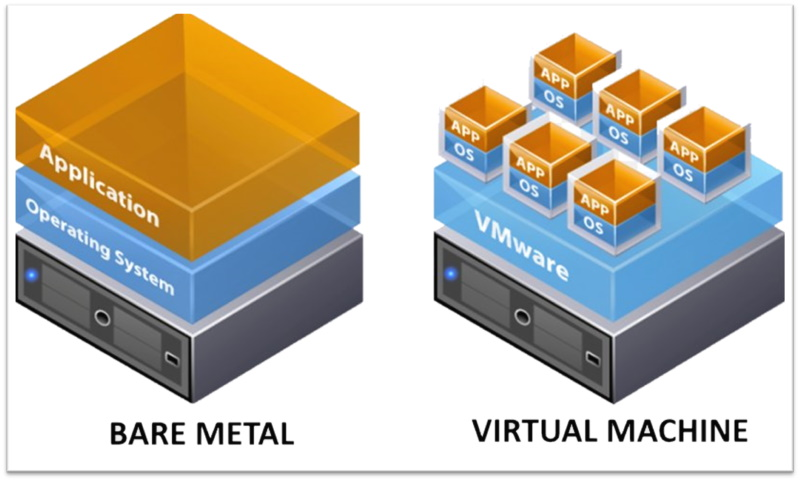

# Capítulo 4: Primeira aplicação no OCI

## 4.2 - Fundamentos do Serviço de Computação

### __Visão Geral__

O _[Serviço de Computação](https://docs.oracle.com/pt-br/iaas/Content/Compute/Concepts/computeoverview.htm)_ permite criar e gerenciar hosts de computação, conhecidos como **instâncias**. Uma _instância de computação_ deve obrigatóriamente ser criada e residir em um _"[Dominio de Disponibilidade (Availability Domains ou AD)](https://docs.oracle.com/pt-br/iaas/Content/General/Concepts/regions.htm#top)"_, e pode ser uma **_Máquina Virtual (VM ou Virtual Machine)_** ou uma **_Máquina Física (BM ou Bare Metal)_**. 

>_**__NOTA:__** Tecnicamente falando, uma instância de computação é criada sobre um "[Domínios de Falha (Fault Domains ou FD)](https://docs.oracle.com/pt-br/iaas/Content/General/Concepts/regions.htm#fault)"._

Uma instância _Bare Metal (BM)_ concede acesso a um servidor físico e dedicado, de altíssimo desempenho e sem um _[hipervisor](https://pt.wikipedia.org/wiki/Hipervisor)_. Neste modelo, além de não ser preciso compartilhar a máquina física, você tem acessos e controles exclusivos sobre a CPU, memória e placa de rede (NIC) da máquina. É como se fosse um hardware em execução no seu próprio data center, semelhante a uma ação de "_[colocation](https://pt.wikipedia.org/wiki/Colocation)_".

Já uma _Máquina Virtual (VM)_ é executada através de técnicas de _[virtualização](https://pt.wikipedia.org/wiki/Virtualiza%C3%A7%C3%A3o)_, que possibilita diferentes máquinas coexistirem, de forma isolada, sobre um hardware físico (um computador maior).



Um outro tipo de _instância de computação_ existente no OCI é o _[Dedicated Virtual Machine Host](https://docs.oracle.com/pt-br/iaas/Content/Compute/Concepts/dedicatedvmhosts.htm)_. Basicamente, este é um _Bare Metal_ dedicado ao seu uso, no qual você pode criar e executar máquinas virtuais (vm) sobre ele.

Utilizar uma _Máquina Virtual_ ou _Bare Metal_, seja de forma direta ou para criar máquinas virtuais sobre, vai depender muito da sua necessidade. Normalmente, utilizamos hardware dedicado e que não sejam compartilhado com outros clientes (único tenant), quando há algum requisito de conformidade e isolamento a cumprir, que o impedem de usar uma infraestrutura compartilhada. Porém, o mais comum de ser visto, são as máquinas virtuais (multitenancy).

Ao se cria uma instância, existem duas escolhas fundamentais a serem feitas. São elas:

- **Shape**
- **Software pré-instalado ou imagem**

### __Shape__

_[Shape](https://docs.oracle.com/pt-br/iaas/Content/Compute/Concepts/computeoverview.htm#instance-types__shapes)_ ou modelo, são características que determinam a quantidade de CPUs, quantidade de memória, banda máxima da rede, total de VNICs, tipo de armazenamento suportado (NVMe ou disco convencional) e outros recursos que sua _instância de computação_ terá. Podemos dizer que o shape especifica um conjunto pré-definido de recursos. Ele especifica o perfil do hardware de computação.

>_**__NOTA:__** A quantidade de VNICs que um determinado shape suporta, tem relação também com o sistema operacional. Seja Linux ou Windows, esta quantidade máxima é diferente. Consulta este [link](https://docs.oracle.com/pt-br/iaas/Content/Compute/References/computeshapes.htm#Compute_Shapes) para maiores detalhes._

Um shape também especifica o tipo do processador, que pode ser _[Intel](https://pt.wikipedia.org/wiki/Intel)_, _[AMD](https://pt.wikipedia.org/wiki/Advanced_Micro_Devices)_ ou processadores _[ARM](https://pt.wikipedia.org/wiki/Arquitetura_ARM)_.

Além do tipo do processador, um shape pode ter recursos fixos e otimizados especificamente para determinadas cargas de trabalho, ou ser _[flexível](https://docs.oracle.com/pt-br/iaas/Content/Compute/References/computeshapes.htm#flexible)_.

Vamos os detalhes ...

#### __Shapes Fixos e/ou Otimizados__

Um shape pode ter recursos fixos, como quantidade de CPUs e memória, além de ser específico para executar cargas de trabalho específicas.

Dependendo das necessidades da aplicação que será executada, é possível escolher um tipo de shape computacional específico. Sendo eles:

- **Standard**
    - Projetado para atender cargas de trabalho de propósito geral. 
    
- **DenseIO**
    - Projetado para bancos de dados de grande porte, big data e aplicações que exigem storage de alto desempenho (SSDs baseadas em NVMe).

- **GPU Shapes**
    - São shapes equipados com processadores gráficos (GPU) da NVIDIA e projetados para cargas de trabalho que necessitam de aceleração em hardware.

- **High performance computing (HPC)**
    - Projetado para atender computação de alto desempenho, que exigem processadores com núcleos de alta frequência, baixa latência, redes em cluster para processamento massivo e paralelo.

- **Optimized Shapes**
    - Projetado para atender computação de alto desempenho, que exigem processadores com núcleos de alta frequência. Também podem ser usados para cargas de trabalho HPC (High performance computing).

Um shape de recursos fixos, pode ser uma _máquina virtual_ ou _bare metal_, e pode estar equipado com processador _[Intel](https://pt.wikipedia.org/wiki/Intel)_, _[AMD](https://pt.wikipedia.org/wiki/Advanced_Micro_Devices)_ ou processadores do tipo _[ARM](https://pt.wikipedia.org/wiki/Arquitetura_ARM)_ (arquitetura RISC).

Como há muitos diferentes tipos de shapes, novos são adicionados e antigos removidos, não convém colocar uma lista deles aqui. Sempre que precisar consultar quais os shapes disponíveis, verifique a lista neste _[link aqui](https://docs.oracle.com/pt-br/iaas/Content/Compute/References/computeshapes.htm)_. É o melhor caminho.

O que vale documentar, é a forma como podemos ler a definição de um shape. Veja a sintaxe:

```
<BM|VM>.<Tipo do Shape>[Geração].[Tipo do Processador][.Qtde de CPU][.Flex|.Micro]
```

- **BM** especifica um shape como sendo _Bare Metal (BM)_, e **VM** especifica uma _Máquina Virtual (VM)_.
- **Tipo do Shape** pode ser um dos valores: _Standard_, _DenseIO_, _GPU_, _HPC_ ou _Optimized_.
- **Geração** do processador. Alguns shapes que evoluíram de uma geração anterior, apresentam um número aqui (ex: Standard1 e Standard2).
- **Tipo do Processador** pode ser _[Intel](https://pt.wikipedia.org/wiki/Intel)_, _[AMD](https://pt.wikipedia.org/wiki/Advanced_Micro_Devices)_ (E2, E3 ou E4) ou _[ARM](https://pt.wikipedia.org/wiki/Arquitetura_ARM)_ (A1). Processadores _[Intel](https://pt.wikipedia.org/wiki/Intel)_ não possuem identificação através de sigla.
- **Qtde de CPU** especifica a quantidade de CPUs do shape. Shapes flexíveis não possuem este valor, pois sua quantidade de CPU não é fixa.
- **Flex ou Micro** especifica se o shape possui características _flexíveis (Flex)_ de CPU, ou se ele é do tipo _micro_ que faz parte do programa _[Always Free](https://docs.oracle.com/pt-br/iaas/Content/FreeTier/freetier_topic-Always_Free_Resources.htm)_.

Por exemplo:

- **VM.Standard2.2**
    - É uma _máquina virtual (VM)_ de segunda geração, equipada com processador _[Intel](https://pt.wikipedia.org/wiki/Intel)_, para cargas de trabalho de propósito geral (Standard), com duas CPUs.

- **VM.Standard.E4**
    - É uma _máquina virtual (VM)_, equipada com processador _[AMD EPYC](https://pt.wikipedia.org/wiki/EPYC)_.

- **VM.Standard.A1.Flex**
    - É uma _máquina virtual (VM)_, equipada com processador _[ARM](https://pt.wikipedia.org/wiki/Arquitetura_ARM)_ e flexível na definição da quantidade de CPUs.

- **BM.GPU3**
    - É um _bare metal (BM)_, equipado com processadores gráficos (GPU) da NVIDIA.

- **BM.Optimized3.36**
    - É um _bare metal (BM)_ de terceira geração, equipado com processador _[Intel](https://pt.wikipedia.org/wiki/Intel)_, para cargas de trabalho HPC e de alto desempenho, com 36 CPUs.

>_**__NOTA:__** Shapes de computação mudam com frequência. Para saber sobre especificação exata do modelo dos processadores, frequência do clock, geração, quantidade de memória disponível por shape e outras informações, consulte a documentação oficial neste [link aqui](https://docs.oracle.com/pt-br/iaas/Content/Compute/References/computeshapes.htm)_.

#### __Shape Flexível__

O _[Shape Flexível](https://docs.oracle.com/pt-br/iaas/Content/Compute/References/computeshapes.htm#flexible)_ permite definir a quantidade de CPUs e memória alocados para uma instância. A largura de banda da rede e a quantidade máxima de VNICs, é proporcional ao número de CPUs. Quanto mais CPUs, maior é a largura de banda da rede. 

Lembrando que você pode modificar a quantidade de CPU e memória, a qualquer momento após a criação da instância. 

_[Shapes Flexíveis](https://docs.oracle.com/pt-br/iaas/Content/Compute/References/computeshapes.htm#flexible)_ concedem respostas rápidas sobre necessidades diferentes de desempenho, de acordo com mudanças nas cargas de trabalho.