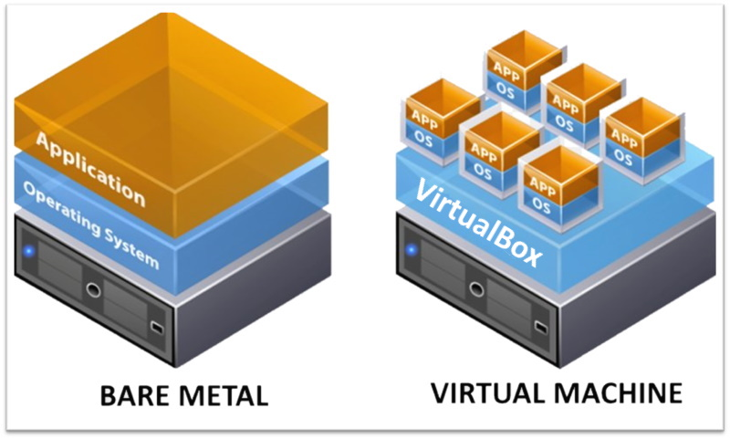

# Capítulo 4: Primeira aplicação no OCI

## 4.2 - Fundamentos do Serviço de Computação

### __Visão Geral__

O _[Serviço de Computação](https://docs.oracle.com/pt-br/iaas/Content/Compute/Concepts/computeoverview.htm)_ permite criar e gerenciar hosts de computação, conhecidos como **instâncias**. Uma _instância de computação_ deve obrigatóriamente ser criada e residir em um _"[Dominio de Disponibilidade (Availability Domains ou AD)](https://docs.oracle.com/pt-br/iaas/Content/General/Concepts/regions.htm#top)"_, e pode ser uma **_Máquina Virtual (VM ou Virtual Machine)_** ou uma **_Máquina Física (BM ou Bare Metal)_**. 

>_**__NOTA:__** Tecnicamente falando, uma instância de computação é criada sobre um "[Domínios de Falha (Fault Domains ou FD)](https://docs.oracle.com/pt-br/iaas/Content/General/Concepts/regions.htm#fault)"._

Uma instância _Bare Metal (BM)_ concede acesso a um servidor físico e dedicado, de altíssimo desempenho e sem um _[hipervisor](https://pt.wikipedia.org/wiki/Hipervisor)_. Neste modelo, além de não ser preciso compartilhar a máquina física, você tem acessos e controles exclusivos sobre a CPU, memória e placa de rede (NIC) da máquina. É como se fosse um hardware em execução no seu próprio data center, semelhante a uma ação de "_[colocation](https://pt.wikipedia.org/wiki/Colocation)_".

Já uma _Máquina Virtual (VM)_ é executada através de técnicas de _[virtualização](https://pt.wikipedia.org/wiki/Virtualiza%C3%A7%C3%A3o)_, que possibilita diferentes máquinas coexistirem, de forma isolada, sobre um hardware físico (um computador maior).

Um outro tipo de _instância de computação_ existente no OCI é o _[Dedicated Virtual Machine Host](https://docs.oracle.com/pt-br/iaas/Content/Compute/Concepts/dedicatedvmhosts.htm)_. Basicamente, este é um _Bare Metal_ dedicado ao seu uso, no qual você pode criar e executar máquinas virtuais (vm) sobre ele.

Utilizar uma _Máquina Virtual_ ou _Bare Metal_, seja de forma direta ou para criar máquinas virtuais sobre ele, vai depender muito da sua necessidade. Normalmente, utilizamos hardware dedicado e não sejam compartilhado com outros clientes (único tenant), quando há algum requisito de conformidade e isolamento a cumprir, que o impedem de usar uma infraestrutura compartilhada. Porém, o mais comum de ser visto, são as máquinas virtuais.