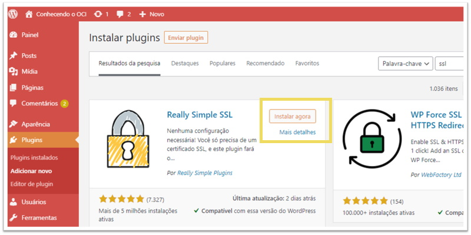
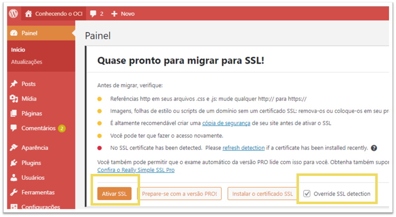

# Capítulo 4: Melhorias na aplicação Wordpress

## 4.2 - HTTPS via Let’s Encrypt

### __Visão Geral__

A comunicação segura pela _[web](https://pt.wikipedia.org/wiki/World_Wide_Web)_ depende do _[HTTPS](https://pt.wikipedia.org/wiki/Hyper_Text_Transfer_Protocol_Secure)_ que requer o uso de um _[certificado digital](https://pt.wikipedia.org/wiki/Certificado_digital)_. Este permite aos _[navegadores](https://pt.wikipedia.org/wiki/Navegador_web)_ verificar a identidade dos servidores da _[web](https://pt.wikipedia.org/wiki/World_Wide_Web)_. 

Uma _[Autoridade Certificadora (CA - Certification Authority)](https://pt.wikipedia.org/wiki/Autoridade_de_certifica%C3%A7%C3%A3o)_ é uma entidade responsável pela emissão dos _[certificados digitais](https://pt.wikipedia.org/wiki/Certificado_digital)_.

Já uma _[assinatura digital](https://pt.wikipedia.org/wiki/Assinatura_digital)_, contida em um _[certificado digital](https://pt.wikipedia.org/wiki/Certificado_digital)_, possui a mesma validade jurídica de um documento autenticado em cartório, por exemplo.

Visto isto, o único meio de um servidor existente na _[web](https://pt.wikipedia.org/wiki/World_Wide_Web)_ poder provar sua identidade, é através de um _[certificado digital](https://pt.wikipedia.org/wiki/Certificado_digital)_ que foi emitido por uma _[autoridade certificadora](https://pt.wikipedia.org/wiki/Autoridade_de_certifica%C3%A7%C3%A3o)_ confiável. Esta é uma forma de poder confiar em um site.

_[Let’s Encrypt](https://letsencrypt.org/pt-br/)_ é uma organização sem fins lucrativos cuja missão é criar uma web mais segura e que respeita a privacidade do usuário, promovendo a adoção em larga escala do _[HTTPS](https://pt.wikipedia.org/wiki/Hyper_Text_Transfer_Protocol_Secure)_.

Por ser uma _[autoridade certificadora](https://pt.wikipedia.org/wiki/Autoridade_de_certifica%C3%A7%C3%A3o)_ global, ela possibilita que pessoas e organizações do mundo todo obtenham, renovem e gerenciem _[certificados](https://pt.wikipedia.org/wiki/Certificado_digital)_ SSL/TLS de forma __gratuita__. Tais _[certificados](https://pt.wikipedia.org/wiki/Certificado_digital)_ podem ser usados por servidores da _[web](https://pt.wikipedia.org/wiki/World_Wide_Web)_ para habilitar conexões seguras através do protocolo _[HTTPS](https://pt.wikipedia.org/wiki/Hyper_Text_Transfer_Protocol_Secure)_.

É possível afirmar que qualquer site agora, pode adotar o _[HTTPS](https://pt.wikipedia.org/wiki/Hyper_Text_Transfer_Protocol_Secure)_ através do _[Let’s Encrypt](https://letsencrypt.org/pt-br/)_. Alem disto, todo navegador atual de hoje já _confia_ nos certificados emitidos pelo _[Let’s Encrypt](https://letsencrypt.org/pt-br/)_. 

>_**__NOTA:__** A [lista de compatibilidade](https://letsencrypt.org/pt-br/docs/certificate-compatibility/) pode ser acessada neste [link aqui](https://letsencrypt.org/pt-br/docs/certificate-compatibility/)._

Existem outras _[autoridades certificadoras](https://pt.wikipedia.org/wiki/Autoridade_de_certifica%C3%A7%C3%A3o)_ disponíveis como a _[VeriSign](https://pt.wikipedia.org/wiki/VeriSign)_, _[Certisign](https://pt.wikipedia.org/wiki/Certisign)_ ou _[DigiCert](https://en.wikipedia.org/wiki/DigiCert)_, por exemplo. Porém são pagas!

Vamos começar pela instalação da ferramenta _[Certbot](https://certbot.eff.org/)_ e seguiremos até a emissão de um certificado digital válido para usarmos na aplicação _[Wordpress](https://pt.wikipedia.org/wiki/WordPress)_.

### __A ferramenta Certbot__

O _[Certbot](https://certbot.eff.org/)_ é uma ferramenta executada em _modo cliente_ e usada para obter _[certificado digital](https://pt.wikipedia.org/wiki/Certificado_digital)_ do _[Let’s Encrypt](https://letsencrypt.org/pt-br/)_.

Existem diversas formas para se instalar o _[Certbot](https://certbot.eff.org/)_. Sugiro consultar a _[página oficial](https://certbot.eff.org/instructions)_ neste _[link](https://certbot.eff.org/instructions)_ para um guia passo a passo, dependendo da configuração que você possui. O requisito principal é possuir o _[python](https://pt.wikipedia.org/wiki/Python)_ e seu _gerenciador de pacotes_ _[pip](https://pt.wikipedia.org/wiki/Pip_(gerenciador_de_pacotes))_, instalados em seu sistema operacional.

No meu caso, irei realizar a instalação do _[Certbot](https://certbot.eff.org/)_ dentro de um _[ambiente virtual python (venv)](https://virtualenv.pypa.io/en/latest/)_ através do _[pip](https://pt.wikipedia.org/wiki/Pip_(gerenciador_de_pacotes))_.

```
darmbrust@hoodwink:~$ python3 -m venv certbot-venv
darmbrust@hoodwink:~$ source certbot-venv/bin/activate
```

Uma vez dentro deste _[ambiente virtual](https://virtualenv.pypa.io/en/latest/)_, é possível instalar o _[Certbot](https://certbot.eff.org/)_:

```
(certbot-venv) darmbrust@hoodwink:~$ pip install --upgrade pip
(certbot-venv) darmbrust@hoodwink:~$ pip install --no-build-isolation certbot
```

>_**__NOTA:__** A ferramenta [Certbot](https://certbot.eff.org/) exige que algumas dependências referentes as bibliotecas do sistema operacional sejam satisfeitas antes da sua instalação. No meu caso, tive que instalar os pacotes libffi-dev, python3-dev e openssl-dev para que tudo ocorresse bem. Consulte a [página oficial](https://certbot.eff.org/docs/install.html#system-requirements) para saber detalhes referente ao seu sistema operacional._

```
(certbot-venv) darmbrust@hoodwink:~$ deactivate
darmbrust@hoodwink:~$ sudo ln -sf ~/certbot-venv/bin/certbot /usr/bin/certbot
darmbrust@hoodwink:~$ sudo certbot --version
certbot 1.19.0
```

Como é possível ver, o _[Certbot](https://certbot.eff.org/)_ foi corretamente instalado.

### __Adquirindo um certificado via "DNS challenge"__

Uma das formas de se obter um _[certificado digital](https://pt.wikipedia.org/wiki/Certificado_digital)_ válido, emitido pelo _[Let’s Encrypt](https://letsencrypt.org/pt-br/)_, é através do chamado _"desafio DNS" (dns challenge)_. 

Para isto, você precisa demonstrar _controle_ sobre o seu _[domínio DNS](https://pt.wikipedia.org/wiki/Sistema_de_Nomes_de_Dom%C3%ADnio)_. Esta é uma das formas exigidas pelo _[Let’s Encrypt](https://letsencrypt.org/pt-br/)_ para que seja possível emitir seu certificado.

>_**__NOTA:__** Existe um outro tipo de "desafio" que é via "http". Consulte a [documentação](https://certbot.eff.org/docs/using.html#getting-certificates-and-choosing-plugins) do [Certbot](https://certbot.eff.org/) neste [link aqui](https://certbot.eff.org/docs/using.html#getting-certificates-and-choosing-plugins) para saber mais sobre._

Abaixo, o comando que especifica o _"desafio DNS"_ para o domínio _"wordpress.ocibook.com.br"_ no qual o certificado está sendo solicitado:

```
darmbrust@hoodwink:~$ sudo certbot certonly --manual --preferred-challenges dns -d wordpress.ocibook.com.br
Saving debug log to /var/log/letsencrypt/letsencrypt.log
Enter email address (used for urgent renewal and security notices)
 (Enter 'c' to cancel): daniel.armbrust@algumdominio.com

- - - - - - - - - - - - - - - - - - - - - - - - - - - - - - - - - - - - - - - -
Please read the Terms of Service at
https://letsencrypt.org/documents/LE-SA-v1.2-November-15-2017.pdf. You must
agree in order to register with the ACME server. Do you agree?
- - - - - - - - - - - - - - - - - - - - - - - - - - - - - - - - - - - - - - - -
(Y)es/(N)o: Y

- - - - - - - - - - - - - - - - - - - - - - - - - - - - - - - - - - - - - - - -
Would you be willing, once your first certificate is successfully issued, to
share your email address with the Electronic Frontier Foundation, a founding
partner of the Let's Encrypt project and the non-profit organization that
develops Certbot? We'd like to send you email about our work encrypting the web,
EFF news, campaigns, and ways to support digital freedom.
- - - - - - - - - - - - - - - - - - - - - - - - - - - - - - - - - - - - - - - -
(Y)es/(N)o: N
Account registered.
Requesting a certificate for wordpress.ocibook.com.br
```

A ferramenta _[Certbot](https://certbot.eff.org/)_ irá solicitar o seu _e-mail_ e alguns prompts de confirmação. É importante inserir um endereço de _e-mail_ válido para você saber sobre quando irá _expirar o seu certificado_ e qualquer outra notícia que envolve a segurança dele.

No decorrer da execução, a parte mais importante é quando for solicitado o registro _DNS TXT_:

```
- - - - - - - - - - - - - - - - - - - - - - - - - - - - - - - - - - - - - - - -
Please deploy a DNS TXT record under the name:

_acme-challenge.wordpress.ocibook.com.br.

with the following value:

prXuZGl7-O7ipqhjV0EiDe-87aFz8jTpWwO-FT9w62Q

Before continuing, verify the TXT record has been deployed. Depending on the DNS
provider, this may take some time, from a few seconds to multiple minutes. You can
check if it has finished deploying with aid of online tools, such as the Google
Admin Toolbox: https://toolbox.googleapps.com/apps/dig/#TXT/_acme-challenge.wordpress.ocibook.com.br.
Look for one or more bolded line(s) below the line ';ANSWER'. It should show the
value(s) you've just added.

- - - - - - - - - - - - - - - - - - - - - - - - - - - - - - - - - - - - - - - -
Press Enter to Continue
```

Aqui devemos inserir o registro _acme-challenge.wordpress.ocibook.com.br._  com o valor _prXuZGl7-O7ipqhjV0EiDe-87aFz8jTpWwO-FT9w62Q_, em nosso domínio. Só siga em frente _(Press Enter to Continue)_ após adição deste registro, caso contrário a emissão do certificado irá falhar. 

Para inserir este registro, usei o comando abaixo:

```
darmbrust@hoodwink:~$ oci dns record domain patch \
> --zone-name-or-id "ocibook.com.br" \
> --domain "_acme-challenge.wordpress.ocibook.com.br." \
> --scope "GLOBAL" \
> --items '[{"domain":"_acme-challenge.wordpress.ocibook.com.br.", "rdata": "prXuZGl7-O7ipqhjV0EiDe-87aFz8jTpWwO-FT9w62Q", "rtype": "TXT", "ttl": 300}]'
{
  "data": {
    "items": [
      {
        "domain": "_acme-challenge.wordpress.ocibook.com.br",
        "is-protected": false,
        "rdata": "\"prXuZGl7-O7ipqhjV0EiDe-87aFz8jTpWwO-FT9w62Q\"",
        "record-hash": "80bd8cd206cdbec5630e6dfb6c46df55",
        "rrset-version": "11",
        "rtype": "TXT",
        "ttl": 300
      }
    ]
  },
  "etag": "\"11ocid1.dns-zone.oc1..3b872f6da34a452ebd1c36678002acc3#application/json\"",
  "opc-total-items": "1"
}
```

Após inserção com sucesso, podemos continuar a execução do _[Certbot](https://certbot.eff.org/)_. Ele irá aferir se o registro solicitado foi inserido corretamente. Tudo estando certo, o certificado é emitido:

```
Successfully received certificate.
Certificate is saved at: /etc/letsencrypt/live/wordpress.ocibook.com.br/fullchain.pem
Key is saved at:         /etc/letsencrypt/live/wordpress.ocibook.com.br/privkey.pem
This certificate expires on 2021-12-28.
These files will be updated when the certificate renews.

NEXT STEPS:
- This certificate will not be renewed automatically. Autorenewal of --manual certificates requires the use of an authentication hook script (--manual-auth-hook) but one was not provided. To renew this certificate, repeat this same certbot command before the certificate's expiry date.

- - - - - - - - - - - - - - - - - - - - - - - - - - - - - - - - - - - - - - - -
If you like Certbot, please consider supporting our work by:
 * Donating to ISRG / Let's Encrypt:   https://letsencrypt.org/donate
 * Donating to EFF:                    https://eff.org/donate-le
- - - - - - - - - - - - - - - - - - - - - - - - - - - - - - - - - - - - - - - -
```

Todos os arquivos referentes ao certificado criado, foram salvos no diretório _/etc/letsencrypt/live/wordpress.ocibook.com.br_:

```
darmbrust@hoodwink:~$ sudo ls -1 /etc/letsencrypt/live/wordpress.ocibook.com.br/
cert.pem
chain.pem
fullchain.pem
privkey.pem
README
```

Como o registro _DNS TXT_ foi usado somente para mostrar _"controle"_ ao _[Let’s Encrypt](https://letsencrypt.org/pt-br/)_, este pode ser excluído após a emissão do certificado.

```
darmbrust@hoodwink:~$ oci dns record domain delete \
> --zone-name-or-id "ocibook.com.br" \
> --domain "_acme-challenge.wordpress.ocibook.com.br." \
> --force
```

### __Adicionando o certificado no Load Balancing__

Antes de seguir, quero mover os arquivos disponibilizados pela ferramenta _[Certbot](https://certbot.eff.org/)_ para um diretório de mais fácil acesso, sem a necessidade de usar _[sudo](https://pt.wikipedia.org/wiki/Sudo)_ pra lá e pra cá.

Por padrão, o diretório que armazena os _[certificados](https://pt.wikipedia.org/wiki/Certificado_digital)_ e a _[chave privada](https://pt.wikipedia.org/wiki/Criptografia_de_chave_p%C3%BAblica)_, são salvos em um diretório onde somente o usuário _root_ tem acesso. Isto é útil e protege os arquivos, pricipamente a _[chave privada](https://pt.wikipedia.org/wiki/Criptografia_de_chave_p%C3%BAblica)_. Lembrando que caso um terceiro consiga acesso a sua _[chave privada](https://pt.wikipedia.org/wiki/Criptografia_de_chave_p%C3%BAblica)_, ele pode ler o tréfego que foi criptografado através do _[HTTPS](https://pt.wikipedia.org/wiki/Hyper_Text_Transfer_Protocol_Secure)_, o que não é uma boa ideia.

```
darmbrust@hoodwink:~$ mkdir wordpress-crt
darmbrust@hoodwink:~$ sudo cp /etc/letsencrypt/live/wordpress.ocibook.com.br/cert.pem wordpress-crt/
darmbrust@hoodwink:~$ sudo cp /etc/letsencrypt/live/wordpress.ocibook.com.br/fullchain.pem wordpress-crt/
darmbrust@hoodwink:~$ sudo cp /etc/letsencrypt/live/wordpress.ocibook.com.br/privkey.pem wordpress-crt/
darmbrust@hoodwink:~$ sudo chown -R darmbrust: wordpress-crt/
```

Tendo os arquivos em um diretório de fácil acesso, podemos fazer _[upload](https://en.wikipedia.org/wiki/Upload)_ dos arquivos ao _[Load Balancer](https://docs.oracle.com/pt-br/iaas/Content/Balance/Concepts/balanceoverview.htm)_ do _[Wordpress](https://pt.wikipedia.org/wiki/WordPress)_ pelo comando abaixo:


```
darmbrust@hoodwink:~$ oci lb certificate create \
> --load-balancer-id "ocid1.loadbalancer.oc1.sa-saopaulo-1.aaaaaaaa5ledgzqveh3o73m3mnv42pkxcm5y64hjmkwl7tnhvsee2zv7gbga" \
> --certificate-name "wordpress_cert" \
> --ca-certificate-file ./wordpress-crt/fullchain.pem \
> --public-certificate-file ./wordpress-crt/cert.pem \
> --private-key-file ./wordpress-crt/privkey.pem \
> --wait-for-state "SUCCEEDED"
Action completed. Waiting until the work request has entered state: ('SUCCEEDED',)
{
  "data": {
    "compartment-id": "ocid1.compartment.oc1..aaaaaaaauvqvbbx3oridcm5d2ztxkftwr362u2vl5zdsayzbehzwbjs56soq",
    "error-details": [],
    "id": "ocid1.loadbalancerworkrequest.oc1.sa-saopaulo-1.aaaaaaaaesyaaacgrawf4wo4jdfdwy5msjd4eeu2jef753xoa6b7ph57zwsa",
    "lifecycle-state": "SUCCEEDED",
    "load-balancer-id": "ocid1.loadbalancer.oc1.sa-saopaulo-1.aaaaaaaa5ledgzqveh3o73m3mnv42pkxcm5y64hjmkwl7tnhvsee2zv7gbga",
    "message": "{\n  \"eventId\" : \"1442cec6-a134-40c7-9724-430bc7b9b8d4\",\n  \"loadBalancerId\" : \"ocid1.loadbalancer.oc1.sa-saopaulo-1.aaaaaaaa5ledgzqveh3o73m3mnv42pkxcm5y64hjmkwl7tnhvsee2zv7gbga\",\n  \"workflowName\" : \"AddCertificateWorkflow\",\n  \"type\" : \"SUCCESS\",\n  \"message\" : \"OK\",\n  \"workRequestId\" : \"ocid1.loadbalancerworkrequest.oc1.sa-saopaulo-1.aaaaaaaaesyaaacgrawf4wo4jdfdwy5msjd4eeu2jef753xoa6b7ph57zwsa\"\n}",
    "time-accepted": "2021-09-29T13:42:04.148000+00:00",
    "time-finished": "2021-09-29T13:42:23.966000+00:00",
    "type": "CreateCertificate"
  }
}
```

### __Criando um Listener HTTPS__

Criaremos um _listener_ na porta _443/TCP_ que faça uso da configuração dos certificados _(wordpress_cert)_:

```
darmbrust@hoodwink:~$ oci lb listener create \
> --load-balancer-id "ocid1.loadbalancer.oc1.sa-saopaulo-1.aaaaaaaa5ledgzqveh3o73m3mnv42pkxcm5y64hjmkwl7tnhvsee2zv7gbga" \
> --default-backend-set-name "lb-pub_wordpress_backend" \
> --name "lb-pub_https-lst_wordpress" \
> --port 443 \
> --protocol "HTTP" \
> --ssl-certificate-name "wordpress_cert" \
> --wait-for-state "SUCCEEDED"
Action completed. Waiting until the work request has entered state: ('SUCCEEDED',)
{
  "data": {
    "compartment-id": "ocid1.compartment.oc1..aaaaaaaauvqvbbx3oridcm5d2ztxkftwr362u2vl5zdsayzbehzwbjs56soq",
    "error-details": [],
    "id": "ocid1.loadbalancerworkrequest.oc1.sa-saopaulo-1.aaaaaaaaefy5i2cbug4qjsvnjh4omrvbxzq2sjg5h2yjx5sahfyjgpeack2a",
    "lifecycle-state": "SUCCEEDED",
    "load-balancer-id": "ocid1.loadbalancer.oc1.sa-saopaulo-1.aaaaaaaa5ledgzqveh3o73m3mnv42pkxcm5y64hjmkwl7tnhvsee2zv7gbga",
    "message": "{\n  \"eventId\" : \"f7a59f4c-c564-42d3-992c-ad42c92898de\",\n  \"loadBalancerId\" : \"ocid1.loadbalancer.oc1.sa-saopaulo-1.aaaaaaaa5ledgzqveh3o73m3mnv42pkxcm5y64hjmkwl7tnhvsee2zv7gbga\",\n  \"workflowName\" : \"AddListenerWorkflow\",\n  \"type\" : \"SUCCESS\",\n  \"message\" : \"OK\",\n  \"workRequestId\" : \"ocid1.loadbalancerworkrequest.oc1.sa-saopaulo-1.aaaaaaaaefy5i2cbug4qjsvnjh4omrvbxzq2sjg5h2yjx5sahfyjgpeack2a\"\n}",
    "time-accepted": "2021-09-29T15:32:50.888000+00:00",
    "time-finished": "2021-09-29T15:33:07.611000+00:00",
    "type": "CreateListener"
  }
}
```

Após isto, como boa prática, quero evitar qualquer tráfego inseguro na aplicação. Ou seja, irei instruir o _[Load Balancer](https://docs.oracle.com/pt-br/iaas/Content/Balance/Concepts/balanceoverview.htm)_ para _redicionar_ todo o tráfego _[HTTP](https://pt.wikipedia.org/wiki/Hypertext_Transfer_Protocol)_ para _[HTTPS](https://pt.wikipedia.org/wiki/Hyper_Text_Transfer_Protocol_Secure)_. Isto é feito através de _[regras de redirecionamento](https://docs.oracle.com/pt-br/iaas/Content/Balance/Tasks/managingrulesets.htm#URLRedirectRules)_ aplicadas diretamente no _listener_.

O comando abaixo cria uma _[regra de redirecionamento](https://docs.oracle.com/pt-br/iaas/Content/Balance/Tasks/managingrulesets.htm#URLRedirectRules)_:

```
darmbrust@hoodwink:~$ oci lb rule-set create \
> --load-balancer-id "ocid1.loadbalancer.oc1.sa-saopaulo-1.aaaaaaaa5ledgzqveh3o73m3mnv42pkxcm5y64hjmkwl7tnhvsee2zv7gbga" \
> --name "http_redirect_https" \
> --items '[{"action": "REDIRECT", "conditions": [{"attributeName": "PATH", "attributeValue": "/", "operator": "FORCE_LONGEST_PREFIX_MATCH"}], "redirectUri": {"host": "{host}", "path": "{path}", "port": 443, "protocol": "HTTPS", "query": "{query}"}, "responseCode": 301}]' \
> --wait-for-state "SUCCEEDED"
Action completed. Waiting until the work request has entered state: ('SUCCEEDED',)
{
  "data": {
    "compartment-id": "ocid1.compartment.oc1..aaaaaaaauvqvbbx3oridcm5d2ztxkftwr362u2vl5zdsayzbehzwbjs56soq",
    "error-details": [],
    "id": "ocid1.loadbalancerworkrequest.oc1.sa-saopaulo-1.aaaaaaaaxek7gombqos7dthumgw7qdrrmzkyd7fsiqcnyq4dw64oeud2kopq",
    "lifecycle-state": "SUCCEEDED",
    "load-balancer-id": "ocid1.loadbalancer.oc1.sa-saopaulo-1.aaaaaaaa5ledgzqveh3o73m3mnv42pkxcm5y64hjmkwl7tnhvsee2zv7gbga",
    "message": "{\n\"eventId\" : \"c55c284d-045b-4a66-a528-7af6e9d4e64c\",\n\"loadBalancerId\" : \"ocid1.loadbalancer.oc1.sa-saopaulo-1.aaaaaaaa5ledgzqveh3o73m3mnv42pkxcm5y64hjmkwl7tnhvsee2zv7gbga\",\n\"workflowName\" : \"AddRuleSetWorkflow\",\n\"type\" : \"SUCCESS\",\n\"message\" : \"OK\",\n\"workRequestId\" : \"ocid1.loadbalancerworkrequest.oc1.sa-saopaulo-1.aaaaaaaaxek7gombqos7dthumgw7qdrrmzkyd7fsiqcnyq4dw64oeud2kopq\"\n}",
    "time-accepted": "2021-09-29T18:10:15.396000+00:00",
    "time-finished": "2021-09-29T18:10:28.655000+00:00",
    "type": "CreateRuleSet"
  }
}
```

Basicamente, o valor contido no parâmetro _"--items"_ especifica uma ação de _redirecionamento (REDIRECT)_, que esteja de acordo com as condições contidas em _"conditions"_. Esta condição afirma que qualquer conteúdo após o "/", seja redirecionado para o mesmo _host ({host})_, usando a mesma _query ({query})_, porém na porta _443/TCP_. O código de resposta _[301](https://pt.wikipedia.org/wiki/HTTP_301)_ significa _["movido permanentemente"](https://pt.wikipedia.org/wiki/HTTP_301)_.

>_**__NOTA:__**  As [regras de redirecionamento](https://docs.oracle.com/pt-br/iaas/Content/Balance/Tasks/managingrulesets.htm#URLRedirectRules) de URL só se aplicam a listeners [HTTP](https://pt.wikipedia.org/wiki/Hypertext_Transfer_Protocol)._

Antes de aplicarmos a _[regra de redirecionamento](https://docs.oracle.com/pt-br/iaas/Content/Balance/Tasks/managingrulesets.htm#URLRedirectRules)_ que foi criada, vamos atualizar as configurações do _[Wordpress](https://pt.wikipedia.org/wiki/WordPress)_ para habilitar o _[HTTPS](https://pt.wikipedia.org/wiki/Hyper_Text_Transfer_Protocol_Secure)_.

Eu tive que instalar o _[plugin](https://docs.oracle.com/pt-br/iaas/Content/Compute/Tasks/manage-plugins.htm#available-plugins)_ _"Really Simple SSL"_ para que tudo pudesse funcionar. Isto pode ser feito diretamente pelo painel administrativo do _[Wordpress](https://pt.wikipedia.org/wiki/WordPress)_ através da _URL_ _"http://wordpress.ocibook.com.br/wp-admin/"_, ou por uma sessão do _[Bastion](https://docs.oracle.com/pt-br/iaas/Content/Bastion/Concepts/bastionoverview.htm)_ em uma das instâncias da aplicação: 





```
[opc@wordpress ~]$ sudo /usr/local/bin/wp plugin install --path=/var/www/html really-simple-ssl --activate
Installing Really Simple SSL (5.2.0)
Downloading installation package from https://downloads.wordpress.org/plugin/really-simple-ssl.5.2.0.zip...
Using cached file '/root/.wp-cli/cache/plugin/really-simple-ssl-5.2.0.zip'...
Unpacking the package...
Installing the plugin...
Plugin installed successfully.
Activating 'really-simple-ssl'...
Plugin 'really-simple-ssl' activated.
Success: Installed 1 of 1 plugins.
```

Como último detalhe, deve-se alterar o parâmetro _"siteurl"_ das configurações do _[Wordpress](https://pt.wikipedia.org/wiki/WordPress)_ para _"https://wordpress.ocibook.com.br"_, no qual especifica o uso do protocolo _"https"_:

```
[opc@wordpress ~]$ sudo /usr/local/bin/wp option update --path=/var/www/html siteurl 'https://wordpress.ocibook.com.br'
Success: Updated 'siteurl' option.
```

Como a instalação deste _[plugin](https://docs.oracle.com/pt-br/iaas/Content/Compute/Tasks/manage-plugins.htm#available-plugins)_ adicionou/alterou alguns arquivos da insância do _[Wordpress](https://pt.wikipedia.org/wiki/WordPress)_, devemos criar uma nova _[custom image](https://docs.oracle.com/pt-br/iaas/Content/Compute/Tasks/managingcustomimages.htm)_ além de atualizar o _backend-set_ do _[Load Balancer](https://docs.oracle.com/pt-br/iaas/Content/Balance/Concepts/balanceoverview.htm)_.

A nova _[custom image](https://docs.oracle.com/pt-br/iaas/Content/Compute/Tasks/managingcustomimages.htm)_ será criada no compartimento _"cmp-app"_ através do comando abaixo:

```
darmbrust@hoodwink:~$ oci compute image create \
> --compartment-id "ocid1.compartment.oc1..aaaaaaaamcff6exkhvp4aq3ubxib2wf74v7cx22b3yj56jnfkazoissdzefq" \
> --instance-id "ocid1.instance.oc1.sa-saopaulo-1.antxeljr6noke4qcric5qfuocpbpeuuydcbqdquokl6erikoxitmzsckmnra" \
> --display-name "ol7-wordpress-https_img" \
> --wait-for-state "AVAILABLE"
{
  "data": {
    "agent-features": null,
    "base-image-id": "ocid1.image.oc1.sa-saopaulo-1.aaaaaaaasahnls6nmev22raz7ecw6i64d65fu27pmqjn4pgz7zue56ojj7qq",
    "billable-size-in-gbs": 7,
    "compartment-id": "ocid1.compartment.oc1..aaaaaaaamcff6exkhvp4aq3ubxib2wf74v7cx22b3yj56jnfkazoissdzefq",
    "create-image-allowed": true,
    "defined-tags": {
      "Oracle-Tags": {
        "CreatedBy": "oracleidentitycloudservice/daniel.armbrust@algumdominio.com",
        "CreatedOn": "2021-12-16T12:09:43.560Z"
      }
    },
    "display-name": "ol7-wordpress-https_img",
    "freeform-tags": {},
    "id": "ocid1.image.oc1.sa-saopaulo-1.aaaaaaaamxolqusjbj4drwo5a4th7vbu6un5oryrerxklqiivu37hxg6t2ia",
    "launch-mode": "PARAVIRTUALIZED",
    "launch-options": {
      "boot-volume-type": "PARAVIRTUALIZED",
      "firmware": "UEFI_64",
      "is-consistent-volume-naming-enabled": true,
      "is-pv-encryption-in-transit-enabled": false,
      "network-type": "PARAVIRTUALIZED",
      "remote-data-volume-type": "PARAVIRTUALIZED"
    },
    "lifecycle-state": "AVAILABLE",
    "listing-type": null,
    "operating-system": "Oracle Linux",
    "operating-system-version": "7.9",
    "size-in-mbs": 102400,
    "time-created": "2021-12-16T12:09:43.885000+00:00"
  },
  "etag": "47fec493f3418f141b971860aa2000240175836c7400b8b5ac7ff6cccafa4821"
}
```

A antiga _[imagem](https://docs.oracle.com/pt-br/iaas/Content/Compute/Tasks/managingcustomimages.htm)_ pode ser excluída com o comando abaixo:

```
darmbrust@hoodwink:~$ oci compute image delete \
> --image-id "ocid1.image.oc1.sa-saopaulo-1.aaaaaaaacdmbrlmzub7p7rwddzfupslb7lx7dvh4insdcz4sw6bxre6ccgkq"
Are you sure you want to delete this resource? [y/N]: y
```

É possível remover a instância do _backend-set_ através do comando:

```
darmbrust@hoodwink:~$ oci lb backend delete \
> --load-balancer-id "ocid1.loadbalancer.oc1.sa-saopaulo-1.aaaaaaaa5ledgzqveh3o73m3mnv42pkxcm5y64hjmkwl7tnhvsee2zv7gbga" \
> --backend-set-name "lb-pub_wordpress_backend" \
> --backend-name "10.0.10.240:80"
Are you sure you want to delete this resource? [y/N]: y
```

Deve-se repetir o mesmo comando para a instância _[Wordpress](https://pt.wikipedia.org/wiki/WordPress)_ de backup, endereço IP _10.0.10.103_.

Os comandos para a criação de uma nova instância a partir de uma _[custom image](https://docs.oracle.com/pt-br/iaas/Content/Compute/Tasks/managingcustomimages.htm)_, além da adição dessas instâncias ao _backend-set_ no _[Load Balancer](https://docs.oracle.com/pt-br/iaas/Content/Balance/Concepts/balanceoverview.htm)_, sendo uma _ativa_ e outra _backup_, não serão repetidos aqui. Consulte os capítulos _"[3.6 - File Storage, DNS privado e Custom Image](https://github.com/daniel-armbrust/oci-book/blob/main/chapter-3/3-6_wordpress-fss-dnsp-customimg.md)"_ e _"[3.7 - Fundamentos do Serviço de Load Balancing](https://github.com/daniel-armbrust/oci-book/blob/main/chapter-3/3-7_fundamentos-load-balancing.md)"_, no qual contém essas instruções.

É possível verificar as novas instâncias com suporte _[HTTPS](https://pt.wikipedia.org/wiki/Hyper_Text_Transfer_Protocol_Secure)_ no _backend-set_:

```
darmbrust@hoodwink:~$ oci lb backend-set list \
> --load-balancer-id "ocid1.loadbalancer.oc1.sa-saopaulo-1.aaaaaaaa5ledgzqveh3o73m3mnv42pkxcm5y64hjmkwl7tnhvsee2zv7gbga" \
> --query "data[].backends"
[
  [
    {
      "backup": true,
      "drain": false,
      "ip-address": "10.0.10.97",
      "name": "10.0.10.97:80",
      "offline": false,
      "port": 80,
      "weight": 1
    },
    {
      "backup": false,
      "drain": false,
      "ip-address": "10.0.10.104",
      "name": "10.0.10.104:80",
      "offline": false,
      "port": 80,
      "weight": 1
    }
  ]
]
```

O último detalhe é aplicar a _[regra de redirecionamento](https://docs.oracle.com/pt-br/iaas/Content/Balance/Tasks/managingrulesets.htm#URLRedirectRules)_ que foi criada ao _listener_:

```
darmbrust@hoodwink:~$ oci lb listener update \
> --load-balancer-id "ocid1.loadbalancer.oc1.sa-saopaulo-1.aaaaaaaa5ledgzqveh3o73m3mnv42pkxcm5y64hjmkwl7tnhvsee2zv7gbga" \
> --default-backend-set-name "lb-pub_wordpress_backend" \
> --port 80 \
> --protocol "HTTP" \
> --listener-name "lb-pub_lst_wordpress" \
> --rule-set-names '["http_redirect_https"]' \
> --force \
> --wait-for-state "SUCCEEDED"
Action completed. Waiting until the work request has entered state: ('SUCCEEDED',)
{
  "data": {
    "compartment-id": "ocid1.compartment.oc1..aaaaaaaauvqvbbx3oridcm5d2ztxkftwr362u2vl5zdsayzbehzwbjs56soq",
    "error-details": [],
    "id": "ocid1.loadbalancerworkrequest.oc1.sa-saopaulo-1.aaaaaaaayykqiu4cpim52ggk42b6dxa7owruwevv2ulqhrarahjpl6tbtmpa",
    "lifecycle-state": "SUCCEEDED",
    "load-balancer-id": "ocid1.loadbalancer.oc1.sa-saopaulo-1.aaaaaaaa5ledgzqveh3o73m3mnv42pkxcm5y64hjmkwl7tnhvsee2zv7gbga",
    "message": "{\n\"eventId\" : \"36e897dc-2920-4ee9-b227-aa4025a9a73a\",\n\"loadBalancerId\" : \"ocid1.loadbalancer.oc1.sa-saopaulo-1.aaaaaaaa5ledgzqveh3o73m3mnv42pkxcm5y64hjmkwl7tnhvsee2zv7gbga\",\n\"workflowName\" : \"PutListenerWorkflow\",\n\"type\" : \"SUCCESS\",\n\"message\" : \"OK\",\n\"workRequestId\" : \"ocid1.loadbalancerworkrequest.oc1.sa-saopaulo-1.aaaaaaaayykqiu4cpim52ggk42b6dxa7owruwevv2ulqhrarahjpl6tbtmpa\"\n}",
    "time-accepted": "2021-09-29T18:22:55.727000+00:00",
    "time-finished": "2021-09-29T18:23:12.292000+00:00",
    "type": "UpdateListener"
  }
}
```

Pronto! Basta testar o acesso a aplicação e é possível ver o redirecionamento para _[HTTPS](https://pt.wikipedia.org/wiki/Hyper_Text_Transfer_Protocol_Secure)_:

```
darmbrust@hoodwink:~$ curl -v http://wordpress.ocibook.com.br
*   Trying 152.70.221.188:80...
* TCP_NODELAY set
* Connected to wordpress.ocibook.com.br (152.70.221.188) port 80 (#0)
> GET / HTTP/1.1
> Host: wordpress.ocibook.com.br
> User-Agent: curl/7.68.0
> Accept: */*
>
* Mark bundle as not supporting multiuse
< HTTP/1.1 301 Moved Permanently
< Date: Wed, 29 Sep 2021 22:46:08 GMT
< Content-Type: text/html
< Content-Length: 157
< Connection: keep-alive
< Location: HTTPS://wordpress.ocibook.com.br:443/
<
<html>
<head><title>301 Moved Permanently</title></head>
<body>
<center><h1>301 Moved Permanently</h1></center>
<hr><center></center>
</body>
</html>
* Connection #0 to host wordpress.ocibook.com.br left intact
```

### __Conclusão__

Vimos aqui que o _[Let’s Encrypt](https://letsencrypt.org/pt-br/)_ é uma forma rápida, fácil e gratuita para se obter um _[certificado digital](https://pt.wikipedia.org/wiki/Certificado_digital)_ váido. Agora, nossa aplicação permite conexão via _[HTTPS](https://pt.wikipedia.org/wiki/Hyper_Text_Transfer_Protocol_Secure)_.

Devo lembrar que todo _[certificado](https://pt.wikipedia.org/wiki/Certificado_digital)_ emitido pelo _[Let’s Encrypt](https://letsencrypt.org/pt-br/)_ possui uma validade de _[90 dias](https://letsencrypt.org/2015/11/09/why-90-days.html)_, como é possiver ver pelo comando abaixo:

```
darmbrust@hoodwink:~$ echo | openssl s_client -servername wordpress.ocibook.com.br -connect wordpress.ocibook.com.br:443 2>/dev/null | openssl x509 -noout -dates
notBefore=Sep 29 11:28:46 2021 GMT
notAfter=Dec 28 11:28:45 2021 GMT
```

Perto da data de expiração, através do e-mail que foi especificado, será emitido um aviso para renovação.

O _[Certbot](https://certbot.eff.org/)_ é usado também para renovar o _[certificado](https://pt.wikipedia.org/wiki/Certificado_digital)_. Iremos ver isto mais adiante.