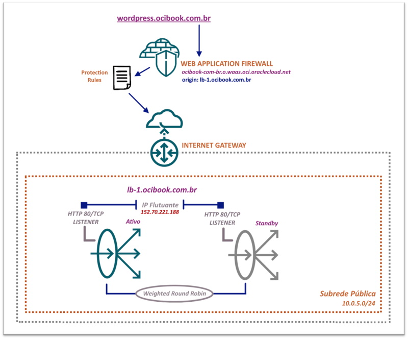

# Capítulo 4: Melhorias na aplicação Wordpress

## 4.3 - Adicionando segurança extra. Seja bem-vindo WAF!

### __Visão Geral__

O _[Serviço Web Application Firewall](https://docs.oracle.com/pt-br/iaas/Content/WAF/Concepts/overview.htm)_ ou _[WAF](https://docs.oracle.com/pt-br/iaas/Content/WAF/Concepts/overview.htm)_, é um serviço de segurança global, gerenciado pelo _[OCI](https://www.oracle.com/cloud/)_ e compatível com o padrão _[PCI (Payment Card Industry)](https://en.wikipedia.org/wiki/Payment_card_industry)_ que protege aplicativos do tráfego malicioso e indesejado existente na internet. Ele pode proteger qualquer aplicação exposta na internet e que faça uso dos protocolos _[HTTP](https://pt.wikipedia.org/wiki/Hypertext_Transfer_Protocol)_ e/ou _[HTTPS](https://pt.wikipedia.org/wiki/Hyper_Text_Transfer_Protocol_Secure)_.

Para você ter uma ideia, qualquer empresa que aceita pagamentos com cartão de crédito/débito, que processa ou armazena dados de cartões, precisa se preocupar em estar em conformidade com o _[PCI](https://en.wikipedia.org/wiki/Payment_card_industry)_. Para maiores informações, consulte este _[link aqui](https://pt.pcisecuritystandards.org/minisite/env2/)_.

Já falamos aqui sobre a _[Camada 7](https://pt.wikipedia.org/wiki/Camada_de_aplica%C3%A7%C3%A3o)_ e seus protocolos quando foi explicado sobre o serviço de _[Load Balancing](https://github.com/daniel-armbrust/oci-book/blob/main/chapter-3/3-5_fundamentos-load-balancing.md)_. Visto isto, dizemos então que o _[WAF](https://docs.oracle.com/pt-br/iaas/Content/WAF/Concepts/overview.htm)_ é um _["Firewall de Camada 7"](https://pt.wikipedia.org/wiki/Web_Application_Firewall)_ ou um _["Firewall de Aplicação"](https://pt.wikipedia.org/wiki/Web_Application_Firewall)_, pois ele ajuda a proteger aplicações web, filtrando e monitorando o tráfego _[HTTP](https://pt.wikipedia.org/wiki/Hypertext_Transfer_Protocol)_ e _[HTTPS](https://pt.wikipedia.org/wiki/Hyper_Text_Transfer_Protocol_Secure)_ usados por sua aplicação. 

Com a implementação do _[Serviço WAF](https://docs.oracle.com/pt-br/iaas/Content/WAF/Concepts/overview.htm)_ à frente de uma aplicação web, é possível impedir diversos ataques como _[cross-site request forgery](https://pt.wikipedia.org/wiki/Cross-site_request_forgery)_, _[cross-site scripting (XSS)](https://pt.wikipedia.org/wiki/Cross-site_scripting)_, _[file inclusion](https://en.wikipedia.org/wiki/File_inclusion_vulnerability)_, _[SQL injection](https://pt.wikipedia.org/wiki/Inje%C3%A7%C3%A3o_de_SQL)_ e outras vulnerabilidades definidas pelo _[OWASP](https://pt.wikipedia.org/wiki/OWASP)_ além de detectar, bloquear ou permitir tráfego vindo de _[bots](https://pt.wikipedia.org/wiki/Bot)_.

O _[OWASP (Open Web Application Security Project)](https://pt.wikipedia.org/wiki/OWASP)_ ou _Projeto Aberto de Segurança em Aplicações Web_, é uma fundação sem fins lucrativos dedicada a melhorar a segurança do software. Ele cria e disponibiliza de forma gratuita artigos, metodologias, documentação, ferramentas e tecnologias no campo da segurança para aplicações. 

Há também o _[OWASP Top 10](https://owasp.org/www-project-top-ten/)_ que é um documento online que fornece classificação e orientação de remediação, para os dez principais riscos de segurança em aplicações Web. Seu objetivo é oferecer aos desenvolvedores e profissionais de segurança, uma visão dos riscos de segurança mais prevalentes.

Vamos configurar o _[WAF](https://docs.oracle.com/pt-br/iaas/Content/WAF/Concepts/overview.htm)_ para o _[Wordpress](https://pt.wikipedia.org/wiki/WordPress)_.

### __Criando uma Política WAF__

O _[Serviço WAF](https://docs.oracle.com/pt-br/iaas/Content/WAF/Concepts/overview.htm)_ é um serviço já existente e disponível globalmente. Não há a necessidade de realizar o provisionamento da sua infraestrutura. 

Para começar a utilizá-lo, cria-se primeiramente uma _[Política WAF](https://docs.oracle.com/pt-br/iaas/Content/WAF/Tasks/managingwaf.htm)_ que basicamente incluí o nome do seu _[domínio DNS](https://pt.wikipedia.org/wiki/Sistema_de_Nomes_de_Dom%C3%ADnio) principal_, o _[servidor de origem](https://docs.oracle.com/pt-br/iaas/Content/WAF/Tasks/originmanagement.htm)_ no qual reside sua aplicação e que você quer proteger contra _[ciberataques](https://pt.wikipedia.org/wiki/Ciberataque)_, e uma ou mais _[regras de proteção](https://docs.oracle.com/pt-br/iaas/Content/WAF/Tasks/wafprotectionrules.htm)_ que podem permitir, bloquear ou registrar (detectar) ataques que correspondam a critérios especificados pelas regras.

Uma _[origem](https://docs.oracle.com/pt-br/iaas/Content/WAF/Tasks/originmanagement.htm)_ pode ser um endereço IP público de um _[balanceador de carga (LBaaS)](https://github.com/daniel-armbrust/oci-book/blob/main/chapter-3/3-5_fundamentos-load-balancing.md)_ ou qualquer outro _endpoint_ do aplicativo que será protegido pelo _[WAF](https://docs.oracle.com/pt-br/iaas/Content/WAF/Concepts/overview.htm)_.

A partir de um _[domínio DNS](https://pt.wikipedia.org/wiki/Sistema_de_Nomes_de_Dom%C3%ADnio) principal_, pode-se especificar um ou mais _subdomínios_ deste _[domínio](https://pt.wikipedia.org/wiki/Sistema_de_Nomes_de_Dom%C3%ADnio)_ para _proteção_. O nome do _[domínio](https://pt.wikipedia.org/wiki/Sistema_de_Nomes_de_Dom%C3%ADnio)_ deve ser diferente das _[origens](https://docs.oracle.com/pt-br/iaas/Content/WAF/Tasks/originmanagement.htm)_ especificadas, e uma _[origem](https://docs.oracle.com/pt-br/iaas/Content/WAF/Tasks/originmanagement.htm)_ deve ser definida para que se possa principalmente configurar as _[regras de proteção](https://docs.oracle.com/pt-br/iaas/Content/WAF/Tasks/wafprotectionrules.htm)_.

Lembrando que o _[Serviço WAF](https://docs.oracle.com/pt-br/iaas/Content/WAF/Concepts/overview.htm)_ só consegue _proteger_ aplicações que utilizem os protocolos _[HTTP](https://pt.wikipedia.org/wiki/Hypertext_Transfer_Protocol)_ e/ou _[HTTPS](https://pt.wikipedia.org/wiki/Hyper_Text_Transfer_Protocol_Secure)_, e é limitado por padrão a _50 políticas_ por tenant. É possível solicitar _[aumento](https://docs.oracle.com/pt-br/iaas/Content/General/Concepts/servicelimits.htm#Requesti)_ destes limites, caso necessário.

O nosso cenário para o _[Wordpress](https://pt.wikipedia.org/wiki/WordPress)_ seria este:



### __Adicionando o certificado no WAF__

Como o _[WAF](https://docs.oracle.com/pt-br/iaas/Content/WAF/Concepts/overview.htm)_ que iremos criar irá tratar conexões _[HTTPS](https://pt.wikipedia.org/wiki/Hyper_Text_Transfer_Protocol_Secure)_, aqui também é necessário fazer _[upload](https://en.wikipedia.org/wiki/Upload)_ dos arquivos de _[certificado](https://pt.wikipedia.org/wiki/Certificado_digital)_ e a _[chave privada](https://pt.wikipedia.org/wiki/Criptografia_de_chave_p%C3%BAblica)_.

Irei concatenar o arquivo que contém o _[certificado digital](https://pt.wikipedia.org/wiki/Certificado_digital)_ do domínio _"wordpress.ocibook.com.br"_ e os demais certificados intermediários, gerando um único arquivo: 

```
darmbrust@hoodwink:~$ cat ./wordpress-crt/cert.pem ./wordpress-crt/fullchain.pem > ./wordpress-crt/waas-cert.pem
```

O comando que cria uma entrada de certificado no _[WAF](https://docs.oracle.com/pt-br/iaas/Content/WAF/Concepts/overview.htm)_ espera receber o conteúdo em si do _[certificado](https://pt.wikipedia.org/wiki/Certificado_digital)_ ou _[chave privada](https://pt.wikipedia.org/wiki/Criptografia_de_chave_p%C3%BAblica)_. Não há como indicar o caminho de um arquivo para que a ferramenta faça _[upload](https://en.wikipedia.org/wiki/Upload)_ até o serviço. De qualquer forma, uma simples _"manobra"_ no _[shell](https://pt.wikipedia.org/wiki/Shell_do_Unix)_ garante a sintaxe esperada:

```
darmbrust@hoodwink:~$ oci waas certificate create \
> --compartment-id "ocid1.compartment.oc1..aaaaaaaauvqvbbx3oridcm5d2ztxkftwr362u2vl5zdsayzbehzwbjs56soq" \
> --certificate-data "$(cat ./wordpress-crt/waas-cert.pem)" \
> --private-key-data "$(cat ./wordpress-crt/privkey.pem)" \
> --display-name "wordpress_waf_cert"
```

Após criado, irei obter o seu OCID pois será necessário na criação da _[política](https://docs.oracle.com/pt-br/iaas/Content/WAF/Tasks/managingwaf.htm)_:

```
darmbrust@hoodwink:~$ oci waas certificate list \
> --compartment-id "ocid1.compartment.oc1..aaaaaaaauvqvbbx3oridcm5d2ztxkftwr362u2vl5zdsayzbehzwbjs56soq" \
> --all \
> --display-name "wordpress_waf_cert" \
> --query "data[].id"
[
  "ocid1.waascertificate.oc1..aaaaaaaadd3raczao5v2y7fyrbqa5fqnsaai3gpieaeo6hb6omtc2ksp4sda"
]
```

### __Criando uma Política WAF__

Por enquanto, temos somente a aplicação _[Wordpress](https://pt.wikipedia.org/wiki/WordPress)_ disponível e publicada pelo nome _"wordpress.ocibook.com.br"_. Irei criar uma _[política](https://docs.oracle.com/pt-br/iaas/Content/WAF/Tasks/managingwaf.htm)_ para proteger especificamente este nome. 

O comando abaixo também anexa o _[certificado](https://pt.wikipedia.org/wiki/Certificado_digital)_ através do seu _OCID_, além de ser instruído a redirecionar o tráfego _[HTTP](https://pt.wikipedia.org/wiki/Hypertext_Transfer_Protocol)_ para _[HTTPS](https://pt.wikipedia.org/wiki/Hyper_Text_Transfer_Protocol_Secure)_, através da opção _"isHttpsForced"_:

```
darmbrust@hoodwink:~$ oci waas waas-policy create \
> --compartment-id "ocid1.compartment.oc1..aaaaaaaauvqvbbx3oridcm5d2ztxkftwr362u2vl5zdsayzbehzwbjs56soq" \
> --display-name "waf-policy_ocibook-com-br" \
> --domain "ocibook.com.br" \
> --additional-domains '["wordpress.ocibook.com.br"]' \
> --origins '{"wordpress_origin":{"uri": "lb-1.ocibook.com.br", "httpPort": 80, "httpsPort": 443}}' \
> --waf-config '{"origin": "wordpress_origin"}' \
> --policy-config '{"certificateId": "ocid1.waascertificate.oc1..aaaaaaaadd3raczao5v2y7fyrbqa5fqnsaai3gpieaeo6hb6omtc2ksp4sda", "isHttpsEnabled": true, "isHttpsForced": true}'
{
  "etag": "W/\"2021-10-01T00:05:29.706Z\"",
  "opc-work-request-id": "ocid1.waasworkrequest.oc1..aaaaaaaay3qbg6a6wgl6rutw366vbcxbazjxk7dqdvgnuduafte6x46ozrva"
}
```

>_**__NOTA:__** O progresso de criação (work request) do [WAF](https://docs.oracle.com/pt-br/iaas/Content/WAF/Concepts/overview.htm) pode ser consultado pelo comando "oci waas work-request get --work-request-id \<id\>"._

Depois de alguns minutos, já é possível ver a _[política](https://docs.oracle.com/pt-br/iaas/Content/WAF/Tasks/managingwaf.htm)_ criada:

```
darmbrust@hoodwink:~$ oci waas waas-policy list \
> --compartment-id "ocid1.compartment.oc1..aaaaaaaauvqvbbx3oridcm5d2ztxkftwr362u2vl5zdsayzbehzwbjs56soq" \
> --display-name "waf-policy_ocibook-com-br"
{
  "data": [
    {
      "compartment-id": "ocid1.compartment.oc1..aaaaaaaauvqvbbx3oridcm5d2ztxkftwr362u2vl5zdsayzbehzwbjs56soq",
      "defined-tags": {
        "Oracle-Tags": {
          "CreatedBy": "oracleidentitycloudservice/daniel.armbrust@algumdominio.com",
          "CreatedOn": "2021-09-27T16:41:23.621Z"
        }
      },
      "display-name": "waf-policy_ocibook-com-br",
      "domain": "ocibook.com.br",
      "freeform-tags": null,
      "id": "ocid1.waaspolicy.oc1..aaaaaaaayymwxrhoqps3zpp4paiwjd7hyza2w7oyjzoyehndp34oa2cdwq6a",
      "lifecycle-state": "ACTIVE",
      "time-created": "2021-09-27T16:41:24.514000+00:00"
    }
  ]
}
```

### __Aplicando o WAF no Wordpress__

Há algumas etapas a cumprir antes de aplicarmos _proteção_ ao _[Wordpress](https://pt.wikipedia.org/wiki/WordPress)_.

Após a _[política WAF](https://docs.oracle.com/pt-br/iaas/Content/WAF/Tasks/managingwaf.htm)_ ser criada, será disponibilizado um _CNAME_ pelo serviço. Veja:

```
darmbrust@hoodwink:~$ oci waas waas-policy get \
> --waas-policy-id "ocid1.waaspolicy.oc1..aaaaaaaayymwxrhoqps3zpp4paiwjd7hyza2w7oyjzoyehndp34oa2cdwq6a" | grep cname | cut -f2 -d':' | tr -d '", '
ocibook-com-br.o.waas.oci.oraclecloud.net
```

Devo utilizar este _CNAME_ como valor para a _[resolução](https://en.wikipedia.org/wiki/Domain_Name_System#DNS_resolvers)_ do nome _"wordpress.ocibook.com.br"_, que criamos no capítulo passado. 

Sabemos que até agora, toda vez que um usuário for acessar a aplicação, o nome _"wordpress.ocibook.com.br"_ é _[resolvido](https://en.wikipedia.org/wiki/Domain_Name_System#DNS_resolvers)_ pelo _[DNS](https://pt.wikipedia.org/wiki/Sistema_de_Nomes_de_Dom%C3%ADnio)_ para o nome _"lb-1.ocibook.com.br"_, que por sua vez _[resolve](https://en.wikipedia.org/wiki/Domain_Name_System#DNS_resolvers)_ para o endereço IP do _[balancedor de carga](https://docs.oracle.com/pt-br/iaas/Content/Balance/Concepts/balanceoverview.htm)_ _152.70.221.188_.

Para aplicarmos _proteção_ através do _[WAF](https://docs.oracle.com/pt-br/iaas/Content/WAF/Concepts/overview.htm)_, o nome _"wordpress.ocibook.com.br"_ deve _[resolver](https://en.wikipedia.org/wiki/Domain_Name_System#DNS_resolvers)_ para o _CNAME "ocibook-com-br.o.waas.oci.oraclecloud.net"_ que foi disponibilizado. Assim garantimos que o tráfego da aplicação passe pela infraestrutura do _[WAF](https://docs.oracle.com/pt-br/iaas/Content/WAF/Concepts/overview.htm)_.

Começarei ajustando o parâmetro _[keep-alive](https://en.wikipedia.org/wiki/Keepalive)_ do _[Load Balancer](https://docs.oracle.com/pt-br/iaas/Content/Balance/Concepts/balanceoverview.htm)_. 

O _[WAF](https://docs.oracle.com/pt-br/iaas/Content/WAF/Concepts/overview.htm)_ requer que os timeouts de _[keep-alive](https://en.wikipedia.org/wiki/Keepalive)_ da sua origem _[(balancedor de carga)](https://docs.oracle.com/pt-br/iaas/Content/Balance/Concepts/balanceoverview.htm)_ sejam mantidos por _301 segundos ou mais_. Existe o valor interno de _100 segundos de timeout (que não é alterável)_ no _[WAF](https://docs.oracle.com/pt-br/iaas/Content/WAF/Concepts/overview.htm)_. Este elimina a conexão se a origem não enviar nenhum _[keep-alive](https://en.wikipedia.org/wiki/Keepalive)_, afirmando que a origem ainda está trabalhando em uma resposta.

Os comandos abaixo irão alterar o timeout para _305 segundos_ de ambos os _listeners_ que temos no _[Load Balancer](https://docs.oracle.com/pt-br/iaas/Content/Balance/Concepts/balanceoverview.htm)_. Durante esses _305 segundos_, mensagens de _[keep-alive](https://en.wikipedia.org/wiki/Keepalive)_ são enviadas ao _[WAF](https://docs.oracle.com/pt-br/iaas/Content/WAF/Concepts/overview.htm)_ para manter a conexão aberta.

- _Listener HTTP_

```
darmbrust@hoodwink:~$ oci lb listener update \
> --load-balancer-id "ocid1.loadbalancer.oc1.sa-saopaulo-1.aaaaaaaa5ledgzqveh3o73m3mnv42pkxcm5y64hjmkwl7tnhvsee2zv7gbga" \
> --default-backend-set-name "lb-pub_wordpress_backend" \
> --port 80 \
> --protocol "HTTP" \
> --listener-name "lb-pub_lst_wordpress" \
> --rule-set-names '["http_redirect_https"]' \
> --connection-configuration-idle-timeout 305 \
> --force
```

- _Listener HTTPS_

```
darmbrust@hoodwink:~$ oci lb listener update \
> --load-balancer-id "ocid1.loadbalancer.oc1.sa-saopaulo-1.aaaaaaaa5ledgzqveh3o73m3mnv42pkxcm5y64hjmkwl7tnhvsee2zv7gbga" \
> --default-backend-set-name "lb-pub_wordpress_backend" \
> --port 443 \
> --protocol "HTTP" \
> --ssl-certificate-name "wordpress_cert" \
> --listener-name "lb-pub_https-lst_wordpress" \
> --connection-configuration-idle-timeout 305 \
> --force
```

Logo após, irei excluír o registro _"wordpress.ocibook.com.br"_ do _DNS_:

```
darmbrust@hoodwink:~$ oci dns record domain delete \
> --zone-name-or-id "ocibook.com.br" \
> --domain "wordpress.ocibook.com.br"
Are you sure you want to delete this resource? [y/N]: y
```

Feito isto, irei inserir um novo registro apontando para o _CNAME_ que foi disponibilizado pelo _[WAF](https://docs.oracle.com/pt-br/iaas/Content/WAF/Concepts/overview.htm)_:

```
darmbrust@hoodwink:~$ oci dns record domain patch \
> --zone-name-or-id "ocibook.com.br" \
> --domain "wordpress.ocibook.com.br" \
> --scope "GLOBAL" \
> --items '[{"domain":"wordpress.ocibook.com.br", "rdata": "ocibook-com-br.o.waas.oci.oraclecloud.net", "rtype": "CNAME", "ttl": 3600}]'
{
  "data": {
    "items": [
      {
        "domain": "wordpress.ocibook.com.br",
        "is-protected": false,
        "rdata": "ocibook-com-br.o.waas.oci.oraclecloud.net.",
        "record-hash": "bf36492cdef44548e5548a5c03e2dd92",
        "rrset-version": "10",
        "rtype": "CNAME",
        "ttl": 3600
      }
    ]
  },
  "etag": "\"10ocid1.dns-zone.oc1..3b872f6da34a452ebd1c36678002acc3#application/json\"",
  "opc-total-items": "1"
}
```

Após esta alteração, é possível verificar que o nome _"wordpress.ocibook.com.br"_ já resolve para o _CNAME_ do _[WAF](https://docs.oracle.com/pt-br/iaas/Content/WAF/Concepts/overview.htm)_:

```
darmbrust@hoodwink:~$ nslookup wordpress.ocibook.com.br
Server:         192.168.88.1
Address:        192.168.88.1#53

Non-authoritative answer:
wordpress.ocibook.com.br        canonical name = ocibook-com-br.o.waas.oci.oraclecloud.net.
ocibook-com-br.o.waas.oci.oraclecloud.net       canonical name = tm.inregion.waas.oci.oraclecloud.net.
tm.inregion.waas.oci.oraclecloud.net    canonical name = sa-brazil.inregion.waas.oci.oraclecloud.net.
Name:   sa-brazil.inregion.waas.oci.oraclecloud.net
Address: 192.29.143.64
Name:   sa-brazil.inregion.waas.oci.oraclecloud.net
Address: 192.29.139.253
Name:   sa-brazil.inregion.waas.oci.oraclecloud.net
Address: 192.29.139.68
```

### __Restringindo o acesso somente pelas redes do WAF__

Este é um detalhe importante!

Como o _[WAF](https://docs.oracle.com/pt-br/iaas/Content/WAF/Concepts/overview.htm)_ está em uma infraestrutura externa do _[Load Balancer](https://docs.oracle.com/pt-br/iaas/Content/Balance/Concepts/balanceoverview.htm)_, ou seja, em uma camada acima, é necessário permitir tráfego de rede ao _[Load Balancer](https://docs.oracle.com/pt-br/iaas/Content/Balance/Concepts/balanceoverview.htm)_ somente a partir das redes do _[Serviço WAF](https://docs.oracle.com/pt-br/iaas/Content/WAF/Concepts/overview.htm)_.

O comando abaixo exibe as redes que _"abrigam"_ o _[Serviço WAF](https://docs.oracle.com/pt-br/iaas/Content/WAF/Concepts/overview.htm)_:

```
darmbrust@hoodwink:~$ oci waas edge-subnet list --query 'data[].cidr'
[
  "138.1.112.0/20",
  "192.29.140.0/22",
  "130.35.228.0/22",
  "129.148.156.0/22",
  "192.157.18.0/24",
  "192.157.19.0/24",
  "205.147.88.0/21",
  "192.69.118.0/23",
  "198.181.48.0/21",
  "199.195.6.0/23"
]
WARNING: This operation supports pagination and not all resources were returned.  Re-run using the --all option to auto paginate and list all resources.
```

>_**__NOTA:__** Utilize a opção --all ao comando acima para exibir todas as redes. Foi poupado espaço por aqui._

Para liberarmos este tráfego de forma assertiva, primeiramente irei excluír todas as regras que temos na _[security list](https://docs.oracle.com/en-us/iaas/api/#/en/iaas/20160918/datatypes/IngressSecurityRule)_ pública, onde está o _[Load Balancer](https://docs.oracle.com/pt-br/iaas/Content/Balance/Concepts/balanceoverview.htm)_.

Antes, irei obter o correto OCID desta _[Security List](https://docs.oracle.com/pt-br/iaas/Content/Network/Concepts/securitylists.htm)_:

```
darmbrust@hoodwink:~$ oci network security-list list \
> --compartment-id "ocid1.compartment.oc1..aaaaaaaauvqvbbx3oridcm5d2ztxkftwr362u2vl5zdsayzbehzwbjs56soq" \
> --display-name "secl-1_subnpub_vcn-prd" \
> --query 'data[].id'
[
  "ocid1.securitylist.oc1.sa-saopaulo-1.aaaaaaaaggezvwdk66j5xq7fesq27z3xohmwsu4bluf7m2rrr7taa6fmdwxq"
]
```

Agora irei excluír todas as regras do _INGRESS_:

```
darmbrust@hoodwink:~$ oci network security-list update \
> --security-list-id "ocid1.securitylist.oc1.sa-saopaulo-1.aaaaaaaaggezvwdk66j5xq7fesq27z3xohmwsu4bluf7m2rrr7taa6fmdwxq" \
> --ingress-security-rules '[]' \
> --force
```

As redes do _[WAF](https://docs.oracle.com/pt-br/iaas/Content/WAF/Concepts/overview.htm)_ ficarão todas em uma _[NSG](https://docs.oracle.com/pt-br/iaas/Content/Network/Concepts/networksecuritygroups.htm)_ específica. Para isto, criarei uma com o comando abaixo:

```
darmbrust@hoodwink:~$ oci network nsg create \
> --compartment-id "ocid1.compartment.oc1..aaaaaaaauvqvbbx3oridcm5d2ztxkftwr362u2vl5zdsayzbehzwbjs56soq" \
> --vcn-id "ocid1.vcn.oc1.sa-saopaulo-1.amaaaaaahcglxkaabicl4jiikcavz2h2nvazibxp4rdiwziqsce4h5wksz2a" \
> --display-name "nsg_waf-1_lb-pub_wordpress" \
> --wait-for-state "AVAILABLE"
Action completed. Waiting until the resource has entered state: ('AVAILABLE',)
{
  "data": {
    "compartment-id": "ocid1.compartment.oc1..aaaaaaaauvqvbbx3oridcm5d2ztxkftwr362u2vl5zdsayzbehzwbjs56soq",
    "defined-tags": {
      "Oracle-Tags": {
        "CreatedBy": "oracleidentitycloudservice/daniel.armbrust@algumdominio.com",
        "CreatedOn": "2021-10-01T23:47:26.899Z"
      }
    },
    "display-name": "nsg_waf-1_lb-pub_wordpress",
    "freeform-tags": {},
    "id": "ocid1.networksecuritygroup.oc1.sa-saopaulo-1.aaaaaaaas4r3j6pxxxvc3locdp7zff7l5tlbvtbdlijkbxqdpcq4pqpbkvra",
    "lifecycle-state": "AVAILABLE",
    "time-created": "2021-10-01T23:47:27.006000+00:00",
    "vcn-id": "ocid1.vcn.oc1.sa-saopaulo-1.amaaaaaahcglxkaabicl4jiikcavz2h2nvazibxp4rdiwziqsce4h5wksz2a"
  },
  "etag": "6c0c7a00"
}
```

Através de uma pequena automação no shell, será adicionado no _[NSG](https://docs.oracle.com/pt-br/iaas/Content/Network/Concepts/networksecuritygroups.htm)_ as redes do _[WAF](https://docs.oracle.com/pt-br/iaas/Content/WAF/Concepts/overview.htm)_:

```
darmbrust@hoodwink:~$ oci waas edge-subnet list --all --query 'data[].cidr | join(`\n`,@)' --raw-output | while read waf_cidr; do
> oci network nsg rules add \
>    --nsg-id "ocid1.networksecuritygroup.oc1.sa-saopaulo-1.aaaaaaaap3vor4bdetltlvovsscr5c56z2zn3kffq45ug73gghc3ixlg63va" \
>    --security-rules "[{\"isStateless\": false, \"protocol\": \"6\", \"direction\": \"INGRESS\", \"sourceType\": \"CIDR_BLOCK\", \"source\": \"$waf_cidr\"}]"
> done
```

Para finalizar, irei aplicar a _[NSG](https://docs.oracle.com/pt-br/iaas/Content/Network/Concepts/networksecuritygroups.htm)_ ao _[Load Balancer](https://docs.oracle.com/pt-br/iaas/Content/Balance/Concepts/balanceoverview.htm)_:

```
darmbrust@hoodwink:~$ oci lb nsg update \
> --load-balancer-id "ocid1.loadbalancer.oc1.sa-saopaulo-1.aaaaaaaa5ledgzqveh3o73m3mnv42pkxcm5y64hjmkwl7tnhvsee2zv7gbga" \
> --nsg-ids '["ocid1.networksecuritygroup.oc1.sa-saopaulo-1.aaaaaaaas4r3j6pxxxvc3locdp7zff7l5tlbvtbdlijkbxqdpcq4pqpbkvra"]' \
> --force \
> --wait-for-state "SUCCEEDED"
```

Isto garante novamente o acesso ao _[Wordpress](https://pt.wikipedia.org/wiki/WordPress)_, porém agora através do _[WAF](https://docs.oracle.com/pt-br/iaas/Content/WAF/Concepts/overview.htm)_:

```
darmbrust@hoodwink:~$ curl -s -D - -o /dev/null https://wordpress.ocibook.com.br
HTTP/2 200
content-type: text/html; charset=UTF-8
server: ZENEDGE
link: <https://wordpress.ocibook.com.br/index.php?rest_route=/>; rel="https://api.w.org/"
date: Sat, 02 Oct 2021 16:13:56 GMT
x-cache-status: NOTCACHED
x-powered-by: PHP/7.4.23
x-zen-fury: 845507b40742a0d56f1580416ae0c53f25d40678
x-cdn: Served-By-Zenedge
```

>_**__NOTA:__** Perceba que o cabeçalho "server" possui o valor [ZENEDGE](https://www.oracle.com/corporate/acquisitions/zenedge/). Esta é uma empresa que possui soluções voltadas a segurança, incluindo soluções de [WAF](https://www.oracle.com/security/cloud-security/web-application-firewall/). Digo isto, pois este cabeçalho comprova que o trafego agora passa pela infraestrutura do [WAF](https://docs.oracle.com/pt-br/iaas/Content/WAF/Concepts/overview.htm). Para mais informações, consulte o [link](https://www.oracle.com/corporate/acquisitions/zenedge/)._

### __Gerenciando as Regras de Proteção__

O _[Serviço WAF](https://docs.oracle.com/pt-br/iaas/Content/WAF/Concepts/overview.htm)_ vem equipado com várias _[regras de proteção](https://docs.oracle.com/pt-br/iaas/Content/WAF/Tasks/wafprotectionrules.htm)_. Estas protegem sua aplicação Web contra diferentes _tipos de ataques_.

Além das _[regras de proteção](https://docs.oracle.com/pt-br/iaas/Content/WAF/Tasks/wafprotectionrules.htm)_ que o serviço possui, você pode criar suas próprias _[regras personalizadas](https://docs.oracle.com/pt-br/iaas/Content/WAF/Tasks/customprotectionrules.htm)_.

Uma _[regra de proteção](https://docs.oracle.com/pt-br/iaas/Content/WAF/Tasks/wafprotectionrules.htm)_, caso combine com os dados contidos no _HTTP/S_, pode ser configurada para tomar uma das ações abaixo:

- __Permitir (OFF)__: 
    - A regra está inativa e não há ação a tomar.
        
- __Bloquear (BLOCK)__
    - O tráfego será bloqueado e não irá para a aplicação.
    
- __Detectar (DETECT)__: 
    - Será registrado em log apenas.

É recomendado sempre optar primeiramente pela ação de _detectar_ antes de _bloquear_. Isto evita _bloquear indevidamente_ qualquer tráfego legítimo. 

Apesar de já existirem _[diferentes regras](https://docs.oracle.com/pt-br/iaas/Content/WAF/Reference/protectionruleids.htm)_ testadas contra diferentes _tipos de ataques_, uma determinada aplicação pode gerar determinado tipo de conteúdo no qual o _[WAF](https://docs.oracle.com/pt-br/iaas/Content/WAF/Concepts/overview.htm)_ pode entender como um _ataque_. Isto depende muito de como a aplicação espera receber os dados ou como ela gera os dados.

Lembre-se, o protocolo _[HTTP](https://pt.wikipedia.org/wiki/Hypertext_Transfer_Protocol)_ é um protocolo que faz troca de mensagens, que nada mais são do que _[strings](https://pt.wikipedia.org/wiki/Cadeia_de_caracteres)_. Operar sobre essas _[strings](https://pt.wikipedia.org/wiki/Cadeia_de_caracteres)_ é complexo e pode levar ao chamado _["falso positivo"](https://pt.wikipedia.org/wiki/Falso_positivo)_. Por isso, teste antes!

O intuíto aqui é mostrar como habilitar as regras no _[WAF](https://docs.oracle.com/pt-br/iaas/Content/WAF/Concepts/overview.htm)_. Como já foi dito, há um grande número de regras já disponíveis e que podem ser consultadas neste _[link aqui](https://docs.oracle.com/pt-br/iaas/Content/WAF/Reference/protectionruleids.htm)_. 

A partir das regras que temos a disposição, irei escolher uma e demonstrar sua ação na prática. Veja o comando abaixo que exibe uma determinada regra que protege contra ataques do tipo _[Cross-site Scripting (XSS)](https://pt.wikipedia.org/wiki/Cross-site_scripting)_:

```
darmbrust@hoodwink:~$ oci waas protection-rule list \
> --waas-policy-id "ocid1.waaspolicy.oc1..aaaaaaaayymwxrhoqps3zpp4paiwjd7hyza2w7oyjzoyehndp34oa2cdwq6a" \
> --all \
> --query "data[?key=='941110']"
[
  {
    "action": "OFF",
    "description": "Cross-Site Scripting (XSS) Attempt: XSS Filters - Category 1. Script tag based XSS vectors, e.g., <script> alert(1)</script>",
    "exclusions": [],
    "key": "941110",
    "labels": [
      "OWASP",
      "OWASP-2017",
      "CRS3",
      "WASCTC",
      "PCI",
      "HTTP",
      "A3",
      "A3-2017",
      "XSS",
      "Cross-Site Scripting"
    ],
    "mod-security-rule-ids": [
      "941110"
    ],
    "name": "Cross-Site Scripting (XSS) Attempt: XSS Filters - Category 1"
  }
]
```

>_**__NOTA:__** O valor "941140" que identifica a regra foi obtido deste [site aqui](https://docs.oracle.com/pt-br/iaas/Content/WAF/Reference/protectionruleids.htm)_.

Irei inserir um treço de código _[JavaScript](https://pt.wikipedia.org/wiki/JavaScript)_ em uma requisição feita ao _[Wordpress](https://pt.wikipedia.org/wiki/WordPress)_ pelo comando abaixo:

```
darmbrust@hoodwink:~$ curl -o /dev/null -s -w "%{http_code}\n" 'https://wordpress.ocibook.com.br/?id=<script>alert("TESTE");</script>'
200
```

Perceba que a aplicação retornou o código _[HTTP 200](https://pt.wikipedia.org/wiki/Lista_de_c%C3%B3digos_de_estado_HTTP#2xx_Sucesso)_ que indica _Sucesso_. Ou seja, a requisição foi recebida, compreendida, aceita e processada com êxito.

Para que a regra entre em vigor, deve-se mudar a ação de _OFF_ para _BLOCK_ ou _DETECT_. Para o nosso exemplo, irei de _BLOCK_:

```
darmbrust@hoodwink:~$ oci waas protection-rule update \
> --waas-policy-id "ocid1.waaspolicy.oc1..aaaaaaaayymwxrhoqps3zpp4paiwjd7hyza2w7oyjzoyehndp34oa2cdwq6a" \
> --protection-rules '[{"action": "BLOCK", "key": "941110"}]'
```

Após alterarmos a ação o serviço entra em _modo de atualização (Updating)_ para publicar a alteração solicitada. Isto pode demorar um pouco, mas não há em momento algum nenhuma indisponibilidade na aplicação.

Ao habilitar a regra de número _"941110"_ no qual protege contra ataques deste tipo, o _[WAF](https://docs.oracle.com/pt-br/iaas/Content/WAF/Concepts/overview.htm)_ agora irá bloquear este tipo de requisição:

```
darmbrust@hoodwink:~$ curl -o /dev/null -s -w "%{http_code}\n" 'https://wordpress.ocibook.com.br?id=<script>alert("TESTE");</script>'
403
```

Agora é o _[WAF](https://docs.oracle.com/pt-br/iaas/Content/WAF/Concepts/overview.htm)_ quem retorna o código _[HTTP 403](https://pt.wikipedia.org/wiki/Lista_de_c%C3%B3digos_de_estado_HTTP#403_Proibido)_ que indica _Proibido (Forbidden)_. A requisição foi reconhecida porém o servidor recusa-se a executá-lo. Ou seja, foi bloqueado no _[WAF](https://docs.oracle.com/pt-br/iaas/Content/WAF/Concepts/overview.htm)_.

>_**__NOTA:__** A lista dos códigos de resposta usados pelo HTTP pode ser consultado neste [link aqui](https://pt.wikipedia.org/wiki/Lista_de_c%C3%B3digos_de_estado_HTTP)._

É possível verificar nos _[logs](https://docs.oracle.com/pt-br/iaas/Content/WAF/Tasks/logs.htm)_ do _[WAF](https://docs.oracle.com/pt-br/iaas/Content/WAF/Concepts/overview.htm)_ se houve bloqueio ou não de determinada regra. Pelo comando abaixo, estou exibindo somente as requisições no qual houve correspondência com a regra _"941110"_ que foi aplicada como _BLOCK_:

```
darmbrust@hoodwink:~$ oci waas waf-log list \
> --waas-policy-id "ocid1.waaspolicy.oc1..aaaaaaaayymwxrhoqps3zpp4paiwjd7hyza2w7oyjzoyehndp34oa2cdwq6a" \
> --protection-rule-key "941110" \
> --all
{
  "data": [
    {
      "access-rule-key": null,
      "action": "BLOCK",
      "address-rate-limiting-key": null,
      "captcha-action": null,
      "captcha-expected": null,
      "captcha-fail-count": "0",
      "captcha-received": null,
      "client-address": "201.33.196.77",
      "country-code": "BR",
      "country-name": "Brazil",
      "device": null,
      "domain": "wordpress.ocibook.com.br",
      "fingerprint": null,
      "http-headers": {
        "Accept": "*/*",
        "Host": "wordpress.ocibook.com.br",
        "Request-Id": "2021-10-04T11:27:19Z|da8fcf186b|201.33.196.77|ovOqLkPxQ8",
        "User-Agent": "curl/7.68.0",
        "X-Client-Ip": "201.33.196.77",
        "X-Country-Code": "BR",
        "X-Forwarded-For": "201.33.196.77",
        "Zen-Host": "ZENEDGE"
      },
      "http-method": "GET",
      "incident-key": "2021-10-04T11:27:19Z|da8fcf186b|201.33.196.77|ovOqLkPxQ8",
      "log-type": "PROTECTION_RULES",
      "origin-address": null,
      "origin-response-time": null,
      "protection-rule-detections": {
        "941110": {
          "Message": "Pattern match \"(?i)([<\\xef\\xbc\\x9c]script[^>\\xef\\xbc\\x9e]*[>\\xef\\xbc\\x9e][\\\\s\\\\S]*?)\" at ARGS:id.",
          "Message details": "Matched Data: <script> found within ARGS:id: <script>alert(\\x22TESTE\\x22);</script>"
        }
      },
      "referrer": null,
      "request-headers": null,
      "request-url": "/?id=<script>alert(\"TESTE\");</script>",
      "response-code": null,
      "response-size": null,
      "threat-feed-key": null,
      "timestamp": "2021-10-04T11:27:19+00:00",
      "user-agent": "curl/7.68.0"
    }
  ]
}
```

Antes de fecharmos o capítulo, que mostrar mais uma opção que o _[WAF](https://docs.oracle.com/pt-br/iaas/Content/WAF/Concepts/overview.htm)_ disponibiliza. As _[regras de proteção recomendadas](https://docs.oracle.com/pt-br/iaas/Content/WAF/Tasks/wafprotectionrules.htm)_. Estas começarão a aparecer quando uma quantidade de tráfego suficiente  já estiver passado pelo _[WAF](https://docs.oracle.com/pt-br/iaas/Content/WAF/Concepts/overview.htm)_.

Essas _regras recomendadas_ podem ser consultadas com o comando abaixo:

```
darmbrust@hoodwink:~$ oci waas recommendation list \
> --waas-policy-id "ocid1.waaspolicy.oc1..aaaaaaaayymwxrhoqps3zpp4paiwjd7hyza2w7oyjzoyehndp34oa2cdwq6a" \
> --query "data[].{key:key,name:name,\"recommended-action\":\"recommended-action\"}" \
> --output table
+----------+---------------------------------------------------------------------------------+--------------------+
| key      | name                                                                            | recommended-action |
+----------+---------------------------------------------------------------------------------+--------------------+
| 920320   | Missing User-Agent header                                                       | DETECT             |
| 920300   | Missing Accept Header                                                           | DETECT             |
| 920390   | Limit arguments total length                                                    | DETECT             |
| 920370   | Limit argument value length                                                     | DETECT             |
| 920380   | Number of Arguments Limits                                                      | DETECT             |
| 94114032 | Cross-Site Scripting (XSS) Attempt: XSS Filters - Category 4                    | DETECT             |
| 93012032 | Local File Inclusion (LFI) - OS File Access                                     | DETECT             |
| 9330000  | PHP Injection Attacks Collaborative Group - PHP Filters Categories              | DETECT             |
| 9320000  | Remote Code Execution (RCE) Collaborative Group - Unix RCE Filter Categories    | DETECT             |
| 9320001  | Remote Code Execution (RCE) Collaborative Group - Windows RCE Filter Categories | DETECT             |
+----------+---------------------------------------------------------------------------------+--------------------+
opc-next-page: 2
etag: W/"2021-10-04T11:56:09.195Z"
WARNING: This operation supports pagination and not all resources were returned.  Re-run using the --all option to auto paginate and list all resources.
```

>_**__NOTA:__** A saída do comando acima foi limitada para poupar espaço. Se deseja ver a lista completa de recomendações, utilize a opção --all._

Perceba que o próprio _[WAF](https://docs.oracle.com/pt-br/iaas/Content/WAF/Concepts/overview.htm)_ sugere o _modo DETECT_, com o intuito de prevalescer os testes antes do bloqueio.

Irei aplicar as recomendações. Através de uma _"manobra"_ no _[shell](https://pt.wikipedia.org/wiki/Shell_do_Unix)_, irei gerar um arquivo no qual contém todos os IDs de todas as regras recomendadas:

```
darmbrust@hoodwink:~$ oci waas recommendation list \
> --waas-policy-id "ocid1.waaspolicy.oc1..aaaaaaaayymwxrhoqps3zpp4paiwjd7hyza2w7oyjzoyehndp34oa2cdwq6a" \
> --all \
> --query 'data[].key | join(`\n`,@)' --raw-output | while read rule_key; do
> echo \"$rule_key\", >> /tmp/waf-recommendation-list.json 
> done
```

Arquivo criado, irei ajustar alguns caracteres para formar um vetor dentro das especificações do _[JSON](https://pt.wikipedia.org/wiki/JSON)_:

```
darmbrust@hoodwink:~$ sed -i '1 i [' /tmp/waf-recommendation-list.json
darmbrust@hoodwink:~$ echo ']' >> /tmp/waf-recommendation-list.json
darmbrust@hoodwink:~$ sed -i 'x;${s/,$//;p;x;};1d' /tmp/waf-recommendation-list.json
```

Agora basta aplicar as recomendações com o comando abaixo:

```
darmbrust@hoodwink:~$ oci waas recommendation accept \
> --waas-policy-id "ocid1.waaspolicy.oc1..aaaaaaaayymwxrhoqps3zpp4paiwjd7hyza2w7oyjzoyehndp34oa2cdwq6a" \
> --protection-rule-keys "$(cat /tmp/waf-recommendation-list.json)"
{
  "opc-work-request-id": "ocid1.waasworkrequest.oc1..aaaaaaaasoqyhxhfaakkdduprnm6ydyvzvk3o2n4z653x36fjucm2uqswx3a"
}
```

Pronto! _[WAF](https://docs.oracle.com/pt-br/iaas/Content/WAF/Concepts/overview.htm)_ já em _modo de atualização (Updating)_ para teremos as regras recomendadas aplicadas.
