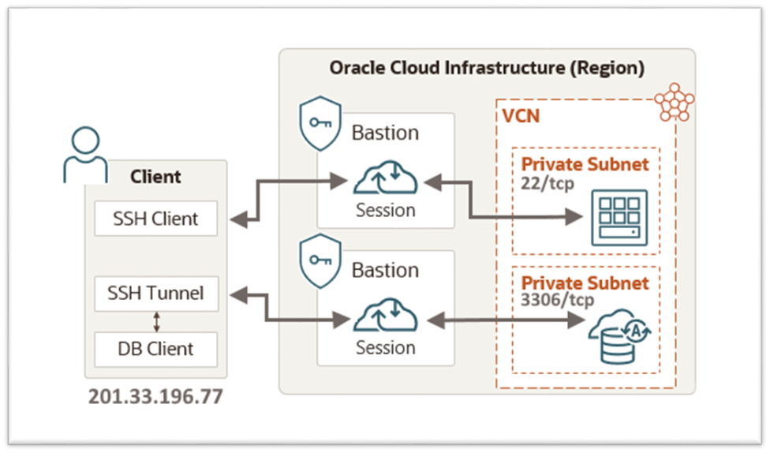

# Capítulo 4: Primeira aplicação no OCI

## 4.3 - Apresentando o Serviço Bastion

### __Visão Geral__

O _[Serviço Bastion](https://docs.oracle.com/pt-br/iaas/Content/Bastion/Concepts/bastionoverview.htm)_ do OCI permite você acessar de forma segura, através de sessões _[SSH](https://pt.wikipedia.org/wiki/Secure_Shell)_ e por tempo limitado, os recursos da sua infraestrutura que não possuem endereço IP público. Ele é um meio rápido e simples de implementar um acesso seguro, até seus recursos privados. Um Bastion é uma entidade lógica, gerenciada pela Oracle que ao ser provisionado, ele cria a infraestrutura de rede necessária para se conectar aos recursos existentes em uma subrede.

Através do _[Bastion](https://docs.oracle.com/pt-br/iaas/Content/Bastion/Concepts/bastionoverview.htm)_ você pode acessar seus recursos sem a necessidade de ter um _["jump server"](https://pt.wikipedia.org/wiki/Jump_server)_ na rede. Este pode ser usado a vontade, de acordo com os _[limites](https://docs.oracle.com/pt-br/iaas/Content/General/Concepts/servicelimits.htm)_ disponíveis no seu _[tenancy](https://docs.oracle.com/pt-br/iaas/Content/Identity/Tasks/managingtenancy.htm)_, além de não gerar custos extras. É um serviço gratuito.

_[OCI Bastion](https://docs.oracle.com/pt-br/iaas/Content/Bastion/Concepts/bastionoverview.htm)_ se integra ao _[IAM (Identity and Access Management)](https://docs.oracle.com/pt-br/iaas/Content/Identity/Concepts/overview.htm)_ e permite que você controle quem pode acessar o serviço ou uma sessão, e o que pode ser feito com esses recursos. 

Por hora, iremos utilizar o _[Serviço Bastion](https://docs.oracle.com/pt-br/iaas/Content/Bastion/Concepts/bastionoverview.htm)_, para concluír algumas tarefas necessárias diretamente no servidor que irá hospedar a aplicação _[Wordpress](https://pt.wikipedia.org/wiki/WordPress)_.



>_**__NOTA:__** Como você verá, um Bastion deve ser criado e "atrelado" a uma única subrede. A partir disto, ele só consegue prover acesso aos recursos desta subrede em específico. Para acesso através de um Bastion ao MySQL do desenho acima, um segundo Bastion foi criado e atrelado a sua subrede._

Para termos êxito no acesso a instância privada da aplicação _[Wordpress](https://pt.wikipedia.org/wiki/WordPress)_, iremos seguir o "passo a passo" abaixo:

- Habilitar o _[plugin Bastion](https://docs.oracle.com/pt-br/iaas/Content/Compute/Tasks/manage-plugins.htm)_ através do _[Oracle Cloud Agent (OCA)](https://docs.oracle.com/pt-br/iaas/Content/Compute/Tasks/manage-plugins.htm)_ em execução na instância _[Wordpress](https://pt.wikipedia.org/wiki/WordPress)_.
- Criar um _[Bastion](https://docs.oracle.com/pt-br/iaas/Content/Bastion/Concepts/bastionoverview.htm)_ em nosso _[tenancy](https://docs.oracle.com/pt-br/iaas/Content/Identity/Tasks/managingtenancy.htm)_ que será usado exclusivamente pela subrede privada que hospeda a instância do _[Wordpress](https://pt.wikipedia.org/wiki/WordPress)_.
- Criar uma _[Sessão SSH](https://docs.oracle.com/pt-br/iaas/Content/Bastion/Concepts/bastionoverview.htm#session_types)_ que possibilita conectividade _[SSH](https://pt.wikipedia.org/wiki/Secure_Shell)_ a partir da _máquina cliente (201.33.196.77)_ a instância do _[Wordpress](https://pt.wikipedia.org/wiki/WordPress)_.
- Estabelecer uma _conexão SSH_ a partir do _host cliente_, usando o _[Bastion](https://docs.oracle.com/pt-br/iaas/Content/Bastion/Concepts/bastionoverview.htm)_ criado até  a instância de destino da aplicação _[Wordpress](https://pt.wikipedia.org/wiki/WordPress)_.

### __Plugin Bastion do Oracle Cloud Agent (OCA)__

O _[Oracle Cloud Agent (OCA)](https://docs.oracle.com/pt-br/iaas/Content/Compute/Tasks/manage-plugins.htm)_ é um processo que vem instalado nas _[imagens de plataforma](https://docs.oracle.com/pt-br/iaas/Content/Compute/References/images.htm#OracleProvided_Images)_ e sua principal função está no gerenciamento de diversos _[plugins](https://docs.oracle.com/pt-br/iaas/Content/Compute/Tasks/manage-plugins.htm#available-plugins)_. Estes coletam métricas de desempenho, instalam atualizações do sistema operacional, verificam vulnerabilidades de segurança, entre outras tarefas na instância de computação.

Um dos _[plugins](https://docs.oracle.com/pt-br/iaas/Content/Compute/Tasks/manage-plugins.htm#available-plugins)_ disponíveis no _[Oracle Cloud Agent (OCA)](https://docs.oracle.com/pt-br/iaas/Content/Compute/Tasks/manage-plugins.htm)_ é o _[plugin](https://docs.oracle.com/pt-br/iaas/Content/Compute/Tasks/manage-plugins.htm#available-plugins)_ _**Bastion**_ que irá permitir conexões _[SSH (Secure Shell)](https://pt.wikipedia.org/wiki/Secure_Shell)_ a partir do _[Serviço Bastion](https://docs.oracle.com/pt-br/iaas/Content/Bastion/Concepts/bastionoverview.htm)_. Este vem desabilitado por padrão e precisa ser ativado antes de criarmos a sessão _[SSH](https://pt.wikipedia.org/wiki/Secure_Shell)_ até a instância.

>_**__NOTA:__** Os [plugins](https://docs.oracle.com/pt-br/iaas/Content/Compute/Tasks/manage-plugins.htm#available-plugins) do [OCA](https://docs.oracle.com/pt-br/iaas/Content/Compute/Tasks/manage-plugins.htm) disponíveis hoje podem ser consultados neste [link aqui](https://docs.oracle.com/pt-br/iaas/Content/Compute/Tasks/manage-plugins.htm#available-plugins)._

Para listarmos todos os _[plugins](https://docs.oracle.com/pt-br/iaas/Content/Compute/Tasks/manage-plugins.htm#available-plugins)_ em execução na instância, usamos o comando abaixo:

```
darmbrust@hoodwink:~$ oci instance-agent plugin list \
> --compartment-id "ocid1.compartment.oc1..aaaaaaaamcff6exkhvp4aq3ubxib2wf74v7cx22b3yj56jnfkazoissdzefq" \
> --instanceagent-id "ocid1.instance.oc1.sa-saopaulo-1.antxeljr6noke4qcf4yilvaofwpt5aiavnsx7cfev3fhp2bpc3xfcxo5k6zq" \
> --output table
+------------------------------+---------+----------------------------------+
| name                         | status  | time-last-updated-utc            |
+------------------------------+---------+----------------------------------+
| Custom Logs Monitoring       | RUNNING | 2021-09-09T18:17:11.772000+00:00 |
| Compute Instance Run Command | RUNNING | 2021-09-09T18:17:11.771000+00:00 |
| OS Management Service Agent  | RUNNING | 2021-09-09T18:17:11.770000+00:00 |
| Vulnerability Scanning       | STOPPED | 2021-09-09T18:17:11.769000+00:00 |
| Management Agent             | STOPPED | 2021-09-09T18:17:11.768000+00:00 |
| Block Volume Management      | STOPPED | 2021-09-09T18:17:11.768000+00:00 |
| Compute Instance Monitoring  | RUNNING | 2021-09-09T18:17:11.766000+00:00 |
| Bastion                      | STOPPED | 2021-09-09T18:17:11.762000+00:00 |
+------------------------------+---------+----------------------------------+
```

Perceba que o _[plugin](https://docs.oracle.com/pt-br/iaas/Content/Compute/Tasks/manage-plugins.htm#available-plugins)_ _**Bastion**_ não está em execução. Iremos ativá-lo com o comando abaixo:

```
darmbrust@hoodwink:~$ oci compute instance update \
> --instance-id "ocid1.instance.oc1.sa-saopaulo-1.antxeljr6noke4qcf4yilvaofwpt5aiavnsx7cfev3fhp2bpc3xfcxo5k6zq" \
> --agent-config '{"pluginsConfig": [{"name": "Bastion", "desiredState": "ENABLED"}]}'
WARNING: Updates to defined-tags and freeform-tags and agent-config and metadata and extended-metadata and shape-config and instance-options and launch-options and availability-config will replace any existing values. Are you sure you want to continue? [y/N]: y
```

Depois de alguns minutos e após confirmarmos as alteração no _[OCA](https://docs.oracle.com/pt-br/iaas/Content/Compute/Tasks/manage-plugins.htm)_ da instância, podemos ver que o _[plugin](https://docs.oracle.com/pt-br/iaas/Content/Compute/Tasks/manage-plugins.htm#available-plugins)_ _**Bastion**_ está ativo e em execução:

```
darmbrust@hoodwink:~$ oci instance-agent plugin list \
> --compartment-id "ocid1.compartment.oc1..aaaaaaaamcff6exkhvp4aq3ubxib2wf74v7cx22b3yj56jnfkazoissdzefq" \
> --instanceagent-id "ocid1.instance.oc1.sa-saopaulo-1.antxeljr6noke4qcf4yilvaofwpt5aiavnsx7cfev3fhp2bpc3xfcxo5k6zq" \
> --name "Bastion"
{
  "data": [
    {
      "name": "Bastion",
      "status": "RUNNING",
      "time-last-updated-utc": "2021-09-09T18:26:14.737000+00:00"
    }
  ]
}
```

>_**__NOTA:__** O _[Oracle Cloud Agent (OCA)](https://docs.oracle.com/pt-br/iaas/Content/Compute/Tasks/manage-plugins.htm)_ é um processo "auto gerênciável". Você informa um "estado desejado para o plugin" e ele se encarrega de ativá-lo. Além disto, se sua instância puder acessar a internet, o [OCA](https://docs.oracle.com/pt-br/iaas/Content/Compute/Tasks/manage-plugins.htm) verifica periodicamente se há versões mais recentes e o atualiza_. 


### __Criando um Bastion__

Antes de criarmos nosso _[Bastion](https://docs.oracle.com/pt-br/iaas/Content/Bastion/Concepts/bastionoverview.htm)_ precisamos de algumas informações. A primeira delas é o endereço IP público da máquina onde estou. Existem inumeras maneiras de se obter esta informação. Porém, como tudo aqui é via linha de comando, estou usando um site externo cuja finalidade é retornar o seu endereço IP público.

Basta eu enviar um _[GET](https://pt.wikipedia.org/wiki/Hypertext_Transfer_Protocol#GET)_ através do comando _[curl](https://pt.wikipedia.org/wiki/CURL)_, que eu consigo saber meu endereço IP público:

```
darmbrust@hoodwink:~$ curl icanhazip.com
201.33.196.77
```

>_**__NOTA:__** Existem outros sites no qual você pode usar como o [ifconfig.me](https://ifconfig.me/), [api.ipify.org](https://api.ipify.org/) ou [ipinfo.io/ip](https://ipinfo.io/ip) que exibem qual é o seu endereço IP público. Consulte este [link](https://linuxconfig.org/how-to-use-curl-to-get-public-ip-address) para mais detalhes._

A próxima informação é saber qual é o OCID da subrede que o _[Serviço Bastion](https://docs.oracle.com/pt-br/iaas/Content/Bastion/Concepts/bastionoverview.htm)_ permitirá _[sessões SSH](https://docs.oracle.com/pt-br/iaas/Content/Bastion/Tasks/managingsessions.htm)_ através ele. Em nosso caso, iremos "anexar" o _[Bastion](https://docs.oracle.com/pt-br/iaas/Content/Bastion/Concepts/bastionoverview.htm)_ na subrede privada que hospeda nossa instância da aplicação _[Wordpress](https://pt.wikipedia.org/wiki/WordPress)_.

Para obter o OCID desta subrede, usamos o comando abaixo:

```
darmbrust@hoodwink:~$ oci network subnet list \
> --compartment-id "ocid1.compartment.oc1..aaaaaaaauvqvbbx3oridcm5d2ztxkftwr362u2vl5zdsayzbehzwbjs56soq" \
> --query "data[?\"display-name\"=='subnprv-app_vcn-prd'].id"
[
  "ocid1.subnet.oc1.sa-saopaulo-1.aaaaaaaajb4wma763mz6uowun3pfeltobe4fmiegdeyma5ehvnf3kzy3jvxa"
]
```


```
darmbrust@hoodwink:~$ oci bastion bastion create \
> --compartment-id "ocid1.compartment.oc1..aaaaaaaauvqvbbx3oridcm5d2ztxkftwr362u2vl5zdsayzbehzwbjs56soq" \
> --bastion-type "standard" \
> --target-subnet-id "ocid1.subnet.oc1.sa-saopaulo-1.aaaaaaaajb4wma763mz6uowun3pfeltobe4fmiegdeyma5ehvnf3kzy3jvxa" \
> --client-cidr-list '["201.33.196.77/32"]' \
> --name "BastionSubnprvAppVcnPrd" \
> --wait-for-state "SUCCEEDED"
Action completed. Waiting until the work request has entered state: ('SUCCEEDED',)
{
  "data": {
    "compartment-id": "ocid1.compartment.oc1..aaaaaaaauvqvbbx3oridcm5d2ztxkftwr362u2vl5zdsayzbehzwbjs56soq",
    "id": "ocid1.bastionworkrequest.oc1.sa-saopaulo-1.amaaaaaa6noke4qavrtnbcuoycdjrmpm2su4j6zqoapftx6ikuvhhdxxdzua",
    "operation-type": "CREATE_BASTION",
    "percent-complete": 100.0,
    "resources": [
      {
        "action-type": "CREATED",
        "entity-type": "BastionsResource",
        "entity-uri": "/bastions/ocid1.bastion.oc1.sa-saopaulo-1.amaaaaaa6noke4qa6bh45omx4mgtcrvs5tan5zoepknyj5bz37h3gs6whxbq",
        "identifier": "ocid1.bastion.oc1.sa-saopaulo-1.amaaaaaa6noke4qa6bh45omx4mgtcrvs5tan5zoepknyj5bz37h3gs6whxbq"
      }
    ],
    "status": "SUCCEEDED",
    "time-accepted": "2021-09-09T23:43:33.234000+00:00",
    "time-finished": "2021-09-09T23:44:16.380000+00:00",
    "time-started": "2021-09-09T23:43:42.172000+00:00"
  }
}
```