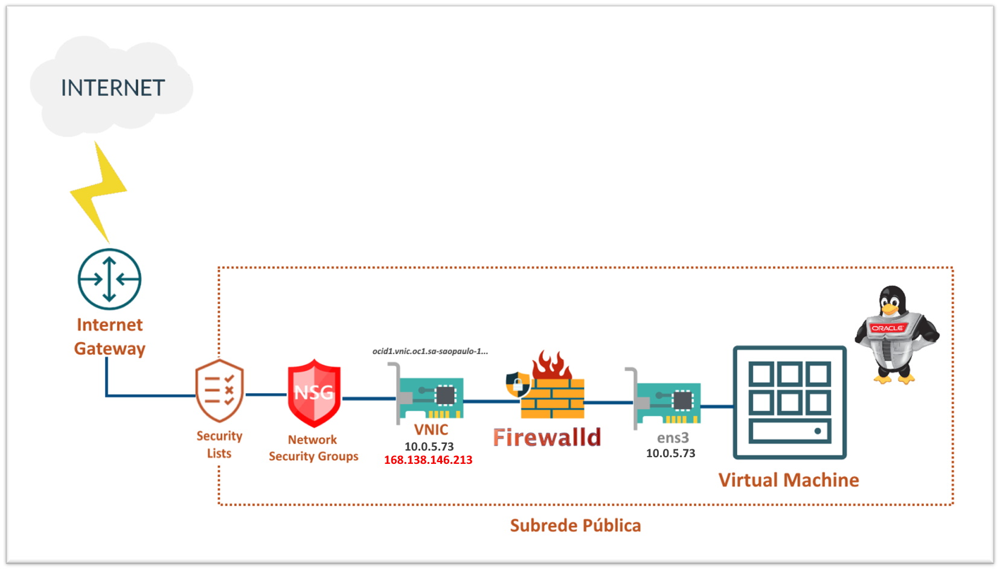

# Capítulo 4: Primeira aplicação no OCI

## 4.4 - Oracle Linux com WordPress na nuvem

### __Introdução__

Neste capítulo quero descrever um pouco mais sobre o _[serviço de computação](https://github.com/daniel-armbrust/oci-book/blob/main/chapter-4/4-2_fundamentos-computacao.md)_, instâncias de computação com _[Oracle Linux](https://www.oracle.com/linux/)_, e suas boas práticas no _[OCI](https://www.oracle.com/cloud/)_. Por fim, faremos a instalação da aplicação _[Wordpress](https://pt.wikipedia.org/wiki/WordPress)_ em nossa instância.

Embora você tenha _"controle total"_ da sua instância, recomendamos uma variedade de boas práticas para garantir a disponibilidade e máximo desempenho.

>_**__NOTA:__** "Controle total" em cloud significa "Responsabilidade Compartilhada". Consulte sobre ["Modelo de responsabilidade compartilhada"](https://github.com/daniel-armbrust/oci-book/blob/main/chapter-1/1-1_intro-cloud-computing.md) para saber mais._


### __Oracle Linux__

Este não é um capítulo que documenta o _[Oracle Linux](https://www.oracle.com/linux/)_. Até por que, existem diversos livros sobre o tema e uma extensa documentação disponível na internet pela própria Oracle. Vou deixar o link de cada versão mais usada hoje em dia. Consulte quando precisar saber de detalhes mais específicos sobre a versão do sistema operacional que está usando.

- [Oracle Linux 8](https://docs.oracle.com/en/operating-systems/oracle-linux/8/)
- [Oracle Linux 7](https://docs.oracle.com/en/operating-systems/oracle-linux/7/)
- [Oracle Linux 6](https://docs.oracle.com/en/operating-systems/oracle-linux/6/)

Porém, vou destacar pontos importantes. Começando por suas vantagens de utilização no _[OCI](https://www.oracle.com/cloud/)_:

- Contas criadas no _[OCI](https://www.oracle.com/cloud/)_ já incluem o _[Oracle Linux Premier Support](https://www.oracle.com/linux/support.html)_ sem custo adicional.
- Gerenciamento de pacotes e patches automatizados através do _[Serviço OS Management](https://docs.oracle.com/pt-br/iaas/os-management/osms/index.htm)_, que mantêm seus sistemas seguros e confiáveis. 
- Acesso a atualizações, últimas correções de bugs, erratas de segurança, etc.
- Ferramenta _[Ksplice](https://docs.oracle.com/pt-br/iaas/Content/Compute/Tasks/installingconfiguringksplice.htm)_ pré-instalada em imagens do _[OCI](https://www.oracle.com/cloud/)_, no qual possibilita aplicar atualizações de segurança importantes e críticas do kernel sem a necessidade de reboot (zero-downtime).
- 100% binário compatível com Red Hat Enterprise Linux.

>_**__NOTA:__** O documento que descreve todas essas vantagens e outras em mais detalhes, pode ser consultado neste [link aqui](https://www.oracle.com/a/ocom/docs/linux-for-cloud-infrastructure-4024517.pdf)._

Vamos seguir agora para o entendimento sobre os **firewalls** que temos até que o tráfego chegue em uma instância de computação. Por um momento, vamos tomar outro exemplo. Imagine que criamos uma nova instância em nossa subrede pública (10.0.5.0/24), também com _[Oracle Linux](https://www.oracle.com/linux/)_. Esta instância, além do seu endereço IP privado 10.0.5.73, atribuímos um IP público 168.138.146.213.

Veja abaixo a representação desta instância:



Sabemos que toda instância possui uma ou mais _[VNICs](https://docs.oracle.com/pt-br/iaas/Content/Network/Tasks/managingVNICs.htm)_. Cada _[VNIC](https://docs.oracle.com/pt-br/iaas/Content/Network/Tasks/managingVNICs.htm)_ reside em uma subrede e é ela quem permite entrada e saída do tráfego da rede. Toda _[VNIC](https://docs.oracle.com/pt-br/iaas/Content/Network/Tasks/managingVNICs.htm)_ possui um endereço IPv4 privado principal e um endereço IPv4 público opcional para cada IP privado.

Aqui entra um ponto importante. O mesmo endereço IP privado que você vê nas propriedades da _[VNIC](https://docs.oracle.com/pt-br/iaas/Content/Network/Tasks/managingVNICs.htm)_, você vê na interface lógica da instância (ens3):

```
[opc@instance-20210912-1218 ~]$ ip addr sh ens3
2: ens3: <BROADCAST,MULTICAST,UP,LOWER_UP> mtu 9000 qdisc pfifo_fast state UP group default qlen 1000
    link/ether 02:00:17:01:e0:b1 brd ff:ff:ff:ff:ff:ff
    inet 10.0.5.73/24 brd 10.0.5.255 scope global dynamic ens3
       valid_lft 86179sec preferred_lft 86179sec
    inet6 fe80::17ff:fe01:e0b1/64 scope link
       valid_lft forever preferred_lft forever
```

Porém, o IP público só pode ser visualizado pelas propriedades da _[VNIC](https://docs.oracle.com/pt-br/iaas/Content/Network/Tasks/managingVNICs.htm)_:

```
darmbrust@hoodwink:~$ oci network vnic get \
> --vnic-id "ocid1.vnic.oc1.sa-saopaulo-1.abtxeljrdbajg6ruoyrmbp53uxf26z3sp32655fj6tmu3snn5gqufybartwa"
{
  "data": {
    "availability-domain": "ynrK:SA-SAOPAULO-1-AD-1",
    "compartment-id": "ocid1.compartment.oc1..aaaaaaaaie4exnvj2ktkjlliahl2bxmdnteu2xmn27oc5cy5mdcmocl4vd7q",
    "defined-tags": {
      "Oracle-Tags": {
        "CreatedBy": "oracleidentitycloudservice/daniel.armbrust@algumdominio.com",
        "CreatedOn": "2021-09-12T15:19:48.000Z"
      }
    },
    "display-name": "instance-20210912-1218",
    "freeform-tags": {},
    "hostname-label": "instance-20210912-1218",
    "id": "ocid1.vnic.oc1.sa-saopaulo-1.abtxeljrdbajg6ruoyrmbp53uxf26z3sp32655fj6tmu3snn5gqufybartwa",
    "is-primary": true,
    "lifecycle-state": "AVAILABLE",
    "mac-address": "02:00:17:01:E0:B1",
    "nsg-ids": [],
    "private-ip": "10.0.5.73",
    "public-ip": "168.138.146.213",
    "skip-source-dest-check": false,
    "subnet-id": "ocid1.subnet.oc1.sa-saopaulo-1.aaaaaaaa25wf2dt55g5bobvbf6b6dx2edfuoajmazr3ikkgmedrpangmnlmq",
    "time-created": "2021-09-12T15:19:55.109000+00:00",
    "vlan-id": null
  },
  "etag": "7a55f0e0"
}
```

