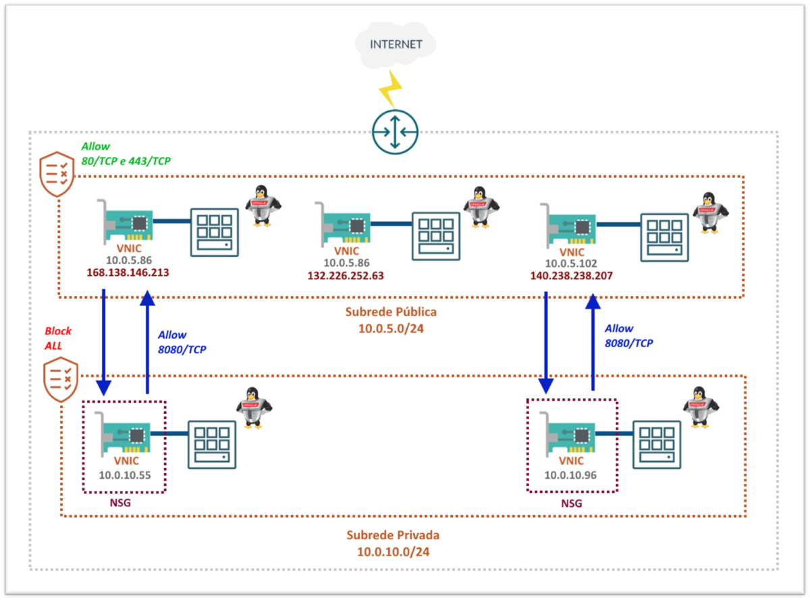

# Capítulo 4: Primeira aplicação no OCI

## 4.4 - Oracle Linux com WordPress na nuvem

### __Introdução__

Neste capítulo quero descrever um pouco mais sobre o _[serviço de computação](https://github.com/daniel-armbrust/oci-book/blob/main/chapter-4/4-2_fundamentos-computacao.md)_, instâncias de computação com _[Oracle Linux](https://www.oracle.com/linux/)_, e suas boas práticas no _[OCI](https://www.oracle.com/cloud/)_. Por fim, faremos a instalação da aplicação _[Wordpress](https://pt.wikipedia.org/wiki/WordPress)_ em nossa instância.

Embora você tenha _"controle total"_ da sua instância, recomendamos uma variedade de boas práticas para garantir a disponibilidade e máximo desempenho.

>_**__NOTA:__** "Controle total" em cloud significa "Responsabilidade Compartilhada". Consulte sobre ["Modelo de responsabilidade compartilhada"](https://github.com/daniel-armbrust/oci-book/blob/main/chapter-1/1-1_intro-cloud-computing.md) para saber mais._


### __Oracle Linux__

Este não é um capítulo que documenta o _[Oracle Linux](https://www.oracle.com/linux/)_. Até por que, existem diversos livros sobre o tema e uma extensa documentação disponível na internet pela própria Oracle. Vou deixar o link de cada versão mais usada hoje em dia. Consulte quando precisar saber de detalhes mais específicos sobre a versão do sistema operacional que está usando.

- [Oracle Linux 8](https://docs.oracle.com/en/operating-systems/oracle-linux/8/)
- [Oracle Linux 7](https://docs.oracle.com/en/operating-systems/oracle-linux/7/)
- [Oracle Linux 6](https://docs.oracle.com/en/operating-systems/oracle-linux/6/)

Porém, vou destacar pontos importantes. Começando por suas vantagens de utilização no _[OCI](https://www.oracle.com/cloud/)_:

- Contas criadas no _[OCI](https://www.oracle.com/cloud/)_ já incluem o _[Oracle Linux Premier Support](https://www.oracle.com/linux/support.html)_ sem custo adicional.
- Gerenciamento de pacotes e patches automatizados através do _[Serviço OS Management](https://docs.oracle.com/pt-br/iaas/os-management/osms/index.htm)_, que mantêm seus sistemas seguros e confiáveis. 
- Acesso a atualizações, últimas correções de bugs, erratas de segurança, etc.
- Ferramenta _[Ksplice](https://docs.oracle.com/pt-br/iaas/Content/Compute/Tasks/installingconfiguringksplice.htm)_ pré-instalada em imagens do _[OCI](https://www.oracle.com/cloud/)_, no qual possibilita aplicar atualizações de segurança importantes e críticas do kernel sem a necessidade de reboot (zero-downtime).
- 100% binário compatível com Red Hat Enterprise Linux.

>_**__NOTA:__** O documento que descreve todas essas vantagens e outras em mais detalhes, pode ser consultado neste [link aqui](https://www.oracle.com/a/ocom/docs/linux-for-cloud-infrastructure-4024517.pdf)._

Vamos seguir agora para o entendimento sobre os **firewalls** que temos até que o tráfego chegue em uma instância de computação. Por um momento, vamos tomar outro exemplo.

Imagine que criamos uma nova instância temporária em nossa subrede pública (10.0.5.0/24), também com _[Oracle Linux](https://www.oracle.com/linux/)_. Esta instância, além do seu endereço IP privado 10.0.5.73, foi atribuído um IP público 168.138.146.213.

Veja abaixo a representação desta instância:


Sabemos que toda instância possui uma ou mais _[VNICs](https://docs.oracle.com/pt-br/iaas/Content/Network/Tasks/managingVNICs.htm)_. Cada _[VNIC](https://docs.oracle.com/pt-br/iaas/Content/Network/Tasks/managingVNICs.htm)_ reside em uma subrede e é ela quem possibilita a instância se comunicar com os recursos de toda _[VCN](https://docs.oracle.com/pt-br/iaas/Content/Network/Tasks/managingVCNs_topic-Overview_of_VCNs_and_Subnets.htm)_. Sabemos também que toda _[VNIC](https://docs.oracle.com/pt-br/iaas/Content/Network/Tasks/managingVNICs.htm)_ possui um endereço IPv4 privado principal e um endereço IPv4 público opcional para cada IP privado.

O primeiro detalhe importante aqui a se notar, é que o tráfego da rede sempre é avaliado primeiramente no _[Network Security Group (NSG)](https://docs.oracle.com/pt-br/iaas/Content/Network/Concepts/networksecuritygroups.htm)_ associado a _[VNIC](https://docs.oracle.com/pt-br/iaas/Content/Network/Tasks/managingVNICs.htm)_ da instância. Caso o _[NSG](https://docs.oracle.com/pt-br/iaas/Content/Network/Concepts/networksecuritygroups.htm)_ permita o tráfego (allow), este vai diretamente para a _[VNIC](https://docs.oracle.com/pt-br/iaas/Content/Network/Tasks/managingVNICs.htm)_ que consequentemente atinge a instância. Se não há _[NSG](https://docs.oracle.com/pt-br/iaas/Content/Network/Concepts/networksecuritygroups.htm)_, as regras existentes na _[Security List](https://docs.oracle.com/pt-br/iaas/Content/Network/Concepts/securitylists.htm#Security_Lists)_  da subrede serão avaliadas em sequência, antes de atingir a instância.

>_**__NOTA:__** Lembre-se que ao criar uma [Security List](https://docs.oracle.com/pt-br/iaas/Content/Network/Concepts/securitylists.htm#Security_Lists) ou [NSG](https://docs.oracle.com/pt-br/iaas/Content/Network/Concepts/networksecuritygroups.htm), tudo vem "bloqueado por padrão". Você deve criar explicitamente as regras que permitam (allow) o tráfego de rede._

O mesmo endereço IP privado que você vê nas propriedades da _[VNIC](https://docs.oracle.com/pt-br/iaas/Content/Network/Tasks/managingVNICs.htm)_, você vê na interface de rede da instância (ens3):

```
[opc@instance-20210912-1218 ~]$ ip addr sh ens3
2: ens3: <BROADCAST,MULTICAST,UP,LOWER_UP> mtu 9000 qdisc pfifo_fast state UP group default qlen 1000
    link/ether 02:00:17:01:e0:b1 brd ff:ff:ff:ff:ff:ff
    inet 10.0.5.73/24 brd 10.0.5.255 scope global dynamic ens3
       valid_lft 86179sec preferred_lft 86179sec
    inet6 fe80::17ff:fe01:e0b1/64 scope link
       valid_lft forever preferred_lft forever
```

Porém, o IP público só pode ser visualizado pelas propriedades da _[VNIC](https://docs.oracle.com/pt-br/iaas/Content/Network/Tasks/managingVNICs.htm)_. Ele está na _[VNIC](https://docs.oracle.com/pt-br/iaas/Content/Network/Tasks/managingVNICs.htm)_ e não na instância. Observe _"private-ip"_, _"public-ip"_ e seus respectivos valores com o comando abaixo:

```
darmbrust@hoodwink:~$ oci network vnic get \
> --vnic-id "ocid1.vnic.oc1.sa-saopaulo-1.abtxeljrdbajg6ruoyrmbp53uxf26z3sp32655fj6tmu3snn5gqufybartwa"
{
  "data": {
    "availability-domain": "ynrK:SA-SAOPAULO-1-AD-1",
    "compartment-id": "ocid1.compartment.oc1..aaaaaaaauvqvbbx3oridcm5d2ztxkftwr362u2vl5zdsayzbehzwbjs56soq",
    "defined-tags": {
      "Oracle-Tags": {
        "CreatedBy": "oracleidentitycloudservice/daniel.armbrust@algumdominio.com",
        "CreatedOn": "2021-09-12T15:19:48.000Z"
      }
    },
    "display-name": "instance-20210912-1218",
    "freeform-tags": {},
    "hostname-label": "instance-20210912-1218",
    "id": "ocid1.vnic.oc1.sa-saopaulo-1.abtxeljrdbajg6ruoyrmbp53uxf26z3sp32655fj6tmu3snn5gqufybartwa",
    "is-primary": true,
    "lifecycle-state": "AVAILABLE",
    "mac-address": "02:00:17:01:E0:B1",
    "nsg-ids": [],
    "private-ip": "10.0.5.73",
    "public-ip": "168.138.146.213",
    "skip-source-dest-check": false,
    "subnet-id": "ocid1.subnet.oc1.sa-saopaulo-1.aaaaaaaax6arj6ccrzlm7fxb4pl4ggrsgig4bwnbvtqaayosdulsyoaliuka",
    "time-created": "2021-09-12T15:19:55.109000+00:00",
    "vlan-id": null
  },
  "etag": "7a55f0e0"
}
```

Isto quer dizer que o _[OCI](https://www.oracle.com/cloud/)_ sempre faz um _[NAT 1:1](https://en.wikipedia.org/wiki/Network_address_translation)_ do IP público da _[VNIC](https://docs.oracle.com/pt-br/iaas/Content/Network/Tasks/managingVNICs.htm)_ para o IP privado. O contrário (saída do tráfego de rede) segue o mesmo processo.

No meio do caminho, entre _[VNIC](https://docs.oracle.com/pt-br/iaas/Content/Network/Tasks/managingVNICs.htm)_ e a interface de rede do _[Oracle Linux](https://www.oracle.com/linux/)_, existe o primeiro _[firewall virtual](https://en.wikipedia.org/wiki/Virtual_firewall)_. O _[firewalld](https://firewalld.org/)_. 

Este vem habilitado por padrão nas _[imagens de plataforma](https://docs.oracle.com/pt-br/iaas/Content/Compute/References/images.htm#OracleProvided_Images)_ equipadas com _[Oracle Linux](https://www.oracle.com/linux/)_.

Somente as portas para os serviços SSH e cliente DHCP vem _"abertas"_:

```
[opc@instance-20210912-1218 ~]$ sudo firewall-cmd --list-services
dhcpv6-client ssh
```

Por exemplo, para _"abrirmos"_ as portas HTTP (80/TCP) e HTTPS (443/TCP) de forma permanente, executamos os comandos abaixo:

```
[opc@instance-20210912-1218 ~]$ sudo firewall-cmd --add-service=http --permanent
success
[opc@instance-20210912-1218 ~]$ sudo firewall-cmd --add-service=https --permanent
success
[opc@instance-20210912-1218 ~]$ sudo firewall-cmd --reload
success
```

Esta ação pode ser confirmada com o comando abaixo:

```
[opc@instance-20210912-1218 ~]$ sudo firewall-cmd --list-services
dhcpv6-client http https ssh
```

#### __Regras Essenciais de Firewall__

Todas as _[imagens de plataforma](https://docs.oracle.com/pt-br/iaas/Content/Compute/References/images.htm#OracleProvided_Images)_ incluem regras de firewall que só permitem o usuário _"root"_ ou _"Administrators"_ em instâncias Windows, para estabelecer conexões com a rede _[iSCSI](https://pt.wikipedia.org/wiki/ISCSI)_ (169.254.0.2:3260, 169.254.2.0/24:3260), que se conecta ao serviço de storage do OCI.

>_**__NOTA:__** Maiores detalhes sobre volumes de disco, conexões _[iSCSI](https://pt.wikipedia.org/wiki/ISCSI)_, você encontra mais adiante. Por hora, siga a recomendação exposta aqui._

É importante _**NÃO REMOVER**_ essas regras através do _[firewalld](https://firewalld.org/)_ ou diretamente pelo _[iptables](https://pt.wikipedia.org/wiki/Iptables)_. A remoção dessas regras irá permitir que usuários não administradores, acessem o volumes de disco de boot da instância. É recomendado também, que não se crie imagens personalizadas sem essas regras de firewall.

>_**__NOTA:__** A excessão é por conta de imagens [Ubuntu](https://pt.wikipedia.org/wiki/Ubuntu), que ao habilitar o [UFW (Uncomplicated Firewall)](https://help.ubuntu.com/community/UFW) pode causar problemas com essas regras. Recomendamos que você não ative o [UFW](https://help.ubuntu.com/community/UFW) em suas instâncias._

#### __A rede reservada 169.254.0.0/16__

### __Security Lists e Network Security Groups (NSG)__

Vamos entrar um pouco mais nos detalhes das _[Security Lists](https://docs.oracle.com/pt-br/iaas/Content/Network/Concepts/securitylists.htm#Security_Lists)_ e _[Network Security Groups (NSG)](https://docs.oracle.com/pt-br/iaas/Content/Network/Concepts/networksecuritygroups.htm)_, exibindo diferenças e aplicabilidades.

A _[Security List](https://docs.oracle.com/pt-br/iaas/Content/Network/Concepts/securitylists.htm#Security_Lists)_ que como sabemos, tudo é bloqueado por padrão. Definimos regras de segurança que permitem tráfego (allow) a todas as _[VNICs](https://docs.oracle.com/pt-br/iaas/Content/Network/Tasks/managingVNICs.htm)_ existentes em uma subrede inteira. Podemos _"empilhar"_ até cinco _[Security Lists](https://docs.oracle.com/pt-br/iaas/Content/Network/Concepts/securitylists.htm#Security_Lists)_ por subrede.

Já o _[Network Security Groups (NSG)](https://docs.oracle.com/pt-br/iaas/Content/Network/Concepts/networksecuritygroups.htm)_ permitem definir um conjunto de regras de segurança que se aplicam a um grupo de _[VNICs](https://docs.oracle.com/pt-br/iaas/Content/Network/Tasks/managingVNICs.htm)_. Uma _[VNIC](https://docs.oracle.com/pt-br/iaas/Content/Network/Tasks/managingVNICs.htm)_ pode ser adicionada a no máximo cinco _[NSGs](https://docs.oracle.com/pt-br/iaas/Content/Network/Concepts/networksecuritygroups.htm)_ diferentes. Lembrando que uma _[VNIC](https://docs.oracle.com/pt-br/iaas/Content/Network/Tasks/managingVNICs.htm)_ não está associada somente a instâncias de computação. O serviço _[Load Balancing](https://docs.oracle.com/pt-br/iaas/Content/NetworkLoadBalancer/home.htm)_ por exemplo, cria automaticamente _[VNICs](https://docs.oracle.com/pt-br/iaas/Content/Network/Tasks/managingVNICs.htm)_ para tráfego de balanceamento sobre seus _[backends](https://docs.oracle.com/pt-br/iaas/Content/NetworkLoadBalancer/BackendSets/backend_set_management.htm)_.

>_**__NOTA:__** A Oracle recomenda o uso de [NSGs](https://docs.oracle.com/pt-br/iaas/Content/Network/Concepts/networksecuritygroups.htm) em vez das [Security Lists](https://docs.oracle.com/pt-br/iaas/Content/Network/Concepts/securitylists.htm#Security_Lists). Entretanto, você pode usar [Security Lists](https://docs.oracle.com/pt-br/iaas/Content/Network/Concepts/securitylists.htm#Security_Lists) e [NSGs](https://docs.oracle.com/pt-br/iaas/Content/Network/Concepts/networksecuritygroups.htm) juntos._

Vamos desmistificar a aplicabilidade através do cenário abaixo:



Cenário tipico em cloud. Duas subredes, uma pública e outra privada. Na subrede pública temos um conjunto de instâncias web equipadas com _[Nginx](https://pt.wikipedia.org/wiki/Nginx)_. Nesta subrede, estamos permitindo (allow) através da sua _[security list](https://docs.oracle.com/pt-br/iaas/Content/Network/Concepts/securitylists.htm#Security_Lists)_, tráfego de qualquer origem vindo da internet para as instâncias nas portas 80/TCP e 443/TCP. O egress da subrede pública possui tráfego total liberado.

Na subrede privada, foi criado uma _[security list](https://docs.oracle.com/pt-br/iaas/Content/Network/Concepts/securitylists.htm#Security_Lists)_ sem nenhuma regra. Ou seja, tudo está _bloqueado_. Aqui temos duas instâncias e cada uma delas com seu _[Weblogic](https://pt.wikipedia.org/wiki/BEA_Weblogic_Server)_ em execução. Foi criado também, um 
_[NSG](https://docs.oracle.com/pt-br/iaas/Content/Network/Concepts/networksecuritygroups.htm)_ para cada uma das _[VNICs](https://docs.oracle.com/pt-br/iaas/Content/Network/Tasks/managingVNICs.htm)_. O _[NSG](https://docs.oracle.com/pt-br/iaas/Content/Network/Concepts/networksecuritygroups.htm)_ só permite tráfego na porta 8080/TCP do seu respectivo _[Nginx](https://pt.wikipedia.org/wiki/Nginx)_ superior. Ou seja, o _[Weblogic](https://pt.wikipedia.org/wiki/BEA_Weblogic_Server)_ _10.0.10.55_, através do seu _[NSG](https://docs.oracle.com/pt-br/iaas/Content/Network/Concepts/networksecuritygroups.htm)_, só permite requisições vinda do _[Nginx](https://pt.wikipedia.org/wiki/Nginx)_ _10.0.5.86_.

Esta é a principal diferença. Neste caso, pelo fato do _[NSG](https://docs.oracle.com/pt-br/iaas/Content/Network/Concepts/networksecuritygroups.htm)_ estar aplicado em uma _[VNIC](https://docs.oracle.com/pt-br/iaas/Content/Network/Tasks/managingVNICs.htm)_, podemos controlar regras de acesso especificamente para esta _[VNIC](https://docs.oracle.com/pt-br/iaas/Content/Network/Tasks/managingVNICs.htm)_. Através da _[security list](https://docs.oracle.com/pt-br/iaas/Content/Network/Concepts/securitylists.htm#Security_Lists)_ eu não consigo este nível de granularidade que permite especificar IP de origem ou destino. O _[NSG](https://docs.oracle.com/pt-br/iaas/Content/Network/Concepts/networksecuritygroups.htm)_ já deixa esta origem ou destino implícito. 

>_**__NOTA:__** Como boa prática, mantenha a [security list](https://docs.oracle.com/pt-br/iaas/Content/Network/Concepts/securitylists.htm#Security_Lists) sem regras e permita tráfego através do [NSG](https://docs.oracle.com/pt-br/iaas/Content/Network/Concepts/networksecuritygroups.htm). Ou, libere o tráfego que abrange toda a subrede através da [security list](https://docs.oracle.com/pt-br/iaas/Content/Network/Concepts/securitylists.htm#Security_Lists), e libere tráfego mais específico através do [NSG](https://docs.oracle.com/pt-br/iaas/Content/Network/Concepts/networksecuritygroups.htm). Isto pode facilitar a administração das suas regras e evitar "buracos" de acesso._

Vamos voltar para a nossa instância da aplicação _[Wordpress](https://pt.wikipedia.org/wiki/WordPress)_. Primeiramente iremos atualizar a subrede privada, removendo todas as suas regras.

```
darmbrust@hoodwink:~$ oci network security-list list \
> --compartment-id "ocid1.compartment.oc1..aaaaaaaauvqvbbx3oridcm5d2ztxkftwr362u2vl5zdsayzbehzwbjs56soq" \
> --query "data[?\"display-name\"=='secl-1_subnprv-app_vcn-prd'].id"
[
  "ocid1.securitylist.oc1.sa-saopaulo-1.aaaaaaaacsbcnmseb2v7flq7guqmee4fuij3d4rhldftqyneingvmre6sqzq"
]
```

Irei utilizar o parâmetro _--force_ que irá remover as regras sem solicitar confirmação:

```
darmbrust@hoodwink:~$ oci network security-list update \
> --security-list-id "ocid1.securitylist.oc1.sa-saopaulo-1.aaaaaaaacsbcnmseb2v7flq7guqmee4fuij3d4rhldftqyneingvmre6sqzq" \
> --ingress-security-rules '[]' \
> --egress-security-rules '[]' \
> --force
{
  "data": {
    "compartment-id": "ocid1.compartment.oc1..aaaaaaaauvqvbbx3oridcm5d2ztxkftwr362u2vl5zdsayzbehzwbjs56soq",
    "defined-tags": {
      "Oracle-Tags": {
        "CreatedBy": "oracleidentitycloudservice/daniel.armbrust@algumdominio.com",
        "CreatedOn": "2021-09-07T22:18:12.983Z"
      }
    },
    "display-name": "secl-1_subnprv-app_vcn-prd",
    "egress-security-rules": [],
    "freeform-tags": {},
    "id": "ocid1.securitylist.oc1.sa-saopaulo-1.aaaaaaaacsbcnmseb2v7flq7guqmee4fuij3d4rhldftqyneingvmre6sqzq",
    "ingress-security-rules": [],
    "lifecycle-state": "AVAILABLE",
    "time-created": "2021-09-07T22:18:13.023000+00:00",
    "vcn-id": "ocid1.vcn.oc1.sa-saopaulo-1.amaaaaaahcglxkaabicl4jiikcavz2h2nvazibxp4rdiwziqsce4h5wksz2a"
  },
  "etag": "3bc38baf"
}
```

Feito isto, criaremos o _[NSG](https://docs.oracle.com/pt-br/iaas/Content/Network/Concepts/networksecuritygroups.htm)_ para a instância do _[Wordpress](https://pt.wikipedia.org/wiki/WordPress)_:

```
darmbrust@hoodwink:~$ oci network nsg create \
> --compartment-id "ocid1.compartment.oc1..aaaaaaaauvqvbbx3oridcm5d2ztxkftwr362u2vl5zdsayzbehzwbjs56soq" \
> --vcn-id "ocid1.vcn.oc1.sa-saopaulo-1.amaaaaaahcglxkaabicl4jiikcavz2h2nvazibxp4rdiwziqsce4h5wksz2a" \
> --display-name "nsg_wordpress" \
> --wait-for-state "AVAILABLE"
Action completed. Waiting until the resource has entered state: ('AVAILABLE',)
{
  "data": {
    "compartment-id": "ocid1.compartment.oc1..aaaaaaaauvqvbbx3oridcm5d2ztxkftwr362u2vl5zdsayzbehzwbjs56soq",
    "defined-tags": {
      "Oracle-Tags": {
        "CreatedBy": "oracleidentitycloudservice/daniel.armbrust@algumdominio.com",
        "CreatedOn": "2021-09-15T22:26:23.290Z"
      }
    },
    "display-name": "nsg_wordpress",
    "freeform-tags": {},
    "id": "ocid1.networksecuritygroup.oc1.sa-saopaulo-1.aaaaaaaa6jz4tjisvsnk4u7xaxkwmywx72jrkxeyjdpmdwgstt5nw4yzskpa",
    "lifecycle-state": "AVAILABLE",
    "time-created": "2021-09-15T22:26:23.521000+00:00",
    "vcn-id": "ocid1.vcn.oc1.sa-saopaulo-1.amaaaaaahcglxkaabicl4jiikcavz2h2nvazibxp4rdiwziqsce4h5wksz2a"
  },
  "etag": "2823fb9"
}
```

A regra que irei criar abaixo, permite conexões vindas do _[Bastion](https://docs.oracle.com/pt-br/iaas/Content/Bastion/Concepts/bastionoverview.htm)_ criado e que possui origem _10.0.10.112_, na porta do protocolo SSH (22/TCP). Uma outra regra que permite saída total também será criada.

```
darmbrust@hoodwink:~$ oci network nsg rules add \
> --nsg-id "ocid1.networksecuritygroup.oc1.sa-saopaulo-1.aaaaaaaa6jz4tjisvsnk4u7xaxkwmywx72jrkxeyjdpmdwgstt5nw4yzskpa" \
> --security-rules '[
> {"isStateless": false, "protocol": "6", "direction": "INGRESS", "sourceType": "CIDR_BLOCK", "source": "10.0.10.112/32",  "tcpOptions": {"destinationPortRange": {"min": 22, "max": 22}}},
> {"isStateless": false, "protocol": "all", "direction": "EGRESS", "destinationType": "CIDR_BLOCK", "destination": "0.0.0.0/0"}
> ]'
{
  "data": {
    "security-rules": [
      {
        "description": null,
        "destination": "0.0.0.0/0",
        "destination-type": "CIDR_BLOCK",
        "direction": "EGRESS",
        "icmp-options": null,
        "id": "B2834E",
        "is-stateless": false,
        "is-valid": true,
        "protocol": "all",
        "source": null,
        "source-type": null,
        "tcp-options": null,
        "time-created": "2021-09-16T11:26:11.650000+00:00",
        "udp-options": null
      },
      {
        "description": null,
        "destination": null,
        "destination-type": null,
        "direction": "INGRESS",
        "icmp-options": null,
        "id": "4DF2CB",
        "is-stateless": false,
        "is-valid": true,
        "protocol": "6",
        "source": "10.0.10.112/32",
        "source-type": "CIDR_BLOCK",
        "tcp-options": {
          "destination-port-range": {
            "max": 22,
            "min": 22
          },
          "source-port-range": null
        },
        "time-created": "2021-09-16T11:26:11.650000+00:00",
        "udp-options": null
      }
    ]
  }
}
```

A criação das regras seguem parecidas com a criação das regras da _[security list](https://docs.oracle.com/en-us/iaas/api/#/en/iaas/20160918/datatypes/IngressSecurityRule)_, porém temos mais parâmetros a disposição. Lembrando que você pode informar as regras especificando um arquivo _[JSON](https://pt.wikipedia.org/wiki/JSON)_ via _file://regras-nsg.json_, por exemplo.

>_**__NOTA:__** Todos os parâmetros para criação das regras de firewall das [NSGs](https://docs.oracle.com/pt-br/iaas/Content/Network/Concepts/networksecuritygroups.htm) podem ser consultados diretamente na documentação da API neste [link aqui](https://docs.oracle.com/en-us/iaas/api/#/en/iaas/20160918/datatypes/AddSecurityRuleDetails)._ 