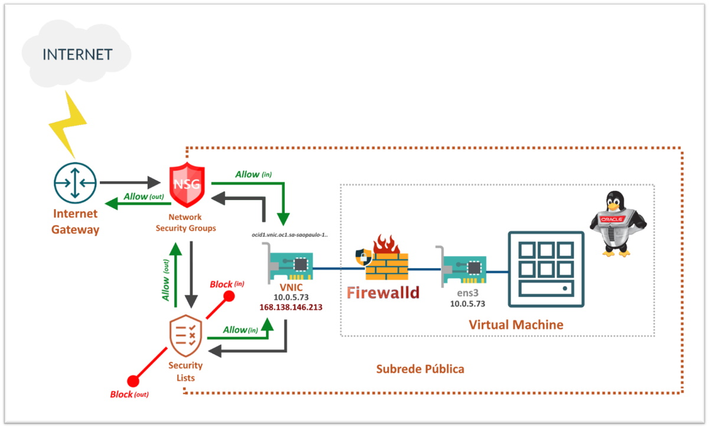

# Capítulo 4: Primeira aplicação no OCI

## 4.4 - Oracle Linux com WordPress na nuvem

### __Introdução__

Neste capítulo quero descrever um pouco mais sobre o _[serviço de computação](https://github.com/daniel-armbrust/oci-book/blob/main/chapter-4/4-2_fundamentos-computacao.md)_, instâncias de computação com _[Oracle Linux](https://www.oracle.com/linux/)_, e suas boas práticas no _[OCI](https://www.oracle.com/cloud/)_. Por fim, faremos a instalação da aplicação _[Wordpress](https://pt.wikipedia.org/wiki/WordPress)_ em nossa instância.

Embora você tenha _"controle total"_ da sua instância, recomendamos uma variedade de boas práticas para garantir a disponibilidade e máximo desempenho.

>_**__NOTA:__** "Controle total" em cloud significa "Responsabilidade Compartilhada". Consulte sobre ["Modelo de responsabilidade compartilhada"](https://github.com/daniel-armbrust/oci-book/blob/main/chapter-1/1-1_intro-cloud-computing.md) para saber mais._


### __Oracle Linux__

Este não é um capítulo que documenta o _[Oracle Linux](https://www.oracle.com/linux/)_. Até por que, existem diversos livros sobre o tema e uma extensa documentação disponível na internet pela própria Oracle. Vou deixar o link de cada versão mais usada hoje em dia. Consulte quando precisar saber de detalhes mais específicos sobre a versão do sistema operacional que está usando.

- [Oracle Linux 8](https://docs.oracle.com/en/operating-systems/oracle-linux/8/)
- [Oracle Linux 7](https://docs.oracle.com/en/operating-systems/oracle-linux/7/)
- [Oracle Linux 6](https://docs.oracle.com/en/operating-systems/oracle-linux/6/)

Porém, vou destacar pontos importantes. Começando por suas vantagens de utilização no _[OCI](https://www.oracle.com/cloud/)_:

- Contas criadas no _[OCI](https://www.oracle.com/cloud/)_ já incluem o _[Oracle Linux Premier Support](https://www.oracle.com/linux/support.html)_ sem custo adicional.
- Gerenciamento de pacotes e patches automatizados através do _[Serviço OS Management](https://docs.oracle.com/pt-br/iaas/os-management/osms/index.htm)_, que mantêm seus sistemas seguros e confiáveis. 
- Acesso a atualizações, últimas correções de bugs, erratas de segurança, etc.
- Ferramenta _[Ksplice](https://docs.oracle.com/pt-br/iaas/Content/Compute/Tasks/installingconfiguringksplice.htm)_ pré-instalada em imagens do _[OCI](https://www.oracle.com/cloud/)_, no qual possibilita aplicar atualizações de segurança importantes e críticas do kernel sem a necessidade de reboot (zero-downtime).
- 100% binário compatível com Red Hat Enterprise Linux.

>_**__NOTA:__** O documento que descreve todas essas vantagens e outras em mais detalhes, pode ser consultado neste [link aqui](https://www.oracle.com/a/ocom/docs/linux-for-cloud-infrastructure-4024517.pdf)._

Vamos seguir agora para o entendimento sobre os **firewalls** que temos até que o tráfego chegue em uma instância de computação. Por um momento, vamos tomar outro exemplo.

Imagine que criamos uma nova instância temporária em nossa subrede pública (10.0.5.0/24), também com _[Oracle Linux](https://www.oracle.com/linux/)_. Esta instância, além do seu endereço IP privado 10.0.5.73, foi atribuído um IP público 168.138.146.213.

Veja abaixo a representação desta instância:



Sabemos que toda instância possui uma ou mais _[VNICs](https://docs.oracle.com/pt-br/iaas/Content/Network/Tasks/managingVNICs.htm)_. Cada _[VNIC](https://docs.oracle.com/pt-br/iaas/Content/Network/Tasks/managingVNICs.htm)_ reside em uma subrede e é ela quem possibilita a instância se comunicar com os recursos de toda _[VCN](https://docs.oracle.com/pt-br/iaas/Content/Network/Tasks/managingVCNs_topic-Overview_of_VCNs_and_Subnets.htm)_. Sabemos também que toda _[VNIC](https://docs.oracle.com/pt-br/iaas/Content/Network/Tasks/managingVNICs.htm)_ possui um endereço IPv4 privado principal e um endereço IPv4 público opcional para cada IP privado.

O primeiro detalhe importante aqui a se notar, é que o tráfego da rede é verificado por dois _[firewalls virtuais](https://en.wikipedia.org/wiki/Virtual_firewall)_ antes de se atingir a _[VNIC](https://docs.oracle.com/pt-br/iaas/Content/Network/Tasks/managingVNICs.htm)_. São eles: _[Network Security Groups (NSG)](https://docs.oracle.com/pt-br/iaas/Content/Network/Concepts/networksecuritygroups.htm)_ e as _[Security Lists](https://docs.oracle.com/pt-br/iaas/Content/Network/Concepts/securitylists.htm#Security_Lists)_, que já conhecemos. O _[NSG](https://docs.oracle.com/pt-br/iaas/Content/Network/Concepts/networksecuritygroups.htm)_ só será avaliado, se criado e aplicado a uma _[VNIC](https://docs.oracle.com/pt-br/iaas/Content/Network/Tasks/managingVNICs.htm)_ em particular. 

>_**__NOTA:__** Lembre-se que ao criar uma [Security List](https://docs.oracle.com/pt-br/iaas/Content/Network/Concepts/securitylists.htm#Security_Lists), tudo vem "bloqueado por padrão". Você deve criar explicitamente regras que permitam (allow) tráfego da rede._

Sobre o endereço IP privado que você vê nas propriedades da _[VNIC](https://docs.oracle.com/pt-br/iaas/Content/Network/Tasks/managingVNICs.htm)_, você vê também na interface de rede da instância (ens3):

```
[opc@instance-20210912-1218 ~]$ ip addr sh ens3
2: ens3: <BROADCAST,MULTICAST,UP,LOWER_UP> mtu 9000 qdisc pfifo_fast state UP group default qlen 1000
    link/ether 02:00:17:01:e0:b1 brd ff:ff:ff:ff:ff:ff
    inet 10.0.5.73/24 brd 10.0.5.255 scope global dynamic ens3
       valid_lft 86179sec preferred_lft 86179sec
    inet6 fe80::17ff:fe01:e0b1/64 scope link
       valid_lft forever preferred_lft forever
```

Porém, o IP público só pode ser visualizado pelas propriedades da _[VNIC](https://docs.oracle.com/pt-br/iaas/Content/Network/Tasks/managingVNICs.htm)_. Ele está na _[VNIC](https://docs.oracle.com/pt-br/iaas/Content/Network/Tasks/managingVNICs.htm)_ e não na instância. Observe _"private-ip"_, _"public-ip"_ e seus respectivos valores com o comando abaixo:

```
darmbrust@hoodwink:~$ oci network vnic get \
> --vnic-id "ocid1.vnic.oc1.sa-saopaulo-1.abtxeljrdbajg6ruoyrmbp53uxf26z3sp32655fj6tmu3snn5gqufybartwa"
{
  "data": {
    "availability-domain": "ynrK:SA-SAOPAULO-1-AD-1",
    "compartment-id": "ocid1.compartment.oc1..aaaaaaaauvqvbbx3oridcm5d2ztxkftwr362u2vl5zdsayzbehzwbjs56soq",
    "defined-tags": {
      "Oracle-Tags": {
        "CreatedBy": "oracleidentitycloudservice/daniel.armbrust@algumdominio.com",
        "CreatedOn": "2021-09-12T15:19:48.000Z"
      }
    },
    "display-name": "instance-20210912-1218",
    "freeform-tags": {},
    "hostname-label": "instance-20210912-1218",
    "id": "ocid1.vnic.oc1.sa-saopaulo-1.abtxeljrdbajg6ruoyrmbp53uxf26z3sp32655fj6tmu3snn5gqufybartwa",
    "is-primary": true,
    "lifecycle-state": "AVAILABLE",
    "mac-address": "02:00:17:01:E0:B1",
    "nsg-ids": [],
    "private-ip": "10.0.5.73",
    "public-ip": "168.138.146.213",
    "skip-source-dest-check": false,
    "subnet-id": "ocid1.subnet.oc1.sa-saopaulo-1.aaaaaaaax6arj6ccrzlm7fxb4pl4ggrsgig4bwnbvtqaayosdulsyoaliuka",
    "time-created": "2021-09-12T15:19:55.109000+00:00",
    "vlan-id": null
  },
  "etag": "7a55f0e0"
}
```

Isto quer dizer que o _[OCI](https://www.oracle.com/cloud/)_ sempre faz um _[NAT 1:1](https://en.wikipedia.org/wiki/Network_address_translation)_ do IP público da _[VNIC](https://docs.oracle.com/pt-br/iaas/Content/Network/Tasks/managingVNICs.htm)_ para o IP privado. O contrário (saída do tráfego de rede) segue o mesmo processo.

No meio do caminho, entre _[VNIC](https://docs.oracle.com/pt-br/iaas/Content/Network/Tasks/managingVNICs.htm)_ e a interface de rede do _[Oracle Linux](https://www.oracle.com/linux/)_, há outro _[firewall virtual](https://en.wikipedia.org/wiki/Virtual_firewall)_. O _[firewalld](https://firewalld.org/)_. 

Este vem habilitado por padrão nas _[imagens de plataforma](https://docs.oracle.com/pt-br/iaas/Content/Compute/References/images.htm#OracleProvided_Images)_ equipadas com _[Oracle Linux](https://www.oracle.com/linux/)_.

Somente as portas para os serviços SSH e cliente DHCP vem _"abertas"_:

```
[opc@instance-20210912-1218 ~]$ sudo firewall-cmd --list-services
dhcpv6-client ssh
```

Por exemplo, para _"abrirmos"_ as portas HTTP (80/TCP) e HTTPS (443/TCP) de forma permanente, executamos os comandos abaixo:

```
[opc@instance-20210912-1218 ~]$ sudo firewall-cmd --add-service=http --permanent
success
[opc@instance-20210912-1218 ~]$ sudo firewall-cmd --add-service=https --permanent
success
[opc@instance-20210912-1218 ~]$ sudo firewall-cmd --reload
success
[opc@wordpress ~]$ sudo firewall-cmd --runtime-to-permanent
success
```

Esta ação pode ser confirmada com o comando abaixo:

```
[opc@instance-20210912-1218 ~]$ sudo firewall-cmd --list-services
dhcpv6-client http https ssh
```

#### __Regras Essenciais de Firewall__

Todas as _[imagens de plataforma](https://docs.oracle.com/pt-br/iaas/Content/Compute/References/images.htm#OracleProvided_Images)_ incluem regras de firewall que só permitem o usuário _"root"_ ou _"Administrators"_ em instâncias Windows, a estabelecer conexões com a rede _[iSCSI](https://pt.wikipedia.org/wiki/ISCSI)_ (169.254.0.2:3260, 169.254.2.0/24:3260) que se conecta ao serviço de storage do OCI.

>_**__NOTA:__** Maiores detalhes sobre volumes de disco, conexões _[iSCSI](https://pt.wikipedia.org/wiki/ISCSI)_, você encontra mais adiante. Por hora, siga a recomendação exposta aqui._

É importante _**NÃO REMOVER**_ essas regras através do _[firewalld](https://firewalld.org/)_ ou diretamente pelo _[iptables](https://pt.wikipedia.org/wiki/Iptables)_. A remoção dessas regras irá permitir que usuários não administradores, acessem o volumes de disco de boot da instância. É recomendado também, que não se crie imagens personalizadas sem essas regras de firewall.

>_**__NOTA:__** A excessão é por conta de imagens [Ubuntu](https://pt.wikipedia.org/wiki/Ubuntu), que ao habilitar o [UFW (Uncomplicated Firewall)](https://help.ubuntu.com/community/UFW) pode causar problemas com essas regras. Recomendamos que você não ative o [UFW](https://help.ubuntu.com/community/UFW) em suas instâncias._

#### __A rede reservada 169.254.0.0/16__

Esta é uma rede especial e reservada para conexões _[iSCSI](https://pt.wikipedia.org/wiki/ISCSI)_ utilizados por _[volumes de inicialização](https://docs.oracle.com/pt-br/iaas/Content/Block/Concepts/bootvolumes.htm)_ e _[volumes em blocos](https://docs.oracle.com/pt-br/iaas/Content/Block/Concepts/overview.htm)_ da instância. 

Um outro serviço presente nesta rede é _[serviço de metadados da instância (IMDS)](https://docs.oracle.com/pt-br/iaas/Content/Compute/Tasks/gettingmetadata.htm)_. Este está em execução através de um endpoint HTTP no endereço _169.254.169.254_ e fornece diversas informações sobre a instância em execução.

Veja abaixo a consulta dos metadados da instância:

```
[opc@instance-20210912-1218 ~]$ curl -H "Authorization: Bearer Oracle" -L http://169.254.169.254/opc/v2/instance/
{
  "availabilityDomain" : "ynrK:SA-SAOPAULO-1-AD-1",
  "faultDomain" : "FAULT-DOMAIN-2",
  "compartmentId" : "ocid1.compartment.oc1..aaaaaaaauvqvbbx3oridcm5d2ztxkftwr362u2vl5zdsayzbehzwbjs56soq",
  "displayName" : "instance-20210912-1218",
  "hostname" : "instance-20210912-1218",
  "id" : "ocid1.instance.oc1.sa-saopaulo-1.antxeljr6noke4qctlg477aoiweyytsovsxxvhraujot27wsin5axqiqfwqq",
  "image" : "ocid1.image.oc1.sa-saopaulo-1.aaaaaaaasahnls6nmev22raz7ecw6i64d65fu27pmqjn4pgz7zue56ojj7qq",
  "metadata" : {
    "ssh_authorized_keys" : "ssh-rsa AAAAB3NzaC1yc2EAAAADAQABAAABAQCVW1S8GjxpV37PCd+2HK4/nEhgwjn5S2flcV8E+y05dvS2YyMHPIsJr9BylgVtYMH7Coe1Q/tAW2Oo7TewUE4c/Y8GssTPJR0r15R/ccsMmY/04Tg2V9S8eBN2MemqDbJL4Vm5GMCIG8JZ7miaRzCpvXDAWPf+OJ/gn3VQHPygNiZp2E6HHmmBiL3JMKQz/43Lj65tDPpI0NZtCtJShV/1bS2houwaU2cG2MedacdjqvF/IPk9CSouxTFJ1BYb9t3czBULq7Hl79iqXAW2dfPl17dckKzfwQDHbBbYXgOdV4Ap3nK6VU70j6kHzdbt2uxUq3IgtMlOyTGyKsJyIzwR darmbrust@hoodwink"
  },
  "region" : "sa-saopaulo-1",
  "canonicalRegionName" : "sa-saopaulo-1",
  "ociAdName" : "sa-saopaulo-1-ad-1",
  "regionInfo" : {
    "realmKey" : "oc1",
    "realmDomainComponent" : "oraclecloud.com",
    "regionKey" : "GRU",
    "regionIdentifier" : "sa-saopaulo-1"
  },
  "shape" : "VM.Standard.E2.1",
  "shapeConfig" : {
    "ocpus" : 1.0,
    "memoryInGBs" : 8.0,
    "networkingBandwidthInGbps" : 0.7,
    "maxVnicAttachments" : 2
  },
  "state" : "Running",
  "timeCreated" : 1631459988266,
  "agentConfig" : {
    "monitoringDisabled" : false,
    "managementDisabled" : false,
    "allPluginsDisabled" : false,
    "pluginsConfig" : [ {
      "name" : "Vulnerability Scanning",
      "desiredState" : "DISABLED"
    }, {
      "name" : "OS Management Service Agent",
      "desiredState" : "ENABLED"
    }, {
      "name" : "Management Agent",
      "desiredState" : "DISABLED"
    }, {
      "name" : "Custom Logs Monitoring",
      "desiredState" : "ENABLED"
    }, {
      "name" : "Compute Instance Run Command",
      "desiredState" : "ENABLED"
    }, {
      "name" : "Compute Instance Monitoring",
      "desiredState" : "ENABLED"
    }, {
      "name" : "Block Volume Management",
      "desiredState" : "DISABLED"
    }, {
      "name" : "Bastion",
      "desiredState" : "DISABLED"
    } ]
  },
  "definedTags" : {
    "Oracle-Tags" : {
      "CreatedBy": "oracleidentitycloudservice/daniel.armbrust@algumdominio.com",
      "CreatedOn" : "2021-09-12T15:19:47.830Z"
    }
  }
}
```

### __Security Lists e Network Security Groups (NSG)__

Vamos entrar um pouco mais nos detalhes das _[Security Lists](https://docs.oracle.com/pt-br/iaas/Content/Network/Concepts/securitylists.htm#Security_Lists)_ e _[Network Security Groups (NSG)](https://docs.oracle.com/pt-br/iaas/Content/Network/Concepts/networksecuritygroups.htm)_, exibindo diferenças e aplicabilidades.

A _[Security List](https://docs.oracle.com/pt-br/iaas/Content/Network/Concepts/securitylists.htm#Security_Lists)_ que como sabemos, tudo é bloqueado por padrão. Definimos regras de segurança que permitem tráfego (allow) a todas as _[VNICs](https://docs.oracle.com/pt-br/iaas/Content/Network/Tasks/managingVNICs.htm)_ existentes em uma subrede inteira. Podemos _"empilhar"_ até cinco _[Security Lists](https://docs.oracle.com/pt-br/iaas/Content/Network/Concepts/securitylists.htm#Security_Lists)_ por subrede.

Já o _[Network Security Groups (NSG)](https://docs.oracle.com/pt-br/iaas/Content/Network/Concepts/networksecuritygroups.htm)_ permitem definir um conjunto de regras de segurança que se aplicam a um grupo de _[VNICs](https://docs.oracle.com/pt-br/iaas/Content/Network/Tasks/managingVNICs.htm)_. Uma _[VNIC](https://docs.oracle.com/pt-br/iaas/Content/Network/Tasks/managingVNICs.htm)_ pode conter no máximo cinco _[NSGs](https://docs.oracle.com/pt-br/iaas/Content/Network/Concepts/networksecuritygroups.htm)_ diferentes. Lembrando que _[VNIC](https://docs.oracle.com/pt-br/iaas/Content/Network/Tasks/managingVNICs.htm)_ não está associada somente a instâncias de computação. O serviço _[Load Balancing](https://docs.oracle.com/pt-br/iaas/Content/NetworkLoadBalancer/home.htm)_ por exemplo, cria automaticamente _[VNICs](https://docs.oracle.com/pt-br/iaas/Content/Network/Tasks/managingVNICs.htm)_ para tráfego de balanceamento sobre seus _[backends](https://docs.oracle.com/pt-br/iaas/Content/NetworkLoadBalancer/BackendSets/backend_set_management.htm)_.

>_**__NOTA:__** A Oracle recomenda o uso de [NSGs](https://docs.oracle.com/pt-br/iaas/Content/Network/Concepts/networksecuritygroups.htm) em vez das [Security Lists](https://docs.oracle.com/pt-br/iaas/Content/Network/Concepts/securitylists.htm#Security_Lists). Entretanto, você pode usar [Security Lists](https://docs.oracle.com/pt-br/iaas/Content/Network/Concepts/securitylists.htm#Security_Lists) e [NSGs](https://docs.oracle.com/pt-br/iaas/Content/Network/Concepts/networksecuritygroups.htm) juntos._

Vamos desmistificar a aplicabilidade através do cenário abaixo:


Cenário tipico em cloud. Duas subredes, uma pública e outra privada. Na subrede pública temos um conjunto de instâncias web equipadas com _[Nginx](https://pt.wikipedia.org/wiki/Nginx)_. Nesta subrede, estamos permitindo (allow) através da sua _[security list](https://docs.oracle.com/pt-br/iaas/Content/Network/Concepts/securitylists.htm#Security_Lists)_, tráfego de qualquer origem vindo da internet para as instâncias nas portas 80/TCP e 443/TCP. O egress da subrede pública possui tráfego total liberado.

Na subrede privada, foi criado uma _[security list](https://docs.oracle.com/pt-br/iaas/Content/Network/Concepts/securitylists.htm#Security_Lists)_ sem nenhuma regra. Ou seja, tudo está _bloqueado_. Aqui temos duas instâncias e cada uma delas com seu _[Weblogic](https://pt.wikipedia.org/wiki/BEA_Weblogic_Server)_ em execução. Foi criado também, um 
_[NSG](https://docs.oracle.com/pt-br/iaas/Content/Network/Concepts/networksecuritygroups.htm)_ para cada uma das _[VNICs](https://docs.oracle.com/pt-br/iaas/Content/Network/Tasks/managingVNICs.htm)_. O _[NSG](https://docs.oracle.com/pt-br/iaas/Content/Network/Concepts/networksecuritygroups.htm)_ só permite tráfego na porta 8080/TCP do seu respectivo _[Nginx](https://pt.wikipedia.org/wiki/Nginx)_ superior. Ou seja, o _[Weblogic](https://pt.wikipedia.org/wiki/BEA_Weblogic_Server)_ _10.0.10.55_, através do seu _[NSG](https://docs.oracle.com/pt-br/iaas/Content/Network/Concepts/networksecuritygroups.htm)_, só permite requisições vindas do _[Nginx](https://pt.wikipedia.org/wiki/Nginx)_ _10.0.5.86_.

Neste caso, pelo fato do _[NSG](https://docs.oracle.com/pt-br/iaas/Content/Network/Concepts/networksecuritygroups.htm)_ estar aplicado em uma _[VNIC](https://docs.oracle.com/pt-br/iaas/Content/Network/Tasks/managingVNICs.htm)_, podemos controlar regras de acesso especificamente para esta _[VNIC](https://docs.oracle.com/pt-br/iaas/Content/Network/Tasks/managingVNICs.htm)_. Através da _[security list](https://docs.oracle.com/pt-br/iaas/Content/Network/Concepts/securitylists.htm#Security_Lists)_ eu não consigo este nível de granularidade que permite especificar IP de origem ou destino. O _[NSG](https://docs.oracle.com/pt-br/iaas/Content/Network/Concepts/networksecuritygroups.htm)_ já deixa esta origem ou destino implícito. 

>_**__NOTA:__** Como boa prática, mantenha a [security list](https://docs.oracle.com/pt-br/iaas/Content/Network/Concepts/securitylists.htm#Security_Lists) sem regras e permita tráfego através do [NSG](https://docs.oracle.com/pt-br/iaas/Content/Network/Concepts/networksecuritygroups.htm). Ou, libere o tráfego que abrange toda a subrede através da [security list](https://docs.oracle.com/pt-br/iaas/Content/Network/Concepts/securitylists.htm#Security_Lists), e libere o tráfego mais específico através do [NSG](https://docs.oracle.com/pt-br/iaas/Content/Network/Concepts/networksecuritygroups.htm). Isto pode facilitar a administração das suas regras e evitar "buracos" no acesso._

Vamos voltar para a nossa instância da aplicação _[Wordpress](https://pt.wikipedia.org/wiki/WordPress)_. Primeiramente iremos atualizar a subrede privada, removendo as regras de entrada (ingress).

```
darmbrust@hoodwink:~$ oci network security-list list \
> --compartment-id "ocid1.compartment.oc1..aaaaaaaauvqvbbx3oridcm5d2ztxkftwr362u2vl5zdsayzbehzwbjs56soq" \
> --query "data[?\"display-name\"=='secl-1_subnprv-app_vcn-prd'].id"
[
  "ocid1.securitylist.oc1.sa-saopaulo-1.aaaaaaaacsbcnmseb2v7flq7guqmee4fuij3d4rhldftqyneingvmre6sqzq"
]
```

Irei utilizar o parâmetro _--force_ que irá remover as regras sem solicitar confirmação:

```
darmbrust@hoodwink:~$ oci network security-list update \
> --security-list-id "ocid1.securitylist.oc1.sa-saopaulo-1.aaaaaaaacsbcnmseb2v7flq7guqmee4fuij3d4rhldftqyneingvmre6sqzq" \
> --ingress-security-rules '[]' \
> --force
{
  "data": {
    "compartment-id": "ocid1.compartment.oc1..aaaaaaaauvqvbbx3oridcm5d2ztxkftwr362u2vl5zdsayzbehzwbjs56soq",
    "defined-tags": {
      "Oracle-Tags": {
        "CreatedBy": "oracleidentitycloudservice/daniel.armbrust@algumdominio.com",
        "CreatedOn": "2021-09-07T22:18:12.983Z"
      }
    },
    "display-name": "secl-1_subnprv-app_vcn-prd",
    "egress-security-rules": [
      {
        "description": null,
        "destination": "0.0.0.0/0",
        "destination-type": "CIDR_BLOCK",
        "icmp-options": null,
        "is-stateless": false,
        "protocol": "all",
        "tcp-options": null,
        "udp-options": null
      }
    ],
    "freeform-tags": {},
    "id": "ocid1.securitylist.oc1.sa-saopaulo-1.aaaaaaaacsbcnmseb2v7flq7guqmee4fuij3d4rhldftqyneingvmre6sqzq",
    "ingress-security-rules": [],
    "lifecycle-state": "AVAILABLE",
    "time-created": "2021-09-07T22:18:13.023000+00:00",
    "vcn-id": "ocid1.vcn.oc1.sa-saopaulo-1.amaaaaaahcglxkaabicl4jiikcavz2h2nvazibxp4rdiwziqsce4h5wksz2a"
  },
  "etag": "7107baa3"
}
```

Feito isto, criaremos o _[NSG](https://docs.oracle.com/pt-br/iaas/Content/Network/Concepts/networksecuritygroups.htm)_ para a instância do _[Wordpress](https://pt.wikipedia.org/wiki/WordPress)_:

```
darmbrust@hoodwink:~$ oci network nsg create \
> --compartment-id "ocid1.compartment.oc1..aaaaaaaauvqvbbx3oridcm5d2ztxkftwr362u2vl5zdsayzbehzwbjs56soq" \
> --vcn-id "ocid1.vcn.oc1.sa-saopaulo-1.amaaaaaahcglxkaabicl4jiikcavz2h2nvazibxp4rdiwziqsce4h5wksz2a" \
> --display-name "nsg_wordpress" \
> --wait-for-state "AVAILABLE"
Action completed. Waiting until the resource has entered state: ('AVAILABLE',)
{
  "data": {
    "compartment-id": "ocid1.compartment.oc1..aaaaaaaauvqvbbx3oridcm5d2ztxkftwr362u2vl5zdsayzbehzwbjs56soq",
    "defined-tags": {
      "Oracle-Tags": {
        "CreatedBy": "oracleidentitycloudservice/daniel.armbrust@algumdominio.com",
        "CreatedOn": "2021-09-15T22:26:23.290Z"
      }
    },
    "display-name": "nsg_wordpress",
    "freeform-tags": {},
    "id": "ocid1.networksecuritygroup.oc1.sa-saopaulo-1.aaaaaaaa6jz4tjisvsnk4u7xaxkwmywx72jrkxeyjdpmdwgstt5nw4yzskpa",
    "lifecycle-state": "AVAILABLE",
    "time-created": "2021-09-15T22:26:23.521000+00:00",
    "vcn-id": "ocid1.vcn.oc1.sa-saopaulo-1.amaaaaaahcglxkaabicl4jiikcavz2h2nvazibxp4rdiwziqsce4h5wksz2a"
  },
  "etag": "2823fb9"
}
```

A regra que irei criar abaixo, permite conexões vindas do _[Bastion](https://docs.oracle.com/pt-br/iaas/Content/Bastion/Concepts/bastionoverview.htm)_ criado e que possui origem _10.0.10.112_, na porta do protocolo SSH (22/TCP). Uma outra regra que permite saída total também será criada.

```
darmbrust@hoodwink:~$ oci network nsg rules add \
> --nsg-id "ocid1.networksecuritygroup.oc1.sa-saopaulo-1.aaaaaaaa6jz4tjisvsnk4u7xaxkwmywx72jrkxeyjdpmdwgstt5nw4yzskpa" \
> --security-rules '[
> {"isStateless": false, "protocol": "6", "direction": "INGRESS", "sourceType": "CIDR_BLOCK", "source": "10.0.10.112/32",  "tcpOptions": {"destinationPortRange": {"min": 22, "max": 22}}},
> {"isStateless": false, "protocol": "all", "direction": "EGRESS", "destinationType": "CIDR_BLOCK", "destination": "0.0.0.0/0"}
> ]'
{
  "data": {
    "security-rules": [
      {
        "description": null,
        "destination": "0.0.0.0/0",
        "destination-type": "CIDR_BLOCK",
        "direction": "EGRESS",
        "icmp-options": null,
        "id": "B2834E",
        "is-stateless": false,
        "is-valid": true,
        "protocol": "all",
        "source": null,
        "source-type": null,
        "tcp-options": null,
        "time-created": "2021-09-16T11:26:11.650000+00:00",
        "udp-options": null
      },
      {
        "description": null,
        "destination": null,
        "destination-type": null,
        "direction": "INGRESS",
        "icmp-options": null,
        "id": "4DF2CB",
        "is-stateless": false,
        "is-valid": true,
        "protocol": "6",
        "source": "10.0.10.112/32",
        "source-type": "CIDR_BLOCK",
        "tcp-options": {
          "destination-port-range": {
            "max": 22,
            "min": 22
          },
          "source-port-range": null
        },
        "time-created": "2021-09-16T11:26:11.650000+00:00",
        "udp-options": null
      }
    ]
  }
}
```

A criação das regras seguem parecidas com a criação das regras da _[security list](https://docs.oracle.com/en-us/iaas/api/#/en/iaas/20160918/datatypes/IngressSecurityRule)_, porém temos mais parâmetros a disposição. Lembrando que você pode informar as regras através de um arquivo _[JSON](https://pt.wikipedia.org/wiki/JSON)_ via _file://regras-nsg.json_, por exemplo.

>_**__NOTA:__** Todos os parâmetros para criação das regras de firewall das [NSGs](https://docs.oracle.com/pt-br/iaas/Content/Network/Concepts/networksecuritygroups.htm) podem ser consultados diretamente na documentação da API neste [link aqui](https://docs.oracle.com/en-us/iaas/api/#/en/iaas/20160918/datatypes/AddSecurityRuleDetails)._ 

Antes de aplicarmos as regras, quero verificar como está a _[VNIC](https://docs.oracle.com/pt-br/iaas/Content/Network/Tasks/managingVNICs.htm)_ da instância _[Wordpress](https://pt.wikipedia.org/wiki/WordPress)_:

```
darmbrust@hoodwink:~$ oci compute instance list-vnics \
> --instance-id "ocid1.instance.oc1.sa-saopaulo-1.antxeljr6noke4qcf4yilvaofwpt5aiavnsx7cfev3fhp2bpc3xfcxo5k6zq" \
> --query "data[].{id:id,\"nsg-ids\":\"nsg-ids\"}"
[
  {
    "id": "ocid1.vnic.oc1.sa-saopaulo-1.abtxeljrxckhpgqp27r55nl4nbhd3ruawu33zenc2mwhavi3h2rqtzvg2ica",
    "nsg-ids": []
  }
]
```

Perceba que não há nenhum _[NSG](https://docs.oracle.com/pt-br/iaas/Content/Network/Concepts/networksecuritygroups.htm)_ aplicado, visto pela propriedade _"nsg-ids"_ que apresenta um vetor vazio _[]_.

Para aplicarmos a _[NSG](https://docs.oracle.com/pt-br/iaas/Content/Network/Concepts/networksecuritygroups.htm)_ que criamos, usamos o comando abaixo:

```
darmbrust@hoodwink:~$ oci network vnic update \
> --vnic-id "ocid1.vnic.oc1.sa-saopaulo-1.abtxeljrxckhpgqp27r55nl4nbhd3ruawu33zenc2mwhavi3h2rqtzvg2ica" \
> --nsg-ids '["ocid1.networksecuritygroup.oc1.sa-saopaulo-1.aaaaaaaa6jz4tjisvsnk4u7xaxkwmywx72jrkxeyjdpmdwgstt5nw4yzskpa"]' \
> --force
{
  "data": {
    "availability-domain": "ynrK:SA-SAOPAULO-1-AD-1",
    "compartment-id": "ocid1.compartment.oc1..aaaaaaaauvqvbbx3oridcm5d2ztxkftwr362u2vl5zdsayzbehzwbjs56soq",
    "defined-tags": {
      "Oracle-Tags": {
        "CreatedBy": "oracleidentitycloudservice/daniel.armbrust@algumdominio.com",
        "CreatedOn": "2021-09-09T18:14:58.697Z"
      }
    },
    "display-name": "vm-wordpress_subnprv-app_vcn-prd",
    "freeform-tags": {},
    "hostname-label": "wordpress",
    "id": "ocid1.vnic.oc1.sa-saopaulo-1.abtxeljrxckhpgqp27r55nl4nbhd3ruawu33zenc2mwhavi3h2rqtzvg2ica",
    "is-primary": true,
    "lifecycle-state": "AVAILABLE",
    "mac-address": "02:00:17:02:F4:E7",
    "nsg-ids": [
      "ocid1.networksecuritygroup.oc1.sa-saopaulo-1.aaaaaaaa6jz4tjisvsnk4u7xaxkwmywx72jrkxeyjdpmdwgstt5nw4yzskpa"
    ],
    "private-ip": "10.0.10.240",
    "public-ip": null,
    "skip-source-dest-check": false,
    "subnet-id": "ocid1.subnet.oc1.sa-saopaulo-1.aaaaaaaajb4wma763mz6uowun3pfeltobe4fmiegdeyma5ehvnf3kzy3jvxa",
    "time-created": "2021-09-09T18:15:04.023000+00:00",
    "vlan-id": null
  },
  "etag": "de919384"
}
```

Pronto! O _[NSG](https://docs.oracle.com/pt-br/iaas/Content/Network/Concepts/networksecuritygroups.htm)_ que permite acesso somente do _[Bastion](https://docs.oracle.com/pt-br/iaas/Content/Bastion/Concepts/bastionoverview.htm)_ foi aplicado.

### __Instalação do Wordpress__

 _[Wordpress](https://pt.wikipedia.org/wiki/WordPress)_ é um dos sistemas de _[gerenciamento de conteúdo (CMS)](https://pt.wikipedia.org/wiki/Sistema_de_gerenciamento_de_conte%C3%BAdo)_ mais populares. Este _[CMS](https://pt.wikipedia.org/wiki/Sistema_de_gerenciamento_de_conte%C3%BAdo)_ é comumente usado no gerenciamento de blogs, mas há muitos complementos e módulos para expandir seus recursos. 

Como já criamos parte da infraestrutura no _[OCI](https://www.oracle.com/cloud/)_, aqui iremos atuar diretamente no shell da instância.

>_**__NOTA:__** A Oracle disponibiliza todo o passo a passo desta instalação neste [link aqui](https://docs.oracle.com/en/learn/wrdprs_mysqldbs_wrkshp/index.html)._ 

#### __Ajuste do Fuso horário__

Pelo fato do _[OCI](https://www.oracle.com/cloud/)_ dispor de uma infraestrutura global, ele deve utilizar um _[fuso horário](https://pt.wikipedia.org/wiki/Fuso_hor%C3%A1rio)_ consistente em todas as suas regiões do globo. Por conta disto, por padrão, o _[fuso horário](https://pt.wikipedia.org/wiki/Fuso_hor%C3%A1rio)_ de uso por todos os recursos é o _[UTC (Coordinated Universal Time) ou Tempo Universal Coordenado](https://pt.wikipedia.org/wiki/Tempo_Universal_Coordenado)_. Ele é a referência a partir do qual se calculam todas as outras zonas horárias do mundo, além de não estar sujeito ao _[horário de verão](https://pt.wikipedia.org/wiki/Hor%C3%A1rio_de_ver%C3%A3o)_ (e ao risco associado de bugs). 

Podemos ver pelo comando abaixo que a instância que criamos está com seu  _[fuso horário](https://pt.wikipedia.org/wiki/Fuso_hor%C3%A1rio)_ definido em _[UTC+0](https://pt.wikipedia.org/wiki/UTC%2B0)_:

```
[opc@wordpress ~]$ timedatectl
      Local time: Thu 2021-09-16 18:17:12 GMT
  Universal time: Thu 2021-09-16 18:17:12 UTC
        RTC time: Thu 2021-09-16 18:17:13
       Time zone: GMT (GMT, +0000)
     NTP enabled: yes
NTP synchronized: yes
 RTC in local TZ: no
      DST active: n/a
```

Como critério de demonstração, para alterarmos o _[fuso horário](https://pt.wikipedia.org/wiki/Fuso_hor%C3%A1rio)_ da instância para o _[fuso horário](https://pt.wikipedia.org/wiki/Fuso_hor%C3%A1rio)_ de _[São Paulo (UTC-3)](https://pt.wikipedia.org/wiki/UTC%E2%88%923)_, utilizamos o comando abaixo:

```
[opc@wordpress ~]$ sudo timedatectl set-timezone America/Sao_Paulo
``` 

>_**__NOTA:__** Ajustar o [fuso horário](https://pt.wikipedia.org/wiki/Fuso_hor%C3%A1rio) pode ser algo complicado. Como já foi dito, tudo no [OCI](https://www.oracle.com/cloud/) utiliza [UTC+0](https://pt.wikipedia.org/wiki/UTC%2B0). Fique atento quando for correlacionar tempo sobre qualquer evento, agora gerado em [UTC-3](https://pt.wikipedia.org/wiki/UTC%E2%88%923) a partir desta instância, com outro evento do [OCI](https://www.oracle.com/cloud/), por exemplo._


#### __Instalação e configuração do Apache HTTP e PHP__

A partir de uma sessão do _[Bastion](https://docs.oracle.com/pt-br/iaas/Content/Bastion/Concepts/bastionoverview.htm)_, vamos acessar a instância do _[Wordpress](https://pt.wikipedia.org/wiki/WordPress)_ e seguir com o passo a passo de sua instalação.

1. Primeira atividade será desabilitar o _[SELinux](https://pt.wikipedia.org/wiki/SELinux)_ da instância:

```
[opc@wordpress ~]$ sudo setenforce 0
[opc@wordpress ~]$ sudo sed -i 's/SELINUX=enforcing/SELINUX=permissive/' /etc/selinux/config
```

>_**__NOTA:__** [SELinux](https://pt.wikipedia.org/wiki/SELinux) é um componente de segurança muito importante do sistema operacional e já vem habilitado por padrão. Porém, sua configuração e troubleshoot pode ser um pouco mais complexo. Meu intuíto aqui é demonstrar uma instalação básica do [Wordpress](https://pt.wikipedia.org/wiki/WordPress) no [OCI](https://www.oracle.com/cloud/). Se a sua necessidade é ter um [Wordpress](https://pt.wikipedia.org/wiki/WordPress) produtivo, recomendo não desativar o [SELinux](https://pt.wikipedia.org/wiki/SELinux)._

2. É necessário instalar o último pacote _oracle-php-release-el7_ que irá permitir a instalação do _[PHP](https://pt.wikipedia.org/wiki/PHP)_ versão _7.4_:

```
[opc@wordpress ~]$ sudo yum -y install oracle-php-release-el7
```

3. Agora, iremos instalar o servidor _[HTTP Apache](https://pt.wikipedia.org/wiki/Servidor_Apache)_ e o _[PHP](https://pt.wikipedia.org/wiki/PHP)_:

```
[opc@wordpress ~]$ sudo yum install -y httpd php
```

4. Instalação das extensões do _[PHP](https://pt.wikipedia.org/wiki/PHP)_ necessárias para o funcionamento do _[Wordpress](https://pt.wikipedia.org/wiki/WordPress)_:

```
[opc@wordpress ~]$ sudo yum install -y php-mysqlnd php-zip php-gd php-mcrypt php-mbstring php-xml php-json
```

5. Irei permitir tráfego na porta 80/TCP da instância através do _[firewalld](https://firewalld.org/)_:

```
[opc@wordpress ~]$ sudo firewall-cmd --permanent --add-port=80/tcp
success
[opc@wordpress ~]$ sudo firewall-cmd --reload
success
```

6. Habilitar e iniciar o servidor _[HTTP Apache](https://pt.wikipedia.org/wiki/Servidor_Apache)_:

```
[opc@wordpress ~]$ sudo systemctl enable httpd --now
[opc@wordpress ~]$ sudo systemctl start httpd --now
```

7. Download da última versão do _[Wordpress](https://pt.wikipedia.org/wiki/WordPress)_:

```
[opc@wordpress ~]$ curl -O https://wordpress.org/latest.tar.gz
```

8. Instalação e ajustes finais:

```
[opc@wordpress ~]$ sudo tar zxf latest.tar.gz -C /var/www/html/ --strip 1
[opc@wordpress ~]$ sudo chown apache. -R /var/www/html/
[opc@wordpress ~]$ sudo mkdir /var/www/html/wp-content/uploads
[opc@wordpress ~]$ sudo chown apache:apache /var/www/html/wp-content/uploads
```

9. Pronto! _[Wordpress](https://pt.wikipedia.org/wiki/WordPress)_ instalado.

### __Criando uma Custom Image__

Já sabemos que toda _[imagem](https://docs.oracle.com/pt-br/iaas/Content/Compute/References/images.htm#OracleProvided_Images)_ possui um pequeno _"pedaço"_ de disco especial chamado _[boot volume](https://docs.oracle.com/pt-br/iaas/Content/Block/Concepts/bootvolumes.htm)_. É a partir do _[boot volume](https://docs.oracle.com/pt-br/iaas/Content/Block/Concepts/bootvolumes.htm)_ é que podemos ter um sistema operacional inicializável.

Todos as atividades que envolveram a instalação e configuração do nosso _[Wordpress](https://pt.wikipedia.org/wiki/WordPress)_ foram salvas diretamente no _[boot volume](https://docs.oracle.com/pt-br/iaas/Content/Block/Concepts/bootvolumes.htm)_ da instância. A partir dessas customizações, podemos _"congelar"_ este _"estado atual"_ e gerar uma imagem própria, para que posteriormente seja possível criar cópias deste _[Wordpress](https://pt.wikipedia.org/wiki/WordPress)_. 

Em certas literaturas, essa imagem que foi salva e pode ser reutilizada, recebe o nome de **Golden Image**. Aqui no OCI ela recebe o nome de _[Custom Image](https://docs.oracle.com/pt-br/iaas/Content/Compute/Tasks/managingcustomimages.htm)_.

Esta é uma prática que iremos usar para promover a _["alta disponibilidade"](https://en.wikipedia.org/wiki/High_availability)_. Se eu tenho o _"estado atual"_ do _[Wordpress](https://pt.wikipedia.org/wiki/WordPress)_ salvo, criar novas instâncias a partir desta imagem, em caso de problemas, é rápido e fácil.

Para gerar uma _[custom image](https://docs.oracle.com/pt-br/iaas/Content/Compute/Tasks/managingcustomimages.htm)_ da instância do _[Wordpress](https://pt.wikipedia.org/wiki/WordPress)_, usamos o comando abaixo:

```
darmbrust@hoodwink:~$ oci compute image create \
> --compartment-id "ocid1.compartment.oc1..aaaaaaaamcff6exkhvp4aq3ubxib2wf74v7cx22b3yj56jnfkazoissdzefq" \
> --instance-id "ocid1.instance.oc1.sa-saopaulo-1.antxeljr6noke4qcf4yilvaofwpt5aiavnsx7cfev3fhp2bpc3xfcxo5k6zq" \
> --display-name "ol7-wordpress_img" \
> --wait-for-state "AVAILABLE"
Action completed. Waiting until the resource has entered state: ('AVAILABLE',)
{
  "data": {
    "agent-features": null,
    "base-image-id": "ocid1.image.oc1.sa-saopaulo-1.aaaaaaaasahnls6nmev22raz7ecw6i64d65fu27pmqjn4pgz7zue56ojj7qq",
    "billable-size-in-gbs": 5,
    "compartment-id": "ocid1.compartment.oc1..aaaaaaaamcff6exkhvp4aq3ubxib2wf74v7cx22b3yj56jnfkazoissdzefq",
    "create-image-allowed": true,
    "defined-tags": {
      "Oracle-Tags": {
        "CreatedBy": "oracleidentitycloudservice/daniel.armbrust@algumdominio.com",
        "CreatedOn": "2021-09-18T19:17:04.841Z"
      }
    },
    "display-name": "ol7-wordpress_img",
    "freeform-tags": {},
    "id": "ocid1.image.oc1.sa-saopaulo-1.aaaaaaaaj4qhvufskm2m4qwn6zpyau6yxekvymvrpt2pokdcxmpokje3tcoq",
    "launch-mode": "PARAVIRTUALIZED",
    "launch-options": {
      "boot-volume-type": "PARAVIRTUALIZED",
      "firmware": "UEFI_64",
      "is-consistent-volume-naming-enabled": true,
      "is-pv-encryption-in-transit-enabled": false,
      "network-type": "PARAVIRTUALIZED",
      "remote-data-volume-type": "PARAVIRTUALIZED"
    },
    "lifecycle-state": "AVAILABLE",
    "listing-type": null,
    "operating-system": "Oracle Linux",
    "operating-system-version": "7.9",
    "size-in-mbs": 102400,
    "time-created": "2021-09-18T19:17:05.301000+00:00"
  },
  "etag": "448349d0c998c83981bef15be66591756e1712dd1e93a633f71697a266656585"
}
```

>_**__NOTA:__** Gerar uma imagem gera uma cópia do estado atual da instância. Se você alterar o [boot volume](https://docs.oracle.com/pt-br/iaas/Content/Block/Concepts/bootvolumes.htm), você deve gerar uma nova [custom image](https://docs.oracle.com/pt-br/iaas/Content/Compute/Tasks/managingcustomimages.htm) que contenha tais alterações._

#### __Replicando o Wordpress__

Para provisionarmos uma nova instância com base na _[custom image](https://docs.oracle.com/pt-br/iaas/Content/Compute/Tasks/managingcustomimages.htm)_ que criamos, precisamos primeiramente obter o OCID da imagem.

```
darmbrust@hoodwink:~$ oci compute image list \
> --compartment-id "ocid1.compartment.oc1..aaaaaaaamcff6exkhvp4aq3ubxib2wf74v7cx22b3yj56jnfkazoissdzefq" \
> --all \
> --query "data[?\"display-name\"=='ol7-wordpress_img'].id"
[
  "ocid1.image.oc1.sa-saopaulo-1.aaaaaaaaj4qhvufskm2m4qwn6zpyau6yxekvymvrpt2pokdcxmpokje3tcoq"
]
```

A criação da instância obedece o mesmo padrão que já conhecemos. Porém, iremos especificar somente alguns parâmetros diferentes como o _"FAULT-DOMAIN-2"_, hostname, e a _[custom image](https://docs.oracle.com/pt-br/iaas/Content/Compute/Tasks/managingcustomimages.htm)_ criada. Utilizaremos o mesmo _[NSG](https://docs.oracle.com/pt-br/iaas/Content/Network/Concepts/networksecuritygroups.htm)_ também.

```
darmbrust@hoodwink:~$ oci compute instance launch \
> --compartment-id "ocid1.compartment.oc1..aaaaaaaamcff6exkhvp4aq3ubxib2wf74v7cx22b3yj56jnfkazoissdzefq" \
> --availability-domain "ynrK:SA-SAOPAULO-1-AD-1" \
> --shape "VM.Standard2.2" \
> --subnet-id "ocid1.subnet.oc1.sa-saopaulo-1.aaaaaaaans5d7xtvurugjpyecws4kazd23lfmcdzyoj2jpqg4cyi56sy6nzq" \
> --display-name "vm-wordpress-bkp_subnprv-app_vcn-prd" \
> --fault-domain "FAULT-DOMAIN-2" \
> --hostname-label "wordpress-bkp" \
> --image-id "ocid1.image.oc1.sa-saopaulo-1.aaaaaaaaj4qhvufskm2m4qwn6zpyau6yxekvymvrpt2pokdcxmpokje3tcoq" \
> --nsg-ids '["ocid1.networksecuritygroup.oc1.sa-saopaulo-1.aaaaaaaa6jz4tjisvsnk4u7xaxkwmywx72jrkxeyjdpmdwgstt5nw4yzskpa"]'
{
  "data": {
    "agent-config": {
      "are-all-plugins-disabled": false,
      "is-management-disabled": false,
      "is-monitoring-disabled": false,
      "plugins-config": null
    },
    "availability-config": {
      "is-live-migration-preferred": null,
      "recovery-action": "RESTORE_INSTANCE"
    },
    "availability-domain": "ynrK:SA-SAOPAULO-1-AD-1",
    "capacity-reservation-id": null,
    "compartment-id": "ocid1.compartment.oc1..aaaaaaaamcff6exkhvp4aq3ubxib2wf74v7cx22b3yj56jnfkazoissdzefq",
    "dedicated-vm-host-id": null,
    "defined-tags": {
      "Oracle-Tags": {
        "CreatedBy": "oracleidentitycloudservice/daniel.armbrust@algumdominio.com",
        "CreatedOn": "2021-09-18T22:17:46.840Z"
      }
    },
    "display-name": "vm-wordpress-bkp_subnprv-app_vcn-prd",
    "extended-metadata": {},
    "fault-domain": "FAULT-DOMAIN-2",
    "freeform-tags": {},
    "id": "ocid1.instance.oc1.sa-saopaulo-1.antxeljr6noke4qcqvfo5wgs4ikrzyicjx7erqzg5oqkqlctpfliw6z7kuyq",
    "image-id": "ocid1.image.oc1.sa-saopaulo-1.aaaaaaaaj4qhvufskm2m4qwn6zpyau6yxekvymvrpt2pokdcxmpokje3tcoq",
    "instance-options": {
      "are-legacy-imds-endpoints-disabled": false
    },
    "ipxe-script": null,
    "launch-mode": "PARAVIRTUALIZED",
    "launch-options": {
      "boot-volume-type": "PARAVIRTUALIZED",
      "firmware": "UEFI_64",
      "is-consistent-volume-naming-enabled": true,
      "is-pv-encryption-in-transit-enabled": false,
      "network-type": "PARAVIRTUALIZED",
      "remote-data-volume-type": "PARAVIRTUALIZED"
    },
    "lifecycle-state": "PROVISIONING",
    "metadata": {},
    "platform-config": null,
    "preemptible-instance-config": null,
    "region": "sa-saopaulo-1",
    "shape": "VM.Standard2.2",
    "shape-config": {
      "baseline-ocpu-utilization": null,
      "gpu-description": null,
      "gpus": 0,
      "local-disk-description": null,
      "local-disks": 0,
      "local-disks-total-size-in-gbs": null,
      "max-vnic-attachments": 2,
      "memory-in-gbs": 30.0,
      "networking-bandwidth-in-gbps": 2.0,
      "ocpus": 2.0,
      "processor-description": "2.0 GHz Intel\u00ae Xeon\u00ae Platinum 8167M (Skylake)"
    },
    "source-details": {
      "boot-volume-size-in-gbs": null,
      "image-id": "ocid1.image.oc1.sa-saopaulo-1.aaaaaaaaj4qhvufskm2m4qwn6zpyau6yxekvymvrpt2pokdcxmpokje3tcoq",
      "kms-key-id": null,
      "source-type": "image"
    },
    "system-tags": {},
    "time-created": "2021-09-18T22:17:47.477000+00:00",
    "time-maintenance-reboot-due": null
  },
  "etag": "487b708d73fd95c1f2a57e5ea6d5bfbb1b45dfca04b2457b2c9a1c5300ed4f42",
  "opc-work-request-id": "ocid1.coreservicesworkrequest.oc1.sa-saopaulo-1.abtxeljrhnp7nngny7qpuyrk7qhc6nalusipd6e2twxndam3fi63wldt5tgq"
}
```

Após conclusão do provisionamento e a partir de uma nova sessão do _[Bastion](https://docs.oracle.com/pt-br/iaas/Content/Bastion/Concepts/bastionoverview.htm)_, iremos verificar a instância:

1. Fuso horário

```
[opc@wordpress-bkp ~]$ timedatectl
      Local time: Sat 2021-09-18 19:23:23 -03
  Universal time: Sat 2021-09-18 22:23:23 UTC
        RTC time: Sat 2021-09-18 22:23:24
       Time zone: America/Sao_Paulo (-03, -0300)
     NTP enabled: yes
NTP synchronized: yes
 RTC in local TZ: no
      DST active: n/a
```

2. SELinux

```
[opc@wordpress-bkp ~]$ getenforce
Permissive
```

3. Firewalld

```
[opc@wordpress-bkp ~]$ sudo firewall-cmd --list-services
dhcpv6-client http ssh
```

4. Apache HTTP

```
[opc@wordpress-bkp ~]$ systemctl status httpd
● httpd.service - The Apache HTTP Server
   Loaded: loaded (/usr/lib/systemd/system/httpd.service; enabled; vendor preset: disabled)
   Active: active (running) since Sat 2021-09-18 19:19:00 -03; 7min ago
     Docs: man:httpd(8)
           man:apachectl(8)
 Main PID: 2192 (httpd)
   Status: "Total requests: 0; Current requests/sec: 0; Current traffic:   0 B/sec"
   Memory: 29.6M
   CGroup: /system.slice/httpd.service
           ├─2192 /usr/sbin/httpd -DFOREGROUND
           ├─2384 /usr/sbin/httpd -DFOREGROUND
           ├─2391 /usr/sbin/httpd -DFOREGROUND
           ├─2392 /usr/sbin/httpd -DFOREGROUND
           ├─2393 /usr/sbin/httpd -DFOREGROUND
           └─2394 /usr/sbin/httpd -DFOREGROUND

Sep 18 19:18:59 wordpress-bkp systemd[1]: Starting The Apache HTTP Server...
Sep 18 19:19:00 wordpress-bkp systemd[1]: Started The Apache HTTP Server.
```

5. PHP

```
[opc@wordpress-bkp ~]$ php -v
PHP 7.4.23 (cli) (built: Aug 26 2021 21:07:39) ( NTS )
Copyright (c) The PHP Group
Zend Engine v3.4.0, Copyright (c) Zend Technologies
```

Com o resultado acima podemos confirmar que a instância criada a partir da _[custom image](https://docs.oracle.com/pt-br/iaas/Content/Compute/Tasks/managingcustomimages.htm)_ é igual a instância principal.