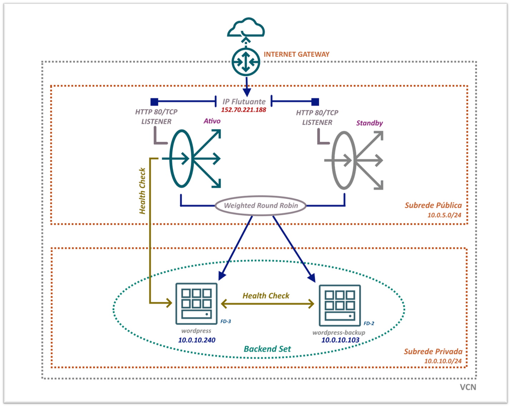

# Capítulo 4: Primeira aplicação no OCI

## 4.5 - Introdução ao Serviço de Load Balancer

### __Visão Geral__

_Load Balancer_, _Balanceador de Carga_ ou _LBaaS_ são alguns nomes que identificam o serviço para _balanceamento de carga_ disponível no _[OCI](https://www.oracle.com/cloud/)_.

Sua principal função é realizar a distribuição do tráfego de um ponto de entrada para vários servidores existentes em sua _[VCN](https://docs.oracle.com/pt-br/iaas/Content/Network/Tasks/managingVCNs_topic-Overview_of_VCNs_and_Subnets.htm)_. Além de distribuir a _"carga de trabalho"_ entre duas ou mais intâncias de computação, há uma melhor utilização dos seus recursos, possibilidade de escalonamento e através da utilização de múltiplas instâncias da sua aplicação, você promove a _["alta disponibilidade"](https://en.wikipedia.org/wiki/High_availability)_.

Existem dois tipos de balanceadores disponíveis no _[OCI](https://www.oracle.com/cloud/)_. São eles:

- **Load Balancing (LB)**
    - Este é um balanceador de carga que opera em _[Camada 7](https://pt.wikipedia.org/wiki/Camada_de_aplica%C3%A7%C3%A3o)_ sobre os protocolos _[HTTP](https://pt.wikipedia.org/wiki/Hypertext_Transfer_Protocol)_, _[HTTPS](https://pt.wikipedia.org/wiki/Hyper_Text_Transfer_Protocol_Secure)_ ou _[HTTP/2](https://pt.wikipedia.org/wiki/HTTP/2)_.
    - Por entender aspectos da aplicação, seu uso é ideal para negociar solicitações _[HTTP](https://pt.wikipedia.org/wiki/Hypertext_Transfer_Protocol)_ que usam _[SSL/TLS](https://pt.wikipedia.org/wiki/Transport_Layer_Security)_ ou não.

- **Network Load Balancing (NLB)**
    - Este é um balanceador de carga que opera em _[Camada 4](https://pt.wikipedia.org/wiki/Camada_de_transporte)_ diretamente sobre os protocolos _[TCP](https://pt.wikipedia.org/wiki/Transmission_Control_Protocol)_ ou _[UDP](https://pt.wikipedia.org/wiki/User_Datagram_Protocol)_.
    - Ele não se importa com a aplicação que pode ser conexões SSH, conexões a um conjunto de bancos de dados, ou conexões Web que utilizam o protocolo _[HTTP](https://pt.wikipedia.org/wiki/Hypertext_Transfer_Protocol)_. Este balanceador se preocupa somente com _"conexões brutas"_ de rede que usam _[TCP](https://pt.wikipedia.org/wiki/Transmission_Control_Protocol)_ ou _[UDP](https://pt.wikipedia.org/wiki/User_Datagram_Protocol)_.
    - O fluxo de rede sempre é encaminhado para o mesmo backend durante a vida útil da conexão. 
 
Pelo fato do _[Network Load Balancing (NLB)](https://docs.oracle.com/pt-br/iaas/Content/NetworkLoadBalancer/overview.htm)_ não _"entender"_ da aplicação, ele é mais simples em termos de configuração. Já o _[Load Balancing (LB)](https://docs.oracle.com/pt-br/iaas/Content/Balance/Concepts/balanceoverview.htm)_, possibilita você configurar aspectos que envolvem o protocolo _[HTTP](https://pt.wikipedia.org/wiki/Hypertext_Transfer_Protocol)_. Há mais opções de configuração.

Como aqui estamos falando de uma aplicação Web, o _[Wordpress](https://pt.wikipedia.org/wiki/WordPress)_, iremos nos atentar aos detalhes que envolvem o _[Load Balancing](https://docs.oracle.com/pt-br/iaas/Content/Balance/Concepts/balanceoverview.htm)_ de _[camada 7](https://pt.wikipedia.org/wiki/Camada_de_aplica%C3%A7%C3%A3o)_. Porém, muito dos conceitos que iremos aprensentar abaixo, se aplicam a ambos balanceadores de cargas.

- **Público ou Privado**
    - Um balanceador de carga _**público**_ é criado em uma subrede pública com um endereço IP público e acessível pela internet. Este pode ser criado em uma subrede regional no qual irá consumir dois endereços IPs privados, ou pode ser criado em duas subredes públicas sobre dois _[ADs](https://docs.oracle.com/pt-br/iaas/Content/General/Concepts/regions.htm#About)_ diferentes, consumindo dois endereços IPs privados por _[ADs](https://docs.oracle.com/pt-br/iaas/Content/General/Concepts/regions.htm#About)_.
   - Já um balancedor de carga _**privado**_ é criado em uma subrede privada com o intuito de não receber requisições pela internet e fazer _"frente"_ somente com recursos internos. Neste caso, será consumido três endereços IPs privados da subrede.
    - Em ambos, há um endereço IP principal que possui a característica de ser _"flutuante"_. Ou seja, ele se alternará para o balanceador de carga secundário (standby) em caso de falha no principal (ativo).

- **Listener**
    - Você configura um _**listener**_ para tratar conexões através dos protocolos de _[Camada 7](https://pt.wikipedia.org/wiki/Camada_de_aplica%C3%A7%C3%A3o)_ (_[HTTP](https://pt.wikipedia.org/wiki/Hypertext_Transfer_Protocol)_, _[HTTPS](https://pt.wikipedia.org/wiki/Hyper_Text_Transfer_Protocol_Secure)_ ou _[HTTP/2](https://pt.wikipedia.org/wiki/HTTP/2)_) ou _[Camada 4](https://pt.wikipedia.org/wiki/Camada_de_transporte)_ (_[TCP](https://pt.wikipedia.org/wiki/Transmission_Control_Protocol)_) em portas específicas.
    - Você pode definir vários _**listener**_ que tratam um determinado protocolo em portas diferentes.

- **Backend**    
    - Um _"conjunto de backend"_ é uma entidade lógica onde é possível agrupar suas instâncias de aplicação que são responsáveis por gerar conteúdo em resposta ao tráfego TCP ou HTTP recebido.        
    - A ideia é sempre ter mais de uma instância (cópia) da sua aplicação dentro de uma configuração de _backend_, empregando assim a _["alta disponibilidade"](https://en.wikipedia.org/wiki/High_availability)_.
    - É possível escolher instâncias de diferentes compartimentos para compor o seu _"conjunto de backend"_.
    - Configurar a comunicação através do protocolo _[SSL](https://pt.wikipedia.org/wiki/Transport_Layer_Security)_, a partir do _[Load Balancer](https://docs.oracle.com/pt-br/iaas/Content/Balance/Concepts/balanceoverview.htm)_ até o _"conjunto de backend"_, é possível porém opcional.

- **Health Check**
    - _"Health Check"_ ou verificação de integridade, é um teste realizado pelo _[Load Balancer](https://docs.oracle.com/pt-br/iaas/Content/Balance/Concepts/balanceoverview.htm)_ para confirmar a disponibilidade das suas instâncias contidas no _"conjunto de backend"_ (monitorar). Caso uma instância não responda com sucesso ao teste, o _[Load Balancer](https://docs.oracle.com/pt-br/iaas/Content/Balance/Concepts/balanceoverview.htm)_ retira temporariamente esta do _"conjunto de backend"_ (fora de rotação). O teste continua e caso futuramente a instância volte a operar, ela é colocada novamente ao _"conjunto de backend"_ e volta a receber requisições da rede.
    - Os testes podem ser feitos em nível _[TCP](https://pt.wikipedia.org/wiki/Transmission_Control_Protocol)_ (abertura de _[socket](https://pt.wikipedia.org/wiki/Soquete_de_rede)_) ou consultando diretamente a aplicação, por uma _[URI](https://pt.wikipedia.org/wiki/URI)_ que você especifica. 
    - Realizar testes via _[URI](https://pt.wikipedia.org/wiki/URI)_ é considerado um teste mais preciso sobre a aplicação.

- **Política de Balanceamento**    
    - A _[política de balanceamento](https://docs.oracle.com/pt-br/iaas/Content/Balance/Concepts/balanceoverview.htm#Policies)_ informa como distribuir o tráfego de entrada para o _"conjunto de backend"_.
    - Atualmente temos três diferentes políticas para o _[Load Balancing (LB)](https://docs.oracle.com/pt-br/iaas/Content/Balance/Concepts/balanceoverview.htm)_ de _[camada 7](https://pt.wikipedia.org/wiki/Camada_de_aplica%C3%A7%C3%A3o)_:
        1. **Weighted Round Robin (Revezamento)**
            - É um algoritmo de balanceamento simples que distribui o tráfego de forma sequencial para cada instância contida no _"conjunto de backend"_.            
            - Esta é uma política que funciona melhor quando todas as instâncias do _backend_ possuem capacidade computacional semelhante.

        2. **IP hash**
            - Esta política calcula um _[Hash](https://pt.wikipedia.org/wiki/Fun%C3%A7%C3%A3o_hash)_ sobre o IP de origem de uma solicitação recebida, com a finalidade de enviar o tráfego para a mesma instância do _backend_.
            - Garante que as solicitações de um cliente específico sejam sempre direcionadas para o mesmo servidor no _backend_.
        
        3. **Least connections (Menos conexões)**
            - Esta política irá encaminhar tráfego para a instância de  _backend_ com menos conexões ativas.

    - Para o _[Network Load Balancing (NLB)](https://docs.oracle.com/pt-br/iaas/Content/NetworkLoadBalancer/overview.htm)_, existem políticas diferentes que atuam em informações providas sobre o endereço IP de origem/destino, portas e protocolos (_[TCP](https://pt.wikipedia.org/wiki/Transmission_Control_Protocol)_, _[UDP](https://pt.wikipedia.org/wiki/User_Datagram_Protocol)_ ou ambos).

- **HTTPS e certificados SSL**
    - O _[Serviço de Load Balancing](https://docs.oracle.com/pt-br/iaas/Content/Balance/Concepts/balanceoverview.htm)_ permite tratar conexões seguras através da configuração de um _listener_ que utiliza o protocolo _[HTTPS](https://pt.wikipedia.org/wiki/Hyper_Text_Transfer_Protocol_Secure)_. Este requer que você faça o upload do seu certificado público, chave privada correspondente e quaisquer outros certificados associados. 
    - _[Gerenciar certificados SSL](https://docs.oracle.com/pt-br/iaas/Content/Balance/Tasks/managingcertificates.htm)_ no _[Load Balancer](https://docs.oracle.com/pt-br/iaas/Content/Balance/Concepts/balanceoverview.htm)_ facilita a administração, evita configuração e sobrecarga computacional ao tratar conexões criptografadas nos servidores de aplicação.
    - Ao configurar seus certificados SSL, é possível especificar diferentes _[suítes de cifragem](https://docs.oracle.com/pt-br/iaas/Content/Balance/Tasks/managingciphersuites.htm)_ _TLS 1.0_, _1.1_ ou _1.2_, que ajudam a manter compatibilidade com sistemas antigos (legado).

- **Shape**
    - Você especifica qual é a largura de banda da rede disponível para o serviço de _[Load Balancing (LB)](https://docs.oracle.com/pt-br/iaas/Content/Balance/Concepts/balanceoverview.htm)_. 
    - Existem dois tipos de shapes disponíveis:
        1. **Flexible Shapes**
            - Nesta configuração você especifica um range de valores, minímo que comecá em _10 Mbps_, e máximo até _8000 Mbps_.
        
        1. **Dynamic Shapes**
            - São valores fixos entre: _10 Mbps (Micro)_, _100 Mbps (Small)_, _400 Mbps (Medium)_ e _8000 Mbps (Large)_.
            
    - Você não define _shape_ no _[Network Load Balancing (NLB)](https://docs.oracle.com/pt-br/iaas/Content/NetworkLoadBalancer/overview.htm)_. Este é um serviço que escala de modo automático, de acordo com as necessidades de largura de banda da rede.

Estes são os principais conceitos que envolvem os balanceadores de carga a disposição no _[OCI](https://www.oracle.com/cloud/)_. O _[Load Balancing](https://docs.oracle.com/pt-br/iaas/Content/Balance/Concepts/balanceoverview.htm)_ de _[camada 7](https://pt.wikipedia.org/wiki/Camada_de_aplica%C3%A7%C3%A3o)_ possui ainda mais configurações que serão exploradas em momento oportuno. Estas outras configurações estão ligadas ao protocolo _[HTTP](https://pt.wikipedia.org/wiki/Hypertext_Transfer_Protocol)_, sendo algumas delas: _[Persistência de Sessão](https://docs.oracle.com/pt-br/iaas/Content/Balance/Reference/sessionpersistence.htm)_ através de _[cookies persistentes](https://docs.oracle.com/pt-br/iaas/Content/Balance/Reference/sessionpersistence.htm#cook)_, definições de _[Keep-Alive](https://docs.oracle.com/pt-br/iaas/Content/Balance/Reference/connectionreuse.htm#KeepAliveSettings)_, _[Hosts Virtuais](https://docs.oracle.com/pt-br/iaas/Content/Balance/Tasks/managingrequest.htm)_ entre outras.

### __Criando o Load Balancer__

Ao final deste capítulo, nosso propósito será termos a infraestrutura para a aplicação do _[Wordpress](https://pt.wikipedia.org/wiki/WordPress)_ com um _[Load Balancer](https://docs.oracle.com/pt-br/iaas/Content/Balance/Concepts/balanceoverview.htm)_ público (frontend) e os servidores de aplicação protegidos na subrede privada (backend).



#### __Reservando um Endereço IP Público__

Esta é uma parte bem importante de todo o processo para expor uma aplicação pública. Qualquer recurso criado e que utiliza um _[endereço IP público](https://docs.oracle.com/pt-br/iaas/Content/Network/Tasks/managingpublicIPs.htm#Public_IP_Addresses)_ no _[OCI](https://www.oracle.com/cloud/)_ está sujeito a usar um destes dois tipos:

- **IP Público Efêmero**
    - Temporário e existente durante o tempo de vida do recurso. 
    - Se você excluír o recurso você também excluí o IP público e não há como reutilizá-lo.

- **IP Público Reservado**
    - Persistênte e não está vinculado ao tempo de vida de qualquer recurso.
    - Se você excluír o recurso, este não excluí o IP público.

Após a reserva, o _[endereço IP público](https://docs.oracle.com/pt-br/iaas/Content/Network/Tasks/managingpublicIPs.htm#Public_IP_Addresses)_ passa a ser de _posse_ do seu _[tenancy](https://docs.oracle.com/pt-br/iaas/Content/Identity/Tasks/managingtenancy.htm)_ e você pode usá-lo em qualquer recurso que queira, um de cada vez.

Como já dito, esta é uma ação importante quando estamos projetando uma aplicação pública e disponível por toda internet. Como você vai ver, é necessário pelo menos um endereço IP público e reservado, quando formos configurar o nome _[DNS](https://docs.oracle.com/pt-br/iaas/Content/DNS/Concepts/dnszonemanagement.htm)_ público usado pela aplicação.

>_**__NOTA:__** Após criar um IP público, você não poderá não poderá converter de reservado para efêmero e vice versa._

Para reservarmos o IP no compartimento dos recursos de rede, usamos o comando abaixo:

```
darmbrust@hoodwink:~$ oci network public-ip create \
> --compartment-id "ocid1.compartment.oc1..aaaaaaaauvqvbbx3oridcm5d2ztxkftwr362u2vl5zdsayzbehzwbjs56soq" \
> --lifetime "RESERVED" \
> --display-name "lb_pubip" \
> --wait-for-state "AVAILABLE"
Action completed. Waiting until the resource has entered state: ('AVAILABLE',)
{
  "data": {
    "assigned-entity-id": null,
    "assigned-entity-type": null,
    "availability-domain": null,
    "compartment-id": "ocid1.compartment.oc1..aaaaaaaauvqvbbx3oridcm5d2ztxkftwr362u2vl5zdsayzbehzwbjs56soq",
    "defined-tags": {
      "Oracle-Tags": {
        "CreatedBy": "oracleidentitycloudservice/daniel.armbrust@algumdominio.com",
        "CreatedOn": "2021-09-19T15:09:19.145Z"
      }
    },
    "display-name": "lb_pubip",
    "freeform-tags": {},
    "id": "ocid1.publicip.oc1.sa-saopaulo-1.amaaaaaa6noke4qahrilu4jlhckrdwjsnpvcjvmbdxnpcbcx75xj5wzin22a",
    "ip-address": "152.70.221.188",
    "lifecycle-state": "AVAILABLE",
    "lifetime": "RESERVED",
    "private-ip-id": null,
    "public-ip-pool-id": null,
    "scope": "REGION",
    "time-created": "2021-09-19T15:09:19.306000+00:00"
  },
  "etag": "f6d71ff3"
}
```

Agora temos o _[endereço IP público](https://docs.oracle.com/pt-br/iaas/Content/Network/Tasks/managingpublicIPs.htm#Public_IP_Addresses)_ reservado _152.70.221.188_ exibido pelo valor da propriedade _"ip-address"_ do comando acima. Este é nosso!

#### __Load Balancer__

Irei detalhar o passo a passo da criação do _[Load Balancer](https://docs.oracle.com/pt-br/iaas/Content/Balance/Concepts/balanceoverview.htm)_ começando pela lista de shapes que temos a disposição:

```
darmbrust@hoodwink:~/oci-book$ oci lb shape list \
> --compartment-id "ocid1.tenancy.oc1..aaaaaaaavv2qh5asjdcoufmb6fzpnrfqgjxxdzlvjrgkrkytnyyz6zgvjnua" \
> --output table
+--------------+
| name         |
+--------------+
| 100Mbps      |
| 10Mbps       |
| 10Mbps-Micro |
| 400Mbps      |
| 8000Mbps     |
| flexible     |
+--------------+
```

Para a aplicação _[Wordpress](https://pt.wikipedia.org/wiki/WordPress)_ utilizaremos o shape de _10Mbps_. Além do shape, temos que informar o OCID da subrede pública _(--subnet-ids)_ e o OCID do _[endereço IP público](https://docs.oracle.com/pt-br/iaas/Content/Network/Tasks/managingpublicIPs.htm#Public_IP_Addresses)_ que reservamos _(--reserved-ips)_:

```
darmbrust@hoodwink:~$ oci lb load-balancer create \
> --compartment-id "ocid1.compartment.oc1..aaaaaaaauvqvbbx3oridcm5d2ztxkftwr362u2vl5zdsayzbehzwbjs56soq" \
> --display-name "lb-pub_wordpress" \
> --shape-name "10Mbps" \
> --subnet-ids '["ocid1.subnet.oc1.sa-saopaulo-1.aaaaaaaax6arj6ccrzlm7fxb4pl4ggrsgig4bwnbvtqaayosdulsyoaliuka"]' \
> --is-private false \
> --reserved-ips '[{"id": "ocid1.publicip.oc1.sa-saopaulo-1.amaaaaaa6noke4qahrilu4jlhckrdwjsnpvcjvmbdxnpcbcx75xj5wzin22a"}]' \
> --wait-for-state "SUCCEEDED"
Action completed. Waiting until the work request has entered state: ('SUCCEEDED',)
{
  "data": {
    "backend-sets": {},
    "certificates": {},
    "compartment-id": "ocid1.compartment.oc1..aaaaaaaauvqvbbx3oridcm5d2ztxkftwr362u2vl5zdsayzbehzwbjs56soq",
    "defined-tags": {
      "Oracle-Tags": {
        "CreatedBy": "oracleidentitycloudservice/daniel.armbrust@algumdominio.com",
        "CreatedOn": "2021-09-19T18:48:15.614Z"
      }
    },
    "display-name": "lb-pub_wordpress",
    "freeform-tags": {},
    "hostnames": {},
    "id": "ocid1.loadbalancer.oc1.sa-saopaulo-1.aaaaaaaa5ledgzqveh3o73m3mnv42pkxcm5y64hjmkwl7tnhvsee2zv7gbga",
    "ip-addresses": [
      {
        "ip-address": "152.70.221.188",
        "is-public": true,
        "reserved-ip": {
          "id": "ocid1.publicip.oc1.sa-saopaulo-1.amaaaaaa6noke4qahrilu4jlhckrdwjsnpvcjvmbdxnpcbcx75xj5wzin22a"
        }
      }
    ],
    "is-private": false,
    "lifecycle-state": "ACTIVE",
    "listeners": {},
    "network-security-group-ids": [],
    "path-route-sets": {},
    "routing-policies": {},
    "rule-sets": {},
    "shape-details": null,
    "shape-name": "10Mbps",
    "ssl-cipher-suites": {},
    "subnet-ids": [
      "ocid1.subnet.oc1.sa-saopaulo-1.aaaaaaaax6arj6ccrzlm7fxb4pl4ggrsgig4bwnbvtqaayosdulsyoaliuka"
    ],
    "system-tags": {},
    "time-created": "2021-09-19T18:48:15.940000+00:00"
  }
}
```

Agora, vamos atualizar o _[NSG](https://docs.oracle.com/pt-br/iaas/Content/Network/Concepts/networksecuritygroups.htm)_ das instâncias da aplicação _[Wordpress](https://pt.wikipedia.org/wiki/WordPress)_ para permitir _"tráfego de entrada (ingress)"_ a partir da subrede pública _(10.0.5.0/24)_ na porta _80/TCP_. Esta é uma ação necessária pois permite o _[serviço de Load Balancing](https://docs.oracle.com/pt-br/iaas/Content/Balance/Concepts/balanceoverview.htm)_ a se comunicar com as instâncias da aplicação, além do teste de _"Health Check"_:

```
darmbrust@hoodwink:~$ oci network nsg rules add \
> --nsg-id "ocid1.networksecuritygroup.oc1.sa-saopaulo-1.aaaaaaaa6jz4tjisvsnk4u7xaxkwmywx72jrkxeyjdpmdwgstt5nw4yzskpa" \
> --security-rules '[
> {"isStateless": false, "protocol": "6", "direction": "INGRESS", "sourceType": "CIDR_BLOCK", "source": "10.0.5.0/24", "tcpOptions": {"destinationPortRange": {"min": 80, "max": 80}}}
> ]'
{
  "data": {
    "security-rules": [
      {
        "description": null,
        "destination": null,
        "destination-type": null,
        "direction": "INGRESS",
        "icmp-options": null,
        "id": "22A0FD",
        "is-stateless": false,
        "is-valid": true,
        "protocol": "6",
        "source": "10.0.5.0/24",
        "source-type": "CIDR_BLOCK",
        "tcp-options": {
          "destination-port-range": {
            "max": 80,
            "min": 80
          },
          "source-port-range": null
        },
        "time-created": "2021-09-19T19:04:23.627000+00:00",
        "udp-options": null
      }
    ]
  }
}
```

O comando abaixo lista quais _[políticas de balanceamento](https://docs.oracle.com/pt-br/iaas/Content/Balance/Concepts/balanceoverview.htm#Policies)_ temos a disposição:

```
darmbrust@hoodwink:~$ oci lb policy list \
> --compartment-id "ocid1.tenancy.oc1..aaaaaaaavv2qh5asjdcoufmb6fzpnrfqgjxxdzlvjrgkrkytnyyz6zgvjnua" \
> --output table
+-------------------+
| name              |
+-------------------+
| ROUND_ROBIN       |
| LEAST_CONNECTIONS |
| IP_HASH           |
+-------------------+
```

Por hora, iremos utilizar a política _ROUND\_ROBIN_. 

É necessário criar o _"conjunto de backend"_ que irá abrigar as instâncias de computação do _[Wordpress](https://pt.wikipedia.org/wiki/WordPress)_. Nesta configuração, iremos informar também os parâmetros do _"Health Check"_ que são:

- --health-checker-protocol "TCP"
    - Teste simples via protocolo _[TCP](https://pt.wikipedia.org/wiki/Transmission_Control_Protocol)_.

- --health-checker-port 80
    - Porta _[TCP](https://pt.wikipedia.org/wiki/Transmission_Control_Protocol)_ que será testada. Como sabemos, será a porta do _[HTTP Apache](https://pt.wikipedia.org/wiki/Servidor_Apache)_ em estado _"OPEN"_ nas instâncias.

- --health-checker-interval-in-ms 120000
    - Intervalo de tempo em milissegundos no qual serão realizadas as verificações. 
    - Em nosso caso a porta _80/TCP_ será veficada a cada _2 minutos (120000 milisegundos)_.

- --health-checker-timeout-in-ms 60000
    - Tempo _TIMEOUT_ em milissegundos das verificações. 
    - Em nosso caso, o teste irá aguardar uma resposta em até no máximo _1 minuto (60000 milisegundos)_ antes de considerar uma falha.

- --health-checker-retries 2
    - Número de tentativas antes de considerar _"em falha"_ uma instância do _backend_.

Juntando tudo, criaremos o _backend-set_:

```
darmbrust@hoodwink:~$ oci lb backend-set create \
> --load-balancer-id "ocid1.loadbalancer.oc1.sa-saopaulo-1.aaaaaaaa5ledgzqveh3o73m3mnv42pkxcm5y64hjmkwl7tnhvsee2zv7gbga" \
> --name "lb-pub_wordpress_backend" \
> --policy "ROUND_ROBIN" \
> --health-checker-protocol "TCP" \
> --health-checker-port 80 \
> --health-checker-interval-in-ms 120000 \
> --health-checker-timeout-in-ms 60000 \
> --health-checker-retries 2 \
> --wait-for-state "SUCCEEDED"
Action completed. Waiting until the work request has entered state: ('SUCCEEDED',)
{
  "data": {
    "compartment-id": "ocid1.compartment.oc1..aaaaaaaauvqvbbx3oridcm5d2ztxkftwr362u2vl5zdsayzbehzwbjs56soq",
    "error-details": [],
    "id": "ocid1.loadbalancerworkrequest.oc1.sa-saopaulo-1.aaaaaaaaxorggoywgervv72rgxpw6vvxdc7znkf3m27dwwlzecz3qagobhaq",
    "lifecycle-state": "SUCCEEDED",
    "load-balancer-id": "ocid1.loadbalancer.oc1.sa-saopaulo-1.aaaaaaaa5ledgzqveh3o73m3mnv42pkxcm5y64hjmkwl7tnhvsee2zv7gbga",
    "message": "{\n    \"eventId\" : \"a44efb3c-cc6c-44af-bf22-c02f0f23413e\",\n    \"loadBalancerId\" : \"ocid1.loadbalancer.oc1.sa-saopaulo-1.aaaaaaaa5ledgzqveh3o73m3mnv42pkxcm5y64hjmkwl7tnhvsee2zv7gbga\",\n    \"workflowName\" : \"AddBackendSetWorkflow\",\n    \"type\" : \"SUCCESS\",\n    \"message\" : \"OK\",\n    \"workRequestId\" : \"ocid1.loadbalancerworkrequest.oc1.sa-saopaulo-1.aaaaaaaaxorggoywgervv72rgxpw6vvxdc7znkf3m27dwwlzecz3qagobhaq\"\n  }",
    "time-accepted": "2021-09-19T20:01:50.738000+00:00",
    "time-finished": "2021-09-19T20:02:01.702000+00:00",
    "type": "CreateBackendSet"
  }
}
```

Irei inserir as duas instâncias que temos no _"conjunto de backend"_ que foi criado. A primeira é a instância principal e recebe o parâmetro _"--backup false"_:

```
darmbrust@hoodwink:~$ oci lb backend create \
> --load-balancer-id "ocid1.loadbalancer.oc1.sa-saopaulo-1.aaaaaaaa5ledgzqveh3o73m3mnv42pkxcm5y64hjmkwl7tnhvsee2zv7gbga" \
> --backend-set-name "lb-pub_wordpress_backend" \
> --ip-address 10.0.10.240 \
> --port 80 \
> --backup false \
> --offline false \
> --wait-for-state "SUCCEEDED"
```

Já a segunda instância irá receber o parâmetro _"--backup true"_:

```
darmbrust@hoodwink:~$ oci lb backend create \
> --load-balancer-id "ocid1.loadbalancer.oc1.sa-saopaulo-1.aaaaaaaa5ledgzqveh3o73m3mnv42pkxcm5y64hjmkwl7tnhvsee2zv7gbga" \
> --backend-set-name "lb-pub_wordpress_backend" \
> --ip-address 10.0.10.103 \
> --port 80 \
> --backup true \
> --offline false \
> --wait-for-state "SUCCEEDED"
```

Depois de alguns minutos, é possível verificar a saúde geral do _[Load Balancer](https://docs.oracle.com/pt-br/iaas/Content/Balance/Concepts/balanceoverview.htm)_ com o comando abaixo:

```
darmbrust@hoodwink:~$ oci lb backend-set-health get \
> --load-balancer-id "ocid1.loadbalancer.oc1.sa-saopaulo-1.aaaaaaaa5ledgzqveh3o73m3mnv42pkxcm5y64hjmkwl7tnhvsee2zv7gbga" \
> --backend-set-name "lb-pub_wordpress_backend"
{
  "data": {
    "critical-state-backend-names": [],
    "status": "OK",
    "total-backend-count": 2,
    "unknown-state-backend-names": [],
    "warning-state-backend-names": []
  }
}
```

Por último, a criação do _listener_ que usa o protocolo _[HTTP](https://pt.wikipedia.org/wiki/Hypertext_Transfer_Protocol)_ também na porta _80/TCP_:

```
darmbrust@hoodwink:~$ oci lb listener create \
> --load-balancer-id "ocid1.loadbalancer.oc1.sa-saopaulo-1.aaaaaaaa6ciautk2hpj3lixy2vwnkzkbq5626rs5punot65pkqr4xw7kh7ma" \
> --default-backend-set-name "lb-pub_wordpress_backend" \
> --name "lb-pub_lst_wordpress" \
> --port 80 \
> --protocol "HTTP" \
> --wait-for-state "SUCCEEDED"
```

Pronto! Após alguns minutos já é possível ver a aplicação _[Wordpress](https://pt.wikipedia.org/wiki/WordPress)_ respondendo através do _[Load Balancer](https://docs.oracle.com/pt-br/iaas/Content/Balance/Concepts/balanceoverview.htm)_ criado:

```
darmbrust@hoodwink:~$ curl -v http://152.70.221.188
*   Trying 152.70.221.188:80...
* TCP_NODELAY set
* Connected to 152.70.221.188 (152.70.221.188) port 80 (#0)
> GET / HTTP/1.1
> Host: 152.70.221.188
> User-Agent: curl/7.68.0
> Accept: */*
>
* Mark bundle as not supporting multiuse
< HTTP/1.1 302 Found
< Date: Sun, 19 Sep 2021 22:10:49 GMT
< Content-Type: text/html; charset=UTF-8
< Content-Length: 0
< Connection: keep-alive
< X-Powered-By: PHP/7.4.23
< Location: http://152.70.221.188/wp-admin/setup-config.php
<
* Connection #0 to host 152.70.221.188 left intact
```

>_**__NOTA:__** Caso não obtenha resposta, confirme se a [Security List](https://docs.oracle.com/en-us/iaas/api/#/en/iaas/20160918/datatypes/IngressSecurityRule) da subrede pública onde foi criado o [Load Balancer](https://docs.oracle.com/pt-br/iaas/Content/Balance/Concepts/balanceoverview.htm) possui as corretas regras que permitam o acesso._