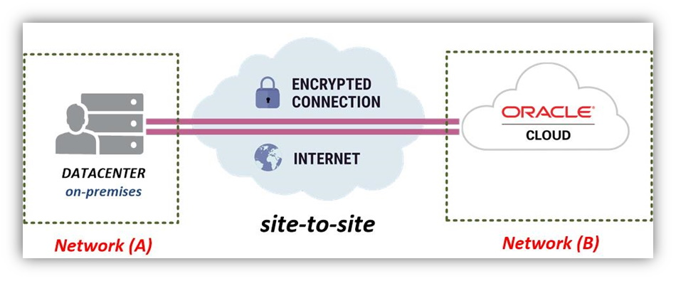

# Capítulo 5: Mais sobre Redes no OCI

## 5.2 - Conexão ao OCI através de VPN

### __Visão Geral__

Hoje em dia sabemos que muitas organizações estão migrando seus ativos computacionais para a Cloud por conta dos inúmeros benefícios que isto agrega. Podemos citar algumas vantagens na sua utilização como:

- A capacidade computacional pode ser ajustada automaticamente conforme demanda (_[Autoscaling](https://en.wikipedia.org/wiki/Autoscaling)_).
- Facilidade em provisionar recursos. Podemos criar servidores físicos (_[Bare Metal](https://www.oracle.com/br/cloud/compute/bare-metal.html)_) e Virtuais, alocar storage, utilizar serviços, tudo de forma ágil e com facilidade.
- Pagamos somente aquilo que usamos (_[Pay As You Go](https://en.wikipedia.org/wiki/Pay-as-you-use)_).
- Foco nos negócios e não mais em detalhes técnicos relacionados à TI.

Sobre as vantagens apresentadas, podemos dizer que a tecnologia deixa de ser uma _"preocupação"_ e se torna um instrumento ágil quando você adere a _[Cloud Computing](https://docs.oracle.com/en/cloud/get-started/subscriptions-cloud/csgsg/oracle-cloud.html)_.

Porém esta transição não acontece do dia para a noite. Iremos exemplificar como podemos conectar um data center qualquer _(on-premises)_ através de uma _[VPN](https://pt.wikipedia.org/wiki/Rede_privada_virtual)_ ao _[OCI](https://www.oracle.com/cloud/)_.

Diferente das sessões de acessos pontuais que usamos através do _[Serviço Bastion](https://docs.oracle.com/pt-br/iaas/Content/Bastion/Concepts/bastionoverview.htm)_, a _[VPN](https://pt.wikipedia.org/wiki/Rede_privada_virtual)_ é um meio de conexão ao _[OCI](https://www.oracle.com/cloud/)_ permantente que depende da Internet para funcionar.

### __O que é uma VPN?__

Uma _[VPN](https://pt.wikipedia.org/wiki/Rede_privada_virtual)_ (_[Virtual Private Network](https://pt.wikipedia.org/wiki/Rede_privada_virtual)_) ou _[Rede privada virtual](https://pt.wikipedia.org/wiki/Rede_privada_virtual)_, é uma rede de comunicação construída sobre uma infraestrutura compartilhada. Para o nosso exemplo, essa infraestrutura compartilhada será um link público de Internet.

Seu propósito é criar _"túneis criptografados"_ entre dois pontos autorizados que neste caso são um data center local _(on-premises)_ e o _[OCI](https://www.oracle.com/cloud/)_. Este _"túnel criptografado"_ mantém os dados que trafegam, seguros e confiáveis, através de técnicas de criptografia. Usa-se a internet por ser financeiramente mais barato do que adquirir links de dados dedicados.

Basicamente existem dois tipos de _[VPN](https://pt.wikipedia.org/wiki/Rede_privada_virtual)_:

- _[Client-To-Site (Host-To-Network)](https://pt.wikipedia.org/wiki/Rede_privada_virtual#Tipos)_ ou _[Remote Access](https://pt.wikipedia.org/wiki/Rede_privada_virtual#Tipos)_
- _[Site-To-Site (Router-To-Router)](https://pt.wikipedia.org/wiki/Rede_privada_virtual#Tipos)_

 Aqui, iremos nos concentrar na _[VPN](https://pt.wikipedia.org/wiki/Rede_privada_virtual)_ do tipo _[Site-To-Site](https://pt.wikipedia.org/wiki/Rede_privada_virtual#Tipos)_, pois nosso objetivo é conectar a rede de um _data center (Network-A)_ ao _[OCI](https://www.oracle.com/cloud/) (Network-B)_. 



O _[OCI](https://www.oracle.com/cloud/)_ disponibiliza o serviço _[VPN Site-to-Site](https://docs.oracle.com/pt-br/iaas/Content/Network/Tasks/overviewIPsec.htm)_, que nada mais é do que um serviço gerenciado pela própria Oracle e que utiliza o protocolo _[IPSec](https://pt.wikipedia.org/wiki/IPsec)_ para a construção de _[VPNs](https://pt.wikipedia.org/wiki/Rede_privada_virtual)_.

### __Falando um pouco sobre IPSec__

_[Internet Protocol Security](https://pt.wikipedia.org/wiki/IPsec)_ ou _[IPSec](https://pt.wikipedia.org/wiki/IPsec)_, é um conjunto de protocolos que basicamente autêntica e criptografa os pacotes de dados trocados entre duas redes _(Network A e B)_. O tráfego IP é criptografado antes que os pacotes sejam transferidos da origem para o destino, e descriptografados quando ele chega.

O _[IPSec](https://pt.wikipedia.org/wiki/IPsec)_ pode ser configurado a partir de um dos modos abaixo:

- **Modo de Transporte (Transport mode)**
    - O _[IPSec](https://pt.wikipedia.org/wiki/IPsec)_ criptografa e autêntica somente o _payload do pacote (dados)_. Informações contidas no cabeçalho do pacote não são alteradas.

- **Modo Túnel (Tunnel mode)**
    - Aqui o _[IPSec](https://pt.wikipedia.org/wiki/IPsec)_ criptografa e autêntica todo o pacote. Após isto, o pacote original já com seus dados criptografados, é colocado dentro de um novo pacote gerado (pacote original é encapsulado em um novo pacote).

Além de ser o mais seguro, o _"Modo Túnel"_  é o único suportado pelo _[OCI](https://www.oracle.com/cloud/)_.

### Conectando meu data center ao OCI

Há vários dispositivos ou softwares existentes no mercado no qual é possível ser utilizado para realizar conectividade via _[VPN](https://pt.wikipedia.org/wiki/Rede_privada_virtual)_ ao _[OCI](https://www.oracle.com/cloud/)_. A _Oracle_ testa, verifica e disponibiliza, todo o passo a passo de configuração por dispositivo ou software, de diversos fabricantes diferentes neste _[link aqui](https://docs.oracle.com/pt-br/iaas/Content/Network/Reference/CPElist.htm)_.

Esta lista dos diferentes fabricantes e versões, também pode ser consultada pelo comando abaixo:

```
darmbrust@hoodwink:~$ oci network cpe-device-shape list \
> --all \
> --query "data[].{vendor: \"cpe-device-info\".vendor, version: \"cpe-device-info\".\"platform-software-version\"}" \
> --output table
+-------------+--------------------------------------------------------------------+
| vendor      | version                                                            |
+-------------+--------------------------------------------------------------------+
| Palo Alto   | PAN-OS 8.0.0                                                       |
| Cisco       | IOS version 15.4M or later                                         |
| WatchGuard  | Firebox with Fireware v12                                          |
| Fortinet    | FortiGate 6.0.4 or later                                           |
| Cisco       | ASA Route-Based VPN 9.7.1 or later                                 |
| Libreswan   | 3.18 or later                                                      |
| Juniper     | SRX Series - JunOS 11.0 or later                                   |
| Juniper     | MX Series - JunOS 15.1 or later                                    |
| Yamaha      | RTX RTX830 Firmware Rev.15.02.03                                   |
| Yamaha      | RTX RTX1210 Firmware Rev.14.01.28                                  |
| Other       | N.A                                                                |
| Cisco       | ASA Policy-Based VPN 8.5+ (single tunnel, static)                  |
| Check Point | R80.20                                                             |
| Furukawa    | FITELnet-F220/F221 Firmware 01.00(00)[0]00.00.0 [2019/07/05 15:00] |
| NEC         | IX Series 10.1.16                                                  |
+-------------+--------------------------------------------------------------------+
```

Neste nosso exemplo, iremos demonstrar a configuração do software _[Libreswan](https://libreswan.org/)_ em um servidor _[Oracle Linux](https://www.oracle.com/linux/)_ localizado em um data center qualquer _(on-premises)_.

_[Libreswan](https://libreswan.org/)_ é uma implementação do protocolo _[IPSec](https://pt.wikipedia.org/wiki/IPsec)_ de _[código aberto](https://en.wikipedia.org/wiki/Open_source)_, baseado no _[FreeS/WAN](https://www.freeswan.org/)_ e _[Openswan](https://www.openswan.org/)_. Para este nosso exemplo, será necessário:

- **Libreswan >= 3.18**
- **Linux Kernel 3.x ou 4.x**

>_**__NOTA:__** Iremos utilizar em nosso data center fictício uma máquina com [Oracle Linux versão 7.9](https://docs.oracle.com/en/operating-systems/oracle-linux/7/relnotes7.9/index.html), pois ele já contempla as versões de software que precisamos._ 

Antes de mais nada, precisamos criar um _[DRG](https://docs.oracle.com/pt-br/iaas/Content/Network/Tasks/managingDRGs.htm)_ e anexá-lo a _vcn-hub_ de acordo com o nosso exemplo. O _[DRG](https://docs.oracle.com/pt-br/iaas/Content/Network/Tasks/managingDRGs.htm)_ é uma _"peça"_ fundamental, pois é a partir dele que será possível criar os túneis _[IPSec](https://pt.wikipedia.org/wiki/IPsec)_.

```
darmbrust@hoodwink:~$ oci network drg create \
> --compartment-id "ocid1.compartment.oc1..aaaaaaaauvqvbbx3oridcm5d2ztxkftwr362u2vl5zdsayzbehzwbjs56soq" \
> --display-name "drg-saopaulo" \
> --wait-for-state "AVAILABLE"
```

Para anexar, usamos o comando abaixo:

```
darmbrust@hoodwink:~$ oci network drg-attachment create \
> --drg-id "ocid1.drg.oc1.sa-saopaulo-1.aaaaaaaaan7n3zxikyf6ga4zeqbffhu4zhst5goxumb4cei5awdd4r5q5hhq" \
> --vcn-id "ocid1.vcn.oc1.sa-saopaulo-1.amaaaaaa6noke4qaesd2qse4224ophc5rx2ckte6rukphbsdiky5vq7uflaq" \
> --display-name "vcn-hub_attch_drg-saopaulo" \
> --wait-for-state "ATTACHED"
Action completed. Waiting until the resource has entered state: ('ATTACHED',)
{
  "data": {
    "compartment-id": "ocid1.compartment.oc1..aaaaaaaauvqvbbx3oridcm5d2ztxkftwr362u2vl5zdsayzbehzwbjs56soq",
    "defined-tags": {},
    "display-name": "vcn-hub_attch_drg-saopaulo",
    "drg-id": "ocid1.drg.oc1.sa-saopaulo-1.aaaaaaaaan7n3zxikyf6ga4zeqbffhu4zhst5goxumb4cei5awdd4r5q5hhq",
    "drg-route-table-id": "ocid1.drgroutetable.oc1.sa-saopaulo-1.aaaaaaaatjlinzltqpc5uzrjd7aapa4os5etroqwswk56h6e2ubayi2iw2gq",
    "export-drg-route-distribution-id": null,
    "freeform-tags": {},
    "id": "ocid1.drgattachment.oc1.sa-saopaulo-1.aaaaaaaalw2vitkanr7kwtxzbdhfe4va4izmcym3yjwoii4aqlhbxttdyksa",
    "is-cross-tenancy": false,
    "lifecycle-state": "ATTACHED",
    "network-details": {
      "id": "ocid1.vcn.oc1.sa-saopaulo-1.amaaaaaa6noke4qaesd2qse4224ophc5rx2ckte6rukphbsdiky5vq7uflaq",
      "route-table-id": null,
      "type": "VCN"
    },
    "route-table-id": null,
    "time-created": "2021-10-11T14:33:16.970000+00:00",
    "vcn-id": "ocid1.vcn.oc1.sa-saopaulo-1.amaaaaaa6noke4qaesd2qse4224ophc5rx2ckte6rukphbsdiky5vq7uflaq"
  },
  "etag": "69736179--gzip"
}
```

>_**__NOTA:__** Para detalhes sobre a criação de [VCNs](https://docs.oracle.com/pt-br/iaas/Content/Network/Tasks/managingVCNs_topic-Overview_of_VCNs_and_Subnets.htm), subredes, [DRG](https://docs.oracle.com/pt-br/iaas/Content/Network/Tasks/managingDRGs.htm) e demais componentes de redes no [OCI](https://www.oracle.com/cloud/), consulte os capítulos "[3.1 - Fundamentos do Serviço de Redes](https://github.com/daniel-armbrust/oci-book/blob/main/chapter-3/3-1_fundamentos-redes.md)" e "[5.1 - Conectando múltiplas VCNs na mesma região](https://github.com/daniel-armbrust/oci-book/blob/main/chapter-5/5-1_mais-sobre-redes-multiplas-vcn-lpg-drg.md)"._

### Detalhes sobre o CPE

_[CPE](https://docs.oracle.com/en-us/iaas/Content/Network/Tasks/configuringCPE.htm)_ ou _[Customer-premises Equipment](https://docs.oracle.com/en-us/iaas/Content/Network/Tasks/configuringCPE.htm)_ nada mais é do que um termo usado para representar virtualmente o seu dispositivo ou software de _[VPN](https://pt.wikipedia.org/wiki/Rede_privada_virtual)_, localizado no seu data center _(on-premises)_. Para o nosso exemplo, o _[CPE](https://docs.oracle.com/en-us/iaas/Content/Network/Tasks/configuringCPE.htm)_ é um dispositivo (roteador ou firewall) que possui o endereço IP público _201.33.196.77_. 

Atrás deste dispositivo, está o servidor _[Oracle Linux](https://www.oracle.com/linux/)_ versão _7.9_ no endereço IP _10.34.0.82_:

```
[opc@onpremises ~]$ ip addr sh ens3
2: ens3: <BROADCAST,MULTICAST,UP,LOWER_UP> mtu 9000 qdisc pfifo_fast state UP group default qlen 1000
    link/ether 02:00:17:00:40:7d brd ff:ff:ff:ff:ff:ff
    inet 10.34.0.82/24 brd 10.34.0.255 scope global dynamic ens3
       valid_lft 76954sec preferred_lft 76954sec
    inet6 fe80::17ff:fe00:407d/64 scope link
       valid_lft forever preferred_lft forever
```

Como iremos utilizar o _[Libreswan](https://libreswan.org/)_ para conectividade com o _[OCI](https://www.oracle.com/cloud/)_, ao criar o _[CPE](https://docs.oracle.com/en-us/iaas/Content/Network/Tasks/configuringCPE.htm)_ irei informar o _id_ correspondente ao _[Libreswan](https://libreswan.org/)_.

O comando abaixo pode ser usado para obter este _id_:

```
darmbrust@hoodwink:~$ oci network cpe-device-shape list \
> --all \
> --query "data[?\"cpe-device-info\".vendor=='Libreswan']"
[
  {
    "cpe-device-info": {
      "platform-software-version": "3.18 or later",
      "vendor": "Libreswan"
    },
    "id": "56b1eb67-19c6-4ed1-924e-bad6e227f5ba"
  }
]
```

Agora, podemos criar o _[CPE](https://docs.oracle.com/en-us/iaas/Content/Network/Tasks/configuringCPE.htm)_ específico para _[Libreswan](https://libreswan.org/)_:

```
darmbrust@hoodwink:~$ oci network cpe create \
> --compartment-id "ocid1.compartment.oc1..aaaaaaaauvqvbbx3oridcm5d2ztxkftwr362u2vl5zdsayzbehzwbjs56soq" \
> --ip-address "201.33.196.77" \
> --cpe-device-shape-id "56b1eb67-19c6-4ed1-924e-bad6e227f5ba" \
> --display-name "cpe-1" 
{
  "data": {
    "compartment-id": "ocid1.compartment.oc1..aaaaaaaauvqvbbx3oridcm5d2ztxkftwr362u2vl5zdsayzbehzwbjs56soq",
    "cpe-device-shape-id": "56b1eb67-19c6-4ed1-924e-bad6e227f5ba",
    "defined-tags": {
      "Oracle-Tags": {
        "CreatedBy": "oracleidentitycloudservice/daniel.armbrust@algumdominio.com",
        "CreatedOn": "2021-10-11T18:57:13.115Z"
      }
    },
    "display-name": "cpe-1",
    "freeform-tags": {},
    "id": "ocid1.cpe.oc1.sa-saopaulo-1.aaaaaaaaq4duvw3wi4cpzx7zsjolhsqkhg6nt5lnnko65u3zqsinmwdzyhhq",
    "ip-address": "201.33.196.77",
    "time-created": "2021-10-11T18:57:13.126000+00:00"
  },
  "etag": "110ce961b27d0bc8f58b41fb08ab2623"
}
```

>_**__NOTA:__** Como já foi dito, um [CPE](https://docs.oracle.com/en-us/iaas/Content/Network/Tasks/configuringCPE.htm) somente tem a função de representar o seu dispositivo ou software de [VPN](https://pt.wikipedia.org/wiki/Rede_privada_virtual). O parâmetro "--cpe-device-shape-id" usado na criação do mesmo é opcional e só tem sentido informativo. Este não intefere em nada no seu funcionamento. Caso você não especifique, o valor "others" será usado._

Antes de deixar esta parte, quero descrever algo importante.

Em nosso exemplo, toda comunicação que o servidor _[Oracle Linux](https://www.oracle.com/linux/) (onpremises)_ faz com a Internet passa por um dispositivo de _"borda"_. Este executa um _[NAT](https://pt.wikipedia.org/wiki/Network_address_translation)_, que _"troca"_ o endereço IP privado _10.34.0.82_ para o endereço IP público _201.33.196.77_, válido e que permite comunicação na Internet (também chamado de endereço roteável). Em resumo, a técnica _[NAT](https://pt.wikipedia.org/wiki/Network_address_translation)_ se faz necessário pois os endereços IPs da rede privada não conseguem se comunicar diretamente com outros servidores na Internet, sem um endereço IP público.

Lembrando que uma das principais características do protocolo _[IPSec](https://pt.wikipedia.org/wiki/IPsec)_ é prover _confidencialidade_, _autenticidade_ e _integridade dos dados_ trafegados. Toda vez que um pacote de dados é criado pela _[VPN](https://pt.wikipedia.org/wiki/Rede_privada_virtual)_, e passa por um dispositivo _([CPE](https://docs.oracle.com/en-us/iaas/Content/Network/Tasks/configuringCPE.htm))_ que faz um _[NAT](https://pt.wikipedia.org/wiki/Network_address_translation)_, ele perde sua _autenticidade_ e _integridade_. Isto se dá pelo fato da técnica _[NAT](https://pt.wikipedia.org/wiki/Network_address_translation)_ alterar o pacote de dados. Se um pacote de dados for alterado, ele será _"descartado" (dropado)_, pela funcionalidade do _[IPSec](https://pt.wikipedia.org/wiki/IPsec)_.

Expliquei toda essa teoria, para que fique claro alguns parâmetros mandatórios, quando formos configurar o _túnel [IPSec](https://pt.wikipedia.org/wiki/IPsec)_. Com isto, não teremos problemas em relação a existência deste _[NAT](https://pt.wikipedia.org/wiki/Network_address_translation)_. Alguns outros detalhes também podem ser verificados _[aqui](https://docs.oracle.com/pt-br/iaas/Content/Network/Tasks/overviewIPsec.htm#nat)_.

### Criando a conexão IPSec

Quando se cria uma conexão _[IPSec](https://pt.wikipedia.org/wiki/IPsec)_ através de um _[DRG](https://docs.oracle.com/pt-br/iaas/Content/Network/Tasks/managingDRGs.htm)_, o _[OCI](https://www.oracle.com/cloud/)_ disponibiliza _dois túneis redundantes_. A _[Oracle](https://www.oracle.com/cloud/)_ recomenda que você utilize ambos os túneis (se o seu dispositivo suportar essa configuração).

Para cada túnel em separado, há a possibilidade de escolher qual é o _tipo de roteamento_ que será usado. Existem dois, são eles:

- **Roteamento dinâmico via BGP**
    - As rotas disponíveis são obtidas dinamicamente através do protocolo _[BGP (Border Gateway Protocol)](https://pt.wikipedia.org/wiki/Border_Gateway_Protocol)_. Isto quer dizer que o _[DRG](https://docs.oracle.com/pt-br/iaas/Content/Network/Tasks/managingDRGs.htm)_ obtém dinamicamente as rotas do seu _on-premises_, além também de _"anunciar"_ os endereços das subredes presentes nas _[VCNs](https://docs.oracle.com/pt-br/iaas/Content/Network/Tasks/managingVCNs_topic-Overview_of_VCNs_and_Subnets.htm)_ do _[OCI](https://www.oracle.com/cloud/)_ ao _on-premises_.
   
- **Roteamento estático**
    - É o meio pelo qual você informa _manualmente_ quais as redes do seu _on-premises_ que serão _"alcançadas"_ pelo túnel _[IPSec](https://pt.wikipedia.org/wiki/IPsec)_ que foi criado no _[OCI](https://www.oracle.com/cloud/)_. O termo _["roteamento estático"](https://en.wikipedia.org/wiki/Static_routing)_ está associado a _ação manual_ de inserir as informações das redes, ao contrário do meio automático e dinâmico disponível pelo protocolo _[BGP (Border Gateway Protocol)](https://pt.wikipedia.org/wiki/Border_Gateway_Protocol)_, por exemplo.

Apesar de ser possível usar _roteamento dinâmico_ para um túnel e _estático_ para o outro, é recomendado usar um tipo só para ambos. Isto simplifica as suas configurações. A exceção é por conta de você estar em um processo de transição entre _[roteamento estático](https://en.wikipedia.org/wiki/Static_routing)_ e _[BGP](https://pt.wikipedia.org/wiki/Border_Gateway_Protocol)_. Um túnel ainda pode usar temporariamente o _[roteamento estático](https://en.wikipedia.org/wiki/Static_routing)_ enquanto o outro já foi  alternado para usar _[BGP](https://pt.wikipedia.org/wiki/Border_Gateway_Protocol)_.

Quando há poucas redes, como é o nosso caso de exemplo, utilizar _[roteamento estático](https://en.wikipedia.org/wiki/Static_routing)_ é o meio mais indicado e simples de ser feito. Por isto, usaremos _[roteamento estático](https://en.wikipedia.org/wiki/Static_routing)_ aqui.

>_**__NOTA:__** O [OCI](https://www.oracle.com/cloud/) usa **roteamento assimétrico** dos túneis que constituem a conexão [IPSec](https://pt.wikipedia.org/wiki/IPsec). Mesmo se você configurar um túnel como primário e outro como backup, o tráfego da sua [VCN](https://docs.oracle.com/pt-br/iaas/Content/Network/Tasks/managingVCNs_topic-Overview_of_VCNs_and_Subnets.htm) para o seu on-premises, pode usar qualquer túnel marcado como "ativo". Configure seus firewalls de acordo, caso contrário a conectividade não irá funcionar._

A primeira atividade antes de criarmos a conexão _[IPSec](https://pt.wikipedia.org/wiki/IPsec)_ é a geração do chamado _"Segredo Compartilhado do Túnel" ([Shared Secret](https://en.wikipedia.org/wiki/Shared_secret))_. Este nada mais é do que uma _[string](https://pt.wikipedia.org/wiki/Cadeia_de_caracteres)_ que será usada para criar os pacotes que são criptografados pelo _[IPSec](https://pt.wikipedia.org/wiki/IPsec)_. 

Tecnicamente falando, uma _[Shared Secret](https://en.wikipedia.org/wiki/Shared_secret)_ é usada por _"[Algoritmos de Chave Simétrica](https://pt.wikipedia.org/wiki/Algoritmo_de_chave_sim%C3%A9trica)_" e que usam a mesma _chave criptográfica_ para _encriptação_ e _decriptação_ dos dados. Mantenha sua _[Shared Secret](https://en.wikipedia.org/wiki/Shared_secret)_ segura e compartilhe somente com a outra _"ponta"_ do túnel.

Irei gerar uma _[Shared Secret](https://en.wikipedia.org/wiki/Shared_secret)_ que será usada por nossos dois túneis com o comando abaixo:

```
darmbrust@hoodwink:~$ cat /dev/urandom | tr -dc 'a-zA-Z0-9' | fold -w ${1:-62} | head -n 1
9HdmXoXccY8UErDupAJFTfqwIiii0pa3wfhYcAN3RdFNGo988EcY0khD3yHMFm
```

Lembrando que uma _[Shared Secret](https://en.wikipedia.org/wiki/Shared_secret)_ deve contém apenas letras, números e espaços em branco. Seu comprimento máximo não deve ultrapassar dos _255 caracteres_, e é possível ter uma _[Shared Secret](https://en.wikipedia.org/wiki/Shared_secret)_ diferente por túnel. Ao criar a conexão _[IPSec](https://pt.wikipedia.org/wiki/IPsec)_, se você não especificar um valor para a _[Shared Secret](https://en.wikipedia.org/wiki/Shared_secret)_, o _[OCI](https://www.oracle.com/cloud/)_ irá gerar este valor automaticamente para você.

Abaixo o comando usado para criar o _[IPSec](https://pt.wikipedia.org/wiki/IPsec)_ com as informações que foram apresentadas aqui:

```
darmbrust@hoodwink:~$ oci network ip-sec-connection create \
> --compartment-id "ocid1.compartment.oc1..aaaaaaaauvqvbbx3oridcm5d2ztxkftwr362u2vl5zdsayzbehzwbjs56soq" \
> --cpe-id "ocid1.cpe.oc1.sa-saopaulo-1.aaaaaaaaq4duvw3wi4cpzx7zsjolhsqkhg6nt5lnnko65u3zqsinmwdzyhhq" \
> --drg-id "ocid1.drg.oc1.sa-saopaulo-1.aaaaaaaaan7n3zxikyf6ga4zeqbffhu4zhst5goxumb4cei5awdd4r5q5hhq" \
> --display-name "vpn-1" \
> --static-routes '["10.34.0.0/24"]' \
> --cpe-local-identifier-type "IP_ADDRESS" \
> --cpe-local-identifier "10.34.0.82" \
> --tunnel-configuration '[{"displayName": "tunnel-1_vpn-1", "routing": "STATIC", "sharedSecret": "9HdmXoXccY8UErDupAJFTfqwIiii0pa3wfhYcAN3RdFNGo988EcY0khD3yHMFm"},{"displayName": "tunnel-2_vpn-1", "routing": "STATIC", "sharedSecret": "9HdmXoXccY8UErDupAJFTfqwIiii0pa3wfhYcAN3RdFNGo988EcY0khD3yHMFm"}]' \
> --wait-for-state "AVAILABLE"
Action completed. Waiting until the resource has entered state: ('AVAILABLE',)
{
  "data": {
    "compartment-id": "ocid1.compartment.oc1..aaaaaaaauvqvbbx3oridcm5d2ztxkftwr362u2vl5zdsayzbehzwbjs56soq",
    "cpe-id": "ocid1.cpe.oc1.sa-saopaulo-1.aaaaaaaaq4duvw3wi4cpzx7zsjolhsqkhg6nt5lnnko65u3zqsinmwdzyhhq",
    "cpe-local-identifier": "10.34.0.82",
    "cpe-local-identifier-type": "IP_ADDRESS",
    "defined-tags": {
      "Oracle-Tags": {
        "CreatedBy": "oracleidentitycloudservice/daniel.armbrust@algumdominio.com",
        "CreatedOn": "2021-10-13T14:14:38.151Z"
      }
    },
    "display-name": "vpn-1",
    "drg-id": "ocid1.drg.oc1.sa-saopaulo-1.aaaaaaaaan7n3zxikyf6ga4zeqbffhu4zhst5goxumb4cei5awdd4r5q5hhq",
    "freeform-tags": {},
    "id": "ocid1.ipsecconnection.oc1.sa-saopaulo-1.aaaaaaaak2ofspq67zy2sta4pcsnimdctwkmkwgtib2y7b5gqtm6lkt7koaa",
    "lifecycle-state": "AVAILABLE",
    "static-routes": [
      "10.34.0.0/24"
    ],
    "time-created": "2021-10-13T14:14:38.531000+00:00"
  },
  "etag": "320aa8edf63ab5012a62dcd69c968653--gzip"
}
```

>_**__NOTA:__** Os parâmetros "--cpe-local-identifier-type" e "--cpe-local-identifier" são usados para identificar o [CPE](https://docs.oracle.com/en-us/iaas/Content/Network/Tasks/configuringCPE.htm), que em nosso caso é o endereço IP privado do [Libreswan](https://libreswan.org/). Isto por conta da existência do [NAT](https://pt.wikipedia.org/wiki/Network_address_translation) entre o [Libreswan](https://libreswan.org/) e o [OCI](https://www.oracle.com/cloud/). É possível especificar o hostname ao invés do endereço IP, se for o caso. Consulte este [link aqui](https://docs.oracle.com/en-us/iaas/tools/oci-cli/latest/oci_cli_docs/cmdref/network/ip-sec-connection.html) para mais informações._

Com o comando abaixo, irei obter o endereço IP público dos dois túneis que foram criados:

```
darmbrust@hoodwink:~$ oci network ip-sec-connection get-status \
> --ipsc-id "ocid1.ipsecconnection.oc1.sa-saopaulo-1.aaaaaaaak2ofspq67zy2sta4pcsnimdctwkmkwgtib2y7b5gqtm6lkt7koaa"
{
  "data": {
    "compartment-id": "ocid1.compartment.oc1..aaaaaaaauvqvbbx3oridcm5d2ztxkftwr362u2vl5zdsayzbehzwbjs56soq",
    "id": "ocid1.ipsecconnection.oc1.sa-saopaulo-1.aaaaaaaak2ofspq67zy2sta4pcsnimdctwkmkwgtib2y7b5gqtm6lkt7koaa",
    "time-created": "2021-10-13T14:14:38.531000+00:00",
    "tunnels": [
      {
        "ip-address": "168.138.248.179",
        "lifecycle-state": "DOWN",
        "time-created": "2021-10-13T14:14:39.955000+00:00",
        "time-state-modified": "2021-10-13T14:40:36.526000+00:00"
      },
      {
        "ip-address": "168.138.239.75",
        "lifecycle-state": "DOWN",
        "time-created": "2021-10-13T14:14:39.917000+00:00",
        "time-state-modified": "2021-10-13T14:40:37.700000+00:00"
      }
    ]
  }
}
```

### Configurando o Libreswan

Para deixar evidente as versões do servidor _[Oracle Linux](https://www.oracle.com/linux/)_ que estamos usando no _on-premises_:

```
[darmbrust@onpremises ~]$ cat /etc/oracle-release
Oracle Linux Server release 7.9

[darmbrust@onpremises ~]$ uname -a
Linux onpremises 5.4.17-2102.205.7.3.el7uek.x86_64 #2 SMP Fri Sep 17 16:52:13 PDT 2021 x86_64 x86_64 x86_64 GNU/Linux
```

- **Oracle Linux Server versão 7.9**
- **Kernel versão 5.4.17**

>_**__NOTA:__** Para download do [Oracle Linux](https://www.oracle.com/linux/), consulte informações neste [link aqui](https://yum.oracle.com/oracle-linux-downloads.html?source=:ow:o:p:nav:121620LinuxHero&intcmp=:ow:o:p:nav:121620LinuxHero)._

Antes de começarmos com as configurações, iremos desabilitar o _[firewall](https://firewalld.org/)_ do servidor e colocar o _[SELinux](https://docs.oracle.com/en/operating-systems/oracle-linux/selinux/)_ em _[modo permissive](https://docs.oracle.com/en/operating-systems/oracle-linux/selinux/ol-selinux-1.html#ol-mode-selinux)_. Para isto, execute os comandos abaixo:


- _[Firewall](https://firewalld.org/)_

```
[darmbrust@onpremises ~]$ sudo systemctl stop firewalld

[darmbrust@onpremises ~]$ sudo systemctl disable firewalld
Removed symlink /etc/systemd/system/multi-user.target.wants/firewalld.service.
Removed symlink /etc/systemd/system/dbus-org.fedoraproject.FirewallD1.service.
```

- _[SELinux](https://docs.oracle.com/en/operating-systems/oracle-linux/selinux/)_

```
[darmbrust@onpremises ~]$ sudo setenforce permissive
[darmbrust@onpremises ~]$ sudo sed -i 's/SELINUX=enforcing/SELINUX=permissive/' /etc/selinux/config
```

>_**__NOTA:__** Tanto o [firewall](https://firewalld.org/) quanto o [SELinux](https://docs.oracle.com/en/operating-systems/oracle-linux/selinux/), são aliados importantes de segurança que devemos ter ativos e devidamente configurados em qualquer servidor produtivo. Porém, aqui o nosso foco é a configuração do Libreswan e comunicação com a Cloud da Oracle. Não iremos nos atentar aos detalhes de configuração do  [firewall](https://firewalld.org/) e [SELinux](https://docs.oracle.com/en/operating-systems/oracle-linux/selinux/). Para saber mais, consulte a documentação oficial do [Oracle Linux 7](https://docs.oracle.com/en/operating-systems/oracle-linux/7/admin/pref.html)._

Vamos para a instalação e configuração do _[Libreswan](https://libreswan.org/)_:

```
[darmbrust@onpremises ~]$ sudo yum -y install libreswan
```

Precisamos criar dois arquivos para manter suas configurações. Iremos criá-los com o comando abaixo:

```
[darmbrust@onpremises ~]$ sudo touch /etc/ipsec.d/oci-ipsec.conf
[darmbrust@onpremises ~]$ sudo touch /etc/ipsec.d/oci-ipsec.secrets
```

O arquivo _**/etc/ipsec.d/oci-ipsec.conf**_ irá receber o seguinte conteúdo:

```
[darmbrust@onpremises ~]$ sudo cat /etc/ipsec.d/oci-ipsec.conf
conn oci-tunnel-1
    left=10.34.0.82
    leftid=10.34.0.82
    right=168.138.239.75
    authby=secret
    leftsubnet=0.0.0.0/0
    rightsubnet=0.0.0.0/0
    auto=start
    mark=10/0xffffffff
    vti-interface=vti1
    vti-routing=no
    ikev2=no
    ike=aes_cbc256-sha2_384;modp1536
    phase2alg=aes_gcm256;modp1536
    encapsulation=yes
    ikelifetime=28800s
    salifetime=3600s

conn oci-tunnel-2
    left=10.34.0.82
    leftid=10.34.0.82
    right=168.138.248.179
    authby=secret
    leftsubnet=0.0.0.0/0
    rightsubnet=0.0.0.0/0
    auto=start
    mark=15/0xffffffff
    vti-interface=vti2
    vti-routing=no
    ikev2=no
    ike=aes_cbc256-sha2_384;modp1536
    phase2alg=aes_gcm256;modp1536
    encapsulation=yes
    ikelifetime=28800s
    salifetime=3600s
```

Neste arquivo, existem as configurações dos dois túneis _[IPSec](https://pt.wikipedia.org/wiki/IPsec)_ entre o _[Libreswan](https://libreswan.org/)_ e o _[OCI](https://www.oracle.com/cloud/)_. Os valores para os parâmetros _**left**_ e _**leftid**_, correspondem ao endereço IP privado do _[Libreswan](https://libreswan.org/)_. Já o parâmetro _**right**_, é o endereço IP público de cada um dos túneis que foi criado.

Para o conteúdo do arquivo _**/etc/ipsec.d/oci-ipsec.secrets**_, temos os valores para o _[Shared Secret](https://en.wikipedia.org/wiki/Shared_secret)_ de cada túnel:

```
[darmbrust@onpremises ~]$ sudo cat /etc/ipsec.d/oci-ipsec.secrets
10.34.0.82 168.138.239.75: PSK "9HdmXoXccY8UErDupAJFTfqwIiii0pa3wfhYcAN3RdFNGo988EcY0khD3yHMFm"
10.34.0.82 168.138.248.179: PSK "9HdmXoXccY8UErDupAJFTfqwIiii0pa3wfhYcAN3RdFNGo988EcY0khD3yHMFm"
```

Por se tratar de um arquivo confidencial, suas permissões devem ser ajustadas para sua proteção:

```
[darmbrust@onpremises ~]$ sudo chmod 0400 /etc/ipsec.d/oci-ipsec.secrets
[darmbrust@onpremises ~]$ sudo chown root:root /etc/ipsec.d/oci-ipsec.secrets
```

Tendo tudo pronto, podemos habilitar e iniciar o _[Libreswan](https://libreswan.org/)_ com os comandos abaixo:

```
[darmbrust@onpremises ~]$ sudo systemctl enable ipsec
Created symlink from /etc/systemd/system/multi-user.target.wants/ipsec.service to /usr/lib/systemd/system/ipsec.service.

[darmbrust@onpremises ~]$ sudo systemctl start ipsec
```

Após iniciado, o _[Libreswan](https://libreswan.org/)_ cria duas interfaces de rede _(vti1 e vti2)_ no servidor para os dois túneis:

```
[darmbrust@onpremises ~]$ ip addr sh vti1
5: vti1@NONE: <POINTOPOINT,NOARP,UP,LOWER_UP> mtu 8980 qdisc noqueue state UNKNOWN group default qlen 1000
    link/ipip 10.34.0.82 peer 168.138.239.75
    inet6 fe80::5efe:a22:52/64 scope link
       valid_lft forever preferred_lft forever

[darmbrust@onpremises ~]$ ip addr sh vti2
4: vti2@NONE: <POINTOPOINT,NOARP,UP,LOWER_UP> mtu 8980 qdisc noqueue state UNKNOWN group default qlen 1000
    link/ipip 10.34.0.82 peer 168.138.248.179
    inet6 fe80::5efe:a22:52/64 scope link
       valid_lft forever preferred_lft forever
```

Além disto, é possível agora verificar que ambos os túneis estão com status _"UP"_:

```
darmbrust@hoodwink:~$ oci network ip-sec-connection get-status \
> --ipsc-id "ocid1.ipsecconnection.oc1.sa-saopaulo-1.aaaaaaaak2ofspq67zy2sta4pcsnimdctwkmkwgtib2y7b5gqtm6lkt7koaa"
{
  "data": {
    "compartment-id": "ocid1.compartment.oc1..aaaaaaaauvqvbbx3oridcm5d2ztxkftwr362u2vl5zdsayzbehzwbjs56soq",
    "id": "ocid1.ipsecconnection.oc1.sa-saopaulo-1.aaaaaaaak2ofspq67zy2sta4pcsnimdctwkmkwgtib2y7b5gqtm6lkt7koaa",
    "time-created": "2021-10-13T14:14:38.531000+00:00",
    "tunnels": [
      {
        "ip-address": "168.138.248.179",
        "lifecycle-state": "UP",
        "time-created": "2021-10-13T14:14:39.955000+00:00",
        "time-state-modified": "2021-10-13T17:15:53.522000+00:00"
      },
      {
        "ip-address": "168.138.239.75",
        "lifecycle-state": "UP",
        "time-created": "2021-10-13T14:14:39.917000+00:00",
        "time-state-modified": "2021-10-13T17:15:54.488000+00:00"
      }
    ]
  }
}
```

### Ajustes no roteamento e Teste de conectividade

Para concluír, devemos ajustar as regras de roteamento tanto na subrede do _[OCI](https://www.oracle.com/cloud/)_ quanto do _[Oracle Linux](https://www.oracle.com/linux/)_ equipado com o _[Libreswan](https://libreswan.org/)_.

Primeiramente, vamos atualizar a _[tabela de roteamento](https://docs.oracle.com/pt-br/iaas/Content/Network/Tasks/managingroutetables.htm)_ com a informação da rede _"10.34.0.0/24"_ que corresponde a rede do _on-premises_. O tráfego que deseja _"alcançar"_ o _on-premises_, deve ter como _destino_ o _[DRG](https://docs.oracle.com/pt-br/iaas/Content/Network/Tasks/managingDRGs.htm)_ onde foi criado a _[VPN](https://pt.wikipedia.org/wiki/Rede_privada_virtual)_:

```
darmbrust@hoodwink:~$ oci network route-table update \
> --rt-id "ocid1.routetable.oc1.sa-saopaulo-1.aaaaaaaa5zkqzc6sx2gsjrx57wuyihcelgifmi2t2del63x4rrco47nfco2q" \
> --route-rules '[{"cidrBlock": "10.34.0.0/24", "networkEntityId": "ocid1.drg.oc1.sa-saopaulo-1.aaaaaaaaan7n3zxikyf6ga4zeqbffhu4zhst5goxumb4cei5awdd4r5q5hhq"}]' \
> --force \
> --wait-for-state "AVAILABLE"
Action completed. Waiting until the resource has entered state: ('AVAILABLE',)
{
  "data": {
    "compartment-id": "ocid1.compartment.oc1..aaaaaaaaro7baesjtceeuntyqxajzotsthm4bg46bwumacmbltuhw6gvb2mq",
    "defined-tags": {
      "Oracle-Tags": {
        "CreatedBy": "oracleidentitycloudservice/daniel.armbrust@algumdominio.com",
        "CreatedOn": "2021-10-11T12:26:59.843Z"
      }
    },
    "display-name": "Default Route Table for vcn-hub",
    "freeform-tags": {},
    "id": "ocid1.routetable.oc1.sa-saopaulo-1.aaaaaaaa5zkqzc6sx2gsjrx57wuyihcelgifmi2t2del63x4rrco47nfco2q",
    "lifecycle-state": "AVAILABLE",
    "route-rules": [
      {
        "cidr-block": "10.34.0.0/24",
        "description": null,
        "destination": "10.34.0.0/24",
        "destination-type": "CIDR_BLOCK",
        "network-entity-id": "ocid1.drg.oc1.sa-saopaulo-1.aaaaaaaaan7n3zxikyf6ga4zeqbffhu4zhst5goxumb4cei5awdd4r5q5hhq"
      }
    ],
    "time-created": "2021-10-11T12:26:59.949000+00:00",
    "vcn-id": "ocid1.vcn.oc1.sa-saopaulo-1.amaaaaaa6noke4qaesd2qse4224ophc5rx2ckte6rukphbsdiky5vq7uflaq"
  },
  "etag": "366e0922"
}
```

Do lado do _[Libreswan](https://libreswan.org/)_, especificamos que para se _"alcançar"_ o _destino_ _"192.168.20.0/26"_, que corresponde a _vcn-hub_, devemos enviar o tráfego para as interfaces de rede _(vti1 e vti2)_ que foram criadas pelo próprio _[Libreswan](https://libreswan.org/)_:

```
[darmbrust@onpremises ~]$ sudo ip route add 192.168.20.0/26 nexthop dev vti1 nexthop dev vti2
```

Como as redes agora se conhecem, podemos conferir sua conectividade pelo utilitário _[ping](https://pt.wikipedia.org/wiki/Ping)_:

```
[opc@onpremises ~]$ ping -c 3 192.168.20.6
PING 192.168.20.6 (192.168.20.6) 56(84) bytes of data.
64 bytes from 192.168.20.6: icmp_seq=1 ttl=62 time=1.45 ms
64 bytes from 192.168.20.6: icmp_seq=2 ttl=62 time=1.83 ms
64 bytes from 192.168.20.6: icmp_seq=3 ttl=62 time=1.04 ms

--- 192.168.20.6 ping statistics ---
3 packets transmitted, 3 received, 0% packet loss, time 2003ms
rtt min/avg/max/mdev = 1.043/1.444/1.833/0.325 ms
```