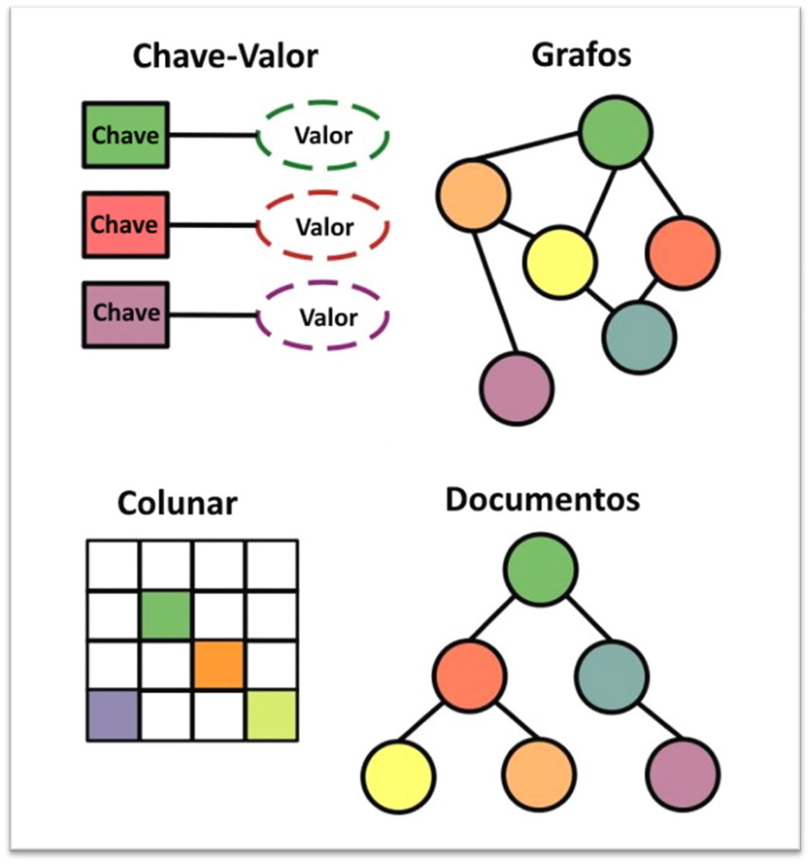

# Capítulo 7: Banco de Dados

## 7.6 - Oracle NoSQL

### __Visão Geral__

Os bancos de dados do tipo _[NoSQL](https://pt.wikipedia.org/wiki/NoSQL)_ são uma nova abordagem para armazenamento e gerenciamento de dados, que difere do _[modelo relacional](https://pt.wikipedia.org/wiki/Modelo_relacional)_ que conhecemos. Falando um pouco do _[modelo relacional](https://pt.wikipedia.org/wiki/Modelo_relacional)_, este armazena os dados em _tabelas_, sendo que cada _tabela_ é dividida em _linhas (tuplas)_ e _colunas_. Tais _tabelas_ podem ou não se relacionar umas com as outras, formando _relações_.

Essa é  a base de todo o _modelo relacional: "Tabelas que se relacionam com outras tabelas, para possibilitar a organização e recuperação de dados"._


Tecnologias _[NoSQL](https://pt.wikipedia.org/wiki/NoSQL)_ foram desenvolvidas para suportar aplicações que manipulam grandes volumes de dados, e que necessitam de um _**modelo de dados mais flexível**_, sem _esquema fixo_ ou _schemaless_. Aplicações para _redes sociais_, _e-commerce_ e _[IoT](https://pt.wikipedia.org/wiki/Internet_das_coisas)_ são alguns tipos de aplicações que se beneficiam de tecnologias _[NoSQL](https://pt.wikipedia.org/wiki/NoSQL)_ por possuírem tal esquema de dados dinâmico.

Abaixo um exemplo de dados de um _e-commerce_, onde há benefícios ao se utilizar um _modelo de dados schemaless_:


Uma outra importante característica sobre os bancos _[NoSQL](https://pt.wikipedia.org/wiki/NoSQL)_, é que eles foram projetados para serem executados em _[clusters de computadores](https://pt.wikipedia.org/wiki/Cluster)_ favorecendo a _"escalabilidade horizontal"_, onde o _[modelo relacional](https://pt.wikipedia.org/wiki/Modelo_relacional)_ é incompatível.

O termo _[NoSQL](https://pt.wikipedia.org/wiki/NoSQL)_ _("Not SQL" ou "Not Only SQL")_ não está definido de uma forma muito clara. Ele é utilizado por alguns bancos de dados não relacionais recentes como os de nome _[Redis](https://pt.wikipedia.org/wiki/Redis)_, _[MongoDB](https://pt.wikipedia.org/wiki/MongoDB)_, _[Oracle NoSQL Database](https://en.wikipedia.org/wiki/Oracle_NoSQL_Database)_, _[Neo4J](https://en.wikipedia.org/wiki/Neo4j)_, entre outros.

Já adianto a informação de que os banco de dados do tipo _[NoSQL](https://pt.wikipedia.org/wiki/NoSQL)_ não substituem os banco de dados relacionais, e nem o contrário também é verdade. _[Bancos de dados NoSQL](https://pt.wikipedia.org/wiki/NoSQL)_, contendo dados _não estruturados_, complementam _bancos de dados SQL_, que contém _dados estruturados_. Nos dias de hoje, como bons arquitetos de solução, devemos entender onde determinada tecnologia _"se encaixa melhor"_ e assim fazer um melhor uso.

>_**__NOTA:__** Todos os conceitos apresentados neste post têm como base o [Oracle NoSQL Database](https://en.wikipedia.org/wiki/Oracle_NoSQL_Database) no modelo on-premises e cloud. Porém, o objetivo é explicar o serviço no modelo cloud computing. Muitos dos conceitos do modelo on-premises, podem ser aplicados no modelo cloud. A documentação oficial do modelo on-premises você encontra [aqui](https://docs.oracle.com/en/database/other-databases/nosql-database/). Já a documentação do modelo cloud, é [aqui](https://www.oracle.com/br/database/nosql-cloud.html) e também [aqui](https://docs.oracle.com/pt-br/iaas/nosql-database/index.html)._

### __A origem do NoSQL__

O principal propósito de um banco de dados está na sua capacidade de armazenar grandes quantidades de dados. Bancos relacionais têm a importante missão de persistir os dados de forma segura, além de ter que lidar com múltiplos acessos concorrentes através das transações.

A _transação_ é quem garante a _**consistência dos dados**_, ajudando a lidar com possíveis problemas ou erros no processamento. Através das transações é possível adicionar, apagar ou modificar múltiplos registros entre diferentes _tabelas_, e decidir se queremos _persistir as alterações (commit)_ ou _descartá-las (rollback)_. Por conta disso, até então, os _bancos de dados relacionais (RDBMS)_ têm sido a escolha padrão para _aplicações comerciais (enterprise)_.

>_**__NOTA:__** O termo transação aqui refere-se a [transações ACID](https://pt.wikipedia.org/wiki/ACID) (Atômicas, Consistentes, Isoladas e Duráveis). Muitas linhas existentes em diferentes tabelas são atualizadas através de uma única operação. Transações incorporam a noção de unidade de trabalho, tem sucesso total ou falha total (tudo ou nada), e nunca um meio termo. Tipicamente, envolvem múltiplas operações em diferentes entidades de dados._

Para entendermos melhor o _[NoSQL](https://pt.wikipedia.org/wiki/NoSQL)_, temos que relembrar os conceitos que envolvem a palavra _escalabilidade_. Uma das vantagens em se utilizar a _Computação em Nuvem_, está ligado a _escalabilidade dos recursos_ (ajustar o sistema à capacidade desejada). Para contextualizar:

- _Escalabilidade Vertical (Scale UP/DOWN)_: refere-se a ação de aumentar ou diminuir os recursos existentes em uma máquina. Por exemplo, adicionar mais memória RAM ou trocar o processador por outro, com um clock mais rápido.

- _Escalabilidade Horizontal (Scale OUT/IN)_: refere-se a ação de adicionar mais máquinas a um conjunto existente de máquinas. Quanto mais máquinas trabalhando em conjunto, mais processamento temos. É aqui que temos o conceito de computação distribuída em _[cluster de computadores](https://pt.wikipedia.org/wiki/Cluster)_.

Uma das principais diferenças entre os dois modos apresentados, está em relação ao custo. Basicamente, escalar uma máquina verticalmente é financeiramente mais caro e exige _tempo de indisponibilidade_. Ao longo do tempo, descobriu-se que adicionar mais máquinas menores para trabalharem juntas, é financeiramente mais barato e _não exige tempo de indisponibilidade_.

O problema é que um _banco de dados relacional_, não consegue aplicar os conceitos de _escalabilidade horizontal_, por conta do funcionamento das _transações_. _[Transações ACID](https://pt.wikipedia.org/wiki/ACID)_ são incompatíveis com execução em _[cluster de computadores](https://pt.wikipedia.org/wiki/Cluster)_. Não se combinam, pois não há como garantir a _consistência dos dados_, ou mesmo realizar um _[JOIN](https://pt.wikipedia.org/wiki/Join_(SQL))_ sobre os dados que estão distribuídos no _[cluster](https://pt.wikipedia.org/wiki/Cluster)_.


Vale lembrar que o modelo relacional possui grande flexibilidade ao processar as relações entre diferentes tabelas. Podemos executar um _[JOIN](https://pt.wikipedia.org/wiki/Join_(SQL))_ e retornar qualquer visualização que se queira dos dados através da união de diferentes tabelas (flexibilidade na apresentação ou composição, dos dados existentes em diferentes tabelas).

>_**__NOTA:__** Como veremos, existem algumas tecnologias de bancos de dados NoSQL que suportam [transações ACID](https://pt.wikipedia.org/wiki/ACID) ou mesmo um relacionamento de dados limitado, possibilitando também, JOINs limitados._

Já um banco de dados _[NoSQL](https://pt.wikipedia.org/wiki/NoSQL)_, surgiu da necessidade de processar grandes volumes de dados _não relacionados_. O fato dos dados não terem relacionamentos entre si, e possuírem um _modelo de dados mais simples_, sem um _esquema fixo (schemaless)_, possibilitou sua execução em grandes _[cluster de computadores](https://pt.wikipedia.org/wiki/Cluster)_, favoráveis ao _escalonamento horizontal_.


A partir disso, podemos dizer que os bancos de dados _[NoSQL](https://pt.wikipedia.org/wiki/NoSQL)_ são _altamente distribuídos_, não necessitam de hardware sofisticado, e fornecem suporte transacional mínimo ou nenhum.

Quando há a necessidade de executar técnicas de _[desnormalização](https://pt.wikipedia.org/wiki/Normaliza%C3%A7%C3%A3o_de_dados#Desnormaliza%C3%A7%C3%A3o)_, ou mesmo quando as regras de negócio tendem a levar a criação do chamado _"tabelão" (termo usado por DBAs e desenvolvedores de software para criar tabelas que não possuem relacionamentos, ou que não seguem as regras da [normalização de dados](https://pt.wikipedia.org/wiki/Normaliza%C3%A7%C3%A3o_de_dados))_, talvez seja a hora de empregar o _[NoSQL](https://pt.wikipedia.org/wiki/NoSQL)_ em sua solução tecnológica.

Diferentes problemas são resolvidos por diferentes tecnologias. E isso se aplica também quando falamos de banco de dados. Diferentes bancos de dados para diferentes tipos de dados. Essa afirmação é muitas vezes chamada de _[Persistência Poliglota](https://en.wikipedia.org/wiki/Polyglot_persistence)_.

### __Banco de dados Relacional vs. NoSQL__

Já destacamos as principais diferenças entre os tipos de bancos de dados quando falamos do surgimento do NoSQL. 

Abaixo, uma tabela de rápida fixação:


### __Tipos de Banco de Dados NoSQL__

A maioria dos bancos _[NoSQL](https://pt.wikipedia.org/wiki/NoSQL)_ é alguma derivação de uma estrutura _chave/valor_. 

Existem quatro grandes categorias mais utilizadas:



- **Armazenamento _Chave/Valor_**
    - Os dados são armazenados através de _chaves_ únicas. O banco de dados não conhece e também não se importa com o _valor_ que uma _chave_ faz referência. Para o banco de dados, é somente um conjunto de bits (_[blobs](https://pt.wikipedia.org/wiki/BLOB)_).
    - Pelo fato do banco não conhecer os dados, só é possível recuperar tais dados através de consultas que envolvam os _valores da chave_.
    - _Casos de uso:_ Sessão de usuário em aplicações Web, carrinho de compras.
    - Alguns tipos de bancos _[NoSQL](https://pt.wikipedia.org/wiki/NoSQL)_ que se enquadram nessa categoria são: _[Riak](https://en.wikipedia.org/wiki/Riak)_, _[Redis](https://pt.wikipedia.org/wiki/Redis)_ ou _[Oracle NoSQL Database](https://docs.oracle.com/pt-br/iaas/nosql-database/index.html)_.

- **Armazenamento de _Documentos_**
    - Muito similar a implementação _chave/valor_, porém aqui, o banco de dados conhece o valor (documento) no qual a chave faz referência. O banco de dados _[NoSQL](https://pt.wikipedia.org/wiki/NoSQL)_ entende o valor armazenado, permitindo realizar interações sobre ele. Além disso, o valor armazenado aqui é mais complexo, normalmente um documento _[JSON](https://pt.wikipedia.org/wiki/JSON)_.
    - _Casos de uso:_ Catalogo de produtos, blog posts, aplicativos de comércio eletrônico.
    - Alguns tipos de bancos _[NoSQL](https://pt.wikipedia.org/wiki/NoSQL)_ que se enquadram nessa categoria são: _[MongoDB](https://pt.wikipedia.org/wiki/MongoDB)_, _[Oracle NoSQL Database](https://docs.oracle.com/pt-br/iaas/nosql-database/index.html)_ ou _[CouchDB](https://pt.wikipedia.org/wiki/CouchDB)_.

- **Banco de dados orientados a _Grafos_**
    - Semelhante ao modelo relacional, aqui é mais explícito o relacionamento entre os dados. Muito útil para dados que estejam bastante interligados, pois a estrutura de um _[grafo](https://pt.wikipedia.org/wiki/Teoria_dos_grafos)_ expõe naturalmente os relacionamentos entre os objetos.
    - _Casos de uso:_ O seu uso varia de aplicações para redes sociais (onde há muita interligação de likes ou pessoas), bioinformática, software de recomendação e etc.
    - Alguns tipos de bancos _[NoSQL](https://pt.wikipedia.org/wiki/NoSQL)_ que se enquadram nessa categoria são: _[Neo4j](https://en.wikipedia.org/wiki/Neo4j)_ e _[OrientDB](https://en.wikipedia.org/wiki/OrientDB)_.

- **Armazenamento _Colunar_**
    - O armazenamento _colunar_ é similar a uma tabela, onde cada linha pode ter uma ou mais colunas. O número de colunas por linha pode variar.
    - Alguns tipos de bancos _[NoSQL](https://pt.wikipedia.org/wiki/NoSQL)_ que se enquadram nessa categoria são: _[Apache Cassandra](https://pt.wikipedia.org/wiki/Apache_Cassandra)_, _[Oracle NoSQL Database](https://docs.oracle.com/pt-br/iaas/nosql-database/index.html)_ ou _[Hypertable](https://en.wikipedia.org/wiki/Hypertable)_.


### __Um pouco sobre o Oracle Berkeley DB__

Desenvolvido em 1980, o _[Berkeley DB](https://en.wikipedia.org/wiki/Berkeley_DB)_ é uma biblioteca de software que  provê um tipo de _"banco de dados embarcado"_, de alto desempenho, para o armazenamento de dados do tipo _chave/valor_. Basicamente, aqui o termo _"embarcado"_, refere-se a uma espécie diferente de banco de dados, no qual não suporta o acesso via rede. Ele está contido ou embutido, dentro de uma aplicação (embarcado). Como um outro exemplo similar, temos o _[SQLite](https://en.wikipedia.org/wiki/SQLite)_, usado em aplicações para dispositivos _[Android](https://en.wikipedia.org/wiki/Android_(operating_system))_.

Em 2006 a empresa _[Sleepycat Software](https://en.wikipedia.org/wiki/Sleepycat_Software)_, que era detentora do _[Berkeley DB](https://en.wikipedia.org/wiki/Berkeley_DB)_, foi adquirida pela _Oracle_. A partir de então, este tornou-se _[Oracle Berkeley DB](https://www.oracle.com/database/technologies/related/berkeleydb.html)_. A intenção dessa aquisição pela _Oracle_ foi justamente a construção de um sistema de banco de dados _[NoSQL](https://pt.wikipedia.org/wiki/NoSQL)_.

O banco de dados _[NoSQL](https://pt.wikipedia.org/wiki/NoSQL)_ da _Oracle_ _([Oracle NoSQL Database](https://docs.oracle.com/pt-br/iaas/nosql-database/index.html))_ utiliza por _"baixo do capô"_, o _[Oracle Berkeley DB](https://www.oracle.com/database/technologies/related/berkeleydb.html)_ para gerenciamento dos dados. Como isso, temos um sistema _[NoSQL](https://pt.wikipedia.org/wiki/NoSQL)_ confiável, moderno e completo.

### __Oracle NoSQL Database Cloud Service__

_[Oracle NoSQL Database Cloud Service](https://docs.oracle.com/en-us/iaas/nosql-database/index.html)_ é um serviço de banco de dados _[NoSQL](https://pt.wikipedia.org/wiki/NoSQL)_ em nuvem, totalmente gerenciado e que suporta o armazenamento de documentos _[JSON](https://pt.wikipedia.org/wiki/JSON)_, tipo de dados _chave/valor_ além de dados em _colunas (tabelas)_.

Com ele, é possível se concentrar no desenvolvimento da sua solução tecnológica, ao invés de se preocupar com o gerenciamento da infraestrutura. Por padrão, o serviço já incorpora monitoração, alta disponibilidade (os dados são distribuídos automaticamente entre _[Fault Domains](https://docs.oracle.com/en-us/iaas/Content/General/Concepts/regions.htm#fault)_ e _[Availability Domains](https://docs.oracle.com/en-us/iaas/Content/General/Concepts/regions.htm#top)_), fácil escalabilidade, além de possuir tempo de resposta baixo e previsível, medido em milissegundos de um único dígito. Isto quer dizer que quanto mais seu banco cresce, tanto em tamanho quanto em _[taxa de throughput](https://en.wikipedia.org/wiki/Throughput)_, o acesso a ele permanece linear.

Para facilitar o dinamismo dos seus negócios, o serviço permite através de uma simples _API_, aumentar e diminuir o _[throughput](https://en.wikipedia.org/wiki/Throughput)_ e _storage_ a qualquer momento, mantendo assim uma experiência constante aos seus usuários, além de evitar desperdícios financeiros. O serviço também possui outros recursos incorporados:

- Suporte a transações _ACID_
- Atualizações parciais em documentos _[JSON](https://pt.wikipedia.org/wiki/JSON)_
- Criação de índices adicionais
- Manipulação e acesso aos dados via linguagem _SQL padrão_
- _TTL (Tempo de Vida)_ ou tempo de expiração sobre as linhas da tabela.

Esses detalhes e alguns outros mais podem ser consultados _[aqui](https://docs.oracle.com/en-us/iaas/nosql-database/doc/key-features.html)_.

### __Detalhes técnicos__

Para utilizar o serviço, você cria tabelas que representam seu _modelo de dados ([schema](https://en.wikipedia.org/wiki/Database_schema))_. Específica o _total de armazenamento (storage)_, além de outras _duas propriedades_ que controlam suas _capacidades de leitura e escrita ([throughput](https://en.wikipedia.org/wiki/Throughput))_.

>_**__NOTA:__** O termo throughput aqui diz respeito ao poder de processamento dado a uma tabela de dados NoSQL. Consulte maiores detalhes neste link [aqui](https://docs.oracle.com/pt-br/iaas/nosql-database/doc/estimating-capacity.html)._

>_**__NOTA:__** Lembrando que os valores que controlam o storage, throughput de leitura e gravação, podem ser alterados a qualquer momento para atender às suas necessidades. Aqui é onde o conceito de escalabilidade horizontal se torna presente._


- **Unidade de Escrita ou Gravação (WU - Write Unit)**
    - Uma _unidade de escrita_ é equivalente a um _[throughput](https://en.wikipedia.org/wiki/Throughput)_ de até _1 kilobyte (KB) de dados por segundo_, para operações como _inserção, atualização ou exclusão_ de um registro de dados. Atualizações de índices também consomem _unidades de escrita_.
    - Por exemplo: um registro menor que _1 KB de dados_, requer _1 unidade de escrita_. Para operações sobre um registro de _1,5 KB de dados_, são necessárias _2 unidades de escrita_.

- **Unidades de Leitura (RU - Read Unit)**
    - Uma _unidade de leitura_ é equivalente a um _[throughput](https://en.wikipedia.org/wiki/Throughput)_ de até _1 kilobyte (KB) de dados por segundo_, para operações de **_leitura eventualmente consistentes_**.
    - Por exemplo: um registro menor que _1 KB de dados_, requer _1 unidade de leitura eventualmente consistente_. Para operações de leitura _eventualmente consistentes_ sobre um registro de _1,5 KB de dados_, são necessárias _2 unidades de leituras_.

- **Capacidade de Armazenamento (Storage)**
    - Capacidade total em _gigabytes (GB)_ que a tabela de dados _[NoSQL](https://pt.wikipedia.org/wiki/NoSQL)_ possui.


Quando lidamos com _dados distribuídos_, como é o caso dos bancos de dados _[NoSQL](https://pt.wikipedia.org/wiki/NoSQL)_, surgem outros dois conceitos importantes quando realizamos a _leitura dos dados_. São eles:

- **Consistência de leitura Eventual**
    - Significa que os dados retornados a partir de uma operação de leitura, não são os dados mais recentemente gravados.
    - Para entender melhor, quando realizamos uma operação de escrita (inserção, atualização ou exclusão), os dados desta precisam ser replicados a todos os nós do cluster para que o dado se torne consistente. Esse tempo de replicação, da última escrita realizada, pode afetar a _consistência da leitura_. Dependendo do negócio da sua aplicação, isto pode ser tolerado, e recebe o nome de _eventualmente consistente_.

- **Consistência de leitura Absoluta**
    - Os dados retornados a partir de uma operação de leitura, são os mais recentes gravados. Neste caso, duas unidades de leitura, em favor de uma maior consistência, são consumidas.  

>_**__NOTA:__** O absolutamente consistente é mais caro, financeiramente falando, por trazer o dado mais recente quando realizamos uma leitura._

Você especifica qual nível de consistência quer _(eventual ou absoluta)_, através da _[API](https://docs.oracle.com/en-us/iaas/nosql-database/doc/connecting-nosql-cloud.html)_ do _[Oracle NoSQL](https://docs.oracle.com/pt-br/iaas/nosql-database/index.html)_.


### __Estimando a capacidade__

A Oracle disponibiliza o _[Oracle NoSQL Capacity Estimator](https://www.oracle.com/a/ocom/docs/oracle-nosql-capacity-estimator.zip)_, que é uma ferramenta no qual é possível prever a quantidade necessária de unidades de escrita, leitura e storage total que uma determinada _tabela NoSQL_ necessita. Esse cálculo é realizado de acordo com a quantidade de _leitura(s)_ e _escrita(s)_ feitas sobre o tamanho, em _KiloBytes_, de um registro de dados. 

Veja o exemplo:


A partir dos valores de exemplo, é possível calcular qual o custo que este serviço terá, via ferramenta _[Cost Estimator](https://www.oracle.com/br/cloud/cost-estimator.html)_:


>_**__NOTA:__** Para mais detalhes sobre a ferramenta Cost Estimator e valores, consulte este link [aqui](https://blogs.oracle.com/lad-cloud-experts/pt/oci-gerenciando-meus-custos-parte-1)._

- Faça o download da ferramenta Cost Estimator _[aqui](https://www.oracle.com/a/ocom/docs/oracle-nosql-capacity-estimator.zip)_.

Na _[página principal do serviço](https://www.oracle.com/database/nosql-cloud.html)_, também é possível verificar o custo de cada unidade computacional: 


Para encerrar este tópico, vale lembrar que o serviço _[NoSQL](https://pt.wikipedia.org/wiki/NoSQL)_ participa do programa _[Always Free da Oracle](https://www.oracle.com/br/cloud/free/)_. Isto quer dizer que você pode desenvolver e hospedar sua aplicação, sem nenhum custo, de acordo com os seguintes limites:

- Criar até _3 tabelas_ Oracle NoSQL
- 50 Unidades de leitura _(RU - Read Unit)_
- 50 Unidades de escrita _(WU - Write Unit)_
- 25GB para armazenamento _(storage)_

>_**__NOTA:__** Os limites gerais do serviço [NoSQL](https://pt.wikipedia.org/wiki/NoSQL) também podem ser consultados neste link [aqui](https://docs.oracle.com/pt-br/iaas/nosql-database/doc/cloud-limits.html)_.

Para mais informações, consulte este _[link](https://docs.oracle.com/en-us/iaas/nosql-database/doc/always-free-nosql-database-service.html)_ sobre o _[Oracle NoSQL Always Free](https://docs.oracle.com/en-us/iaas/nosql-database/doc/always-free-nosql-database-service.html)_.

### __Colocando a "mão na massa"__

Depois de entendermos os principais conceitos que envolvem o _[Oracle NoSQL](https://docs.oracle.com/pt-br/iaas/nosql-database/index.html)_, veremos como iniciar a utilização real do serviço. Irei começar explicando sobre o design das tabelas.

Os dados no _[Oracle NoSQL](https://docs.oracle.com/pt-br/iaas/nosql-database/index.html)_ são armazenados e organizados em _[tabelas](https://docs.oracle.com/pt-br/iaas/nosql-database/doc/table-management.html)_. Você verá que muito dos conceitos e sintaxe sobre a criação de tabelas que vem do modelo relacional no qual conhecemos, podem ser aplicados aqui também.

Uma _[tabela](https://docs.oracle.com/pt-br/iaas/nosql-database/doc/table-management.html)_ pode conter várias linhas, sendo que cada linha armazena um _registro_. Dizemos que um _registro_, são todos os dados que pertencem a uma _linha_ em particular. Além disso, em uma linha temos as _colunas_. Cada _coluna_ precisa ter o seu _[tipo de dados](https://docs.oracle.com/pt-br/iaas/nosql-database/doc/table-design.html)_ definido. É o _[tipo de dados](https://docs.oracle.com/pt-br/iaas/nosql-database/doc/table-design.html)_ que garante a _integridade da informação_ a ser armazenada. Por exemplo, se uma _coluna_ possui um _[tipo de dados](https://docs.oracle.com/pt-br/iaas/nosql-database/doc/table-design.html)_ _INTEGER_, você só poderá armazenar números inteiros nesta _coluna_. Uma tentativa de inserção de uma palavra, do tipo _STRING_, ocasionaria em um erro.

Apresentamos um exemplo onde temos uma _tabela_, que representa um simples _modelo de dados_ utilizado por um _e-commerce_:


Aqui é onde a flexibilidade do _[Oracle NoSQL](https://docs.oracle.com/pt-br/iaas/nosql-database/index.html)_ se torna presente. Podemos criar _tabelas schemafull (todos os campos da tabela possuem tipo de dados específicos)_, _schemaless (contendo tipo de dados JSON)_ ou ter uma combinação de ambos, formando um _modelo de dados híbrido_, como é o caso desse exemplo.

Os _registros_ desta _tabela_ são os diferentes produtos que o nosso _e-commerce_ fictício vende. Aqui, exibimos somente um _registro_ que tem as informações sobre um drone de brinquedo.

>_**__NOTA:__** Para o [Oracle NoSQL](https://docs.oracle.com/pt-br/iaas/nosql-database/index.html), tabela é sinônimo de infraestrutura. A tabela é uma representação, na qual você pode organizar e manipular dados. Por trás de uma tabela, você tem uma infraestrutura gerenciada pelo OCI, contendo um cluster de computadores._

No _[Oracle NoSQL](https://docs.oracle.com/pt-br/iaas/nosql-database/index.html)_, toda linha de uma tabela, obrigatoriamente deve ter pelo menos uma coluna designada como _**chave primária**_. Esta serve como _**identificador único do registro**_ e não pode ser alterada. Perceba que esta _tabela_ também possui diferentes _colunas_ com diferentes _tipos de dados_.

>_**__NOTA:__** Existem vários outros [tipos de dados](https://docs.oracle.com/pt-br/iaas/nosql-database/doc/table-design.html) que você pode usar para criar suas tabelas, de acordo com as suas necessidades de negócio. Consulte os [tipos de dados](https://docs.oracle.com/pt-br/iaas/nosql-database/doc/table-design.html) disponíveis no Oracle NoSQL [aqui](https://docs.oracle.com/pt-br/iaas/nosql-database/doc/table-design.html)._

Convertendo nossa tabela de exemplo para um _[DDL (Data Definition Language)](https://pt.wikipedia.org/wiki/Linguagem_de_defini%C3%A7%C3%A3o_de_dados)_ válido, temos:

```sql
CREATE TABLE produtos (
    id INTEGER GENERATED BY DEFAULT ON NULL AS IDENTITY (START WITH 1 INCREMENT BY 1),
    propriedades JSON,
    valor NUMBER,
    frete_gratis BOOLEAN,
    imagens ARRAY(STRING),
    PRIMARY KEY(id))
```

>_**__NOTA:__** Nossa chave-primária é uma coluna auto-increment. Isto quer dizer que toda nova linha inserida nesta tabela, o Oracle NoSQL gera e insere automaticamente um valor para ID. Somente uma coluna IDENTITY pode existir por tabela, e ela deve ser do tipo INTEGER, LONG ou NUMBER. Se quiser saber mais sobre colunas IDENTITY, consulte este [link aqui](https://docs.oracle.com/en/database/other-databases/nosql-database/19.3/java-driver-table/defining-tables-identity-column.html)._

Antes de criarmos qualquer recurso, irei criar um compartimento específico para abrigar as _[tabelas](https://docs.oracle.com/pt-br/iaas/nosql-database/doc/table-management.html)_ _[NoSQL](https://docs.oracle.com/pt-br/iaas/nosql-database/index.html)_ que forem criadas.

```
darmbrust@hoodwink:~$ oci iam compartment create \
> --compartment-id "ocid1.tenancy.oc1..aaaaaaaavv2qh5asjdcoufmb6fzpnrfqgjxxdzlvjrgkrkytnyyz6zgvjnua" \
> --name "cmp-nosql" \
> --description "Recursos NoSQL de todo o Tenant"
{
  "data": {
    "compartment-id": "ocid1.tenancy.oc1..aaaaaaaavv2qh5asjdcoufmb6fzpnrfqgjxxdzlvjrgkrkytnyyz6zgvjnua",
    "defined-tags": {
      "Oracle-Tags": {
        "CreatedBy": "oracleidentitycloudservice/daniel.armbrust@algumdominio.com",
        "CreatedOn": "2021-10-23T11:48:23.725Z"
      }
    },
    "description": "Recursos NoSQL de todo o Tenant",
    "freeform-tags": {},
    "id": "ocid1.compartment.oc1..aaaaaaaaafjgvmrez5krathnzafkfsaep3bs7dkioat32d23ubaimjiyw5qq",
    "inactive-status": null,
    "is-accessible": true,
    "lifecycle-state": "ACTIVE",
    "name": "cmp-nosql",
    "time-created": "2021-10-23T11:48:24.242000+00:00"
  },
  "etag": "af79e166ed0590fb5e5407c54cd866448f5a8797"
}
```

Agora, a _[tabela](https://docs.oracle.com/pt-br/iaas/nosql-database/doc/table-management.html)_ será criada com o comando abaixo:

```
darmbrust@hoodwink:~$ oci nosql table create \
> --compartment-id "ocid1.compartment.oc1..aaaaaaaaafjgvmrez5krathnzafkfsaep3bs7dkioat32d23ubaimjiyw5qq" \
> --name "produtos" \
> --table-limits '{"maxReadUnits": 10, "maxWriteUnits": 5, "maxStorageInGBs": 1}' \
> --ddl-statement 'CREATE TABLE produtos (
>     id INTEGER GENERATED BY DEFAULT ON NULL AS IDENTITY (START WITH 1 INCREMENT BY 1),
>     propriedades JSON,
>     valor NUMBER,
>     frete_gratis BOOLEAN,
>     imagens ARRAY(STRING),
>     PRIMARY KEY(id))' \
> --wait-for-state "SUCCEEDED"
Action completed. Waiting until the work request has entered state: ('SUCCEEDED',)
{
  "data": {
    "compartment-id": "ocid1.compartment.oc1..aaaaaaaaafjgvmrez5krathnzafkfsaep3bs7dkioat32d23ubaimjiyw5qq",
    "id": "ocid1.nosqltableworkrequest.oc1.sa-saopaulo-1.amaaaaaa6noke4qaoi4bnligtkardm6ok6s2dfluwn6fdxvsrwkwesegxzfq",
    "operation-type": "CREATE_TABLE",
    "percent-complete": 100.0,
    "resources": [
      {
        "action-type": "CREATED",
        "entity-type": "TABLE",
        "entity-uri": "/20190828/tables/produtos?compartmentId=ocid1.compartment.oc1..aaaaaaaaafjgvmrez5krathnzafkfsaep3bs7dkioat32d23ubaimjiyw5qq",
        "identifier": "ocid1.nosqltable.oc1.sa-saopaulo-1.amaaaaaa6noke4qaro2lm6fli2nz3qnvfjn2b6cpbnwwdikn2suipzu4w6rq"
      }
    ],
    "status": "SUCCEEDED",
    "time-accepted": "2021-10-23T11:59:47.390000+00:00",
    "time-finished": "2021-10-23T11:59:50.876000+00:00",
    "time-started": "2021-10-23T11:59:47.399000+00:00"
  }
}
```

>_**__NOTA:__** Para saber mais detalhes sobre DDL para criar suas tabelas, consulte este [link aqui](https://docs.oracle.com/en/database/other-databases/nosql-database/19.3/java-driver-table/table-data-definition-language-overview.html)._

Para finalizar esta parte, quero apresentar a _escalabilidade horizontal_ na prática. Pelo comando abaixo, é muito simples adicionar mais _capacidade de throughput_ ou _storage ([scale out](https://pt.wikipedia.org/wiki/Escalabilidade))_, ou mesmo _remover tal capacidade ([scale in](https://pt.wikipedia.org/wiki/Escalabilidade))_.

```
darmbrust@hoodwink:~$ oci nosql table update \
> --compartment-id "ocid1.compartment.oc1..aaaaaaaaafjgvmrez5krathnzafkfsaep3bs7dkioat32d23ubaimjiyw5qq" \
> --table-name-or-id "produtos" \
> --table-limits '{"maxReadUnits": 15, "maxWriteUnits": 10, "maxStorageInGBs": 2}' \
> --force \
> --wait-for-state "SUCCEEDED"
Action completed. Waiting until the work request has entered state: ('SUCCEEDED',)
{
  "data": {
    "compartment-id": "ocid1.compartment.oc1..aaaaaaaaafjgvmrez5krathnzafkfsaep3bs7dkioat32d23ubaimjiyw5qq",
    "id": "ocid1.nosqltableworkrequest.oc1.sa-saopaulo-1.amaaaaaa6noke4qaktokmkakgmojg5js2qzlkvvj6lewqj2rktzqnldw53lq",
    "operation-type": "UPDATE_TABLE",
    "percent-complete": 100.0,
    "resources": [
      {
        "action-type": "UPDATED",
        "entity-type": "TABLE",
        "entity-uri": "/20190828/tables/produtos?compartmentId=ocid1.compartment.oc1..aaaaaaaaafjgvmrez5krathnzafkfsaep3bs7dkioat32d23ubaimjiyw5qq",
        "identifier": "ocid1.nosqltable.oc1.sa-saopaulo-1.amaaaaaa6noke4qaro2lm6fli2nz3qnvfjn2b6cpbnwwdikn2suipzu4w6rq"
      }
    ],
    "status": "SUCCEEDED",
    "time-accepted": "2021-10-23T12:08:43.440000+00:00",
    "time-finished": "2021-10-23T12:08:46.890000+00:00",
    "time-started": "2021-10-23T12:08:43.448000+00:00"
  }
}
```

### __Manipulando Dados no NoSQL__

Irei apresentar o básico para manipularmos a _tabela produtos_ que criamos, iniciando pela possibilidade de _inserir dados_:

```
darmbrust@hoodwink:~$ oci nosql row update \
> --compartment-id "ocid1.compartment.oc1..aaaaaaaaafjgvmrez5krathnzafkfsaep3bs7dkioat32d23ubaimjiyw5qq" \
> --table-name-or-id "produtos" \
> --value '{"id": 1, "propriedades": {"nome": "Drone Eachine", "marca": "Eachine", "modelo": "e58a", "versão": "Dual Camera 720p", "cor": "preto"}, "valor": 237.85, "frete_gratis": true, "imagens": ["drone-1.jpg", "drone-2.jpg", "drone-3.jpg"]}' \
> --force
{
  "data": {
    "existing-value": null,
    "existing-version": null,
    "generated-value": null,
    "usage": {
      "read-units-consumed": 0,
      "write-units-consumed": 1
    },
    "version": "rO0ABXcsABidoE77XFVFaojy01KzspsGAAAAAGXh6nMBAwAAAAIAAAACAAAFWCH7ah8="
  },
  "etag": "rO0ABXcsABidoE77XFVFaojy01KzspsGAAAAAGXh6nMBAwAAAAIAAAACAAAFWCH7ah8="
}
```

Uma outra funcionalidade útil, é poder executar _consultas simples_, através de expressões do tipo _[SELECT](https://docs.oracle.com/pt-br/iaas/nosql-database/doc/query-language-reference.html)_:

```
darmbrust@hoodwink:~$ oci nosql query execute \
> --compartment-id "ocid1.compartment.oc1..aaaaaaaaafjgvmrez5krathnzafkfsaep3bs7dkioat32d23ubaimjiyw5qq" \
> --consistency "ABSOLUTE" \
> --statement "SELECT * FROM produtos"
{
  "data": {
    "items": [
      {
        "frete_gratis": true,
        "id": 1,
        "imagens": [
          "drone-1.jpg",
          "drone-2.jpg",
          "drone-3.jpg"
        ],
        "propriedades": {
          "cor": "preto",
          "marca": "Eachine",
          "modelo": "e58a",
          "nome": "Drone Eachine",
          "vers\u00e3o": "Dual Camera 720p"
        },
        "valor": 237.85
      }
    ],
    "usage": {
      "read-units-consumed": 6,
      "write-units-consumed": 0
    }
  }
}
```

Perceba que utilizamos o parâmetro _"--consistency"_ que especifica uma consistência de _leitura absoluta_, garantindo que o dado consultado é o mais recente do _cluster_.

>_**__NOTA:__** Para maiores informações sobre a linguagem SQL utilizada pelo NoSQL, consulte este [link aqui](https://docs.oracle.com/pt-br/iaas/nosql-database/doc/query-language-reference.html)._

Podemos adicionar ou remover colunas da tabela também. Para adicionar uma coluna, seguimos com o famoso e conhecido _[ALTER TABLE](https://docs.oracle.com/en/database/other-databases/nosql-database/19.5/sqlreferencefornosql/alter-table.html)_:

```
darmbrust@hoodwink:~$ oci nosql table update \
> --compartment-id "ocid1.compartment.oc1..aaaaaaaaafjgvmrez5krathnzafkfsaep3bs7dkioat32d23ubaimjiyw5qq" \
> --table-name-or-id "produtos" \
> --ddl-statement "ALTER TABLE produtos (ADD data_criacao TIMESTAMP(0))" \
> --force \
> --wait-for-state "SUCCEEDED"
Action completed. Waiting until the work request has entered state: ('SUCCEEDED',)
{
  "data": {
    "compartment-id": "ocid1.compartment.oc1..aaaaaaaaafjgvmrez5krathnzafkfsaep3bs7dkioat32d23ubaimjiyw5qq",
    "id": "ocid1.nosqltableworkrequest.oc1.sa-saopaulo-1.amaaaaaa6noke4qap6ar7c5oon5qqvvkcvtds724mj75b7ibfsailuoiogyq",
    "operation-type": "UPDATE_TABLE",
    "percent-complete": 100.0,
    "resources": [
      {
        "action-type": "UPDATED",
        "entity-type": "TABLE",
        "entity-uri": "/20190828/tables/produtos?compartmentId=ocid1.compartment.oc1..aaaaaaaaafjgvmrez5krathnzafkfsaep3bs7dkioat32d23ubaimjiyw5qq",
        "identifier": "ocid1.nosqltable.oc1.sa-saopaulo-1.amaaaaaa6noke4qaro2lm6fli2nz3qnvfjn2b6cpbnwwdikn2suipzu4w6rq"
      }
    ],
    "status": "SUCCEEDED",
    "time-accepted": "2021-10-23T13:11:02.498000+00:00",
    "time-finished": "2021-10-23T13:11:05.675000+00:00",
    "time-started": "2021-10-23T13:11:02.507000+00:00"
  }
}
```

Podemos visualizar a estrutura da tabela com o comando abaixo:

```
darmbrust@hoodwink:~$ oci nosql table get \
> --compartment-id "ocid1.compartment.oc1..aaaaaaaaafjgvmrez5krathnzafkfsaep3bs7dkioat32d23ubaimjiyw5qq" \
> --table-name-or-id "produtos"
{
  "data": {
    "compartment-id": "ocid1.compartment.oc1..aaaaaaaaafjgvmrez5krathnzafkfsaep3bs7dkioat32d23ubaimjiyw5qq",
    "ddl-statement": "CREATE TABLE produtos(id INTEGER, propriedades JSON, valor NUMBER, frete_gratis BOOLEAN, imagens ARRAY(STRING), data_criacao TIMESTAMP(0), PRIMARY KEY(SHARD(id)))",
    "defined-tags": {
      "Oracle-Tags": {
        "CreatedBy": "oracleidentitycloudservice/guilherme.rocha@oracle.com",
        "CreatedOn": "2021-10-23T11:59:47.385Z"
      }
    },
    "freeform-tags": {},
    "id": "ocid1.nosqltable.oc1.sa-saopaulo-1.amaaaaaa6noke4qaro2lm6fli2nz3qnvfjn2b6cpbnwwdikn2suipzu4w6rq",
    "is-auto-reclaimable": false,
    "lifecycle-details": "The resource is ACTIVE",
    "lifecycle-state": "ACTIVE",
    "name": "produtos",
    "schema": {
      "columns": [
        {
          "default-value": null,
          "is-nullable": false,
          "name": "id",
          "type": "INTEGER"
        },
        {
          "default-value": null,
          "is-nullable": true,
          "name": "propriedades",
          "type": "JSON"
        },
        {
          "default-value": null,
          "is-nullable": true,
          "name": "valor",
          "type": "NUMBER"
        },
        {
          "default-value": null,
          "is-nullable": true,
          "name": "frete_gratis",
          "type": "BOOLEAN"
        },
        {
          "default-value": null,
          "is-nullable": true,
          "name": "imagens",
          "type": "ARRAY(STRING)"
        },
        {
          "default-value": null,
          "is-nullable": true,
          "name": "data_criacao",
          "type": "TIMESTAMP(0)"
        }
      ],
      "primary-key": [
        "id"
      ],
      "shard-key": [
        "id"
      ],
      "ttl": null
    },
    "system-tags": {},
    "table-limits": {
      "max-read-units": 15,
      "max-storage-in-g-bs": 2,
      "max-write-units": 10
    },
    "time-created": "2021-10-23T11:59:47.864000+00:00",
    "time-of-expiration": null,
    "time-updated": "2021-10-23T13:11:05.610000+00:00"
  },
  "etag": "AAABfK1GuIo="
}
```

Ou detalhes sobre o consumo corrente das unidades de _escrita/leitura_ e storage em _Gigabytes_:

```
darmbrust@hoodwink:~$ oci nosql table list-table-usage \
> --compartment-id "ocid1.compartment.oc1..aaaaaaaaafjgvmrez5krathnzafkfsaep3bs7dkioat32d23ubaimjiyw5qq" \
> --table-name-or-id "produtos" \
> --all
{
  "data": {
    "items": [
      {
        "read-throttle-count": 0,
        "read-units": 0,
        "seconds-in-period": 60,
        "storage-in-g-bs": 0,
        "storage-throttle-count": 0,
        "write-throttle-count": 0,
        "write-units": 0
      }
    ]
  }
}
```

>_**__NOTA:__** Consulte este link para maiores informações sobre o [gerenciamento de dados da tabela](https://docs.oracle.com/pt-br/iaas/nosql-database/doc/managing-table-data.html)._

### __Oracle NoSQL Database Cloud Simulator__

O _[Oracle NoSQL Database Cloud Simulator](https://docs.oracle.com/pt-br/iaas/nosql-database/doc/developing-oracle-nosql-database-cloud-simulator.html)_ é uma aplicação desenvolvida em _[Java](https://www.oracle.com/java/)_ que simula o serviço do _[Oracle NoSQL](https://docs.oracle.com/pt-br/iaas/nosql-database/index.html)_. Este permite que você desenvolva aplicações localmente, sem acessar o serviço diretamente. Pode ser usado também como uma maneira de testar as funcionalidades do _[Oracle NoSQL](https://docs.oracle.com/pt-br/iaas/nosql-database/index.html)_, sem necessariamente ter que se preocupar com custos ou com uma infraestrutura produtiva, por exemplo. É a maneira mais fácil de começar a desenvolver suas aplicações.

Irei demonstrar aqui a instalação do _[Oracle NoSQL Simulator](https://docs.oracle.com/pt-br/iaas/nosql-database/doc/developing-oracle-nosql-database-cloud-simulator.html)_ em um _[Oracle Linux](https://www.oracle.com/br/linux/)_ padrão. Porém, antes de realizarmos a instalação, é necessário ter o _[Java](https://www.oracle.com/java/)_ instalado. Para instalar o _[Java](https://www.oracle.com/java/)_, faça o download e siga as instruções contidas _[nesta página](https://www.oracle.com/br/java/technologies/javase-jdk15-downloads.html)_.

```
[darmbrust@oci-dev ~]$ java -version
java version "15.0.2" 2021-01-19
Java(TM) SE Runtime Environment (build 15.0.2+7-27)
Java HotSpot(TM) 64-Bit Server VM (build 15.0.2+7-27, mixed mode, sharing)
```

1. Acesse a página _[Oracle Cloud Downloads](https://www.oracle.com/downloads/cloud/oracle-cloud-downloads.html)_ e faça o download do simulador NoSQL.


 

2. Após fazer o download, basta extrair o pacote em um diretório de sua preferência:

```
[darmbrust@oci-dev ~]$ tar zxvf oracle-nosql-cloud-simulator-1.2.0.tar.gz
``` 

3. Para iniciar o simulador, é muito simples. Basta executar o script _**runCloudSim**_ informando algumas opções na linha de comando. A única opção obrigatória, é o caminho de um diretório que será usado para armazenamento dos seus dados (_-root_):

```
[darmbrust@oci-dev ~]$ cd oracle-nosql-cloud-simulator-1.2.0/  

[darmbrust@oci-dev oracle-nosql-cloud-simulator-1.2.0]$ ./runCloudSim -root /home/darmbrust/nosql -host 0.0.0.0
Oracle NoSQL Cloud Simulator is ready
```

>_**__NOTA:__** Existem outras opções que podem ser usadas. Execute **./runCloudSim -?** para obter uma lista completa. O modo de usar e seu significado, estão documentadas no arquivo **README.md**, contido no diretório raíz do simulador._

4. Pronto! Nosso _NoSQL Simulator_ foi iniciado na porta _**5000/tcp**_ e pode receber conexões de qualquer host da rede _**0.0.0.0**_.